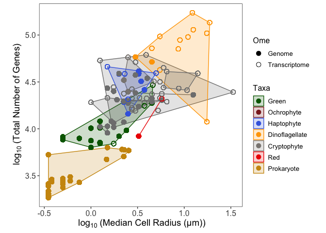
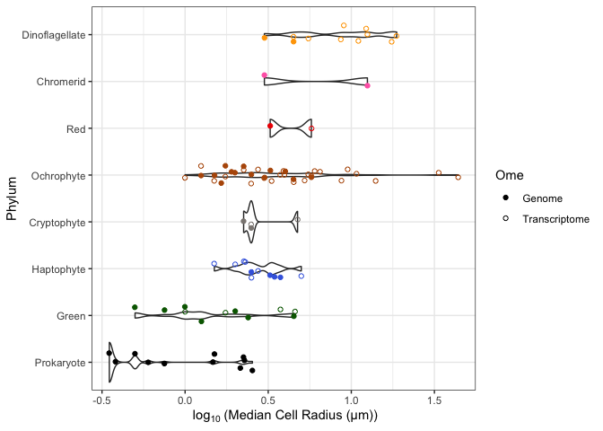
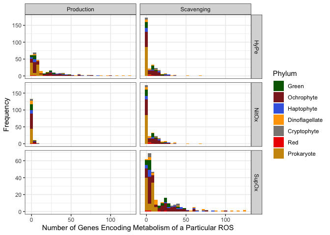

# Abstract {.unnumbered}

Marine phytoplankton produce and scavenge Reactive Oxygen Species, to support cellular processes, while limiting damaging reactions. Some prokaryotic picophytoplankton have, however, lost all genes encoding scavenging of hydrogen peroxide. Such losses of metabolic function can only apply to Reactive Oxygen Species which potentially traverse the cell membrane, before provoking damaging intracellular reactions.
We therefore hypothesized that cell radius influences which elements of Reactive Oxygen Species metabolism are potentially dispensable from a cell. We investigated genomes and transcriptomes from diverse marine eukaryotic phytoplankton, ranging from 0.4 to 44 µm radius, to analyze the genomic allocations encoding enzymes metabolizing Reactive Oxygen Species.
Superoxide has high reactivity, short lifetimes and limited membrane permeability. Genes encoding superoxide scavenging were ubiquitous, but the fractional gene allocation decreased with increasing cell radius, consistent with a nearly fixed set of core genes for scavenging superoxide pools.
Hydrogen peroxide has lower reactivity, longer intracellular and extracellular lifetimes and readily crosses cell membranes. Genomic allocations to hydrogen peroxide production decrease with increasing cell radius, more than do genomic allocations to scavenging of hydrogen peroxide, consistent with maintenance of ROS homeostasis in the face of slower diffusional losses of hydrogen peroxide from larger cells. Gene allocations to hydrogen peroxide metabolism are positively influenced by capacity for colony formation, suggesting more active hydrogen peroxide metabolism among the closely spaced cells of colonies, compared to single cells; and by the presence of flagella, suggesting an interaction between flagella and maintenance of Reactive Oxygen Species homeostasis.
Nitric Oxide has low reactivity, long intracellular and extracellular lifetimes and readily crosses cell membranes. Neither Nitric Oxide production nor scavenging genomic capacities changed with increasing cell radius. Centric vs. pennate diatoms, however, show contrasting gene allocations to nitric oxide metabolism, consistent with diverse roles of nitric oxide across taxa.

# Introduction {.unnumbered}

Phytoplankton cells span a large size range, from picoplankton (<2µm), nanoplankton (2 to 20µm), microplankton (20 to 200µm) to macroplankton (200 to <2000µm) [@finkelPhytoplanktonChangingWorld2010]. Cell size interacts with multiple selective pressures, including cellular metabolic rate, light absorption, nutrient uptake, cell nutrient quotas, trophic interactions and diffusional exchanges with the environment  [@finkelPhytoplanktonChangingWorld2010; @andersenModellingEmergentTrophic2015; @finkelLightAbsorptionSize2001; @geiderSizeDependenceGrowth1986; @stromMicrozooplanktonGrazingCoastal2007]. Beyond simple size, cells of different shapes differ in surface area to volume ratio. For example, more elongated cells, such as pennate diatoms, have a larger surface area to volume ratio compared to more rounded cells, such as centric diatoms, of equivalent biovolume [@litchmanLinkingTraitsSpecies2010], which can in turn influence diffusional exchanges between cells and their environment. 

## Characteristics of Reactive Oxygen Species {.unnumbered}

Phytoplankton both produce and scavenge Reactive Oxygen Species (ROS), both within and outside the cell membrane, enzymatically and non-enzymatically. Some ROS readily cross the cell membrane, connecting intra- and extra-cellular pools. Other ROS rarely cross cell membranes and therefore intra- and extra-cellular pools are at least partially segregated (Table \@ref(tab:ROSDiffusion)).

<table class=" lightable-classic" style='font-family: "Arial Narrow", "Source Sans Pro", sans-serif; margin-left: auto; margin-right: auto;'>
<caption>(\#tab:ROSDiffusion)Diffusion and Stability of Different ROS</caption>
 <thead>
  <tr>
   <th style="text-align:left;"> ROS </th>
   <th style="text-align:left;"> ROSSymbol </th>
   <th style="text-align:right;"> SeawaterLow_M </th>
   <th style="text-align:right;"> SeawaterHigh_M </th>
   <th style="text-align:left;"> ConcentrationCitation </th>
   <th style="text-align:left;"> DiffusionDistance_nm </th>
   <th style="text-align:left;"> DiffusionDistanceCitation </th>
   <th style="text-align:right;"> LifetimeLow_s </th>
   <th style="text-align:right;"> LifetimeHigh_s </th>
   <th style="text-align:left;"> LifetimeCitation </th>
   <th style="text-align:left;"> CrossesCellMembrane </th>
   <th style="text-align:left;"> CrossesCellMembraneCitation </th>
   <th style="text-align:left;"> AbioticProductionLow_Ms^-1^ </th>
   <th style="text-align:left;"> AbioticProductionHigh_Ms^-1^ </th>
   <th style="text-align:left;"> AbioticProductionRatesCitation </th>
   <th style="text-align:left;"> DiffCoef_um^2^us </th>
   <th style="text-align:left;"> DiffCoefCitation </th>
  </tr>
 </thead>
<tbody>
  <tr>
   <td style="text-align:left;"> Hydrogen Peroxide </td>
   <td style="text-align:left;"> H~2~O~2~ </td>
   <td style="text-align:right;"> 1e-09 </td>
   <td style="text-align:right;"> 1e-06 </td>
   <td style="text-align:left;"> [@diazProductionExtracellularReactive2018; @schneiderKineticsBiologicalHydrogen2015] </td>
   <td style="text-align:left;"> NA </td>
   <td style="text-align:left;"> NA </td>
   <td style="text-align:right;"> 3.6e+03 </td>
   <td style="text-align:right;"> 1.2e+05 </td>
   <td style="text-align:left;"> [@lesserOxidativeStressMarine2006; @diazProductionExtracellularReactive2018; @schneiderKineticsBiologicalHydrogen2015] </td>
   <td style="text-align:left;"> Yes </td>
   <td style="text-align:left;"> [@bienertAquaporinfacilitatedTransmembraneDiffusion2014; @almasalmehStructuralDeterminantsHydrogen2014; @wangCharacterizationAquaporindrivenHydrogen2020; @millerAquaporin3MediatesHydrogen2010] </td>
   <td style="text-align:left;"> 1e-13 </td>
   <td style="text-align:left;"> 1e-11 </td>
   <td style="text-align:left;"> [@zinserMicrobialContributionReactive2018] </td>
   <td style="text-align:left;"> 1500 </td>
   <td style="text-align:left;"> [@tjellDiffusionRateHydrogen2018] </td>
  </tr>
  <tr>
   <td style="text-align:left;"> Superoxide </td>
   <td style="text-align:left;"> O~2~^•−^ </td>
   <td style="text-align:right;"> 1e-12 </td>
   <td style="text-align:right;"> 1e-09 </td>
   <td style="text-align:left;"> [@diazProductionExtracellularReactive2018; @adesinaPhotochemicallyGeneratedNitric2021] </td>
   <td style="text-align:left;"> 320 </td>
   <td style="text-align:left;"> [@lesserOxidativeStressMarine2006] </td>
   <td style="text-align:right;"> 1.0e-03 </td>
   <td style="text-align:right;"> 6.0e+01 </td>
   <td style="text-align:left;"> [@diazProductionExtracellularReactive2018; @adesinaPhotochemicallyGeneratedNitric2021] </td>
   <td style="text-align:left;"> No </td>
   <td style="text-align:left;"> [@korshunovPotentialRolePeriplasmic2002] </td>
   <td style="text-align:left;"> 1e-14 </td>
   <td style="text-align:left;"> 1e-10 </td>
   <td style="text-align:left;"> [@zinserMicrobialContributionReactive2018] </td>
   <td style="text-align:left;"> 210 </td>
   <td style="text-align:left;"> [@reinsbergElectrochemistryAchievingHighly2019] </td>
  </tr>
  <tr>
   <td style="text-align:left;"> Nitric Oxide </td>
   <td style="text-align:left;"> NO^•^ </td>
   <td style="text-align:right;"> 1e-12 </td>
   <td style="text-align:right;"> 1e-10 </td>
   <td style="text-align:left;"> [@tianPhotoproductionNitricOxide2020; @adesinaPhotochemicallyGeneratedNitric2021] </td>
   <td style="text-align:left;"> NA </td>
   <td style="text-align:left;"> NA </td>
   <td style="text-align:right;"> 2.0e+00 </td>
   <td style="text-align:right;"> 2.0e+01 </td>
   <td style="text-align:left;"> [@olasehindePhotochemicalProductionConsumption2010; @adesinaPhotochemicallyGeneratedNitric2021] </td>
   <td style="text-align:left;"> Yes </td>
   <td style="text-align:left;"> [@delrioReactiveOxygenSpecies2009] </td>
   <td style="text-align:left;"> 1e-13 </td>
   <td style="text-align:left;"> 1e-11 </td>
   <td style="text-align:left;"> [@adesinaPhotochemicallyGeneratedNitric2021] </td>
   <td style="text-align:left;"> 2210 </td>
   <td style="text-align:left;"> [@zachariaDiffusivitySolubilityNitric2005] </td>
  </tr>
  <tr>
   <td style="text-align:left;"> Hydroxyl Radical </td>
   <td style="text-align:left;"> HO^•^ </td>
   <td style="text-align:right;"> 1e-18 </td>
   <td style="text-align:right;"> 1e-15 </td>
   <td style="text-align:left;"> [@diazProductionExtracellularReactive2018] </td>
   <td style="text-align:left;"> 4.5 </td>
   <td style="text-align:left;"> [@lesserOxidativeStressMarine2006] </td>
   <td style="text-align:right;"> 1.0e-06 </td>
   <td style="text-align:right;"> 1.0e-06 </td>
   <td style="text-align:left;"> [@diazProductionExtracellularReactive2018] </td>
   <td style="text-align:left;"> NA </td>
   <td style="text-align:left;"> NA </td>
   <td style="text-align:left;"> NA </td>
   <td style="text-align:left;"> NA </td>
   <td style="text-align:left;"> NA </td>
   <td style="text-align:left;"> NA </td>
   <td style="text-align:left;"> NA </td>
  </tr>
  <tr>
   <td style="text-align:left;"> Singlet Oxygen </td>
   <td style="text-align:left;"> ^1^O~2~ </td>
   <td style="text-align:right;"> 1e-13 </td>
   <td style="text-align:right;"> 1e-14 </td>
   <td style="text-align:left;"> [@sundaySingletOxygenPhotogeneration2020] </td>
   <td style="text-align:left;"> 82 </td>
   <td style="text-align:left;"> [@lesserOxidativeStressMarine2006] </td>
   <td style="text-align:right;"> 1.0e-06 </td>
   <td style="text-align:right;"> 1.0e-06 </td>
   <td style="text-align:left;"> [@lesserOxidativeStressMarine2006] </td>
   <td style="text-align:left;"> NA </td>
   <td style="text-align:left;"> NA </td>
   <td style="text-align:left;"> NA </td>
   <td style="text-align:left;"> NA </td>
   <td style="text-align:left;"> NA </td>
   <td style="text-align:left;"> 2100 </td>
   <td style="text-align:left;"> [@dillMolecularDrivingForces2011] </td>
  </tr>
  <tr>
   <td style="text-align:left;"> Peroxynitrite </td>
   <td style="text-align:left;"> ONOO^−^ </td>
   <td style="text-align:right;"> 1e-12 </td>
   <td style="text-align:right;"> 1e-11 </td>
   <td style="text-align:left;"> [@adesinaPhotochemicallyGeneratedNitric2021] </td>
   <td style="text-align:left;"> NA </td>
   <td style="text-align:left;"> NA </td>
   <td style="text-align:right;"> 1.0e-03 </td>
   <td style="text-align:right;"> 1.0e-03 </td>
   <td style="text-align:left;"> [@zielonkaPeroxynitriteMajorSpecies2010; @adesinaPhotochemicallyGeneratedNitric2021] </td>
   <td style="text-align:left;"> Yes </td>
   <td style="text-align:left;"> [@marlaPeroxynitriteRapidlyPermeates1997] </td>
   <td style="text-align:left;"> 1e-11 </td>
   <td style="text-align:left;"> 1e-09 </td>
   <td style="text-align:left;"> [@adesinaPhotochemicallyGeneratedNitric2021] </td>
   <td style="text-align:left;"> NA </td>
   <td style="text-align:left;"> NA </td>
  </tr>
</tbody>
</table>

Superoxide (O~2~^•−^), a radical anion generated through the monovalent reduction of O~2~ to O~2~^•−^ [@hayyanSuperoxideIonGeneration2016], is present in the oceans at concentrations of 10^-12^ to 10^-9^ [@diazProductionExtracellularReactive2018; @adesinaPhotochemicallyGeneratedNitric2021]. O~2~^•−^ is highly reactive [@fridovichOxygenToxicityRadical1998] with organic compounds including thiols [@winterbournThiolChemistrySpecificity2008] and with metals [@roeUptakeMechanismsInorganic2014; @roseInfluenceExtracellularSuperoxide2012]. As the first ROS in a sequential series of reductions of O~2~, O~2~^•−^ is a 'gateway' to production of other ROS. O~2~^•−^ is produced both inside and outside a cell, but shows limited diffusion across the hydrophobic cell membrane [@korshunovPotentialRolePeriplasmic2002]. Electron transfers to O~2~ from the photosynthetic and mitochondrial electron transport chains generate intracellular O~2~^•−^ as a by-product [@kozulevaMinimizingElectronFlow2020; @blokhinaReactiveOxygenSpecies2010; @asadaUnivalentReductionMolecular1974; @kozulevaEvaluationParticipationFerredoxin2010;@pospisilProductionReactiveOxygen2009; @pospisilRoleMetalsProduction2014]. Multiple oxidases (Table \@ref(tab:ROSEnzymeList)) reduce O~2~ and generate either H~2~O [@solomonO2ReductionH2O2008], or alternately O~2~^•−^ and/or Hydrogen Peroxide (H~2~O~2~) [@messnerMechanismSuperoxideHydrogen2002; @mittlerOxidativeStressAntioxidants2002]. Biogenic production of extracellular ROS mediated by taxa ranging from heterotrophic bacteria to diatoms is significant in marine environments [@zhangExtensiveDarkBiological2016; @diazWidespreadProductionExtracellular2013; @diazProductionExtracellularReactive2018; @diazProductionExtracellularSuperoxide2018; @roseMeasurementImplicationsNonphotochemically2008; @schneiderSpeciesLevelVariabilityExtracellular2016; @sutherlandExtracellularSuperoxideProduction2019; @kustkaExtracellularProductionSuperoxide2005; @hanselDynamicsExtracellularSuperoxide2016]. Increasing cell suspension density leads to decreased O~2~^•−^ production per cell [@sutherlandExtracellularSuperoxideProduction2019; @hanselTightRegulationExtracellular2019; @marshallSuperoxideProductionMarine2005]. Some extracellular O~2~^•−^ production likely contributes to cell growth, in that the removal of extracellular ROS from cultures of the heterotrophic bacteria *Roseobacter* inhibits its growth [@hanselTightRegulationExtracellular2019]. O~2~^•−^ in coastal waters is primarily attributable to extracellular production mediated by eukaryotic phytoplankton [@sutherlandSpatialHeterogeneityParticleAssociated2020]. In contrast, *Prochlorococcus* MED4 shows the least extracellular production of O~2~^•−^ among microbes analyzed to date [@sutherlandExtracellularSuperoxideProduction2019]. O~2~^•−^ production patterns can vary even within a genus [@schneiderSpeciesLevelVariabilityExtracellular2016].

Two known enzymes mediate conversion of O~2~^•−^ to H~2~O~2~; the ubiquitous dismutation of O~2~^•−^ catalyzed by diverse Superoxide Dismutases (SOD) or the less prevalent reduction of O~2~^•−^, catalyzed by Superoxide Reductase (SOR) at the expense of metabolic reductant. O~2~^•−^ also dismutates spontaneously to produce H~2~O~2~ and O~2~ [@zafiriouChemistrySuperoxideIonradical1990], although @sutherlandDarkBiologicalSuperoxide2020 found that ~52% of dark O~2~^•−^ production instead likely undergoes oxidation back to O~2~.  Extracellular production of O~2~^•−^ thus indirectly contributes to extracellular H~2~O~2~ pools [@wuttigPathwaysSuperoxideDecay2013; @sutherlandExtracellularSuperoxideProduction2019; @scanlanEcologicalGenomicsMarine2009; @schneiderSpeciesLevelVariabilityExtracellular2016].

H~2~O~2~ is an uncharged compound, present in the ocean at concentrations of 10^-9^ to 10^-6^ mol L^-1^ [@diazProductionExtracellularReactive2018], depending upon location and conditions including temperature, light level, depth of the mixed layer and the concentration of total dissolved organic carbon [@yuanDistributionHydrogenPeroxide2001]. In aquatic systems, H~2~O~2~ has lifetimes of hours to days (Table \@ref(tab:ROSDiffusion)) [@lesserOxidativeStressMarine2006; @diazProductionExtracellularReactive2018]. H~2~O~2~ passively traverses cell membranes [@halliwellFreeRadicalsBiology1999], primarily through aquaporins [@bienertAquaporinfacilitatedTransmembraneDiffusion2014; @almasalmehStructuralDeterminantsHydrogen2014; @wangCharacterizationAquaporindrivenHydrogen2020; @millerAquaporin3MediatesHydrogen2010], allowing exchange of intracellular and extracellular pools of H~2~O~2~, although cells can maintain a concentration gradient between internal and external H~2~O~2~ [@seaverHydrogenPeroxideFluxes2001].

H~2~O~2~ is acutely toxic to most cells in the range of 10^-5^ to 10^-4^ mol L^-1^ [@halliwellFreeRadicalsBiology1999] (Table \@ref(tab:ROSDiffusion)). H~2~O~2~ can react with thiols and methionine [@winterbournThiolChemistrySpecificity2008] and can interfere with gene expression [@fedurayevHydrogenPeroxideParticipates2018]. Cytotoxic effects of H~2~O~2~, including lipid damage, are however, primarily caused by H~2~O~2~ dismutating into the hydroxyl radical, which is strongly oxidative [@lesserOxidativeStressMarine2006].

Multiple different oxidases are important in producing H~2~O~2~ including glycolate oxidase, NADPH oxidase, oxalate oxidase, amine oxidase [@mittlerOxidativeStressAntioxidants2002] and many others (Table \@ref(tab:ROSEnzymeList)), but abiotic processes, including rainfall, may be dominant sources of extracellular H~2~O~2~ in seawater [@averyHydrogenPeroxideBermuda2005; @kellyMeasurementsPeroxidesCloudwater1985; @willeyCoastalRainwaterHydrogen1996]. H~2~O~2~ concentrations in seawater follow a diurnal cycle with a peak at mid-day [@morrisDielRegulationHydrogen2016; @averyHydrogenPeroxideBermuda2005; @yuanDistributionHydrogenPeroxide2001], suggesting significant direct or indirect photochemical or photobiological generation of H~2~O~2~. Heterotrophs do not contribute much of the H~2~O~2~ production but significantly mediate H~2~O~2~ detoxification [@bondHeterotrophicBacteriaExhibit2020].  H~2~O~2~ also decomposes spontaneously, though slowly, into water and oxygen [@senguptaControllingNonCatalyticDecomposition2004], and contributes significantly to the redox cycling of copper and iron in seawater [@milleroRateReductionCopper1991; @moffettReactionKineticsHydrogen1987].

*Prochlorococcus* and some strains of *Synechococcus* lack all genes encoding enzymes for scavenging of H~2~O~2~, and are therefore difficult to grow in axenic cultures, particularly at higher cell densities. Growth and survival of these strains improves when co-cultured with other 'helper' bacteria which carry genes for catalase [@zinserCrossprotectionHydrogenPeroxide2018; @morrisDependenceCyanobacteriumProchlorococcus2011; @morrisFacilitationRobustGrowth2008; @coeSurvivalProchlorococcusExtended2016]. These culture results were found at *Prochlorococcus* cell densities somewhat higher than typical ocean levels of 1 × 10^5^ to 3 × 10^5^ *Prochlorococcus* cells ml^−1^ [@partenskyProchlorococcusMarinePhotosynthetic1999], where auto-intoxication from metabolism of the *Prochlorococcus* cell population might be less prevalent [@omarDiffusionalInteractionsMarine2022]. In the open ocean, extracellular H~2~O~2~ levels generally remain below the acutely cytotoxic threshold of ~1 x 10^-5^ M, perhaps partly through activity of co-occuring helper microorganisms that retain capacity to produce catalase [@zinserCrossprotectionHydrogenPeroxide2018; @morrisDielRegulationHydrogen2016].

Despite its radical nature and ability to react with biomolecules, ^•^NO functions widely as a signaling molecule [@vardiStressSurveillanceSystem2006; @thomsonEcophysiologyBrineDinoflagellate2000]. Optimal *in vivo* concentrations of ^•^NO for phytoplankton growth vary significantly across taxa, from 10^−8^ to 10^−9^ mol extracellular ^•^NO L^-1^ [@zhangStudyPatternsChemical2005]. ^•^NO is produced both biogenically through arginine dependent Nitric Oxide Synthases (NOS) or Nitric Oxide Associated Proteins (NOA) [@vardiCellSignalingMarine2008], as well as through abiotic processes including nitrite photolysis [@zafiriouNitricOxideSeawater1980]. Overexpression of ^•^NO producing genes in the diatom *Phaeodactylum tricornutum* results in reduced growth, photosynthetic activity and ability to adhere to surfaces, and thus likely a decrease in biofilm formation [@vardiDiatomGeneRegulating2008]. @vardiDiatomGeneRegulating2008 further suggest that ^•^NO influences cell motility in that diatoms increase ^•^NO production under stressful conditions thereby decreasing cellular adhesion, freeing the cell to find a more suitable habitat to which to adhere. ^•^NO can be enzymatically scavenged through Nitric Oxide Dioxygenase (NOD) or Nitric Oxide Reductases (NOR) [@fujiwaraCytochromeCbtypeNitric1996] (Table \@ref(tab:ROSEnzymeList)), and may also react non-enzymatically with reduced glutathione (GSH) to form S-nitrosoglutathione (GSNO) [@delrioReactiveOxygenSpecies2009; @jahnovaSNitrosoglutathioneReductaseMaster2019].
Most cellular damage mediated by ^•^NO is attributed to the reaction of ^•^NO with O~2~^−^ to produce Peroxinitrite (ONOO^−^). The reaction of ^•^NO with O~2~^•−^ to produce ONOO^-^ is limited by the extracellular concentration of ^•^NO and is not a major ^•^NO sink in seawater [@adesinaPhotochemicallyGeneratedNitric2021]. 

Other important ROS, Singlet Oxygen (^1^O~2~), Peroxynitrite (ONOO^-^) and Hydroxyl Radical (HO^•^) are not known to be directly produced nor scavenged by enzymatic processes [@collinChemicalBasisReactive2019; [@marusawaHydroxylRadicalStrong2002; @gutteridgeReactivityHydroxylHydroxyllike1984; @mcgillChapterOxidantStress2013; @daviesProteinsDamagedOxygen1987; @halliwellFreeRadicalsBiology1999]. In seawater, HO^•^ is present in concentrations of 10^−18^ to 10^−15^ mol L^-1^, and has a diffusion distance of only ~4.5 nm before destruction with a lifetime of µs [@diazProductionExtracellularReactive2018; @lesserOxidativeStressMarine2006]. Because of the high reactivity of HO^•^, it is unlikely that there are any scavengers dedicated to HO^•^ specifically [@halliwellFreeRadicalsBiology1999], although reactions with dissolved organic matter non-specifically scavenge extracellular HO^•^ [@brezonikNitrateInducedPhotolysisNatural1998].

## The Black Queen Hypothesis {.unnumbered}
The Black Queen Hypothesis states that loss of function mutations may proceed so long as some interacting community members retain the function, and the function can occur outside a given cell [@morrisBlackQueenHypothesis2012]. The Black Queen Hypothesis was formulated on the basis of *Prochlorococcus* and H~2~O~2~. *Prochlorococcus* (the beneficiary) lost the gene *katG* encoding an enzyme which scavenges H~2~O~2~. Instead *Prochlorococcus* allows H~2~O~2~ outwards across the cell membrane to be dealt with by community members retaining the capacity to scavenge H~2~O~2~, thus saving *Prochlorococcus* the cost of maintaining the genes and metabolism for scavenging H~2~O~2~ [@morrisDependenceCyanobacteriumProchlorococcus2011; @morrisBlackQueenHypothesis2012].

## Hypotheses and Significance {.unnumbered}

Given that ROS show differential abilities to cross cell membranes, and have widely different diffusion distances before destruction, we sought to study whether cell radius, colony formation, flagella or diatom cell shape influence genomic allocations to ROS production and scavenging across diverse marine phytoplankters.

::: {.hypothesis #SupOx}
**Cell radius across phytoplankton taxa does not influence the fraction of total gene content encoding O~2~^•−^ production, nor scavenging. **
O~2~^•−^ is highly toxic, and not readily able to cross biological membranes [@korshunovPotentialRolePeriplasmic2002], so diffusional losses of O~2~^•−^ from cells are limited and will be little influenced by cell size.
:::

::: {.hypothesis #HyPeNitOxRad}
**Large phytoplankton allocate a smaller fraction of their total gene content to H~2~O~2~ and ^•^NO production and a larger fraction of their total gene content to H~2~O~2~ and ^•^NO scavenging.**
  
H~2~O~2~ and ^•^NO have relatively low reactivity, with long intracellular and extracellular lifetimes leading to long potential diffusion paths before destruction. Both H~2~O~2~ and ^•^NO are uncharged and readily cross cell membranes (Table \@ref(tab:ROSDiffusion)).
Large cells have longer intracellular diffusional paths and a lower surface to volume ratios than do smaller cells [@finkelPhytoplanktonChangingWorld2010]. Large cells are thus less prone to diffusional losses of intracellular H~2~O~2~ and ^•^NO.
To maintain H~2~O~2~ and ^•^NO homeostasis in the face of slower diffusional losses of H~2~O~2~ or ^•^NO out of the cells to the environment, large phytoplankton may have a smaller fraction of their gene contents for H~2~O~2~ and ^•^NO production. In contrast, loss of function mutations on enzymes that scavenge H~2~O~2~ and ^•^NO would be more deleterious in large cells than in smaller cells [@morrisBlackQueenHypothesis2012; @morrisDependenceCyanobacteriumProchlorococcus2011].
:::

::: {.hypothesis #HyPeNitOxDiatom}
**Pennate Diatoms allocate a larger fraction of their total gene content to H~2~O~2~ and ^•^NO production, and a smaller fraction of their total gene content to H~2~O~2~ and ^•^NO scavenging than do Centric Diatoms.**

Pennate Diatoms have a small minimum radii even at large biovolumes due to their elongated shape [@mitchellRoleDiatomNanostructures2013]. This cell shape of pennate diatoms allows for more diffusion of H~2~O~2~ and ^•^NO across the cell membrane due to the short mean diffusion paths to the cell surface and high surface area to volume ratio. Noting that H~2~O~2~ and ^•^NO are permeable across biological membranes (Table \@ref(tab:ROSDiffusion)). Pennate diatoms may have a larger fraction of their total gene content for H~2~O~2~ and ^•^NO production compared to centric diatoms. In contrast, pennate diatoms may have a smaller fraction of their gene content for H~2~O~2~ and ^•^NO scavenging, compared to centric diatoms.
:::

::: {.hypothesis #Colony}
**Colony forming phytoplankton have a smaller fraction of their total gene content encoding H~2~O~2~ and ^•^NO production, and a larger fraction of their total gene content encoding  H~2~O~2~ and ^•^NO scavenging. **
Cell spacing in colony forming phytoplankton is so small that the diffusional spheres of H~2~O~2~ or ^•^NO diffusing outwards from cells overlap with nearby cells [@omarDiffusionalInteractionsMarine2022], thereby shifting the requirements to maintain homeostasis within cells of a colony. 
:::

::: {.hypothesis #Flagella}
**Flagellated phytoplankton have a larger fraction of their total gene content encoding  H~2~O~2~ and ^•^NO production, and a smaller fraction of their total gene content encoding H~2~O~2~ and ^•^NO scavenging.** 
Increased motility in flagellated cells allows movement away from cytotoxic levels of  H~2~O~2~ and ^•^NO, possibly complementing scavenging. 
:::

Our work analyzed the fraction of the total genes in a genome or transcriptome associated with the metabolism of a particular ROS. The presence or absence of genes encoding specific ROS metabolizing enzymes may be caused by genetic drift, or may relate to a selective advantage linked to other metabolites of the same enzyme, rather than an enzymatic role in ROS metabolism, *per se*.  Furthermore, the presence of a gene in a genome does not necessarily mean the encoded enzyme will be active, and closely related enzymes may mediate different activities in different organisms. The influence of non-enzymatic pathways such as carotenoids or tocopherols  [@mittlerOxidativeStressAntioxidants2002; @dellapennaVITAMINSYNTHESISPLANTS2006; @sharmaReactiveOxygenSpecies2012] may affect the hypotheses listed above, but were beyond the frame of this study.

# Methods {.unnumbered}

## Data Dictionary {.unnumbered}

Table \@ref(tab:DataDictionary) contains a data dictionary of variable names used in our analysis, their definitions and locations in code and data objects. 

## Bioinformatic Pipeline {.unnumbered}

We downloaded Genomes and/or Transcriptomes of 146 diverse marine phytoplankton (Table \@ref(tab:MetaData)) from the National Center for Biotechnology Information (NCBI) [@DatabaseResourcesNational2016]; Joint Genome Institute (JGI) [@grigorievGenomePortalDepartment2012; @nordbergGenomePortalDepartment2014]; iMicrobe [@youens-clarkIMicrobeToolsDatadriven2019], European Nucleotide Archive (ENA) [@leinonenEuropeanNucleotideArchive2011]; pico-PLAZA [@vandepoelePicoPLAZAGenomeDatabase2013], 1000 Plants (1KP) [@matasciDataAccess0002014]; and the Reef Genomics Database [@liewReefgenomicsOrgRepository2016] (Figure \@ref(fig:BioinformaticSummary)). 

We implemented an automated pipeline using Snakemake [@molderSustainableDataAnalysis2021] to pass gene sequences from downloaded genomes or transciptomes, in .fasta format, to eggNOG-Mapper 2.0.6 [@huerta-cepasFastGenomeWideFunctional2017; @cantalapiedraEggNOGmapperV2Functional2021] and then used the DIAMOND algorithm [@buchfinkFastSensitiveProtein2015] and the eggNOG 5.0 database [@huerta-cepasEggNOGHierarchicalFunctionally2019], to annotate potential orthologs in each analyzed genome or transcriptome, using the following parameters: seed_ortholog_evalue = 0.001, seed_ortholog_score = 60, tax_scope = "auto", go_evidence = "non-electronic", query_cover = 20 and subject_cover = 0.
The annotation generated for each gene model included (when available): the name of the matching ortholog (coded by eggNOG as 'seed_eggNOG_ortholog'); E-value (coded by eggNOG as 'seed_ortholog_evalue'); Score (coded by eggNOG as 'seed_ortholog_score'); EC number (coded by eggNOG as 'EC'); Kegg Orthology (KO) number (coded by eggNOG as 'KEGG_ko'); Kegg Pathway (coded by eggNOG as 'KEGG_Pathway'); Kegg Module (coded by eggNOG as 'KEGG_Module'); Kegg Reaction (coded by eggNOG as 'KEGG_Reaction'); Kegg Reaction Class (coded by eggNOG as 'KEGG_rclass'); the predicted protein family (coded by eggNOG as 'PFAMs'); Gene Ontology (GO) annotation (coded by eggNOG as 'Gos'); as well as a description from eggNOG of the source organism of the matching ortholog (coded by eggNOG as 'best_og_desc').
Note that comparison of sequences to the eggNOG 5.0 database generates non-supervised orthology annotations, and is subject to error if the underlying eggNOG annotation was inaccurate, or for functionally divergent orthologous gene sequences.
The output of automatically annotated orthologs, from each genome or transcriptome, from the bioinformatic pipeline was compiled into one file `CombinedHits.csv` (to be submitted to the DRYAD database to support alternate analyses) (Figure \@ref(fig:BioinformaticSummary)).

(\#fig:BioinformaticSummary)**Summary Flowchart of Methods.**

## Overview of Analysis of Annotated Genes {.unnumbered}

`CombinedHits.csv` was imported into a data frame (coded as 'CombinedHits') for analysis using R [@rcoreteamLanguageEnvironmentStatistical2019] running under RStudio [@rstudioteamRStudioIntegratedDevelopment2015], using the 'tidyverse' [@wickhamTidyverseEasilyInstall2017], 'broom' [@robinsonBroomConvertStatistical2019], 'magrittr' [@bacheMagrittrForwardPipeOperator2014], 'dplyr' [@wickhamDplyrGrammarData2018], 'rcompanion' [@mangiaficoRcompanionFunctionsSupport2020], 'gmodels' [@warnesGmodelsVariousProgramming2018], 'stats' [@rcoreteamLanguageEnvironmentStatistical2019], 'AER' [@kleiberAERAppliedEconometrics2020] and 'smatr' [@wartonSmatrPackageEstimation2012] packages.
Graphics and tables were generated using the 'ggplot2' [@wickhamGgplot2ElegantGraphics2016], 'cowplot' [@wilkeCowplotStreamlinedPlot2019], 'glue' [@hesterGlueInterpretedString2018], 'kableExtra' [@zhuKableExtraConstructComplex2019], 'corrplot' [@weiPackageCorrplotVisualization2017], 'ggfortify' [@tangGgfortifyUnifiedInterface2016; @horikoshiGgfortifyDataVisualization2018], and 'ggforce' [@pedersenGgforceAcceleratingGgplot22021] packages (Figure \@ref(fig:BioinformaticSummary)).
Formatted outputs were generated from RMarkdown files using the 'knitr' [@xieKnitrComprehensiveTool2014a; @xieDynamicDocumentsKnitr2015; @xieKnitrGeneralPurposePackage2018] and 'bookdown' [@xieBookdownAuthoringBooks2019] packages. 

In parallel we assembled metadata from the literature and culture collection databases for each phytoplankter for which we obtained a genome or transcriptome, including the cell radii in µm from 100% of organisms; colony formation for 84% of organisms; cell shape from diatoms from 100% of diatoms; presence or absence of flagella as an index of potential motility from 100% of organisms, the genome size from all genomes and the total number of predicted gene models from 80% of organisms (Table \@ref(tab:MetaData)); all stored in `CellGenomeMetrics.csv` (to be submitted to the DRYAD database for alternate analyses) (Figure \@ref(fig:BioinformaticSummary)).
For organisms for which only transcriptomes were available, we only included datasets for which the total number of detected different transcripts was available, as a proxy for the total number of predicted genes.
Strains of brackish origin were included but we did not include obligate freshwater strains in our analyses.

Citations were managed using the Zotero (www.zotero.org) open access reference manager connected to RStudio using the 'citr' [@austCitrRStudioAddin2018] package.
The Zotero library of citations for this paper is available at (https://www.zotero.org/groups/2333131/ros_phytoplankton).

We compared the Enzyme Commission Number (EC number) from CombinedHits to the BRENDA enzyme database [@changBRENDAELIXIRCore2021] to identify enzymes annotated by BRENDA as 'natural product' or 'natural substrate' for H~2~O~2~, O~2~^•−^ or ^•^NO *in vivo* (Table \@ref(tab:ROSEnzymeList); Figure \@ref(fig:BioinformaticSummary)).
We then used the EC Number to filter 'CombinedHits' to generate a subset containing only those orthologs encoding enzymes directly mediating metabolism, Production or Scavenging, of H~2~O~2~ , O~2~^•−^ and ^•^NO.

From the 'CombinedHits' data frame, we filtered out some enzymes where the BRENDA annotations of 'natural product' or 'natural substrate' was questionable, in particular:
- Superoxide oxidase (EC:1.10.3.17) carries a BRENDA annotation of 'natural product' for O~2~^•−^, despite the BRENDA citation stating that O~2~^•−^ production from superoxide oxidase was only documented *in vitro* with an excess of ubiquinone [@lundgrenScavengingSuperoxideMembranebound2018].
- D-amino-acid oxidase was removed from counts of genes encoding H~2~O~2~ production, as the enzyme does not produce H~2~O~2~ *in vivo* [@matlashovHowMuchH2O22014].
- Bacterial non heme ferritin is listed under H~2~O~2~ production and scavenging as it produces H~2~O~2~ in the first of a two-step reaction and scavenges H~2~O~2~ in the second step [@bou-abdallahFunctionalityThreeSiteFerroxidase2014].

From the subset of 'CombinedHits' of enzymes annotated for ROS metabolism, we grouped orthologs together by EC number and their Kegg Orthology number (KO number) and determined the occurrences of individual orthologs encoding each EC number, or KO number when EC number was not available, in a given organism.
We merged this data subset with `CellGenomeMetrics.csv` to generate a dataset of genes encoding ROS metabolizing enzymes, as defined by the EC or KO number, along with characteristics of the source organism, combined into 'MergedData'.

H~2~O~2~, O~2~^•−^ and ^•^NO differ in reactivity, stability, diffusion distance, effects on biomolecules and roles in cell signaling (Table \@ref(tab:ROSDiffusion)). We therefore generated the total gene counts coding for the production or scavenging of each different ROS in a given organism, which were used to generate Poisson or Quasi-Poisson regressions (Figure \@ref(fig:BioinformaticSummary)).

## Data Validation & Justification of Statistical Analyses {.unnumbered}

Data from both genomes and transcriptomes were used in this analysis to gain wider representation from more taxa (Figure \@ref(fig:RadTaxaviolin)). Data from the taxa with the largest radii were derived wholly from transcriptomes. Aside from the prokaryote genomes, sourced solely from within the 45° north south latitude band, the sampled phytoplankton did not exhibit taxonomic biases in source latitude of isolation, but were primarily coastal (Figure \@ref(fig:LongLatMap)). For 40 organisms we had both genomic and transcriptomic data, which we used to test assumptions on data distributions (Figure \@ref(fig:OmesPlot)). As expected, data coverage from paired genomes and transcriptomes correlated well. Therefore, when both genomic and transcriptomic data were available from the same organism, we used genomic data in subsequent analyses (Table \@ref(tab:MetaData)), but we used data from transcriptomes when genomes were not available. We validated the gene annotations generated by the snakemake bioinformatic pipeline by comparing the total number of genes encoding ROS metabolism data from a subset of 'CombinedHits.csv' to the total number of genes encoding ROS metabolism data from a manually annotated dataset generated during a pilot project (Figure \@ref(fig:ManualAutoCompare)) [@fleuryReactiveOxygenDetoxification2019; @omarReactiveOxygenProduction2020]. 

As expected Figure \@ref(fig:ManualAutoCompare) shows a significant correlation (Correlation of 0.87, p = 1.6×10^-49^) between manually generated 'ROSGene_count' and the automated 'ROSGene_count' from the snakemake pipeline.

(\#fig:GeneModelsRadPlot)**Comparison of log~10~ of the total number of genes in an organism ('log_GeneModels_count') to log~10~ of the median cell radius in µm ('log_Radius_um').** Colour corresponds to the taxonomic lineage ('Phylum'), whereas symbol shape corresponds to the source of the data, whether Genome or Transcriptome ('Ome'). Citations for data sources are in Supplementary Table S3.

Figure \@ref(fig:PoissonDist) shows that the frequencies of counts of genes encoding the metabolism of O~2~^•−^, H~2~O~2~ or ^•^NO within an organism are not normally distributed (Shapiro-Wilk Test [@shapiroAnalysisVarianceTest1965] with a p value of 6.4×10^-30^ for O~2~^•−^ scavenging, 9.4×10^-24^ for H~2~O~2~ production, 5×10^-25^ for H~2~O~2~ scavenging, 1.2×10^-18^ for ^•^NO production and  1.5×10^-30^ for ^•^NO scavenging). The frequencies of gene counts instead follow a Poisson distribution. Therefore, for subsequent analyses we used Poisson or Quasi-Poisson regressions to compare the counts of genes that encode the production or scavenging of O~2~^•−^, H~2~O~2~ or ^•^NO within an organism to log~10~ of the median cell radius in µm. Code used to produce the Poisson and Quasi-Poisson models is on https://github.com/NaamanOmar/ROS_bioinfo/tree/master/ROSGenomicPatternsAcrossMarinePhytoplankton.

Quasi-Poisson regressions were used when the Poisson regression was over-dispersed (dispersion > 1, p < 0.05) as determined by the 'AER' package [@kleiberAERAppliedEconometrics2020]. A Poisson regression followed by a chi-squared test, or a Quasi-Poisson regression followed by an F test, was used to obtain p-values [@AnovaGlmFunction], with an alpha value of ≤0.05 as the threshold for statistical significance of regressions. 

The total number of genes in each organism increased with the median cell radius, and also varied among the taxonomic lineages (coded as 'Phylum') (Figure \@ref(fig:GeneModelsRadPlot)). Taxonomic lineage, in turn, interacts strongly with the median cell radius. For our analyses, we sought to detect effects of cell radius upon the fraction of total genes encoding ROS metabolism. We therefore included an offset of the total number of genes in the organism in the Poisson or Quasi-Poisson regressions, which is equivalent to normalizing the number of genes encoding the production or scavenging of H~2~O~2~, O~2~^•−^ or ^•^NO, to the total number of genes in the organism ('GeneModel_count'). We thereby offset the general increase in 'GeneModel_count' with increasing the median cell radius. Because of the strong interaction between the median cell radius and taxonomic lineage (Figure \@ref(fig:RadTaxaviolin)), we did not include Phylum as a co-variate in our subsequent regressions of normalized gene counts vs. median cell radius. Thus, we did not analyze specific influences of Phylum upon gene counts for ROS metabolism. Poisson or Quasi-Poisson regressions were run both with or without 'Colony' and 'Flagella' as co-variates. 

To further investigate possible influences of colony formation, the presence of flagella or diatom cell shape (pennate or centric), upon the fraction of genes that encode the metabolism of H~2~O~2~, O~2~^•−^ or ^•^NO, we used a Wilcoxon test [@kassambaraGgpubrGgplot2Based2018]. 

# Results and Discussion {.unnumbered}

## Superoxide {.unnumbered}

Although there are enzymes producing O~2~^•−^ [@diazNADPHdependentExtracellularSuperoxide2019], in the marine phytoplankton genomes and transcriptomes that we analysed, we did not detect any genes that encode for enzymes (Table \@ref(tab:ROSEnzymeList)) specifically producing O~2~^•−^, based on the BRENDA annotation of O~2~^•−^ scavenging. It is however worth noting the presence of genes annotated as encoding NADPH Oxidase (NOX) in some phytoplankton genomes. NOX can produce either H~2~O~2~ or O~2~^•−^ depending on the NOX isoform. NOX is included in our analyses as a H~2~O~2~ producer, in accordance with the BRENDA annotation of the enzyme (Table \@ref(tab:ROSEnzymeList)). Further analyses of the detected NOX isoforms might identify whether they are isoforms that produce O~2~^•−^. Sequences that are similar to Glutathione Reductase (GR) have been documented to produce enzymes that produce extracellular O~2~^•−^ in the diatom *Thalassiosira oceanica* [@diazNADPHdependentExtracellularSuperoxide2019]. We found sequences annotated as GR across all phytoplankton genomes (Data not presented), which likely include genes encoding enzymes producing O~2~^•−^. In any case, we do not expect phytoplankton to differentially allocate a changing fraction of their total gene content to O~2~^•−^ production with increasing cell size, as O~2~^•−^ is weakly membrane diffusible. Phytoplankton may need to maintain working extracellular concentrations of O~2~^•−^, since decreasing the extracellular concentration of O~2~^•−^ can hinder cell growth [@sutherlandExtracellularSuperoxideProduction2019]. @sutherlandExtracellularSuperoxideProduction2019 further explains that the downregulation of Superoxide Dismutase (SOD, EC:1.15.1.1) genes at peak light levels by *Prochlorococcus* [@mella-floresProchlorococcusSynechococcusHave2012] would allow *Prochlorococcus* to maintain 'working levels' of extracellular O~2~^•−^.  Beyond putative enzymatically mediated production of O~2~^•−^, non-enzymatic processes associated with cells can also produce O~2~^•−^.  Notably, O~2~^•−^ is released to variable extents from side-reactions of electron transport [@pospisilProductionReactiveOxygen2009; @pospisilMolecularMechanismsProduction2012; @pospisilProductionReactiveOxygen2016] particularly under stress conditions.

Given that the O~2~^•−^ is poorly diffusible across membranes, intracellularly produced O~2~^•−^ has to be scavenged to limit detrimental reactions of O~2~^•−^ [@bergaminiOxygenReactiveOxygen2004]. As a result, cells universally maintain the genomic capacity to scavenge O~2~^•−^.  All prokaryotic (Data not shown) and eukaryotic (Figure \@ref(fig:EukSupOxDotPlot)) phytoplankton analyzed, with the exception of a single transcriptome from *Micromonas polaris*, have genes annotated as encoding the ubiquitous O~2~^•−^ scavenging enzyme SOD. Genes annotated as encoding the enzyme Superoxide Oxidase (SOO, EC:1.10.3.17) were present in a few diatom species (*Leptocylindrus danicus*, *Chaetoceros curvicetus* and *Thalassiosira minuscula CCMP1093.*) and prokaryotes (*Crocosphaera spp.*). Genes encoding the enzyme Superoxide Reductase (SOR, EC:1.15.1.2) were not detected in prokaryotes, but were detected in some diatoms (*Pseudo-nitzschia fradulenta WWA7* and *Seminavis robusta D6*), and in the haptophyte *Pleurochrysis carterae CCMP456*.

The absence of transcripts encoding SOD from the *Micromonas polaris* transcriptome is likely due to low expression of SOD at the time that the mRNA was harvested for sequence analyses. Given that the O~2~^•−^ is not membrane diffusible, intracellularly produced O~2~^•−^ would have to be scavenged or would react with other cell components. As a result, organisms that do not have the ability to scavenge O~2~^•−^ would have reduced fitness and so marine phytoplankton have not lost the genomic capacity to scavenge O~2~^•−^. To our knowledge, our results are the first detections of the occurences of genes encoding SOO and SOR in marine phytoplankton, and need confirmation by Multiple Sequence Alignment and enzyme assays, to determine whether our results stem from errors in annotation from the non-supervised grouping of orthologs (genes) by eggNOG, or indeed represent the sporadic presence of genes for SOO and SOR in the genomes of some phytoplankters. Further trends in genomic allocations to O~2~^•−^ scavenging may emerge from the metallo-forms of SOD [@millerSuperoxideDismutasesAncient2012]. For example, in pilot runs with higher discrimination among metallo-forms we found that pico-prasinophytes encode Mn-SOD instead of the Fe-SOD encoded in genomes from larger green algal phytoplankters (Data not presented). 

### Influence of Cell Size on Gene Counts for Enzymes Metabolizing O~2~^•−^ {.unnumbered}

(\#fig:SupOxRadPlots)**Comparison of log~10~ (Total number of genes encoding O~2~^•−^ metabolizing enzymes ('SupOx_count') normalized to the total number of genes present in each organism ('GeneModels_count')) vs. the log~10~ (median cell radius in µm ('log_Radius_um')).** Poisson (solid line) or Quasi-Poisson (dashed line) regressions fitted to data ± Standard Error (dotted line). Regressions were run with (black line) or without (blue line) 'Colony' and 'Flagella' as co-variates. Selected prokaryote genomes are presented for comparison, but excluded from the presented regressions. Symbol color corresponds to taxon lineage ('Phylum').

With increasing cell radius, eukaryotic phytoplankton have a smaller fraction of their total genes encoding scavenging of O~2~^•−^, quasipoisson regression (Figure \@ref(fig:SupOxRadPlots), Blue line, Slope = -2.1×10^-1^ ± 7.1×10^-2^, p = 4.2×10^-3^). The negative slope does not support our Hypothesis \@ref(hyp:SupOx) that phytoplankton do not differentially allocate a changing fraction of their total gene content to O~2~^•−^ production nor scavenging with increasing cell size. 
Including 'Flagella' and 'Colony' as co-variates in the regression results, however, in a slope that is not statistically different from zero (Figure \@ref(fig:SupOxRadPlots), Black line, Slope = -6.7×10^-2^ ± 6.8×10^-2^, p = 3.3×10^-1^), driven by the influence of 'Flagella' (p-value = 3.7×10^-2^) but not 'Colony' (p-value = 8.6×10^-1^). Including data from selected prokaryotic phytoplankton did not qualitatively alter these results (Data not shown). O~2~^•−^ metabolism in phytoplankton appears to be mediated by a nearly fixed set of core genes that do not change with increasing gene count, thus the fractional gene allocation to O~2~^•−^ decreases as cell radius, and the co-varying total gene count increases. Gene dosage does not emerge as a factor in phytoplankton O~2~^•−^ metabolism.

### Influences of Flagella, Colony Formation and Cell Shape on Gene Counts for Enzymes Metabolizing O~2~^•−^ {.unnumbered}

(\#fig:SupOxFlagPlot)**Comparison of total number of genes encoding O~2~^•−^ scavenging enzymes ('SupOx_count') normalized to the total number of genes present in each organism ('GeneModels_count')) vs. the presence or absence of flagella in the organism.** Symbol color corresponds to taxon lineage ('Phylum'). Notch spans ± standard error of the median. Box spans median ± 1 quartile of the data. Whiskers span the range excluding outliers in the data. Citations for data sources can be found in Supplementary Table S3.

Consistent with the significant influence of flagella on the regressions vs median cell radius (Figure \@ref(fig:SupOxRadPlots)), flagellated phytoplankton, irrespective of size, have a smaller proportion of their total gene content encoding O~2~^•−^ scavenging (Figure \@ref(fig:SupOxFlagPlot), p = 4.3×10^-3^), than do non-flagellated phytoplankton. This suggests that cellular motility contributes to phytoplankton homeostasis of O~2~^•−^, possibly by supporting escape from localized pockets of O~2~^•−^.

Setting aside any influence of cell size, colony and non-colony forming phytoplankton do not significantly differ in the fraction of their total gene content encoding O~2~^•−^ scavenging (p = 8.1×10^-1^) (Data not presented), consistent with limited membrane permeability for O~2~^•−^ and thus limited colony level interactions in O~2~^•−^ metabolism.

Pennate and centric diatoms have similar fractions of their genomes encoding O~2~^•−^ scavenging (p = 9.7×10^-1^) (Data not presented).
Our results support our hypothesis that differential diffusional exchange across diatoms of different shape does not influence the fraction of total gene content that encodes O~2~^•−^ scavenging enzymes, because O~2~^•−^ diffusion is limited by the cell membrane irrespective of cell shape (Hypothesis \@ref(hyp:SupOx)).
Differences between genomic patterns of pennate and centric diatoms may arise when comparing metallo-forms of SOD, noting that @groussmanDiversityEvolutionaryHistory2015 found that pennate diatoms transcribe Cu/Zn-SOD but not Fe-SOD, whereas centric diatoms transcribe Fe-SOD more frequently than they transcribe Cu/Zn-SOD.

## Hydrogen Peroxide {.unnumbered}

All prokaryotic (Figure \@ref(fig:ProkHyPeDotPlot)) and eukaryotic (Figure \@ref(fig:EukHyPeDotPlot)) phytoplankton, with the exception of a single transcriptome from the prasinophyte *Micromonas polaris*, have genes encoding H~2~O~2~ producing enzymes, as they all carry gene(s) encoding the ubiquitous enzyme Superoxide Dismutase. Genes encoding three oxidases producing H~2~O~2~ are also widely distributed across phytoplankton genomes. Genes for copropophyrinogen oxidase are found across all eukaryotic and prokaryotic phytoplankton, with the exception of one transcriptome. Genes encoding thiol oxidase and acyl CoA oxidase are found in nearly all eukaryotic phytoplankton, with the exception of three transcriptomes. Genes encoding L-aspartate oxidase are found in nearly all prokaryotes, and all green algae, but are nearly absent from other eukaryotic taxa. Sarcosine oxidase is not present in small diatoms and small green algae, but is present in nearly all dinoflagellates and haptophytes. (S)-2-hydroxy-acid oxidase is found in most eukaryotic phytoplankton, but rarely in dinoflagellates.

All eukaryotic (Figure \@ref(fig:EukHyPeDotPlot)) and most prokaryotic phytoplankton (Figure \@ref(fig:ProkHyPeDotPlot)), have genes encoding H~2~O~2~ scavenging enzymes. Some strains of *Prochlorococcus* and *Synechococcus* have lost all genomic capacity to scavenge H~2~O~2~, and appear to rely on co-occuring hosts for H~2~O~2~ scavenging [@morrisDependenceCyanobacteriumProchlorococcus2011; @morrisBlackQueenHypothesis2012; @coeSurvivalProchlorococcusExtended2016].

The absence from catalase from most analyzed cyanobacterial genomes supports @bernroitnerOccurrencePhylogenyStructure2009 who analyzed 44 different cyanobacterial genomes and found that only *Nostoc punctiforme* PCC73102 retained a full gene encoding catalase. In our analyses, only *Synechococcus elongatus* PCC11802 maintained a catalase encoding gene (Figure \@ref(fig:ProkHyPeDotPlot)). In the greens, catalase has been lost from the smaller prasinophytes but is maintained in the larger greens (Figure \@ref(fig:EukHyPeDotPlot)). The loss of catalase from smaller green algae may be evidence of the Black Queen Hypothesis in action [@morrisBlackQueenHypothesis2012], in that H~2~O~2~ can passively diffuse out of the smaller green algae but diffuses less out of larger green algae. Loss of function mutations in catalase encoding genes in small algae are therefore less deleterious than they would be to large green algae. Catalase, with a K~M~ of ~220 mM,  may be poorly retained because the cells maintain some genomic capacity to scavenge H~2~O~2~ using the enzymes ascorbate peroxidase, glutathione peroxidase and Cytochrome C peroxidase (Figure \@ref(fig:EukHyPeDotPlot)), with K~M~ in the low µM range [@bernroitnerOccurrencePhylogenyStructure2009].

Our results support an earlier suggestion that increased genomic capacity for H~2~O~2~ scavenging in *Synechococcus* compared to *Prochlorococcus* is a result of the larger size in *Synechococcus* compared to *Prochlorococcus* [@morrisDependenceCyanobacteriumProchlorococcus2011] (Figure \@ref(fig:ProkHyPeDotPlot)). It is however important to note the vast differences between prokaryotic and eukaryotic phytoplankton, with most eukaryotic phytoplankton, irrespective of lineage, maintaining the genomic capacity to produce ascorbate peroxidase, glutathione peroxidase and Cytochrome C peroxidase (Figure \@ref(fig:EukHyPeDotPlot)). Peroxidases are often involved in pathways beyond simple ROS scavenging, including the Halliwell-Asada cycle for ascorbate peroxidase [@pandeyRedoxHomeostasisGene2015]. *Ostreococcus*, the smallest prasinophyte has a radius of 0.5 µm, comparable to that of the prokaryote *Synechococcus* (Table \@ref(tab:MetaData)), and would therefore share a similar short diffusion path length. Nevertheless *Ostreococcus*, in common with other eukaryotes, retains genomic capacities to produce ascorbate peroxidase, glutathione peroxidase and Cytochrome C peroxidase, which may thus reflect the cost of being eukaryotic (Figure \@ref(fig:EukHyPeDotPlot)).

### Influence of Cell Size on Gene Counts for Enzymes Metabolizing H~2~O~2~ {.unnumbered}

(\#fig:HyPeRadPlots)**Comparison of log~10~ (Total number of genes encoding H~2~O~2~ metabolizing enzymes ('HyPe_count') normalized to the total number of genes present in each organism ('GeneModels_count')) vs. the log~10~ (median cell radius in µm ('log_Radius_um')).** Poisson (solid line) or Quasi-Poisson (dashed line) regressions fitted to data ± Standard Error (dotted line). Regressions were run with (black line) or without (blue line) 'Colony' and 'Flagella' as co-variates. Selected prokaryote genomes are presented for comparison, but excluded from the presented regressions. Symbol color corresponds to taxon lineage ('Phylum'). Citations for data sources are in Supplementary Table S3. 

With increasing cell radius, eukaryotic phytoplankton have a smaller fraction of their total genes that encode the production of H~2~O~2~, quasipoisson regression (Figure \@ref(fig:HyPeRadPlots), Blue line, Slope = -3.4×10^-1^ ± 5×10^-2^, p = 9.6×10^-10^). Including 'Flagella' and 'Colony' as co-variates did not influence the negative slope of the fraction of total genes encoding H~2~O~2~ production with increasing median cell radius (Black line, 'Flagella' p-value = 8.4×10^-1^, 'Colony' p-value = 4.7×10^-1^). Including data from selected prokaryotic phytoplankton also did not qualitatively alter these results (Data not shown). The pattern of a smaller fraction of total genes for H~2~O~2~ production with increasing cell radius supports our Hypothesis \@ref(hyp:HyPeNitOxRad) that larger phytoplankton counter decreasing diffusional loss of H~2~O~2~ out of cells by having lower genomic capacity for H~2~O~2~ production, while losses of genes encoding H~2~O~2~ producing enzymes are more costly to small phytoplankton (Figure \@ref(fig:HyPeRadPlots)).  @diazProductionExtracellularReactive2018 found that a major influence upon the capacity for production of H~2~O~2~ is whether or not the organism can form blooms, with bloom forming species producing more H~2~O~2~. The ability to form blooms was not analyzed in our data as we did not find systematic information on potentials for bloom formation across taxa. 

With increasing cell radius, eukaryotic phytoplankton also have a smaller fraction of their total genes that encode the capacity to scavenge H~2~O~2~, quasipoisson regression (Figure \@ref(fig:HyPeRadPlots), Blue line, Slope = -3.2×10^-1^ ± 5.6×10^-2^, p = 1.4×10^-7^). Including 'Flagella' and 'Colony' as co-variates did not influence the negative slope of the fraction of total genes encoding H~2~O~2~ scavenging with increasing median cell radius (Figure \@ref(fig:HyPeRadPlots), Black line, 'Flagella' p-value = 4.1×10^-1^, 'Colony' p-value = 1.6×10^-1^). Including data from selected prokaryotic phytoplankton also did not qualitatively alter these results (Data not shown). A parallel analysis focusing only on small phytoplankton such as pico-cyanobacteria and pico-prasinophytes might yield different results as more genomes are sequenced, especially considering that @randhawaApplicabilityHydrogenPeroxide2012 found that H~2~O~2~ added to seawater at a concentration of 1.6 mg L^−1^ did not affect cells with a radius larger than 1 to 1.5 μm, but differentially harmed the picoprasinophyte *Micromonas pusilla*.

Noting that the fraction of total genes allocated to both H~2~O~2~ production and scavenging decrease with increasing median cell radius, we found that the fraction of total genes that encode production of H~2~O~2~ decreases proportionally more with increasing cell radius than does the fraction of total genes that encode scavenging of H~2~O~2~ (4.6×10^-50^). The difference in slopes supports our Hypothesis \@ref(hyp:HyPeNitOxRad) that large phytoplankton counter decreasing diffusional loss of H~2~O~2~ out of cells by having lower genomic capacity for H~2~O~2~ production relative to H~2~O~2~ scavenging. Because median cell radius co-varied with Taxa, we generally excluded Taxa as a co-variate from our regressions, in order to focus on any cross-taxon patterns driven by changing median cell radius. Nevertheless, representatives of the Ochrophyte Phylum alone spanned more than an order of magnitude in median cell radius. We therefore tested whether the log~10~(total number of genes encoding the metabolism of O~2~^•−^, H~2~O~2~ or ^•^NO) varied with the log~10~ (median cell radius) across the Ochrophytes alone (Figure \@ref(fig:OchrophyteRadPlot)). We found that across Ochrophytes, the fraction of total genes encoding the production of H~2~O~2~ decreased with increasing cell radius (Slope = -1.6×10^-1^ ± 9.4×10^-2^), although the p-value for the regression was only 1×10^-1^. This marginal decrease in the total number of genes encoding H~2~O~2~ production with increasing median cell radius in Ochrophytes again tends to support our Hypothesis \@ref(hyp:HyPeNitOxRad), with data from within a single phylum to limit confounding influences of diverse evolutionary histories and cell biologies upon patterns.

### Influences of Flagella, Colony Formation and Cell Shape on Gene Counts for Enzymes Metabolizing H~2~O~2~ {.unnumbered}

 

(\#fig:HyPeFlagPlot)**Comparison of total number of genes encoding H~2~O~2~ metabolizing enzymes ('HyPe_count') normalized to the total number of genes present in each organism ('GeneModels_count') vs. the presence or absence of flagella in the organism.** Symbol color corresponds to taxon lineage ('Phylum'). Notch spans ± standard error of the median. Box spans median ± 1 quartile of the data. Whiskers span the range excluding outliers in the data. Citations for data sources can be found in Supplementary Table S3.

Setting aside influences of median cell radius, non-flagellated vs. flagellated phytoplankton exhibit no statistically significant difference in the fraction of their total genes encoding the production of H~2~O~2~ (p = 5.9×10^-2^), whereas non-flagellated phytoplankton have a significantly larger proportion of their total gene content encoding H~2~O~2~ scavenging (p = 6.9×10^-3^), than do flagellated phytoplankton (Figure \@ref(fig:HyPeFlagPlot)). Thus, presence of flagella may contribute to the maintenance of H~2~O~2~ homeostasis across eukaryotic phytoplankton, but this potential influence is obscured by the range of cell sizes across eukaryotic phytoplankton when flagella are included as a co-variate in size regressions.

(\#fig:HyPeColonyPlot)**Comparison of total number of genes encoding H~2~O~2~ metabolizing enzymes ('HyPe_count') normalized to the total number of genes present in each organism ('GeneModels_count') vs. the ability of the organism to form colonies.** Symbol color corresponds to taxon lineage ('Phylum'). Notch spans ± standard error of the median. Box spans median ± 1 quartile of the data. Whiskers span the range excluding outliers in the data. Citations for data sources can be found in Supplementary Table S3.

Setting aside cell size influences, non-colony forming phytoplankton have a smaller proportion of their total gene content encoding both H~2~O~2~ production (p = 3.2×10^-2^), and also H~2~O~2~ scavenging (Figure \@ref(fig:HyPeColonyPlot), p = 1.7×10^-2^), than do colony forming phytoplankton. Looking at proportional change, we found that the decrease in the fraction of total genes encoding H~2~O~2~ production between non-colony and colony forming phytoplankton is smaller (-24.71%), than the decrease in the fraction of total genes encoding H~2~O~2~ scavenging (-27.79%). Colony forming phytoplankton may have more active H~2~O~2~ metabolism with a particular emphasis on H~2~O~2~ scavenging, consistent with stronger H~2~O~2~ exchange among closely spaced cells within a colony (Hypothesis \@ref(hyp:Colony)) [@omarDiffusionalInteractionsMarine2022].

Pennate and centric diatoms do not show statistically significant differences in the fraction of their total gene content encoding the production (p = 1.9×10^-1^) nor the scavenging of H~2~O~2~ (p = 9.6×10^-2^). This result does not support our Hypothesis \@ref(hyp:HyPeNitOxDiatom) that pennates have more genes encoding H~2~O~2~ producing enzymes due to their higher surface area to volume ratio (Data not presented). 

## Nitric Oxide {.unnumbered}

In the genomes and transcriptomes that we analysed, Nitric Oxide Synthase (NOS, EC:1.14.13.39) was the most frequently occurring ^•^NO producing enzyme encoded (Figure \@ref(fig:EukNitOxDotPlot)), but was not encoded, or at least not annotated, among prokaryotic phytoplankton (Data not presented). 

Nitric Oxide Dioxygenase (NOD, EC:1.14.12.17) was the most frequently occurring of the ^•^NO scavenging enzymes (Figure \@ref(fig:EukNitOxDotPlot)). NOD sequences were identified in some eukaryotes, but were either not annotated, or not present in *Prochlorococcus*, most green algae and most centric diatoms. A NOS-like sequence has recently been identified in *Synechococcus*, that also has Nitric Oxide Dioxygenase-like function [@piccianoNitricOxideSynthase2019], and which might mediate NOD activity in some strains lacking annotated NOD sequences.

### Influence of Cell Size on Gene Counts for Enzymes Metabolizing ^•^NO {.unnumbered}

(\#fig:NitOxRadPlots)**Comparison of log~10~ (Total number of genes encoding ^•^NO metabolizing enzymes ('NitOx_count') normalized to the total number of genes present in each organism ('GeneModels_count')) vs. the log~10~ (median cell radius in µm ('log_Radius_um')).** Poisson (solid line) or Quasi-Poisson (dashed line) regressions fitted to data ± Standard Error (dotted line). Regressions were run with (black line) or without (blue line) 'Colony' and 'Flagella' as co-variates. Selected prokaryote genomes are presented for comparison, but excluded from the presented regressions. Symbol color corresponds to taxon lineage ('Phylum').

With increasing cell radius eukaryotic phytoplankton do not vary in the fraction of total genes encoding the capacity to produce ^•^NO,  quasipoisson regression in Figure \@ref(fig:NitOxRadPlots) (Blue line, Slope = -2.5×10^-1^ ± 1.7×10^-1^, p = 1.5×10^-1^). Including prokaryotes in the regression in Figure \@ref(fig:NitOxRadPlots) does not substantially alter the interpretation (Data not presented).
We re-ran the quasipoisson, excluding those organisms that completely lack genes encoding enzymes for ^•^NO production (NitOx_count = 0, points along the x-axis), which resulted in a decreasing slope with increasing cell radius. Thus those phytoplankton with any detected capacity to produce ^•^NO indeed have a smaller fraction of their total genes encoding ^•^NO production with increasing radius (Figure \@ref(fig:NitOxRadPlots), Blue line, Slope = -3.7×10^-1^ ± 1.1×10^-1^, p value = 8.6×10^-4^). 
Including 'Flagella' and 'Colony' as co-factors to the regression that solely looks at organisms with the genomic capacity to produce ^•^NO resulted in a slope that is no longer significantly different from zero (Figure \@ref(fig:NitOxRadPlots), Black line, Slope = -2.5×10^-1^ ± 1.4×10^-1^, p = 7×10^-2^), driven by the influence of 'Flagella' (p-value = 1.4×10^-4^), but not 'Colony' (p-value = 1.8×10^-1^). 

With increasing cell radius, eukaryotic phytoplankton do not vary in the fraction of their total genes encoding the capacity to scavenge ^•^NO,  quasipoisson regression slope not significantly different from zero (Figure \@ref(fig:NitOxRadPlots), Blue line, Slope = 1.3×10^-1^ ± 1.8×10^-1^, p = 4.7×10^-1^). Including prokaryotes in the quasipoisson regression from Figure \@ref(fig:NitOxRadPlots) does not alter the interpretation, as the slope is still not significantly different from zero. We re-ran the quasipoisson, excluding those organisms that completely lack genes encoding enzymes for ^•^NO scavenging (NitOx_count = 0, points along the x-axis), and found the exclusion did not alter the slope of the fraction of total genes encoding ^•^NO scavenging with increasing radius.

Non-enzymatic paths contribute to intracellular and extracellular ^•^NO production [@zweierNonenzymaticNitricOxide1999], and may explain the absences of genes encoding ^•^NO production from some genomes across taxonomic lineages. Alternately, ^•^NO homeostasis may be achieved in some lineages by regulating the active cellular uptake and release of intracellular ^•^NO, as has been recently demonstrated in humans [@chenCellPenetratingDeliveryNitric2021]. Although NOD sequences have only been identified from phytoplankton through metatranscriptomic analyses, in diatoms, haptophytes and dinoflagellates [@lampeStrategiesPhytoplanktonResponse2019], there is limited understanding as to what may contribute to the active removal of ^•^NO, and the lack of ^•^NO scavenging genes across multiple phytoplankters. More research is needed on possible contributions of NOD to the active removal of ^•^NO, as well as the NOS sequences detected in *Synechococcus* that also display NOD-like activity [@piccianoNitricOxideSynthase2019]. Perhaps the low toxicity of ^•^NO does not warrant the active removal of ^•^NO as long as the concentration does not exceed the toxic threshold. This explanation is plausible given that *Platymonas helgolandica*, *Platymonas subcordiformis*, *Skeletonema costatum*, *Gymnodinium sp.*, and *Prorocentrum donghaiense* showed optimum growth in the presence of ^•^NO concentrations between 10^-9^ and 10^-6^ mol L^−1^ [@peifengEffectsNitricOxide2021], which are higher than the concentrations found in the ocean (Table \@ref(tab:ROSDiffusion)).

### Influences of Flagella, Colony Formation and Cell Shape on Gene Counts for Enzymes Metabolizing ^•^NO {.unnumbered}

 

Setting aside the influence of cell size, non-flagellated and flagellated phytoplankton do not show statistically significant differences in the fractions of total gene content encoding ^•^NO production (p = 6.3×10^-1^) nor  ^•^NO scavenging (p = 8.9×10^-1^) (Data not presented), suggesting ^•^NO does not have a generalized interaction with flagella across eukaryotic phytoplankton groups.

Comparing non-colony to colony forming phytoplankton does not show a statistically significant difference in the fraction of total gene content encoding ^•^NO production (p = 7.7×10^-1^) nor  ^•^NO scavenging (p = 2.7×10^-1^) (Data not presented), suggesting ^•^NO metabolism does not have a generalized role in colony formation across eukaryotic phytoplankton groups.

(\#fig:NitOxPennateCentricPlot)**Comparison of total number of genes encoding ^•^NO metabolizing enzymes ('NitOx_count') normalized to the total number of genes present in each diatom ('GeneModels_count') vs. the growth form of the diatom ('PennateCentric').** Symbol color corresponds to taxon lineage ('Phylum'). Notch spans ± standard error of the median. Box spans median ± 1 quartile of the data. Whiskers span the range excluding outliers in the data. Citations for data sources can be found in Supplementary Table S3.

Most centric diatoms carry genes annotated as encoding ^•^NO producing enzymes, whereas most pennate diatoms do not (p = 6.2×10^-3^). In contrast, most centric diatoms lack genes annotated as encoding ^•^NO scavenging enzymes, whereas most pennate diatoms carry those genes (p = 3.8×10^-5^) (Figure \@ref(fig:NitOxPennateCentricPlot)). 

The larger fractional gene allocation to ^•^NO production, and smaller fraction of genes that encode ^•^NO scavenging enzymes, in centric diatoms (Figure \@ref(fig:NitOxPennateCentricPlot)) counters our hypothesis that diffusion from pennate diatoms would drive gene allocations in favor of ^•^NO production (Hypothesis \@ref(hyp:HyPeNitOxDiatom)). Given the strong contrast in annotated ^•^NO metabolism genes, it is likely that ^•^NO has regulatory or signaling roles that vary systematically between pennate and centric diatoms, outside any diffusional influences. For example, ^•^NO inhibits diatom adhesion to substrate [@thompsonRoleNitricOxide2008; @vardiDiatomGeneRegulating2008]. Pennates are more likely to grow adhered in biofilms [@hunsuckerSituMeasurementsDiatom2016], which may explain the striking differences in total gene allocation to  ^•^NO production and scavenging. Alternately, @didatoTranscriptomeSequencingThree2015 identified putative NOS sequences in the transcriptomes of three Pennate Diatom species (*Pseudo-nitzschia arenysensis*, *Pseudo-nitzschia delicatissima* and *Pseudo-nitzschia multistriata*), so it is possible the apparent lack of ^•^NO producing sequences in pennates is due to errors in the unsupervised annotations from eggNOG.

## Summary {.unnumbered}

The differential reactivities, diffusion distances, diffusibilities across cell membranes, and roles in cell signaling of H~2~O~2~, O~2~^•−^ and ^•^NO (Table \@ref(tab:ROSDiffusion)) influence genomic allocation patterns for the production and scavenging of these three distinct ROS.

O~2~^•−^ has high reactivity, short intracellular and extracellular lifetimes and limited cell membrane crossing. We did not find genes specifically encoding O~2~^•−^ production in eukaryotic phytoplankton genomes. As expected, genes encoding O~2~^•−^ scavenging were ubiquitous, but the fractional gene allocation to O~2~^•−^ scavenging decreases as cell radius, and the co-varying total gene count increases, consistent with a nearly fixed set of core genes scavenging O~2~^•−^ that do not change with increasing gene count. 

H~2~O~2~ has lower reactivity, longer intracellular and extracellular lifetimes and readily crosses cell membranes. Across eukaryotic phytoplankton, the fraction of the total genes encoding H~2~O~2~ producing enzymes decreases with increasing cell radius, consistent with maintenance of ROS homeostasis in the face of slower diffusional losses from larger cells. The fraction of the total genes encoding H~2~O~2~ scavenging enzymes also decreases with increasing cell radius, but with a slope smaller than that for H~2~O~2~ producing enzymes. Presence of flagella and colony formation appear to influence H~2~O~2~ metabolism, supporting interactions between growth form and H~2~O~2~ homeostasis.

^•^NO has low reactivity, long intracellular and extracellular lifetimes and readily crosses cell membranes. Neither the fraction of the total genes for ^•^NO production nor for scavenging changed significantly with increasing cell radius, consistent with relatively low cytotoxicity and roles of ^•^NO in taxonomically diverse regulatory systems. Pennate diatoms frequently lack genes annotated as encoding ^•^NO producing enzymes, whereas centric diatoms frequently lack genes annotated as encoding ^•^NO scavenging enzymes. This finding is not explicable by differential diffusional losses of ^•^NO, but may reflect distinct roles of ^•^NO in the regulatory systems of diatom lineages.

# Open Data Statement {.unnumbered}

Code, genes annotated for ROS metabolism (MergedData.csv), MetaData.csv and DataDictionary.csv are stored on https://github.com/NaamanOmar/ROS_bioinfo/tree/master/ROSGenomicPatternsAcrossMarinePhytoplankton.

Annotations of all genes from genomes or transcriptomes of organisms used in this study, MetaData.csv and DataDictionary.csv are stored on DRYAD (DOI pending) to facilitate reuse for other purposes.

# Supplementary Materials {.unnumbered}

## Supplementary Figures {.unnumbered}

(\#fig:RadTaxaviolin)**Violin plot presenting the range of log~10~ of the median cell radius in µm ('log_Radius_um') for each taxonomic lineage ('Phylum').** Point colour corresponds to the source of the data, whether Genome or Transcriptome ('Ome'). Violin width indicates the fraction of all datapoints occuring at a cell radius ('log_Radius_um') within a phylum. Citations for data sources are in Supplementary Table S3.

(\#fig:LongLatMap)Longitude and Latitude of isolation of analyzed organisms, overlaid on a world map Point colour corresponds to the taxonomic lineage ('Phylum'). Ocean colour corresponds to depth Citations for data sources are in Supplementary Table S3. Data used to generate world map produced from the 'ggOceanMaps' R package [@vihtakariGgOceanMapsPlotData2021]

(\#fig:ManualAutoCompare)**Comparison of paired counts of particular genes encoding ROS Production or Scavenging from manual and automatic annotations taken from the same organism.** Data was drawn from a subset of genomes and transcriptomes which were both manually and automatically annotated. Colour corresponds to the 'Gene' Points are jittered to avoid overlapping, resulting in blocks around frequently occuring counts. Dashed line is placed at 1:1 where Manual and Automated counts would be equal. Citations for data sources in Supplemental Data Table S4.

(\#fig:PoissonDist)**Histogram of occurrences of number of total genes, in a genome or transcriptome, (y axis) that code for the production of enzymes that produce or scavenge H~2~O~2~, O~2~^•−^ or ^•^NO *in vivo*.** Symbol color corresponds to taxon lineage ('Taxa')

(\#fig:OmesPlot)**Comparison of paired counts of particular genes encoding ROS Production or Scavenging from the genome ('ROSGene_count.g') or transcriptome ('ROSGene_count.t') taken from the same organism.** Data was drawn from a subset of analyzed organisms for which both genome and transcriptome were available. Colour corresponds to the taxonomic lineage ('Phylum') Points are jittered to avoid overlapping, resulting in blocks around frequently occuring counts. Dashed line is at 1:1 where 'ROSGene_count.g' and 'ROSGene_count.t' would be equal. Citations for data sources are in Supplementary Table S3.

(\#fig:OchrophyteRadPlot)**Comparison of log~10~ (Total number of genes encoding H~2~O~2~, O~2~^•−^ or ^•^NO metabolizing enzymes normalized to the total number of genes present in each Ochrophyte) vs. the log~10~( median cell radius in µm).** Poisson (solid line) or Quasi-Poisson (dashed line) regressions fitted to data ± Standard Error (dotted line). Regressions were run without (blue line) 'Colony' and 'Flagella' as co-variates. Citations for data sources are in Supplementary Table S3.

(\#fig:EukSupOxDotPlot)**Summary of O~2~^•−^ scavenging enzymes encoded within genomes and transcriptomes of eukaryotic phytoplankton analyzedTaxa are ordered from top to bottom along the left according to increasing median cell diameter within each taxonomic lineage.** Symbol colour corresponds to taxonomic lineages (‘Taxa’).Filled data points indicate that the data obtained from that organism was sourced from a genome, and unfilled data points were sourced from a transcriptome. The size of the symbol increases with the number of members of each enzyme found within each genome or transcriptome. Symbol absence means no sequences known to encode the enzyme family of interest were found in the target genome or transcriptome.

(\#fig:EukHyPeDotPlot)**Summary of H~2~O~2~ metabolizing enzymes encoded within genomes and transcriptomes of eukaryotic phytoplankton analyzed, faceted by whether the enzymes Produce or Scavenge H~2~O~2~.**Taxa are ordered from top to bottom along the left according to increasing median cell diameter within each taxonomic lineage.Symbol colour corresponds to taxonomic lineages (‘Taxa’).Filled data points indicate that the data obtained from that organism was sourced from a genome, and unfilled data points were sourced from a transcriptome.The size of the symbol increases with the number of members of each enzyme found within each genome or transcriptome.Symbol absence means no sequences known to encode the enzyme family of interest were found in the target genome or transcriptome.

(\#fig:ProkHyPeDotPlot)**Summary of H~2~O~2~ metabolizing enzymes encoded within genomes of prokaryotic phytoplankton analyzed, faceted by whether the enzymes Produce or Scavenge H~2~O~2~.** Taxa are ordered from top to bottom along the left according to increasing median cell diameter within each taxonomic lineage. Symbol colour corresponds to the genus of the prokaryote.Filled data points indicate that the data obtained from that organism was sourced from a genome. The size of the symbol increases with the number of members of each enzyme found within each genome or transcriptome. Symbol absence means no sequences known to encode the enzyme family of interest were found in the target genome or transcriptome.

(\#fig:EukNitOxDotPlot)**Summary of ^•^NO metabolizing enzymes encoded within genomes and transcriptomes of eukaryotic phytoplankton analyzed, faceted by whether the enzymes Produce or Scavenge ^•^NO.** Taxa are ordered from top to bottom along the left according to increasing median cell diameter within each taxonomic lineage. Symbol colour corresponds to taxonomic lineages (‘Taxa’). Filled data points indicate that the data obtained from that organism was sourced from a genome, and unfilled data points were sourced from a transcriptome. The size of the symbol increases with the number of members of each enzyme found within each genome or transcriptome. Symbol absence means no sequences known to encode the enzyme family of interest were found in the target genome or transcriptome.

## Supplementary Tables {.unnumbered}

<table class=" lightable-classic" style='font-family: "Arial Narrow", "Source Sans Pro", sans-serif; margin-left: auto; margin-right: auto;'>
<caption>(\#tab:DataDictionary)Variable names, definitions, units, and first location of occurence in code, used for our data.</caption>
 <thead>
  <tr>
   <th style="text-align:left;"> Variable </th>
   <th style="text-align:left;"> Units </th>
   <th style="text-align:left;"> Definition </th>
  </tr>
 </thead>
<tbody>
  <tr>
   <td style="text-align:left;"> FileName </td>
   <td style="text-align:left;">  </td>
   <td style="text-align:left;"> Name of source genome or transcriptome file composed of three components - Name, Nucleic acid and Genome or Transcriptome, separated by dashes </td>
  </tr>
  <tr>
   <td style="text-align:left;"> EnzymeName </td>
   <td style="text-align:left;">  </td>
   <td style="text-align:left;"> Name of ROS producing or scavenging enzyme </td>
  </tr>
  <tr>
   <td style="text-align:left;"> ECNumber </td>
   <td style="text-align:left;">  </td>
   <td style="text-align:left;"> Enzyme Commission Number of enzyme </td>
  </tr>
  <tr>
   <td style="text-align:left;"> HyPe </td>
   <td style="text-align:left;">  </td>
   <td style="text-align:left;"> Indicates whether the enzyme Produces or Scavenges Hydrogen Peroxide </td>
  </tr>
  <tr>
   <td style="text-align:left;"> SupOx </td>
   <td style="text-align:left;">  </td>
   <td style="text-align:left;"> Indicates whether the enzyme Produces or Scavenges  Superoxide </td>
  </tr>
  <tr>
   <td style="text-align:left;"> NitOx </td>
   <td style="text-align:left;">  </td>
   <td style="text-align:left;"> Indicates whether the enzyme Produces or Scavenges Nitric Oxide </td>
  </tr>
  <tr>
   <td style="text-align:left;"> Genus </td>
   <td style="text-align:left;">  </td>
   <td style="text-align:left;"> Genus of the organism </td>
  </tr>
  <tr>
   <td style="text-align:left;"> species </td>
   <td style="text-align:left;">  </td>
   <td style="text-align:left;"> Species of the organism </td>
  </tr>
  <tr>
   <td style="text-align:left;"> Strain </td>
   <td style="text-align:left;">  </td>
   <td style="text-align:left;"> Strain of the organism </td>
  </tr>
  <tr>
   <td style="text-align:left;"> Ome </td>
   <td style="text-align:left;">  </td>
   <td style="text-align:left;"> Genome or Transcriptome </td>
  </tr>
  <tr>
   <td style="text-align:left;"> Taxa </td>
   <td style="text-align:left;">  </td>
   <td style="text-align:left;"> Taxonomic group that the organism falls in, typically class, phyla or superphyla </td>
  </tr>
  <tr>
   <td style="text-align:left;"> Rad1_um </td>
   <td style="text-align:left;"> µm </td>
   <td style="text-align:left;"> Smallest median radius (in µm) along all three axes </td>
  </tr>
  <tr>
   <td style="text-align:left;"> Rad2_um </td>
   <td style="text-align:left;"> µm </td>
   <td style="text-align:left;"> Second largest median radius (in µm) along all three axes </td>
  </tr>
  <tr>
   <td style="text-align:left;"> Rad3_um </td>
   <td style="text-align:left;"> µm </td>
   <td style="text-align:left;"> Largest median radius (in µm) along all three axes </td>
  </tr>
  <tr>
   <td style="text-align:left;"> Flagella </td>
   <td style="text-align:left;">  </td>
   <td style="text-align:left;"> Refers to whether or not the organism has flagella </td>
  </tr>
  <tr>
   <td style="text-align:left;"> GenomeSize_mbp </td>
   <td style="text-align:left;"> mbp </td>
   <td style="text-align:left;"> Size of the genome in megabasepairs </td>
  </tr>
  <tr>
   <td style="text-align:left;"> GeneModels_count </td>
   <td style="text-align:left;"> count </td>
   <td style="text-align:left;"> Total number of genes in genome </td>
  </tr>
  <tr>
   <td style="text-align:left;"> Latitude </td>
   <td style="text-align:left;"> ° </td>
   <td style="text-align:left;"> Source latitude from which the organism was sampled in degrees </td>
  </tr>
  <tr>
   <td style="text-align:left;"> Longitude </td>
   <td style="text-align:left;"> ° </td>
   <td style="text-align:left;"> Source longitude from which the organism was sampled in degrees </td>
  </tr>
  <tr>
   <td style="text-align:left;"> Marine </td>
   <td style="text-align:left;">  </td>
   <td style="text-align:left;"> States whether the organism is Marine or not </td>
  </tr>
  <tr>
   <td style="text-align:left;"> PennateCentric </td>
   <td style="text-align:left;">  </td>
   <td style="text-align:left;"> Solely for Diatoms, indicates whether the Diatom is a Pennate or a Centric Diatom </td>
  </tr>
  <tr>
   <td style="text-align:left;"> ColonySpecies </td>
   <td style="text-align:left;">  </td>
   <td style="text-align:left;"> Indicates whether an organism can form colonies or not </td>
  </tr>
  <tr>
   <td style="text-align:left;"> KO </td>
   <td style="text-align:left;">  </td>
   <td style="text-align:left;"> Kegg Orthology Number </td>
  </tr>
  <tr>
   <td style="text-align:left;"> HyPe_PriSec </td>
   <td style="text-align:left;">  </td>
   <td style="text-align:left;"> If the Enzyme Produces or Scavenges Hydrogen Peroxide, HyPePriSec indicates whether Hydrogen Peroxide is a Primary or Secondary product or substrate </td>
  </tr>
  <tr>
   <td style="text-align:left;"> HyPe_PriSec_citekey </td>
   <td style="text-align:left;">  </td>
   <td style="text-align:left;"> Citation for HyPe </td>
  </tr>
  <tr>
   <td style="text-align:left;"> NitOx_PriSec </td>
   <td style="text-align:left;">  </td>
   <td style="text-align:left;"> If the Enzyme Produces or Scavenges Nitric Oxide, NitOxPriSec indicates whether Nitric Oxide is a Primary or Secondary product or substrate </td>
  </tr>
  <tr>
   <td style="text-align:left;"> NitOx_PriSec_citekey </td>
   <td style="text-align:left;">  </td>
   <td style="text-align:left;"> Citation for NitOx_PriSec </td>
  </tr>
  <tr>
   <td style="text-align:left;"> SupOx_PriSec </td>
   <td style="text-align:left;">  </td>
   <td style="text-align:left;"> If the Enzyme Produces or Scavenges Superoxide, SupOxPriSec indicates whether Superoxide is a Primary or Secondary product or substrate </td>
  </tr>
  <tr>
   <td style="text-align:left;"> SupOx_PriSec_citekey </td>
   <td style="text-align:left;">  </td>
   <td style="text-align:left;"> Citation for SupOx_PriSec </td>
  </tr>
  <tr>
   <td style="text-align:left;"> Reaction </td>
   <td style="text-align:left;">  </td>
   <td style="text-align:left;"> Reaction of the enzyme to produce or scavenge ROS; if multiple reactions are present, they are separated by ";" </td>
  </tr>
  <tr>
   <td style="text-align:left;"> Reaction_citation </td>
   <td style="text-align:left;">  </td>
   <td style="text-align:left;"> Citation for Reaction </td>
  </tr>
  <tr>
   <td style="text-align:left;"> ECTreeL1 </td>
   <td style="text-align:left;">  </td>
   <td style="text-align:left;"> First Level Description of EC Tree </td>
  </tr>
  <tr>
   <td style="text-align:left;"> ECTreeL2 </td>
   <td style="text-align:left;">  </td>
   <td style="text-align:left;"> Second Level Description of EC Tree </td>
  </tr>
  <tr>
   <td style="text-align:left;"> ECTreeL3 </td>
   <td style="text-align:left;">  </td>
   <td style="text-align:left;"> Third Level Description of EC Tree </td>
  </tr>
  <tr>
   <td style="text-align:left;"> ProdAndScav </td>
   <td style="text-align:left;">  </td>
   <td style="text-align:left;"> An enzyme that is annotated as both producing and scavenging the substrate </td>
  </tr>
  <tr>
   <td style="text-align:left;"> RemoveEnzyme </td>
   <td style="text-align:left;">  </td>
   <td style="text-align:left;"> Remove an enzyme as per methods </td>
  </tr>
  <tr>
   <td style="text-align:left;"> Notes </td>
   <td style="text-align:left;">  </td>
   <td style="text-align:left;"> Notes </td>
  </tr>
  <tr>
   <td style="text-align:left;"> query_name </td>
   <td style="text-align:left;">  </td>
   <td style="text-align:left;"> query sequence name </td>
  </tr>
  <tr>
   <td style="text-align:left;"> seed_eggNOG_ortholog </td>
   <td style="text-align:left;">  </td>
   <td style="text-align:left;"> best protein match in eggNOG </td>
  </tr>
  <tr>
   <td style="text-align:left;"> seed_ortholog_evalue </td>
   <td style="text-align:left;">  </td>
   <td style="text-align:left;"> best protein match (e-value) </td>
  </tr>
  <tr>
   <td style="text-align:left;"> seed_ortholog_score </td>
   <td style="text-align:left;">  </td>
   <td style="text-align:left;"> best protein match (bit-score) </td>
  </tr>
  <tr>
   <td style="text-align:left;"> eggNOG OGs </td>
   <td style="text-align:left;">  </td>
   <td style="text-align:left;"> a comma-separated, clade depth-sorted (broadest to narrowest), list of Orthologous Groups (OGs) identified for this query. Note that each OG is represented in the following format: OG@tax_id|tax_name </td>
  </tr>
  <tr>
   <td style="text-align:left;"> narr_og_name </td>
   <td style="text-align:left;">  </td>
   <td style="text-align:left;"> OG@tax_id|tax_name for the narrowest OG found for this query. </td>
  </tr>
  <tr>
   <td style="text-align:left;"> narr_og_cat </td>
   <td style="text-align:left;">  </td>
   <td style="text-align:left;"> COG category corresponding to narr_og_name </td>
  </tr>
  <tr>
   <td style="text-align:left;"> narr_og_desc </td>
   <td style="text-align:left;">  </td>
   <td style="text-align:left;"> Description corresponding to narr_og_name </td>
  </tr>
  <tr>
   <td style="text-align:left;"> best_og_name </td>
   <td style="text-align:left;">  </td>
   <td style="text-align:left;"> OG@tax_id|tax_name for the OG chosen based on --tax_scope. </td>
  </tr>
  <tr>
   <td style="text-align:left;"> best_og_cat </td>
   <td style="text-align:left;">  </td>
   <td style="text-align:left;"> COG category corresponding to best_og_name </td>
  </tr>
  <tr>
   <td style="text-align:left;"> best_og_desc </td>
   <td style="text-align:left;">  </td>
   <td style="text-align:left;"> Description corresponding to best_og_name </td>
  </tr>
  <tr>
   <td style="text-align:left;"> Preferred_name </td>
   <td style="text-align:left;">  </td>
   <td style="text-align:left;"> EGGNOG annotation of enzyme name </td>
  </tr>
  <tr>
   <td style="text-align:left;"> GOs </td>
   <td style="text-align:left;">  </td>
   <td style="text-align:left;"> Gene Ontology </td>
  </tr>
  <tr>
   <td style="text-align:left;"> KEGG_ko </td>
   <td style="text-align:left;">  </td>
   <td style="text-align:left;"> Kegg Orthology Number </td>
  </tr>
  <tr>
   <td style="text-align:left;"> KEGG_Pathway </td>
   <td style="text-align:left;">  </td>
   <td style="text-align:left;"> KEGG Pathway </td>
  </tr>
  <tr>
   <td style="text-align:left;"> KEGG_Module </td>
   <td style="text-align:left;">  </td>
   <td style="text-align:left;"> KEGG Module </td>
  </tr>
  <tr>
   <td style="text-align:left;"> KEGG_Reaction </td>
   <td style="text-align:left;">  </td>
   <td style="text-align:left;"> KEGG Reaction </td>
  </tr>
  <tr>
   <td style="text-align:left;"> KEGG_rclass </td>
   <td style="text-align:left;">  </td>
   <td style="text-align:left;"> KEGG rclass </td>
  </tr>
  <tr>
   <td style="text-align:left;"> BRITE </td>
   <td style="text-align:left;">  </td>
   <td style="text-align:left;"> Hierarchical classification systems capturing functional hierarchies of various biological objects </td>
  </tr>
  <tr>
   <td style="text-align:left;"> KEGG_TC </td>
   <td style="text-align:left;">  </td>
   <td style="text-align:left;"> KEGG Transporter Classification </td>
  </tr>
  <tr>
   <td style="text-align:left;"> CAZy </td>
   <td style="text-align:left;">  </td>
   <td style="text-align:left;"> Carbohydrate-Active enZYmes </td>
  </tr>
  <tr>
   <td style="text-align:left;"> BiGG_Reaction </td>
   <td style="text-align:left;">  </td>
   <td style="text-align:left;"> Biochemical Genetic and Genomic </td>
  </tr>
  <tr>
   <td style="text-align:left;"> PFAMs </td>
   <td style="text-align:left;">  </td>
   <td style="text-align:left;"> Protein Families </td>
  </tr>
  <tr>
   <td style="text-align:left;"> ROSGene_count </td>
   <td style="text-align:left;"> count </td>
   <td style="text-align:left;"> Count of genes encoding an enzyme by EC number </td>
  </tr>
  <tr>
   <td style="text-align:left;"> TotalDetectedEnzymes </td>
   <td style="text-align:left;"> count </td>
   <td style="text-align:left;"> Total count of detected enzyme encoding genes in the genome </td>
  </tr>
  <tr>
   <td style="text-align:left;"> SA_um2 </td>
   <td style="text-align:left;"> µm^2^ </td>
   <td style="text-align:left;"> Surface area in µm^2^ </td>
  </tr>
  <tr>
   <td style="text-align:left;"> Volume_um3 </td>
   <td style="text-align:left;"> µm^3^ </td>
   <td style="text-align:left;"> Volume in µm^3^ </td>
  </tr>
  <tr>
   <td style="text-align:left;"> SAVol_um </td>
   <td style="text-align:left;"> µm^-1^ </td>
   <td style="text-align:left;"> Surface area to Volume ratio in µm^-1^ </td>
  </tr>
  <tr>
   <td style="text-align:left;"> Radius_um </td>
   <td style="text-align:left;"> µm </td>
   <td style="text-align:left;"> Smallest median radius (in µm) along all three axes </td>
  </tr>
  <tr>
   <td style="text-align:left;"> log_Radius_um </td>
   <td style="text-align:left;"> µm </td>
   <td style="text-align:left;"> log10 of Radius_µm </td>
  </tr>
  <tr>
   <td style="text-align:left;"> log_GenomeSize_mbp </td>
   <td style="text-align:left;"> mbp </td>
   <td style="text-align:left;"> log10 of GenomeSize_mbp </td>
  </tr>
  <tr>
   <td style="text-align:left;"> log_GeneModels_count </td>
   <td style="text-align:left;"> count </td>
   <td style="text-align:left;"> log10 of GeneModel_count </td>
  </tr>
  <tr>
   <td style="text-align:left;"> log_Gene_count </td>
   <td style="text-align:left;"> count </td>
   <td style="text-align:left;"> log10 of Gene_count </td>
  </tr>
  <tr>
   <td style="text-align:left;"> abs_Latitude </td>
   <td style="text-align:left;"> ° </td>
   <td style="text-align:left;"> absolute of Latitude </td>
  </tr>
  <tr>
   <td style="text-align:left;"> log_Volume_um3 </td>
   <td style="text-align:left;"> µm^3^ </td>
   <td style="text-align:left;"> log10 of Volume_µm3 </td>
  </tr>
  <tr>
   <td style="text-align:left;"> log_SA_um2 </td>
   <td style="text-align:left;"> µm^2^ </td>
   <td style="text-align:left;"> log10 of SA_µm2 </td>
  </tr>
  <tr>
   <td style="text-align:left;"> log_SAVol_um </td>
   <td style="text-align:left;"> µm^-1^ </td>
   <td style="text-align:left;"> log10 of SAVol_perµm </td>
  </tr>
  <tr>
   <td style="text-align:left;"> Name </td>
   <td style="text-align:left;">  </td>
   <td style="text-align:left;"> Combination of Genus, species, Strain </td>
  </tr>
  <tr>
   <td style="text-align:left;"> Phylum </td>
   <td style="text-align:left;">  </td>
   <td style="text-align:left;"> Taxonomic group that the organism falls in, typically class, phyla or superphyla </td>
  </tr>
  <tr>
   <td style="text-align:left;"> HyPe_count </td>
   <td style="text-align:left;">  </td>
   <td style="text-align:left;"> Total count of genes encoding Production or Scavenging of HyPe </td>
  </tr>
  <tr>
   <td style="text-align:left;"> NitOx_count </td>
   <td style="text-align:left;">  </td>
   <td style="text-align:left;"> Total count of genes encoding Production or Scavenging of NitOx </td>
  </tr>
  <tr>
   <td style="text-align:left;"> SupOx_count </td>
   <td style="text-align:left;">  </td>
   <td style="text-align:left;"> Total count of genes encoding Production or Scavenging of SupOx </td>
  </tr>
  <tr>
   <td style="text-align:left;"> TotalROSGene_count </td>
   <td style="text-align:left;">  </td>
   <td style="text-align:left;"> Total count of genes encoding Production or Scavenging of HyPe, NitOx and SupOx </td>
  </tr>
  <tr>
   <td style="text-align:left;"> TransWGenomePresent </td>
   <td style="text-align:left;">  </td>
   <td style="text-align:left;"> A transcriptome that also has a genome published; these are used for quality control </td>
  </tr>
</tbody>
</table>

<table class=" lightable-classic" style='font-family: "Arial Narrow", "Source Sans Pro", sans-serif; margin-left: auto; margin-right: auto;'>
<caption>(\#tab:ROSEnzymeList)Enzyme Commission Number, Kegg Orthology Number, Enzyme Name and ROS Substrate Metabolised</caption>
 <thead>
  <tr>
   <th style="text-align:left;"> ECNumber </th>
   <th style="text-align:left;"> KO </th>
   <th style="text-align:left;"> EnzymeName </th>
   <th style="text-align:left;"> SupOx </th>
   <th style="text-align:left;"> HyPe </th>
   <th style="text-align:left;"> NitOx </th>
  </tr>
 </thead>
<tbody>
  <tr>
   <td style="text-align:left;"> 1.1.3.4 </td>
   <td style="text-align:left;">  </td>
   <td style="text-align:left;"> Glucose oxidase </td>
   <td style="text-align:left;">  </td>
   <td style="text-align:left;"> Production </td>
   <td style="text-align:left;">  </td>
  </tr>
  <tr>
   <td style="text-align:left;"> 1.1.3.B4 </td>
   <td style="text-align:left;">  </td>
   <td style="text-align:left;"> Glycerol oxidase </td>
   <td style="text-align:left;">  </td>
   <td style="text-align:left;"> Production </td>
   <td style="text-align:left;">  </td>
  </tr>
  <tr>
   <td style="text-align:left;"> 1.1.3.5 </td>
   <td style="text-align:left;"> K21840 </td>
   <td style="text-align:left;"> Hexose oxidase </td>
   <td style="text-align:left;">  </td>
   <td style="text-align:left;"> Production </td>
   <td style="text-align:left;">  </td>
  </tr>
  <tr>
   <td style="text-align:left;"> 1.1.3.6 </td>
   <td style="text-align:left;"> K03333 </td>
   <td style="text-align:left;"> Cholesterol oxidase </td>
   <td style="text-align:left;">  </td>
   <td style="text-align:left;"> Production </td>
   <td style="text-align:left;">  </td>
  </tr>
  <tr>
   <td style="text-align:left;"> 1.1.3.7 </td>
   <td style="text-align:left;">  </td>
   <td style="text-align:left;"> Aryl-Alcohol oxidase </td>
   <td style="text-align:left;">  </td>
   <td style="text-align:left;"> Production </td>
   <td style="text-align:left;">  </td>
  </tr>
  <tr>
   <td style="text-align:left;"> 1.1.3.8 </td>
   <td style="text-align:left;"> K00103 </td>
   <td style="text-align:left;"> L-gulonolactone oxidase </td>
   <td style="text-align:left;">  </td>
   <td style="text-align:left;"> Production </td>
   <td style="text-align:left;">  </td>
  </tr>
  <tr>
   <td style="text-align:left;"> 1.1.3.9 </td>
   <td style="text-align:left;"> K04618 </td>
   <td style="text-align:left;"> Galactose oxidase </td>
   <td style="text-align:left;">  </td>
   <td style="text-align:left;"> Production </td>
   <td style="text-align:left;">  </td>
  </tr>
  <tr>
   <td style="text-align:left;"> 1.1.3.10 </td>
   <td style="text-align:left;"> K23272 </td>
   <td style="text-align:left;"> Pyranose oxidase </td>
   <td style="text-align:left;">  </td>
   <td style="text-align:left;"> Production </td>
   <td style="text-align:left;">  </td>
  </tr>
  <tr>
   <td style="text-align:left;"> 1.1.3.11 </td>
   <td style="text-align:left;">  </td>
   <td style="text-align:left;"> L-sorbose oxidase </td>
   <td style="text-align:left;">  </td>
   <td style="text-align:left;"> Production </td>
   <td style="text-align:left;">  </td>
  </tr>
  <tr>
   <td style="text-align:left;"> 1.1.3.12 </td>
   <td style="text-align:left;"> K18607 </td>
   <td style="text-align:left;"> Pyridoxine 4-oxidase </td>
   <td style="text-align:left;">  </td>
   <td style="text-align:left;"> Production </td>
   <td style="text-align:left;">  </td>
  </tr>
  <tr>
   <td style="text-align:left;"> 1.1.3.13 </td>
   <td style="text-align:left;"> K17066 </td>
   <td style="text-align:left;"> Alcohol oxidase </td>
   <td style="text-align:left;">  </td>
   <td style="text-align:left;"> Production </td>
   <td style="text-align:left;">  </td>
  </tr>
  <tr>
   <td style="text-align:left;"> 1.1.3.15 </td>
   <td style="text-align:left;"> K00104;K11517 </td>
   <td style="text-align:left;"> (S)-2-hydroxy-acid oxidase </td>
   <td style="text-align:left;">  </td>
   <td style="text-align:left;"> Production </td>
   <td style="text-align:left;">  </td>
  </tr>
  <tr>
   <td style="text-align:left;"> 1.1.3.16 </td>
   <td style="text-align:left;"> K10724 </td>
   <td style="text-align:left;"> Ecdysone oxidase </td>
   <td style="text-align:left;">  </td>
   <td style="text-align:left;"> Production </td>
   <td style="text-align:left;">  </td>
  </tr>
  <tr>
   <td style="text-align:left;"> 1.1.3.17 </td>
   <td style="text-align:left;"> K17755 </td>
   <td style="text-align:left;"> choline oxidase </td>
   <td style="text-align:left;">  </td>
   <td style="text-align:left;"> Production </td>
   <td style="text-align:left;">  </td>
  </tr>
  <tr>
   <td style="text-align:left;"> 1.1.3.18 </td>
   <td style="text-align:left;">  </td>
   <td style="text-align:left;"> secondary-alcohol oxidase </td>
   <td style="text-align:left;">  </td>
   <td style="text-align:left;"> Production </td>
   <td style="text-align:left;">  </td>
  </tr>
  <tr>
   <td style="text-align:left;"> 1.1.3.19 </td>
   <td style="text-align:left;">  </td>
   <td style="text-align:left;"> 4-hydroxymandelate oxidase (decarboxylating) </td>
   <td style="text-align:left;">  </td>
   <td style="text-align:left;"> Production </td>
   <td style="text-align:left;">  </td>
  </tr>
  <tr>
   <td style="text-align:left;"> 1.1.3.20 </td>
   <td style="text-align:left;"> K17756 </td>
   <td style="text-align:left;"> long-chain-alcohol oxidase </td>
   <td style="text-align:left;">  </td>
   <td style="text-align:left;"> Production </td>
   <td style="text-align:left;">  </td>
  </tr>
  <tr>
   <td style="text-align:left;"> 1.1.3.21 </td>
   <td style="text-align:left;"> K00105 </td>
   <td style="text-align:left;"> glycerol-3-phosphate oxidase </td>
   <td style="text-align:left;">  </td>
   <td style="text-align:left;"> Production </td>
   <td style="text-align:left;">  </td>
  </tr>
  <tr>
   <td style="text-align:left;"> 1.1.3.27 </td>
   <td style="text-align:left;">  </td>
   <td style="text-align:left;"> hydroxyphytanate oxidase </td>
   <td style="text-align:left;">  </td>
   <td style="text-align:left;"> Production </td>
   <td style="text-align:left;">  </td>
  </tr>
  <tr>
   <td style="text-align:left;"> 1.1.3.30 </td>
   <td style="text-align:left;">  </td>
   <td style="text-align:left;"> polyvinyl-alcohol oxidase </td>
   <td style="text-align:left;">  </td>
   <td style="text-align:left;"> Production </td>
   <td style="text-align:left;">  </td>
  </tr>
  <tr>
   <td style="text-align:left;"> 1.1.3.37 </td>
   <td style="text-align:left;"> K00107 </td>
   <td style="text-align:left;"> D-arabinono-1,4-lactone oxidase </td>
   <td style="text-align:left;">  </td>
   <td style="text-align:left;"> Production </td>
   <td style="text-align:left;">  </td>
  </tr>
  <tr>
   <td style="text-align:left;"> 1.1.3.38 </td>
   <td style="text-align:left;"> K20153 </td>
   <td style="text-align:left;"> vanillyl-alcohol oxidase </td>
   <td style="text-align:left;">  </td>
   <td style="text-align:left;"> Production </td>
   <td style="text-align:left;">  </td>
  </tr>
  <tr>
   <td style="text-align:left;"> 1.1.3.39 </td>
   <td style="text-align:left;">  </td>
   <td style="text-align:left;"> nucleoside oxidase (H2O2-forming) </td>
   <td style="text-align:left;">  </td>
   <td style="text-align:left;"> Production </td>
   <td style="text-align:left;">  </td>
  </tr>
  <tr>
   <td style="text-align:left;"> 1.1.3.40 </td>
   <td style="text-align:left;">  </td>
   <td style="text-align:left;"> D-mannitol oxidase </td>
   <td style="text-align:left;">  </td>
   <td style="text-align:left;"> Production </td>
   <td style="text-align:left;">  </td>
  </tr>
  <tr>
   <td style="text-align:left;"> 1.1.3.41 </td>
   <td style="text-align:left;"> K00594 </td>
   <td style="text-align:left;"> alditol oxidase </td>
   <td style="text-align:left;">  </td>
   <td style="text-align:left;"> Production </td>
   <td style="text-align:left;">  </td>
  </tr>
  <tr>
   <td style="text-align:left;"> 1.1.3.42 </td>
   <td style="text-align:left;"> K20550 </td>
   <td style="text-align:left;"> prosolanapyrone-II oxidase </td>
   <td style="text-align:left;">  </td>
   <td style="text-align:left;"> Production </td>
   <td style="text-align:left;">  </td>
  </tr>
  <tr>
   <td style="text-align:left;"> 1.1.3.45 </td>
   <td style="text-align:left;"> K15949 </td>
   <td style="text-align:left;"> aclacinomycin-N oxidase </td>
   <td style="text-align:left;">  </td>
   <td style="text-align:left;"> Production </td>
   <td style="text-align:left;">  </td>
  </tr>
  <tr>
   <td style="text-align:left;"> 1.1.3.46 </td>
   <td style="text-align:left;"> K16422 </td>
   <td style="text-align:left;"> 4-hydroxymandelate oxidase </td>
   <td style="text-align:left;">  </td>
   <td style="text-align:left;"> Production </td>
   <td style="text-align:left;">  </td>
  </tr>
  <tr>
   <td style="text-align:left;"> 1.1.3.47 </td>
   <td style="text-align:left;"> K16873 </td>
   <td style="text-align:left;"> 5-(hydroxymethyl)furfural oxidase </td>
   <td style="text-align:left;">  </td>
   <td style="text-align:left;"> Production </td>
   <td style="text-align:left;">  </td>
  </tr>
  <tr>
   <td style="text-align:left;"> 1.1.3.48 </td>
   <td style="text-align:left;"> K19714 </td>
   <td style="text-align:left;"> 3-deoxy-alpha-D-manno-octulosonate 8-oxidase </td>
   <td style="text-align:left;">  </td>
   <td style="text-align:left;"> Production </td>
   <td style="text-align:left;">  </td>
  </tr>
  <tr>
   <td style="text-align:left;"> 1.1.5.13 </td>
   <td style="text-align:left;"> K15736 </td>
   <td style="text-align:left;"> (S)-2-hydroxyglutarate dehydrogenase </td>
   <td style="text-align:left;">  </td>
   <td style="text-align:left;"> Production </td>
   <td style="text-align:left;">  </td>
  </tr>
  <tr>
   <td style="text-align:left;"> 1.1.98.3 </td>
   <td style="text-align:left;"> K16653 </td>
   <td style="text-align:left;"> decaprenylphospho-beta-D-ribofuranose 2-dehydrogenase </td>
   <td style="text-align:left;">  </td>
   <td style="text-align:left;"> Production </td>
   <td style="text-align:left;">  </td>
  </tr>
  <tr>
   <td style="text-align:left;"> 1.1.99.B3 </td>
   <td style="text-align:left;">  </td>
   <td style="text-align:left;"> glucooligosaccharide oxidase </td>
   <td style="text-align:left;">  </td>
   <td style="text-align:left;"> Production </td>
   <td style="text-align:left;">  </td>
  </tr>
  <tr>
   <td style="text-align:left;"> 1.1.99.18 </td>
   <td style="text-align:left;">  </td>
   <td style="text-align:left;"> cellobiose dehydrogenase (acceptor) </td>
   <td style="text-align:left;">  </td>
   <td style="text-align:left;"> Production </td>
   <td style="text-align:left;">  </td>
  </tr>
  <tr>
   <td style="text-align:left;"> 1.2.3.1 </td>
   <td style="text-align:left;"> K00157 </td>
   <td style="text-align:left;"> aldehyde oxidase </td>
   <td style="text-align:left;">  </td>
   <td style="text-align:left;"> Production </td>
   <td style="text-align:left;">  </td>
  </tr>
  <tr>
   <td style="text-align:left;"> 1.2.3.3 </td>
   <td style="text-align:left;"> K00158 </td>
   <td style="text-align:left;"> pyruvate oxidase </td>
   <td style="text-align:left;">  </td>
   <td style="text-align:left;"> Production </td>
   <td style="text-align:left;">  </td>
  </tr>
  <tr>
   <td style="text-align:left;"> 1.2.3.4 </td>
   <td style="text-align:left;">  </td>
   <td style="text-align:left;"> oxalate oxidase </td>
   <td style="text-align:left;">  </td>
   <td style="text-align:left;"> Production </td>
   <td style="text-align:left;">  </td>
  </tr>
  <tr>
   <td style="text-align:left;"> 1.2.3.5 </td>
   <td style="text-align:left;">  </td>
   <td style="text-align:left;"> glyoxylate oxidase </td>
   <td style="text-align:left;">  </td>
   <td style="text-align:left;"> Production </td>
   <td style="text-align:left;">  </td>
  </tr>
  <tr>
   <td style="text-align:left;"> 1.2.3.7 </td>
   <td style="text-align:left;"> K11817 </td>
   <td style="text-align:left;"> indole-3-acetaldehyde oxidase </td>
   <td style="text-align:left;">  </td>
   <td style="text-align:left;"> Production </td>
   <td style="text-align:left;">  </td>
  </tr>
  <tr>
   <td style="text-align:left;"> 1.2.3.9 </td>
   <td style="text-align:left;">  </td>
   <td style="text-align:left;"> aryl-aldehyde oxidase </td>
   <td style="text-align:left;">  </td>
   <td style="text-align:left;"> Production </td>
   <td style="text-align:left;">  </td>
  </tr>
  <tr>
   <td style="text-align:left;"> 1.2.3.14 </td>
   <td style="text-align:left;"> K09842 </td>
   <td style="text-align:left;"> abscisic-aldehyde oxidase </td>
   <td style="text-align:left;">  </td>
   <td style="text-align:left;"> Production </td>
   <td style="text-align:left;">  </td>
  </tr>
  <tr>
   <td style="text-align:left;"> 1.2.3.15 </td>
   <td style="text-align:left;"> K20929 </td>
   <td style="text-align:left;"> (methyl)glyoxal oxidase </td>
   <td style="text-align:left;">  </td>
   <td style="text-align:left;"> Production </td>
   <td style="text-align:left;">  </td>
  </tr>
  <tr>
   <td style="text-align:left;"> 1.3.3.3 </td>
   <td style="text-align:left;"> K00228 </td>
   <td style="text-align:left;"> coproporphyrinogen oxidase </td>
   <td style="text-align:left;">  </td>
   <td style="text-align:left;"> Production </td>
   <td style="text-align:left;">  </td>
  </tr>
  <tr>
   <td style="text-align:left;"> 1.3.3.4 </td>
   <td style="text-align:left;"> K00231 </td>
   <td style="text-align:left;"> protoporphyrinogen oxidase </td>
   <td style="text-align:left;">  </td>
   <td style="text-align:left;"> Production </td>
   <td style="text-align:left;">  </td>
  </tr>
  <tr>
   <td style="text-align:left;"> 1.3.3.6 </td>
   <td style="text-align:left;"> K00232 </td>
   <td style="text-align:left;"> acyl-CoA oxidase </td>
   <td style="text-align:left;">  </td>
   <td style="text-align:left;"> Production </td>
   <td style="text-align:left;">  </td>
  </tr>
  <tr>
   <td style="text-align:left;"> 1.3.3.8 </td>
   <td style="text-align:left;"> K22089 </td>
   <td style="text-align:left;"> tetrahydroberberine oxidase </td>
   <td style="text-align:left;">  </td>
   <td style="text-align:left;"> Production </td>
   <td style="text-align:left;">  </td>
  </tr>
  <tr>
   <td style="text-align:left;"> 1.3.3.11 </td>
   <td style="text-align:left;"> K06137 </td>
   <td style="text-align:left;"> pyrroloquinoline-quinone synthase </td>
   <td style="text-align:left;">  </td>
   <td style="text-align:left;"> Production </td>
   <td style="text-align:left;">  </td>
  </tr>
  <tr>
   <td style="text-align:left;"> 1.3.3.12 </td>
   <td style="text-align:left;">  </td>
   <td style="text-align:left;"> L-galactonolactone oxidase </td>
   <td style="text-align:left;">  </td>
   <td style="text-align:left;"> Production </td>
   <td style="text-align:left;">  </td>
  </tr>
  <tr>
   <td style="text-align:left;"> 1.3.3.13 </td>
   <td style="text-align:left;"> K21375 </td>
   <td style="text-align:left;"> albonoursin synthase </td>
   <td style="text-align:left;">  </td>
   <td style="text-align:left;"> Production </td>
   <td style="text-align:left;">  </td>
  </tr>
  <tr>
   <td style="text-align:left;"> 1.3.3.14 </td>
   <td style="text-align:left;"> K15949 </td>
   <td style="text-align:left;"> aclacinomycin-A oxidase </td>
   <td style="text-align:left;">  </td>
   <td style="text-align:left;"> Production </td>
   <td style="text-align:left;">  </td>
  </tr>
  <tr>
   <td style="text-align:left;"> 1.3.3.16 </td>
   <td style="text-align:left;"> K05897 </td>
   <td style="text-align:left;"> oxazoline dehydrogenase </td>
   <td style="text-align:left;">  </td>
   <td style="text-align:left;"> Production </td>
   <td style="text-align:left;">  </td>
  </tr>
  <tr>
   <td style="text-align:left;"> 1.3.98.1 </td>
   <td style="text-align:left;"> K00226 </td>
   <td style="text-align:left;"> dihydroorotate dehydrogenase (fumarate) </td>
   <td style="text-align:left;">  </td>
   <td style="text-align:left;"> Production </td>
   <td style="text-align:left;">  </td>
  </tr>
  <tr>
   <td style="text-align:left;"> 1.4.3.1 </td>
   <td style="text-align:left;"> K00272 </td>
   <td style="text-align:left;"> D-aspartate oxidase </td>
   <td style="text-align:left;">  </td>
   <td style="text-align:left;"> Production </td>
   <td style="text-align:left;">  </td>
  </tr>
  <tr>
   <td style="text-align:left;"> 1.4.3.B1 </td>
   <td style="text-align:left;"> K09471 </td>
   <td style="text-align:left;"> gamma-glutamylputrescine oxidase </td>
   <td style="text-align:left;">  </td>
   <td style="text-align:left;"> Production </td>
   <td style="text-align:left;">  </td>
  </tr>
  <tr>
   <td style="text-align:left;"> 1.4.3.2 </td>
   <td style="text-align:left;"> K03334 </td>
   <td style="text-align:left;"> L-amino-acid oxidase </td>
   <td style="text-align:left;">  </td>
   <td style="text-align:left;"> Production </td>
   <td style="text-align:left;">  </td>
  </tr>
  <tr>
   <td style="text-align:left;"> 1.4.3.3 </td>
   <td style="text-align:left;"> K00273 </td>
   <td style="text-align:left;"> D-amino-acid oxidase </td>
   <td style="text-align:left;">  </td>
   <td style="text-align:left;"> Production </td>
   <td style="text-align:left;">  </td>
  </tr>
  <tr>
   <td style="text-align:left;"> 1.4.3.4 </td>
   <td style="text-align:left;"> K00274 </td>
   <td style="text-align:left;"> monoamine oxidase </td>
   <td style="text-align:left;">  </td>
   <td style="text-align:left;"> Production </td>
   <td style="text-align:left;">  </td>
  </tr>
  <tr>
   <td style="text-align:left;"> 1.4.3.5 </td>
   <td style="text-align:left;"> K00275 </td>
   <td style="text-align:left;"> pyridoxal 5'-phosphate synthase </td>
   <td style="text-align:left;">  </td>
   <td style="text-align:left;"> Production </td>
   <td style="text-align:left;">  </td>
  </tr>
  <tr>
   <td style="text-align:left;"> 1.4.3.7 </td>
   <td style="text-align:left;">  </td>
   <td style="text-align:left;"> D-glutamate oxidase </td>
   <td style="text-align:left;">  </td>
   <td style="text-align:left;"> Production </td>
   <td style="text-align:left;">  </td>
  </tr>
  <tr>
   <td style="text-align:left;"> 1.4.3.8 </td>
   <td style="text-align:left;">  </td>
   <td style="text-align:left;"> ethanolamine oxidase </td>
   <td style="text-align:left;">  </td>
   <td style="text-align:left;"> Production </td>
   <td style="text-align:left;">  </td>
  </tr>
  <tr>
   <td style="text-align:left;"> 1.4.3.10 </td>
   <td style="text-align:left;"> K03343 </td>
   <td style="text-align:left;"> putrescine oxidase </td>
   <td style="text-align:left;">  </td>
   <td style="text-align:left;"> Production </td>
   <td style="text-align:left;">  </td>
  </tr>
  <tr>
   <td style="text-align:left;"> 1.4.3.11 </td>
   <td style="text-align:left;">  </td>
   <td style="text-align:left;"> L-glutamate oxidase </td>
   <td style="text-align:left;">  </td>
   <td style="text-align:left;"> Production </td>
   <td style="text-align:left;">  </td>
  </tr>
  <tr>
   <td style="text-align:left;"> 1.4.3.12 </td>
   <td style="text-align:left;">  </td>
   <td style="text-align:left;"> cyclohexylamine oxidase </td>
   <td style="text-align:left;">  </td>
   <td style="text-align:left;"> Production </td>
   <td style="text-align:left;">  </td>
  </tr>
  <tr>
   <td style="text-align:left;"> 1.4.3.13 </td>
   <td style="text-align:left;"> K00277 </td>
   <td style="text-align:left;"> protein-lysine 6-oxidase </td>
   <td style="text-align:left;">  </td>
   <td style="text-align:left;"> Production </td>
   <td style="text-align:left;">  </td>
  </tr>
  <tr>
   <td style="text-align:left;"> 1.4.3.14 </td>
   <td style="text-align:left;">  </td>
   <td style="text-align:left;"> L-lysine oxidase </td>
   <td style="text-align:left;">  </td>
   <td style="text-align:left;"> Production </td>
   <td style="text-align:left;">  </td>
  </tr>
  <tr>
   <td style="text-align:left;"> 1.4.3.15 </td>
   <td style="text-align:left;">  </td>
   <td style="text-align:left;"> D-glutamate(D-aspartate) oxidase </td>
   <td style="text-align:left;">  </td>
   <td style="text-align:left;"> Production </td>
   <td style="text-align:left;">  </td>
  </tr>
  <tr>
   <td style="text-align:left;"> 1.4.3.16 </td>
   <td style="text-align:left;"> K00278 </td>
   <td style="text-align:left;"> L-aspartate oxidase </td>
   <td style="text-align:left;">  </td>
   <td style="text-align:left;"> Production </td>
   <td style="text-align:left;">  </td>
  </tr>
  <tr>
   <td style="text-align:left;"> 1.4.3.19 </td>
   <td style="text-align:left;"> K03153 </td>
   <td style="text-align:left;"> glycine oxidase </td>
   <td style="text-align:left;">  </td>
   <td style="text-align:left;"> Production </td>
   <td style="text-align:left;">  </td>
  </tr>
  <tr>
   <td style="text-align:left;"> 1.4.3.20 </td>
   <td style="text-align:left;"> K17831 </td>
   <td style="text-align:left;"> L-lysine 6-oxidase </td>
   <td style="text-align:left;">  </td>
   <td style="text-align:left;"> Production </td>
   <td style="text-align:left;">  </td>
  </tr>
  <tr>
   <td style="text-align:left;"> 1.4.3.21 </td>
   <td style="text-align:left;"> K00276 </td>
   <td style="text-align:left;"> primary-amine oxidase </td>
   <td style="text-align:left;">  </td>
   <td style="text-align:left;"> Production </td>
   <td style="text-align:left;">  </td>
  </tr>
  <tr>
   <td style="text-align:left;"> 1.4.3.22 </td>
   <td style="text-align:left;"> K11182 </td>
   <td style="text-align:left;"> diamine oxidase </td>
   <td style="text-align:left;">  </td>
   <td style="text-align:left;"> Production </td>
   <td style="text-align:left;">  </td>
  </tr>
  <tr>
   <td style="text-align:left;"> 1.4.3.23 </td>
   <td style="text-align:left;"> K19884 </td>
   <td style="text-align:left;"> 7-chloro-L-tryptophan oxidase </td>
   <td style="text-align:left;">  </td>
   <td style="text-align:left;"> Production </td>
   <td style="text-align:left;">  </td>
  </tr>
  <tr>
   <td style="text-align:left;"> 1.4.3.25 </td>
   <td style="text-align:left;"> K21639 </td>
   <td style="text-align:left;"> L-arginine oxidase </td>
   <td style="text-align:left;">  </td>
   <td style="text-align:left;"> Production </td>
   <td style="text-align:left;">  </td>
  </tr>
  <tr>
   <td style="text-align:left;"> 1.5.3.1 </td>
   <td style="text-align:left;"> K00301;K00302;K00303;K00304;K00305 </td>
   <td style="text-align:left;"> sarcosine oxidase </td>
   <td style="text-align:left;">  </td>
   <td style="text-align:left;"> Production </td>
   <td style="text-align:left;">  </td>
  </tr>
  <tr>
   <td style="text-align:left;"> 1.5.3.4 </td>
   <td style="text-align:left;">  </td>
   <td style="text-align:left;"> N6-methyl-lysine oxidase </td>
   <td style="text-align:left;">  </td>
   <td style="text-align:left;"> Production </td>
   <td style="text-align:left;">  </td>
  </tr>
  <tr>
   <td style="text-align:left;"> 1.5.3.5 </td>
   <td style="text-align:left;"> K19826 </td>
   <td style="text-align:left;"> (S)-6-hydroxynicotine oxidase </td>
   <td style="text-align:left;">  </td>
   <td style="text-align:left;"> Production </td>
   <td style="text-align:left;">  </td>
  </tr>
  <tr>
   <td style="text-align:left;"> 1.5.3.6 </td>
   <td style="text-align:left;"> K19890 </td>
   <td style="text-align:left;"> (R)-6-hydroxynicotine oxidase </td>
   <td style="text-align:left;">  </td>
   <td style="text-align:left;"> Production </td>
   <td style="text-align:left;">  </td>
  </tr>
  <tr>
   <td style="text-align:left;"> 1.5.3.7 </td>
   <td style="text-align:left;"> K00306 </td>
   <td style="text-align:left;"> L-pipecolate oxidase </td>
   <td style="text-align:left;">  </td>
   <td style="text-align:left;"> Production </td>
   <td style="text-align:left;">  </td>
  </tr>
  <tr>
   <td style="text-align:left;"> 1.5.3.10 </td>
   <td style="text-align:left;"> K00309 </td>
   <td style="text-align:left;"> dimethylglycine oxidase </td>
   <td style="text-align:left;">  </td>
   <td style="text-align:left;"> Production </td>
   <td style="text-align:left;">  </td>
  </tr>
  <tr>
   <td style="text-align:left;"> 1.5.3.12 </td>
   <td style="text-align:left;">  </td>
   <td style="text-align:left;"> dihydrobenzophenanthridine oxidase </td>
   <td style="text-align:left;">  </td>
   <td style="text-align:left;"> Production </td>
   <td style="text-align:left;">  </td>
  </tr>
  <tr>
   <td style="text-align:left;"> 1.5.3.13 </td>
   <td style="text-align:left;"> K00308 </td>
   <td style="text-align:left;"> N1-acetylpolyamine oxidase </td>
   <td style="text-align:left;">  </td>
   <td style="text-align:left;"> Production </td>
   <td style="text-align:left;">  </td>
  </tr>
  <tr>
   <td style="text-align:left;"> 1.5.3.14 </td>
   <td style="text-align:left;"> K13366 </td>
   <td style="text-align:left;"> polyamine oxidase (propane-1,3-diamine-forming) </td>
   <td style="text-align:left;">  </td>
   <td style="text-align:left;"> Production </td>
   <td style="text-align:left;">  </td>
  </tr>
  <tr>
   <td style="text-align:left;"> 1.5.3.15 </td>
   <td style="text-align:left;">  </td>
   <td style="text-align:left;"> N8-acetylspermidine oxidase (propane-1 </td>
   <td style="text-align:left;">  </td>
   <td style="text-align:left;"> Production </td>
   <td style="text-align:left;">  </td>
  </tr>
  <tr>
   <td style="text-align:left;"> 1.5.3.16 </td>
   <td style="text-align:left;"> K12259 </td>
   <td style="text-align:left;"> spermine oxidase </td>
   <td style="text-align:left;">  </td>
   <td style="text-align:left;"> Production </td>
   <td style="text-align:left;">  </td>
  </tr>
  <tr>
   <td style="text-align:left;"> 1.5.3.17 </td>
   <td style="text-align:left;"> K13367;K17839 </td>
   <td style="text-align:left;"> non-specific polyamine oxidase </td>
   <td style="text-align:left;">  </td>
   <td style="text-align:left;"> Production </td>
   <td style="text-align:left;">  </td>
  </tr>
  <tr>
   <td style="text-align:left;"> 1.5.3.18 </td>
   <td style="text-align:left;"> K17833 </td>
   <td style="text-align:left;"> L-saccharopine oxidase </td>
   <td style="text-align:left;">  </td>
   <td style="text-align:left;"> Production </td>
   <td style="text-align:left;">  </td>
  </tr>
  <tr>
   <td style="text-align:left;"> 1.5.8.4 </td>
   <td style="text-align:left;"> K00315 </td>
   <td style="text-align:left;"> dimethylglycine dehydrogenase </td>
   <td style="text-align:left;">  </td>
   <td style="text-align:left;"> Production </td>
   <td style="text-align:left;">  </td>
  </tr>
  <tr>
   <td style="text-align:left;"> 1.6.3.1 </td>
   <td style="text-align:left;"> K13411 </td>
   <td style="text-align:left;"> NAD(P)H oxidase (H2O2-forming) </td>
   <td style="text-align:left;">  </td>
   <td style="text-align:left;"> Production </td>
   <td style="text-align:left;">  </td>
  </tr>
  <tr>
   <td style="text-align:left;"> 1.6.3.3 </td>
   <td style="text-align:left;"> K17870 </td>
   <td style="text-align:left;"> NADH oxidase (H2O2-forming) </td>
   <td style="text-align:left;">  </td>
   <td style="text-align:left;"> Production </td>
   <td style="text-align:left;">  </td>
  </tr>
  <tr>
   <td style="text-align:left;"> 1.6.3.5 </td>
   <td style="text-align:left;"> K18208 </td>
   <td style="text-align:left;"> renalase </td>
   <td style="text-align:left;">  </td>
   <td style="text-align:left;"> Production </td>
   <td style="text-align:left;">  </td>
  </tr>
  <tr>
   <td style="text-align:left;"> 1.7.3.1 </td>
   <td style="text-align:left;"> K19823 </td>
   <td style="text-align:left;"> nitroalkane oxidase </td>
   <td style="text-align:left;">  </td>
   <td style="text-align:left;"> Production </td>
   <td style="text-align:left;">  </td>
  </tr>
  <tr>
   <td style="text-align:left;"> 1.7.3.3 </td>
   <td style="text-align:left;"> K00365 </td>
   <td style="text-align:left;"> factor-independent urate hydroxylase </td>
   <td style="text-align:left;">  </td>
   <td style="text-align:left;"> Production </td>
   <td style="text-align:left;">  </td>
  </tr>
  <tr>
   <td style="text-align:left;"> 1.8.3.1 </td>
   <td style="text-align:left;"> K00387 </td>
   <td style="text-align:left;"> sulfite oxidase </td>
   <td style="text-align:left;">  </td>
   <td style="text-align:left;"> Production </td>
   <td style="text-align:left;">  </td>
  </tr>
  <tr>
   <td style="text-align:left;"> 1.8.3.2 </td>
   <td style="text-align:left;"> K10758;K17783;K17891 </td>
   <td style="text-align:left;"> thiol oxidase </td>
   <td style="text-align:left;">  </td>
   <td style="text-align:left;"> Production </td>
   <td style="text-align:left;">  </td>
  </tr>
  <tr>
   <td style="text-align:left;"> 1.8.3.3 </td>
   <td style="text-align:left;">  </td>
   <td style="text-align:left;"> glutathione oxidase </td>
   <td style="text-align:left;">  </td>
   <td style="text-align:left;"> Production </td>
   <td style="text-align:left;">  </td>
  </tr>
  <tr>
   <td style="text-align:left;"> 1.8.3.4 </td>
   <td style="text-align:left;"> K17285 </td>
   <td style="text-align:left;"> methanethiol oxidase </td>
   <td style="text-align:left;">  </td>
   <td style="text-align:left;"> Production </td>
   <td style="text-align:left;">  </td>
  </tr>
  <tr>
   <td style="text-align:left;"> 1.8.3.5 </td>
   <td style="text-align:left;"> K05906 </td>
   <td style="text-align:left;"> prenylcysteine oxidase </td>
   <td style="text-align:left;">  </td>
   <td style="text-align:left;"> Production </td>
   <td style="text-align:left;">  </td>
  </tr>
  <tr>
   <td style="text-align:left;"> 1.8.3.6 </td>
   <td style="text-align:left;"> K05906 </td>
   <td style="text-align:left;"> farnesylcysteine lyase </td>
   <td style="text-align:left;">  </td>
   <td style="text-align:left;"> Production </td>
   <td style="text-align:left;">  </td>
  </tr>
  <tr>
   <td style="text-align:left;"> 1.10.3.4 </td>
   <td style="text-align:left;"> K20219 </td>
   <td style="text-align:left;"> o-aminophenol oxidase </td>
   <td style="text-align:left;">  </td>
   <td style="text-align:left;"> Production </td>
   <td style="text-align:left;">  </td>
  </tr>
  <tr>
   <td style="text-align:left;"> 1.10.3.5 </td>
   <td style="text-align:left;">  </td>
   <td style="text-align:left;"> 3-hydroxyanthranilate oxidase </td>
   <td style="text-align:left;">  </td>
   <td style="text-align:left;"> Production </td>
   <td style="text-align:left;">  </td>
  </tr>
  <tr>
   <td style="text-align:left;"> 1.10.3.6 </td>
   <td style="text-align:left;">  </td>
   <td style="text-align:left;"> rifamycin-B oxidase </td>
   <td style="text-align:left;">  </td>
   <td style="text-align:left;"> Production </td>
   <td style="text-align:left;">  </td>
  </tr>
  <tr>
   <td style="text-align:left;"> 1.11.1.1 </td>
   <td style="text-align:left;"> K05910 </td>
   <td style="text-align:left;"> NADH peroxidase </td>
   <td style="text-align:left;">  </td>
   <td style="text-align:left;"> Production </td>
   <td style="text-align:left;">  </td>
  </tr>
  <tr>
   <td style="text-align:left;"> 1.13.12.9 </td>
   <td style="text-align:left;"> K21795 </td>
   <td style="text-align:left;"> phenylalanine 2-monooxygenase </td>
   <td style="text-align:left;">  </td>
   <td style="text-align:left;"> Production </td>
   <td style="text-align:left;">  </td>
  </tr>
  <tr>
   <td style="text-align:left;"> 1.13.12.16 </td>
   <td style="text-align:left;"> K00459 </td>
   <td style="text-align:left;"> nitronate monooxygenase </td>
   <td style="text-align:left;">  </td>
   <td style="text-align:left;"> Production </td>
   <td style="text-align:left;">  </td>
  </tr>
  <tr>
   <td style="text-align:left;"> 1.14.99.24 </td>
   <td style="text-align:left;">  </td>
   <td style="text-align:left;"> steroid 9alpha-monooxygenase </td>
   <td style="text-align:left;">  </td>
   <td style="text-align:left;"> Production </td>
   <td style="text-align:left;">  </td>
  </tr>
  <tr>
   <td style="text-align:left;"> 1.14.99.66 </td>
   <td style="text-align:left;"> K11450 </td>
   <td style="text-align:left;"> [histone H3]-N6,N6-dimethyl-L-lysine4 FAD-dependent demethylase </td>
   <td style="text-align:left;">  </td>
   <td style="text-align:left;"> Production </td>
   <td style="text-align:left;">  </td>
  </tr>
  <tr>
   <td style="text-align:left;"> 1.15.1.1 </td>
   <td style="text-align:left;"> K00518;K04564;K04565;K16627 </td>
   <td style="text-align:left;"> superoxide dismutase </td>
   <td style="text-align:left;"> Scavenging </td>
   <td style="text-align:left;"> Production </td>
   <td style="text-align:left;">  </td>
  </tr>
  <tr>
   <td style="text-align:left;"> 1.15.1.2 </td>
   <td style="text-align:left;"> K05919 </td>
   <td style="text-align:left;"> superoxide reductase </td>
   <td style="text-align:left;"> Scavenging </td>
   <td style="text-align:left;"> Production </td>
   <td style="text-align:left;">  </td>
  </tr>
  <tr>
   <td style="text-align:left;"> 1.16.3.2 </td>
   <td style="text-align:left;"> K00522;K02217 </td>
   <td style="text-align:left;"> bacterial non-heme ferritin </td>
   <td style="text-align:left;">  </td>
   <td style="text-align:left;"> Production </td>
   <td style="text-align:left;">  </td>
  </tr>
  <tr>
   <td style="text-align:left;"> 1.17.1.4 </td>
   <td style="text-align:left;"> K00087;K11177;K11178;K13479;K13481;K13482 </td>
   <td style="text-align:left;"> xanthine dehydrogenase </td>
   <td style="text-align:left;">  </td>
   <td style="text-align:left;"> Production </td>
   <td style="text-align:left;">  </td>
  </tr>
  <tr>
   <td style="text-align:left;"> 1.17.3.2 </td>
   <td style="text-align:left;">  </td>
   <td style="text-align:left;"> xanthine oxidase </td>
   <td style="text-align:left;">  </td>
   <td style="text-align:left;"> Production </td>
   <td style="text-align:left;">  </td>
  </tr>
  <tr>
   <td style="text-align:left;"> 1.21.3.3 </td>
   <td style="text-align:left;"> K00307 </td>
   <td style="text-align:left;"> reticuline oxidase </td>
   <td style="text-align:left;">  </td>
   <td style="text-align:left;"> Production </td>
   <td style="text-align:left;">  </td>
  </tr>
  <tr>
   <td style="text-align:left;"> 1.21.3.7 </td>
   <td style="text-align:left;"> K20501 </td>
   <td style="text-align:left;"> tetrahydrocannabinolic acid synthase </td>
   <td style="text-align:left;">  </td>
   <td style="text-align:left;"> Production </td>
   <td style="text-align:left;">  </td>
  </tr>
  <tr>
   <td style="text-align:left;"> 1.21.3.8 </td>
   <td style="text-align:left;"> K20502 </td>
   <td style="text-align:left;"> cannabidiolic acid synthase </td>
   <td style="text-align:left;">  </td>
   <td style="text-align:left;"> Production </td>
   <td style="text-align:left;">  </td>
  </tr>
  <tr>
   <td style="text-align:left;"> 2.1.1.148 </td>
   <td style="text-align:left;"> K03465 </td>
   <td style="text-align:left;"> thymidylate synthase (FAD) </td>
   <td style="text-align:left;">  </td>
   <td style="text-align:left;"> Production </td>
   <td style="text-align:left;">  </td>
  </tr>
  <tr>
   <td style="text-align:left;"> 4.1.1.107 </td>
   <td style="text-align:left;"> K01618 </td>
   <td style="text-align:left;"> 3,4-dihydroxyphenylacetaldehyde synthase </td>
   <td style="text-align:left;">  </td>
   <td style="text-align:left;"> Production </td>
   <td style="text-align:left;">  </td>
  </tr>
  <tr>
   <td style="text-align:left;"> 4.1.1.108 </td>
   <td style="text-align:left;"> K22327 </td>
   <td style="text-align:left;"> 4-hydroxyphenylacetaldehyde synthase </td>
   <td style="text-align:left;">  </td>
   <td style="text-align:left;"> Production </td>
   <td style="text-align:left;">  </td>
  </tr>
  <tr>
   <td style="text-align:left;"> 4.1.1.109 </td>
   <td style="text-align:left;"> K22328 </td>
   <td style="text-align:left;"> phenylacetaldehyde synthase </td>
   <td style="text-align:left;">  </td>
   <td style="text-align:left;"> Production </td>
   <td style="text-align:left;">  </td>
  </tr>
  <tr>
   <td style="text-align:left;"> 1.1.3.17 </td>
   <td style="text-align:left;"> K17755 </td>
   <td style="text-align:left;"> choline oxidase </td>
   <td style="text-align:left;">  </td>
   <td style="text-align:left;"> Scavenging </td>
   <td style="text-align:left;">  </td>
  </tr>
  <tr>
   <td style="text-align:left;"> 1.2.3.9 </td>
   <td style="text-align:left;">  </td>
   <td style="text-align:left;"> aryl-aldehyde oxidase </td>
   <td style="text-align:left;">  </td>
   <td style="text-align:left;"> Scavenging </td>
   <td style="text-align:left;">  </td>
  </tr>
  <tr>
   <td style="text-align:left;"> 1.3.98.5 </td>
   <td style="text-align:left;"> K00435;K25033 </td>
   <td style="text-align:left;"> hydrogen peroxide-dependent heme synthase </td>
   <td style="text-align:left;">  </td>
   <td style="text-align:left;"> Scavenging </td>
   <td style="text-align:left;">  </td>
  </tr>
  <tr>
   <td style="text-align:left;"> 1.4.3.3 </td>
   <td style="text-align:left;"> K00273 </td>
   <td style="text-align:left;"> D-amino-acid oxidase </td>
   <td style="text-align:left;">  </td>
   <td style="text-align:left;"> Scavenging </td>
   <td style="text-align:left;">  </td>
  </tr>
  <tr>
   <td style="text-align:left;"> 1.11.1.1 </td>
   <td style="text-align:left;"> K05910 </td>
   <td style="text-align:left;"> NADH peroxidase </td>
   <td style="text-align:left;">  </td>
   <td style="text-align:left;"> Scavenging </td>
   <td style="text-align:left;">  </td>
  </tr>
  <tr>
   <td style="text-align:left;"> 1.11.1.B2 </td>
   <td style="text-align:left;">  </td>
   <td style="text-align:left;"> chloride peroxidase (vanadium-containing) </td>
   <td style="text-align:left;">  </td>
   <td style="text-align:left;"> Scavenging </td>
   <td style="text-align:left;">  </td>
  </tr>
  <tr>
   <td style="text-align:left;"> 1.11.1.3 </td>
   <td style="text-align:left;">  </td>
   <td style="text-align:left;"> fatty-acid peroxidase </td>
   <td style="text-align:left;">  </td>
   <td style="text-align:left;"> Scavenging </td>
   <td style="text-align:left;">  </td>
  </tr>
  <tr>
   <td style="text-align:left;"> 1.11.1.5 </td>
   <td style="text-align:left;"> K00428 </td>
   <td style="text-align:left;"> cytochrome-c peroxidase </td>
   <td style="text-align:left;">  </td>
   <td style="text-align:left;"> Scavenging </td>
   <td style="text-align:left;">  </td>
  </tr>
  <tr>
   <td style="text-align:left;"> 1.11.1.6 </td>
   <td style="text-align:left;"> K03781 </td>
   <td style="text-align:left;"> catalase </td>
   <td style="text-align:left;">  </td>
   <td style="text-align:left;"> Scavenging </td>
   <td style="text-align:left;">  </td>
  </tr>
  <tr>
   <td style="text-align:left;"> 1.11.1.7 </td>
   <td style="text-align:left;"> K00430;K10788;K12550;K19511;K21201 </td>
   <td style="text-align:left;"> peroxidase </td>
   <td style="text-align:left;">  </td>
   <td style="text-align:left;"> Scavenging </td>
   <td style="text-align:left;">  </td>
  </tr>
  <tr>
   <td style="text-align:left;"> 1.11.1.8 </td>
   <td style="text-align:left;"> K00431 </td>
   <td style="text-align:left;"> iodide peroxidase </td>
   <td style="text-align:left;">  </td>
   <td style="text-align:left;"> Scavenging </td>
   <td style="text-align:left;">  </td>
  </tr>
  <tr>
   <td style="text-align:left;"> 1.11.1.9 </td>
   <td style="text-align:left;"> K00432 </td>
   <td style="text-align:left;"> glutathione peroxidase </td>
   <td style="text-align:left;">  </td>
   <td style="text-align:left;"> Scavenging </td>
   <td style="text-align:left;">  </td>
  </tr>
  <tr>
   <td style="text-align:left;"> 1.11.1.10 </td>
   <td style="text-align:left;"> K00433;K17990 </td>
   <td style="text-align:left;"> chloride peroxidase </td>
   <td style="text-align:left;">  </td>
   <td style="text-align:left;"> Scavenging </td>
   <td style="text-align:left;">  </td>
  </tr>
  <tr>
   <td style="text-align:left;"> 1.11.1.11 </td>
   <td style="text-align:left;"> K00434 </td>
   <td style="text-align:left;"> L-ascorbate peroxidase </td>
   <td style="text-align:left;">  </td>
   <td style="text-align:left;"> Scavenging </td>
   <td style="text-align:left;">  </td>
  </tr>
  <tr>
   <td style="text-align:left;"> 1.11.1.13 </td>
   <td style="text-align:left;"> K20205 </td>
   <td style="text-align:left;"> manganese peroxidase </td>
   <td style="text-align:left;">  </td>
   <td style="text-align:left;"> Scavenging </td>
   <td style="text-align:left;">  </td>
  </tr>
  <tr>
   <td style="text-align:left;"> 1.11.1.14 </td>
   <td style="text-align:left;"> K23515 </td>
   <td style="text-align:left;"> lignin peroxidase </td>
   <td style="text-align:left;">  </td>
   <td style="text-align:left;"> Scavenging </td>
   <td style="text-align:left;">  </td>
  </tr>
  <tr>
   <td style="text-align:left;"> 1.11.1.16 </td>
   <td style="text-align:left;">  </td>
   <td style="text-align:left;"> versatile peroxidase </td>
   <td style="text-align:left;">  </td>
   <td style="text-align:left;"> Scavenging </td>
   <td style="text-align:left;">  </td>
  </tr>
  <tr>
   <td style="text-align:left;"> 1.11.1.19 </td>
   <td style="text-align:left;"> K15733 </td>
   <td style="text-align:left;"> dye decolorizing peroxidase </td>
   <td style="text-align:left;">  </td>
   <td style="text-align:left;"> Scavenging </td>
   <td style="text-align:left;">  </td>
  </tr>
  <tr>
   <td style="text-align:left;"> 1.11.1.21 </td>
   <td style="text-align:left;"> K03782 </td>
   <td style="text-align:left;"> catalase-peroxidase </td>
   <td style="text-align:left;">  </td>
   <td style="text-align:left;"> Scavenging </td>
   <td style="text-align:left;">  </td>
  </tr>
  <tr>
   <td style="text-align:left;"> 1.11.1.23 </td>
   <td style="text-align:left;"> K12903;K22392 </td>
   <td style="text-align:left;"> (S)-2-hydroxypropylphosphonic acid epoxidase </td>
   <td style="text-align:left;">  </td>
   <td style="text-align:left;"> Scavenging </td>
   <td style="text-align:left;">  </td>
  </tr>
  <tr>
   <td style="text-align:left;"> 1.11.2.1 </td>
   <td style="text-align:left;"> K21820 </td>
   <td style="text-align:left;"> unspecific peroxygenase </td>
   <td style="text-align:left;">  </td>
   <td style="text-align:left;"> Scavenging </td>
   <td style="text-align:left;">  </td>
  </tr>
  <tr>
   <td style="text-align:left;"> 1.11.2.2 </td>
   <td style="text-align:left;"> K10789 </td>
   <td style="text-align:left;"> myeloperoxidase </td>
   <td style="text-align:left;">  </td>
   <td style="text-align:left;"> Scavenging </td>
   <td style="text-align:left;"> Scavenging </td>
  </tr>
  <tr>
   <td style="text-align:left;"> 1.11.2.3 </td>
   <td style="text-align:left;"> K17991 </td>
   <td style="text-align:left;"> plant seed peroxygenase </td>
   <td style="text-align:left;">  </td>
   <td style="text-align:left;"> Scavenging </td>
   <td style="text-align:left;">  </td>
  </tr>
  <tr>
   <td style="text-align:left;"> 1.11.2.4 </td>
   <td style="text-align:left;"> K15629 </td>
   <td style="text-align:left;"> fatty-acid peroxygenase </td>
   <td style="text-align:left;">  </td>
   <td style="text-align:left;"> Scavenging </td>
   <td style="text-align:left;">  </td>
  </tr>
  <tr>
   <td style="text-align:left;"> 1.11.2.5 </td>
   <td style="text-align:left;"> K20208 </td>
   <td style="text-align:left;"> 3-methyl-L-tyrosine peroxygenase </td>
   <td style="text-align:left;">  </td>
   <td style="text-align:left;"> Scavenging </td>
   <td style="text-align:left;">  </td>
  </tr>
  <tr>
   <td style="text-align:left;"> 1.11.2.6 </td>
   <td style="text-align:left;"> K24287 </td>
   <td style="text-align:left;"> L-tyrosine peroxygenase </td>
   <td style="text-align:left;">  </td>
   <td style="text-align:left;"> Scavenging </td>
   <td style="text-align:left;">  </td>
  </tr>
  <tr>
   <td style="text-align:left;"> 1.14.18.1 </td>
   <td style="text-align:left;"> K00505 </td>
   <td style="text-align:left;"> tyrosinase </td>
   <td style="text-align:left;">  </td>
   <td style="text-align:left;"> Scavenging </td>
   <td style="text-align:left;">  </td>
  </tr>
  <tr>
   <td style="text-align:left;"> 1.16.3.2 </td>
   <td style="text-align:left;"> K00522;K02217 </td>
   <td style="text-align:left;"> bacterial non-heme ferritin </td>
   <td style="text-align:left;">  </td>
   <td style="text-align:left;"> Scavenging </td>
   <td style="text-align:left;">  </td>
  </tr>
  <tr>
   <td style="text-align:left;"> 1.21.98.2 </td>
   <td style="text-align:left;"> K19885 </td>
   <td style="text-align:left;"> dichlorochromopyrrolate synthase </td>
   <td style="text-align:left;">  </td>
   <td style="text-align:left;"> Scavenging </td>
   <td style="text-align:left;">  </td>
  </tr>
  <tr>
   <td style="text-align:left;"> 1.10.3.17 </td>
   <td style="text-align:left;"> K12262 </td>
   <td style="text-align:left;"> superoxide oxidase </td>
   <td style="text-align:left;"> Scavenging </td>
   <td style="text-align:left;">  </td>
   <td style="text-align:left;">  </td>
  </tr>
  <tr>
   <td style="text-align:left;"> 1.10.3.17 </td>
   <td style="text-align:left;"> K12262 </td>
   <td style="text-align:left;"> superoxide oxidase </td>
   <td style="text-align:left;"> Production </td>
   <td style="text-align:left;">  </td>
   <td style="text-align:left;">  </td>
  </tr>
  <tr>
   <td style="text-align:left;"> 1.7.2.1 </td>
   <td style="text-align:left;"> K00368 </td>
   <td style="text-align:left;"> nitrite reductase (NO-forming) </td>
   <td style="text-align:left;">  </td>
   <td style="text-align:left;">  </td>
   <td style="text-align:left;"> Production </td>
  </tr>
  <tr>
   <td style="text-align:left;"> 1.7.2.5 </td>
   <td style="text-align:left;"> K04561 </td>
   <td style="text-align:left;"> nitric oxide reductase (cytochrome c) </td>
   <td style="text-align:left;">  </td>
   <td style="text-align:left;">  </td>
   <td style="text-align:left;"> Production </td>
  </tr>
  <tr>
   <td style="text-align:left;"> 1.7.2.7 </td>
   <td style="text-align:left;"> K20932;K20933;K20934 </td>
   <td style="text-align:left;"> hydrazine synthase </td>
   <td style="text-align:left;">  </td>
   <td style="text-align:left;">  </td>
   <td style="text-align:left;"> Production </td>
  </tr>
  <tr>
   <td style="text-align:left;"> 1.7.6.1 </td>
   <td style="text-align:left;"> K22962 </td>
   <td style="text-align:left;"> nitrite dismutase </td>
   <td style="text-align:left;">  </td>
   <td style="text-align:left;">  </td>
   <td style="text-align:left;"> Production </td>
  </tr>
  <tr>
   <td style="text-align:left;"> 1.14.13.39 </td>
   <td style="text-align:left;"> K13240;K13241;K13242;K13427 </td>
   <td style="text-align:left;"> nitric-oxide synthase (NADPH) </td>
   <td style="text-align:left;">  </td>
   <td style="text-align:left;">  </td>
   <td style="text-align:left;"> Production </td>
  </tr>
  <tr>
   <td style="text-align:left;"> 1.7.2.1 </td>
   <td style="text-align:left;"> K00368 </td>
   <td style="text-align:left;"> nitrite reductase (NO-forming) </td>
   <td style="text-align:left;">  </td>
   <td style="text-align:left;">  </td>
   <td style="text-align:left;"> Scavenging </td>
  </tr>
  <tr>
   <td style="text-align:left;"> 1.7.2.5 </td>
   <td style="text-align:left;"> K04561 </td>
   <td style="text-align:left;"> nitric oxide reductase (cytochrome c) </td>
   <td style="text-align:left;">  </td>
   <td style="text-align:left;">  </td>
   <td style="text-align:left;"> Scavenging </td>
  </tr>
  <tr>
   <td style="text-align:left;"> 1.14.12.17 </td>
   <td style="text-align:left;"> K05916 </td>
   <td style="text-align:left;"> nitric oxide dioxygenase </td>
   <td style="text-align:left;">  </td>
   <td style="text-align:left;">  </td>
   <td style="text-align:left;"> Scavenging </td>
  </tr>
</tbody>
</table>

<table class=" lightable-classic" style='font-family: "Arial Narrow", "Source Sans Pro", sans-serif; margin-left: auto; margin-right: auto;'>
<caption>(\#tab:MetaData)Metadata for each organism</caption>
 <thead>
  <tr>
   <th style="text-align:left;"> Genus </th>
   <th style="text-align:left;"> species </th>
   <th style="text-align:left;"> Strain </th>
   <th style="text-align:left;"> FileName </th>
   <th style="text-align:left;"> Marine </th>
   <th style="text-align:left;"> Ome </th>
   <th style="text-align:left;"> Taxa </th>
   <th style="text-align:left;"> PennateCentric </th>
   <th style="text-align:left;"> PennateCentric_citekey </th>
   <th style="text-align:right;"> Rad1_um </th>
   <th style="text-align:right;"> Rad2_um </th>
   <th style="text-align:right;"> Rad3_um </th>
   <th style="text-align:left;"> Rad_citekey </th>
   <th style="text-align:left;"> Flagella </th>
   <th style="text-align:left;"> Flagella_citekey </th>
   <th style="text-align:right;"> GenomeSize_mbp </th>
   <th style="text-align:right;"> GeneModels_count </th>
   <th style="text-align:left;"> Genome_ref </th>
   <th style="text-align:left;"> Genome_citekey </th>
   <th style="text-align:left;"> Database </th>
   <th style="text-align:left;"> AccessionInfo </th>
   <th style="text-align:left;"> LiveLink </th>
   <th style="text-align:right;"> Latitude </th>
   <th style="text-align:right;"> Longitude </th>
   <th style="text-align:left;"> LogLat_citekey </th>
   <th style="text-align:right;"> ColonySpecies </th>
   <th style="text-align:left;"> Colony_citekey </th>
   <th style="text-align:left;"> Notes </th>
  </tr>
 </thead>
<tbody>
  <tr>
   <td style="text-align:left;"> Guillardia </td>
   <td style="text-align:left;"> theta </td>
   <td style="text-align:left;"> CCMP2712 </td>
   <td style="text-align:left;"> Guillardia_theta_CCMP2712-aa-gen </td>
   <td style="text-align:left;"> yes </td>
   <td style="text-align:left;"> Genome </td>
   <td style="text-align:left;"> Cryptophyte </td>
   <td style="text-align:left;">  </td>
   <td style="text-align:left;">  </td>
   <td style="text-align:right;"> 2.500 </td>
   <td style="text-align:right;"> 2.500 </td>
   <td style="text-align:right;"> 4.750 </td>
   <td style="text-align:left;"> [@re3data.orgBigelowNationalCenter2017] </td>
   <td style="text-align:left;"> yes </td>
   <td style="text-align:left;"> [@hillGuillardiaThetaGen1990] </td>
   <td style="text-align:right;"> 87.16000 </td>
   <td style="text-align:right;"> 24840 </td>
   <td style="text-align:left;">  </td>
   <td style="text-align:left;"> [@curtisAlgalGenomesReveal2012] </td>
   <td style="text-align:left;"> JGI </td>
   <td style="text-align:left;"> 16067 </td>
   <td style="text-align:left;"> https://mycocosm.jgi.doe.gov/Guith1/Guith1.home.html </td>
   <td style="text-align:right;"> 41.22640 </td>
   <td style="text-align:right;"> -73.063900 </td>
   <td style="text-align:left;"> [@re3data.orgBigelowNationalCenter2017] </td>
   <td style="text-align:right;"> 0 </td>
   <td style="text-align:left;"> [@re3data.orgBigelowNationalCenter2017] </td>
   <td style="text-align:left;">  </td>
  </tr>
  <tr>
   <td style="text-align:left;"> Guillardia </td>
   <td style="text-align:left;"> theta </td>
   <td style="text-align:left;"> CCMP2712 </td>
   <td style="text-align:left;"> Guillardia_theta_CCMP2712-dna-trans </td>
   <td style="text-align:left;"> yes </td>
   <td style="text-align:left;"> Transcriptome </td>
   <td style="text-align:left;"> Cryptophyte </td>
   <td style="text-align:left;">  </td>
   <td style="text-align:left;">  </td>
   <td style="text-align:right;"> 2.500 </td>
   <td style="text-align:right;"> 2.500 </td>
   <td style="text-align:right;"> 4.750 </td>
   <td style="text-align:left;"> [@re3data.orgBigelowNationalCenter2017] </td>
   <td style="text-align:left;"> yes </td>
   <td style="text-align:left;"> [@hillGuillardiaThetaGen1990] </td>
   <td style="text-align:right;"> 1.00000 </td>
   <td style="text-align:right;"> 0 </td>
   <td style="text-align:left;">  </td>
   <td style="text-align:left;"> [@curtisAlgalGenomesReveal2012] </td>
   <td style="text-align:left;"> JGI </td>
   <td style="text-align:left;"> 16067 </td>
   <td style="text-align:left;"> https://mycocosm.jgi.doe.gov/Guith1/Guith1.home.html </td>
   <td style="text-align:right;"> 41.22640 </td>
   <td style="text-align:right;"> -73.063900 </td>
   <td style="text-align:left;"> [@re3data.orgBigelowNationalCenter2017] </td>
   <td style="text-align:right;"> 0 </td>
   <td style="text-align:left;"> [@re3data.orgBigelowNationalCenter2017] </td>
   <td style="text-align:left;">  </td>
  </tr>
  <tr>
   <td style="text-align:left;"> Phaeodactylum </td>
   <td style="text-align:left;"> tricornutum </td>
   <td style="text-align:left;"> CCAP1055/1 </td>
   <td style="text-align:left;"> Phaeodactylum_tricornutum_CCAP10551-aa-gen </td>
   <td style="text-align:left;"> yes </td>
   <td style="text-align:left;"> Genome </td>
   <td style="text-align:left;"> Diatom </td>
   <td style="text-align:left;"> Pennate </td>
   <td style="text-align:left;"> [@karlsonNordicMicroalgae2020] </td>
   <td style="text-align:right;"> 1.750 </td>
   <td style="text-align:right;"> 1.750 </td>
   <td style="text-align:right;"> 21.000 </td>
   <td style="text-align:left;"> [@karlsonNordicMicroalgae2020] </td>
   <td style="text-align:left;"> no </td>
   <td style="text-align:left;"> [@iwasaMotilityDiatomPhaeodactylum1972] </td>
   <td style="text-align:right;"> 27.45070 </td>
   <td style="text-align:right;"> 10402 </td>
   <td style="text-align:left;">  </td>
   <td style="text-align:left;"> [@bowlerPhaeodactylumGenomeReveals2008] </td>
   <td style="text-align:left;"> NCBI </td>
   <td style="text-align:left;"> ASM15095v2 </td>
   <td style="text-align:left;"> https://www.ncbi.nlm.nih.gov/assembly/GCF_000150955.2/ </td>
   <td style="text-align:right;"> 54.00000 </td>
   <td style="text-align:right;"> 4.000000 </td>
   <td style="text-align:left;"> [@re3data.orgBigelowNationalCenter2017] </td>
   <td style="text-align:right;"> 0 </td>
   <td style="text-align:left;"> [@ovaozcanEvaluationInteractionTemperature2020] </td>
   <td style="text-align:left;">  </td>
  </tr>
  <tr>
   <td style="text-align:left;"> Phaeodactylum </td>
   <td style="text-align:left;"> tricornutum </td>
   <td style="text-align:left;"> CCAP1055/1 </td>
   <td style="text-align:left;"> Phaeodactylum_tricornutum_CCAP10551-dna-trans </td>
   <td style="text-align:left;"> yes </td>
   <td style="text-align:left;"> Transcriptome </td>
   <td style="text-align:left;"> Diatom </td>
   <td style="text-align:left;"> Pennate </td>
   <td style="text-align:left;"> [@karlsonNordicMicroalgae2020] </td>
   <td style="text-align:right;"> 1.750 </td>
   <td style="text-align:right;"> 1.750 </td>
   <td style="text-align:right;"> 21.000 </td>
   <td style="text-align:left;"> [@karlsonNordicMicroalgae2020] </td>
   <td style="text-align:left;"> no </td>
   <td style="text-align:left;"> [@iwasaMotilityDiatomPhaeodactylum1972] </td>
   <td style="text-align:right;"> 1.00000 </td>
   <td style="text-align:right;"> 0 </td>
   <td style="text-align:left;">  </td>
   <td style="text-align:left;"> [@bowlerPhaeodactylumGenomeReveals2008] </td>
   <td style="text-align:left;"> NCBI </td>
   <td style="text-align:left;"> ASM15095v2 </td>
   <td style="text-align:left;"> https://www.ncbi.nlm.nih.gov/assembly/GCF_000150955.2/ </td>
   <td style="text-align:right;"> 54.00000 </td>
   <td style="text-align:right;"> 4.000000 </td>
   <td style="text-align:left;"> [@re3data.orgBigelowNationalCenter2017] </td>
   <td style="text-align:right;"> 0 </td>
   <td style="text-align:left;"> [@ovaozcanEvaluationInteractionTemperature2020] </td>
   <td style="text-align:left;">  </td>
  </tr>
  <tr>
   <td style="text-align:left;"> Fistulifera </td>
   <td style="text-align:left;"> solaris </td>
   <td style="text-align:left;"> JPCC_DA0580 </td>
   <td style="text-align:left;"> Fistulifera_solaris_JPCCDA0580-aa-gen </td>
   <td style="text-align:left;"> yes </td>
   <td style="text-align:left;"> Genome </td>
   <td style="text-align:left;"> Diatom </td>
   <td style="text-align:left;"> Pennate </td>
   <td style="text-align:left;"> [@matsumotoMorphologicalMolecularPhylogenetic2014] </td>
   <td style="text-align:right;"> 1.900 </td>
   <td style="text-align:right;"> 1.900 </td>
   <td style="text-align:right;"> 3.375 </td>
   <td style="text-align:left;"> [@matsumotoMorphologicalMolecularPhylogenetic2014] </td>
   <td style="text-align:left;"> no </td>
   <td style="text-align:left;"> [@nanjappaDiatomFlagellarGenes2017] </td>
   <td style="text-align:right;"> 49.74000 </td>
   <td style="text-align:right;"> 20429 </td>
   <td style="text-align:left;">  </td>
   <td style="text-align:left;"> [@tanakaOilAccumulationOleaginous2015] </td>
   <td style="text-align:left;"> JGI </td>
   <td style="text-align:left;"> Fistulifera solaris JPCC DA0580: Fisso1_GeneCatalog_proteins_20200805.aa.fasta.gz </td>
   <td style="text-align:left;"> https://genome.jgi.doe.gov/portal/pages/dynamicOrganismDownload.jsf?organism=Fisso0 </td>
   <td style="text-align:right;"> 28.15000 </td>
   <td style="text-align:right;"> 129.240000 </td>
   <td style="text-align:left;"> [@matsumotoMorphologicalMolecularPhylogenetic2014] </td>
   <td style="text-align:right;"> 0 </td>
   <td style="text-align:left;"> [@matsumotoMorphologicalMolecularPhylogenetic2014a] </td>
   <td style="text-align:left;">  </td>
  </tr>
  <tr>
   <td style="text-align:left;"> Fistulifera </td>
   <td style="text-align:left;"> solaris </td>
   <td style="text-align:left;"> JPCC_DA0580 </td>
   <td style="text-align:left;"> Fistulifera_solaris_JPCCDA0580-dna-trans </td>
   <td style="text-align:left;"> yes </td>
   <td style="text-align:left;"> Transcriptome </td>
   <td style="text-align:left;"> Diatom </td>
   <td style="text-align:left;"> Pennate </td>
   <td style="text-align:left;"> [@matsumotoMorphologicalMolecularPhylogenetic2014] </td>
   <td style="text-align:right;"> 1.900 </td>
   <td style="text-align:right;"> 1.900 </td>
   <td style="text-align:right;"> 3.375 </td>
   <td style="text-align:left;"> [@matsumotoMorphologicalMolecularPhylogenetic2014] </td>
   <td style="text-align:left;"> no </td>
   <td style="text-align:left;"> [@nanjappaDiatomFlagellarGenes2017] </td>
   <td style="text-align:right;"> 1.00000 </td>
   <td style="text-align:right;"> 0 </td>
   <td style="text-align:left;">  </td>
   <td style="text-align:left;"> [@tanakaOilAccumulationOleaginous2015] </td>
   <td style="text-align:left;"> JGI </td>
   <td style="text-align:left;"> Fistulifera solaris JPCC DA0580: Fisso1_GeneCatalog_transcripts_20200805.nt.fasta.gz </td>
   <td style="text-align:left;"> https://genome.jgi.doe.gov/portal/pages/dynamicOrganismDownload.jsf?organism=Fisso1 </td>
   <td style="text-align:right;"> 28.15000 </td>
   <td style="text-align:right;"> 129.240000 </td>
   <td style="text-align:left;"> [@matsumotoMorphologicalMolecularPhylogenetic2014] </td>
   <td style="text-align:right;"> 0 </td>
   <td style="text-align:left;"> [@matsumotoMorphologicalMolecularPhylogenetic2014a] </td>
   <td style="text-align:left;">  </td>
  </tr>
  <tr>
   <td style="text-align:left;"> Thalassiosira </td>
   <td style="text-align:left;"> pseudonana </td>
   <td style="text-align:left;"> CCMP1335 </td>
   <td style="text-align:left;"> Thalassiosira_pseudonana_CCMP1335-aa-gen </td>
   <td style="text-align:left;"> yes </td>
   <td style="text-align:left;"> Genome </td>
   <td style="text-align:left;"> Diatom </td>
   <td style="text-align:left;"> Centric </td>
   <td style="text-align:left;"> [@re3data.orgBigelowNationalCenter2017] </td>
   <td style="text-align:right;"> 2.250 </td>
   <td style="text-align:right;"> 2.250 </td>
   <td style="text-align:right;"> 2.500 </td>
   <td style="text-align:left;"> [@re3data.orgBigelowNationalCenter2017] </td>
   <td style="text-align:left;"> no </td>
   <td style="text-align:left;"> [@misumiGenomeAnalysisIts2008] </td>
   <td style="text-align:right;"> 32.10000 </td>
   <td style="text-align:right;"> 11776 </td>
   <td style="text-align:left;">  </td>
   <td style="text-align:left;"> [@armbrustGenomeDiatomThalassiosira2004] </td>
   <td style="text-align:left;"> PicoPlaza </td>
   <td style="text-align:left;"> proteome.tps.tfa.gz </td>
   <td style="text-align:left;"> https://bioinformatics.psb.ugent.be/plaza/versions/pico-plaza/download </td>
   <td style="text-align:right;"> 40.75600 </td>
   <td style="text-align:right;"> -72.820000 </td>
   <td style="text-align:left;"> [@re3data.orgBigelowNationalCenter2017] </td>
   <td style="text-align:right;"> 0 </td>
   <td style="text-align:left;"> [@hevia-orubeMolecularMorphologicalAnalyses2016] </td>
   <td style="text-align:left;">  </td>
  </tr>
  <tr>
   <td style="text-align:left;"> Thalassiosira </td>
   <td style="text-align:left;"> pseudonana </td>
   <td style="text-align:left;"> CCMP1335 </td>
   <td style="text-align:left;"> Thalassiosira_pseudonana_CCMP1335-dna-trans </td>
   <td style="text-align:left;"> yes </td>
   <td style="text-align:left;"> Transcriptome </td>
   <td style="text-align:left;"> Diatom </td>
   <td style="text-align:left;"> Centric </td>
   <td style="text-align:left;"> [@re3data.orgBigelowNationalCenter2017] </td>
   <td style="text-align:right;"> 2.250 </td>
   <td style="text-align:right;"> 2.250 </td>
   <td style="text-align:right;"> 2.500 </td>
   <td style="text-align:left;"> [@re3data.orgBigelowNationalCenter2017] </td>
   <td style="text-align:left;"> no </td>
   <td style="text-align:left;"> [@misumiGenomeAnalysisIts2008] </td>
   <td style="text-align:right;"> 1.00000 </td>
   <td style="text-align:right;"> 0 </td>
   <td style="text-align:left;">  </td>
   <td style="text-align:left;"> [@armbrustGenomeDiatomThalassiosira2004] </td>
   <td style="text-align:left;"> NCBI </td>
   <td style="text-align:left;"> ASM14940v2 </td>
   <td style="text-align:left;"> https://www.ncbi.nlm.nih.gov/genome/?term=txid35128[orgn] </td>
   <td style="text-align:right;"> 40.75600 </td>
   <td style="text-align:right;"> -72.820000 </td>
   <td style="text-align:left;"> [@re3data.orgBigelowNationalCenter2017] </td>
   <td style="text-align:right;"> 0 </td>
   <td style="text-align:left;"> [@hevia-orubeMolecularMorphologicalAnalyses2016] </td>
   <td style="text-align:left;">  </td>
  </tr>
  <tr>
   <td style="text-align:left;"> Thalassiosira </td>
   <td style="text-align:left;"> oceanica </td>
   <td style="text-align:left;"> CCMP1005 </td>
   <td style="text-align:left;"> Thalassiosira_oceanica_CCMP1005-aa-gen </td>
   <td style="text-align:left;"> yes </td>
   <td style="text-align:left;"> Genome </td>
   <td style="text-align:left;"> Diatom </td>
   <td style="text-align:left;"> Centric </td>
   <td style="text-align:left;"> [@re3data.orgBigelowNationalCenter2017] </td>
   <td style="text-align:right;"> 4.000 </td>
   <td style="text-align:right;"> 4.000 </td>
   <td style="text-align:right;"> 4.000 </td>
   <td style="text-align:left;"> [@re3data.orgBigelowNationalCenter2017] </td>
   <td style="text-align:left;"> no </td>
   <td style="text-align:left;"> [@nanjappaDiatomFlagellarGenes2017] </td>
   <td style="text-align:right;"> 92.19000 </td>
   <td style="text-align:right;"> 34642 </td>
   <td style="text-align:left;">  </td>
   <td style="text-align:left;"> [@lommerRecentTransferIronRegulated2010] </td>
   <td style="text-align:left;"> NCBI </td>
   <td style="text-align:left;"> PRJNA36595 </td>
   <td style="text-align:left;"> https://www.ncbi.nlm.nih.gov/genome/3436 </td>
   <td style="text-align:right;"> 33.18330 </td>
   <td style="text-align:right;"> -65.850000 </td>
   <td style="text-align:left;"> [@re3data.orgBigelowNationalCenter2017] </td>
   <td style="text-align:right;"> 0 </td>
   <td style="text-align:left;"> [@bucciarelliEffectsIronlightColimitation2009] </td>
   <td style="text-align:left;">  </td>
  </tr>
  <tr>
   <td style="text-align:left;"> Thalassiosira </td>
   <td style="text-align:left;"> oceanica </td>
   <td style="text-align:left;"> CCMP1005 </td>
   <td style="text-align:left;"> Thalassiosira_oceanica_CCMP1005-dna-trans </td>
   <td style="text-align:left;"> yes </td>
   <td style="text-align:left;"> Transcriptome </td>
   <td style="text-align:left;"> Diatom </td>
   <td style="text-align:left;"> Centric </td>
   <td style="text-align:left;"> [@re3data.orgBigelowNationalCenter2017] </td>
   <td style="text-align:right;"> 4.000 </td>
   <td style="text-align:right;"> 4.000 </td>
   <td style="text-align:right;"> 4.000 </td>
   <td style="text-align:left;"> [@re3data.orgBigelowNationalCenter2017] </td>
   <td style="text-align:left;"> no </td>
   <td style="text-align:left;"> [@nanjappaDiatomFlagellarGenes2017] </td>
   <td style="text-align:right;"> 1.00000 </td>
   <td style="text-align:right;"> 0 </td>
   <td style="text-align:left;">  </td>
   <td style="text-align:left;"> [@lommerRecentTransferIronRegulated2010] </td>
   <td style="text-align:left;"> NCBI </td>
   <td style="text-align:left;"> PRJNA36595 </td>
   <td style="text-align:left;"> https://www.ncbi.nlm.nih.gov/genome/3437 </td>
   <td style="text-align:right;"> 33.18330 </td>
   <td style="text-align:right;"> -65.850000 </td>
   <td style="text-align:left;"> [@re3data.orgBigelowNationalCenter2017] </td>
   <td style="text-align:right;"> 0 </td>
   <td style="text-align:left;"> [@bucciarelliEffectsIronlightColimitation2009] </td>
   <td style="text-align:left;">  </td>
  </tr>
  <tr>
   <td style="text-align:left;"> Coscinodiscus </td>
   <td style="text-align:left;"> wailesii </td>
   <td style="text-align:left;"> CCMP2513 </td>
   <td style="text-align:left;"> Coscinodiscus_wailesii_CCMP2513-aa-trans </td>
   <td style="text-align:left;"> yes </td>
   <td style="text-align:left;"> Transcriptome </td>
   <td style="text-align:left;"> Diatom </td>
   <td style="text-align:left;"> Centric </td>
   <td style="text-align:left;"> [@re3data.orgBigelowNationalCenter2017] </td>
   <td style="text-align:right;"> 44.000 </td>
   <td style="text-align:right;"> 44.000 </td>
   <td style="text-align:right;"> 44.000 </td>
   <td style="text-align:left;"> [@re3data.orgBigelowNationalCenter2017] </td>
   <td style="text-align:left;"> no </td>
   <td style="text-align:left;"> [@nanjappaDiatomFlagellarGenes2017] </td>
   <td style="text-align:right;"> 1.00000 </td>
   <td style="text-align:right;"> 0 </td>
   <td style="text-align:left;">  </td>
   <td style="text-align:left;"> [@johnsonReassemblyQualityEvaluation2019] </td>
   <td style="text-align:left;"> MMETSP </td>
   <td style="text-align:left;"> MMETSP1066 </td>
   <td style="text-align:left;"> https://figshare.com/articles/dataset/Marine_Microbial_Eukaryotic_Transcriptome_Sequencing_Project_re-assemblies/3840153 </td>
   <td style="text-align:right;"> 31.43220 </td>
   <td style="text-align:right;"> -80.358000 </td>
   <td style="text-align:left;"> [@re3data.orgBigelowNationalCenter2017] </td>
   <td style="text-align:right;"> 0 </td>
   <td style="text-align:left;"> [@miklaszPhysicalConstraintsSize2012] </td>
   <td style="text-align:left;">  </td>
  </tr>
  <tr>
   <td style="text-align:left;"> Chaetoceros </td>
   <td style="text-align:left;"> debilis </td>
   <td style="text-align:left;"> MM31A_1 </td>
   <td style="text-align:left;"> Chaetoceros_debilis_MM31A_1-aa-trans </td>
   <td style="text-align:left;"> yes </td>
   <td style="text-align:left;"> Transcriptome </td>
   <td style="text-align:left;"> Diatom </td>
   <td style="text-align:left;"> Centric </td>
   <td style="text-align:left;"> [@phytopediaPhytoPediaPhytoplankton2012] </td>
   <td style="text-align:right;"> 6.500 </td>
   <td style="text-align:right;"> 7.500 </td>
   <td style="text-align:right;"> 12.000 </td>
   <td style="text-align:left;"> [@phytopediaPhytoPediaPhytoplankton2012] </td>
   <td style="text-align:left;"> no </td>
   <td style="text-align:left;"> [@nanjappaDiatomFlagellarGenes2017] </td>
   <td style="text-align:right;"> 1.00000 </td>
   <td style="text-align:right;"> 19453 </td>
   <td style="text-align:left;">  </td>
   <td style="text-align:left;"> [@keelingMarineMicrobialEukaryote2014] </td>
   <td style="text-align:left;"> iMicrobe </td>
   <td style="text-align:left;"> Chaetoceros-debilis-MM31A_1.pep.fa.gz </td>
   <td style="text-align:left;"> ftp://ftp.imicrobe.us/camera/combined_assemblies/ </td>
   <td style="text-align:right;">  </td>
   <td style="text-align:right;">  </td>
   <td style="text-align:left;">  </td>
   <td style="text-align:right;"> 0 </td>
   <td style="text-align:left;"> [@gaonkarSpeciesDetectionDelineation2020] </td>
   <td style="text-align:left;">  </td>
  </tr>
  <tr>
   <td style="text-align:left;"> Conticribra_Thalassiosira </td>
   <td style="text-align:left;"> weissflogii </td>
   <td style="text-align:left;"> CCMP1010 </td>
   <td style="text-align:left;"> Thalassiosira_weissflogii_CCMP1010-aa-trans </td>
   <td style="text-align:left;"> yes </td>
   <td style="text-align:left;"> Transcriptome </td>
   <td style="text-align:left;"> Diatom </td>
   <td style="text-align:left;"> Centric </td>
   <td style="text-align:left;"> [@re3data.orgBigelowNationalCenter2017] </td>
   <td style="text-align:right;"> 5.500 </td>
   <td style="text-align:right;"> 5.500 </td>
   <td style="text-align:right;"> 7.750 </td>
   <td style="text-align:left;"> [@re3data.orgBigelowNationalCenter2017] </td>
   <td style="text-align:left;"> no </td>
   <td style="text-align:left;"> [@nanjappaDiatomFlagellarGenes2017] </td>
   <td style="text-align:right;"> 1.00000 </td>
   <td style="text-align:right;"> 21329 </td>
   <td style="text-align:left;">  </td>
   <td style="text-align:left;"> [@keelingMarineMicrobialEukaryote2014] </td>
   <td style="text-align:left;"> iMicrobe </td>
   <td style="text-align:left;"> Thalassiosira-weissflogii-CCMP1010.pep.fa.gz </td>
   <td style="text-align:left;"> ftp://ftp.imicrobe.us/camera/combined_assemblies/ </td>
   <td style="text-align:right;"> 37.00000 </td>
   <td style="text-align:right;"> -65.000000 </td>
   <td style="text-align:left;"> [@re3data.orgBigelowNationalCenter2017] </td>
   <td style="text-align:right;"> 0 </td>
   <td style="text-align:left;"> [@hevia-orubeMolecularMorphologicalAnalyses2016] </td>
   <td style="text-align:left;">  </td>
  </tr>
  <tr>
   <td style="text-align:left;"> Cyclotella </td>
   <td style="text-align:left;"> cryptica </td>
   <td style="text-align:left;"> CCMP332 </td>
   <td style="text-align:left;"> Cyclotella_cryptica_CCMP332-aa-gen </td>
   <td style="text-align:left;"> yes </td>
   <td style="text-align:left;"> Genome </td>
   <td style="text-align:left;"> Diatom </td>
   <td style="text-align:left;"> Centric </td>
   <td style="text-align:left;"> [@trallerGenomeMethylomeOleaginous2016] </td>
   <td style="text-align:right;"> 4.500 </td>
   <td style="text-align:right;"> 4.500 </td>
   <td style="text-align:right;"> 7.000 </td>
   <td style="text-align:left;"> [@trallerGenomeMethylomeOleaginous2016] </td>
   <td style="text-align:left;"> no </td>
   <td style="text-align:left;"> [@nanjappaDiatomFlagellarGenes2017] </td>
   <td style="text-align:right;"> 161.70000 </td>
   <td style="text-align:right;"> 21121 </td>
   <td style="text-align:left;">  </td>
   <td style="text-align:left;"> [@trallerGenomeMethylomeOleaginous2016] </td>
   <td style="text-align:left;"> UCLA </td>
   <td style="text-align:left;"> Nuclear genome </td>
   <td style="text-align:left;"> http://genomes.mcdb.ucla.edu/Cyclotella/download.html </td>
   <td style="text-align:right;"> 41.35500 </td>
   <td style="text-align:right;"> -70.655000 </td>
   <td style="text-align:left;">  </td>
   <td style="text-align:right;"> 0 </td>
   <td style="text-align:left;"> [@hevia-orubeMolecularMorphologicalAnalyses2016] </td>
   <td style="text-align:left;">  </td>
  </tr>
  <tr>
   <td style="text-align:left;"> Nannochloropsis </td>
   <td style="text-align:left;"> oceanica </td>
   <td style="text-align:left;"> CCMP1779 </td>
   <td style="text-align:left;"> Nannochloropsis_oceanica_CCMP1779-aa-gen </td>
   <td style="text-align:left;"> yes </td>
   <td style="text-align:left;"> Genome </td>
   <td style="text-align:left;"> Eustigmatophyte </td>
   <td style="text-align:left;">  </td>
   <td style="text-align:left;">  </td>
   <td style="text-align:right;"> 1.500 </td>
   <td style="text-align:right;"> 1.500 </td>
   <td style="text-align:right;"> 1.500 </td>
   <td style="text-align:left;"> [@re3data.orgBigelowNationalCenter2017] </td>
   <td style="text-align:left;"> no </td>
   <td style="text-align:left;"> [@guoGenomeAssemblyNannochloropsis2019] </td>
   <td style="text-align:right;"> 28.74000 </td>
   <td style="text-align:right;"> 10641 </td>
   <td style="text-align:left;">  </td>
   <td style="text-align:left;"> [@vielerGenomeFunctionalGene2012] </td>
   <td style="text-align:left;"> JGI </td>
   <td style="text-align:left;"> 1143084 </td>
   <td style="text-align:left;"> https://mycocosm.jgi.doe.gov/Nanoce1779_2/Nanoce1779_2.home.html </td>
   <td style="text-align:right;"> 29.00000 </td>
   <td style="text-align:right;"> 48.000000 </td>
   <td style="text-align:left;"> [@re3data.orgBigelowNationalCenter2017] </td>
   <td style="text-align:right;"> 0 </td>
   <td style="text-align:left;"> [@sudaTaxonomicCharacterizationMarine2002a] </td>
   <td style="text-align:left;">  </td>
  </tr>
  <tr>
   <td style="text-align:left;"> Nannochloropsis </td>
   <td style="text-align:left;"> oceanica </td>
   <td style="text-align:left;"> CCMP1779 </td>
   <td style="text-align:left;"> Nannochloropsis_oceanica_CCMP1779-dna-trans </td>
   <td style="text-align:left;"> yes </td>
   <td style="text-align:left;"> Transcriptome </td>
   <td style="text-align:left;"> Eustigmatophyte </td>
   <td style="text-align:left;">  </td>
   <td style="text-align:left;">  </td>
   <td style="text-align:right;"> 1.500 </td>
   <td style="text-align:right;"> 1.500 </td>
   <td style="text-align:right;"> 1.500 </td>
   <td style="text-align:left;"> [@re3data.orgBigelowNationalCenter2017] </td>
   <td style="text-align:left;"> no </td>
   <td style="text-align:left;"> [@guoGenomeAssemblyNannochloropsis2019] </td>
   <td style="text-align:right;"> 1.00000 </td>
   <td style="text-align:right;"> 0 </td>
   <td style="text-align:left;">  </td>
   <td style="text-align:left;"> [@vielerGenomeFunctionalGene2012] </td>
   <td style="text-align:left;"> JGI </td>
   <td style="text-align:left;"> 1143084 </td>
   <td style="text-align:left;"> https://mycocosm.jgi.doe.gov/Nanoce1779_2/Nanoce1779_2.home.html </td>
   <td style="text-align:right;"> 29.00000 </td>
   <td style="text-align:right;"> 48.000000 </td>
   <td style="text-align:left;"> [@re3data.orgBigelowNationalCenter2017] </td>
   <td style="text-align:right;"> 0 </td>
   <td style="text-align:left;"> [@sudaTaxonomicCharacterizationMarine2002a] </td>
   <td style="text-align:left;">  </td>
  </tr>
  <tr>
   <td style="text-align:left;"> Nannochloropsis </td>
   <td style="text-align:left;"> gaditana </td>
   <td style="text-align:left;"> CCMP526 </td>
   <td style="text-align:left;"> Nannochloropsis_gaditana_CCMP526-aa-gen </td>
   <td style="text-align:left;"> yes </td>
   <td style="text-align:left;"> Genome </td>
   <td style="text-align:left;"> Eustigmatophyte </td>
   <td style="text-align:left;">  </td>
   <td style="text-align:left;">  </td>
   <td style="text-align:right;"> 1.500 </td>
   <td style="text-align:right;"> 1.500 </td>
   <td style="text-align:right;"> 2.500 </td>
   <td style="text-align:left;"> [@re3data.orgBigelowNationalCenter2017] </td>
   <td style="text-align:left;"> no </td>
   <td style="text-align:left;"> [@radakovitsDraftGenomeSequence2012] </td>
   <td style="text-align:right;"> 30.30000 </td>
   <td style="text-align:right;"> 9052 </td>
   <td style="text-align:left;">  </td>
   <td style="text-align:left;"> [@sudaTaxonomicCharacterizationMarine2002] </td>
   <td style="text-align:left;"> NCBI </td>
   <td style="text-align:left;"> ASM24072v1 </td>
   <td style="text-align:left;"> https://www.ncbi.nlm.nih.gov/assembly/GCF_000240725.1/ </td>
   <td style="text-align:right;"> 32.83330 </td>
   <td style="text-align:right;"> -9.000000 </td>
   <td style="text-align:left;"> [@re3data.orgBigelowNationalCenter2017] </td>
   <td style="text-align:right;"> 0 </td>
   <td style="text-align:left;"> [@mitraEuryhalineNannochloropsisGaditana2015] </td>
   <td style="text-align:left;">  </td>
  </tr>
  <tr>
   <td style="text-align:left;"> Nannochloropsis </td>
   <td style="text-align:left;"> gaditana </td>
   <td style="text-align:left;"> CCMP526 </td>
   <td style="text-align:left;"> Nannochloropsis_gaditana_CCMP526-dna-trans </td>
   <td style="text-align:left;"> yes </td>
   <td style="text-align:left;"> Transcriptome </td>
   <td style="text-align:left;"> Eustigmatophyte </td>
   <td style="text-align:left;">  </td>
   <td style="text-align:left;">  </td>
   <td style="text-align:right;"> 1.500 </td>
   <td style="text-align:right;"> 1.500 </td>
   <td style="text-align:right;"> 2.500 </td>
   <td style="text-align:left;"> [@re3data.orgBigelowNationalCenter2017] </td>
   <td style="text-align:left;"> no </td>
   <td style="text-align:left;"> [@radakovitsDraftGenomeSequence2012] </td>
   <td style="text-align:right;"> 1.00000 </td>
   <td style="text-align:right;"> 0 </td>
   <td style="text-align:left;">  </td>
   <td style="text-align:left;"> [@sudaTaxonomicCharacterizationMarine2002] </td>
   <td style="text-align:left;"> NCBI </td>
   <td style="text-align:left;"> ASM24072v1 </td>
   <td style="text-align:left;"> https://www.ncbi.nlm.nih.gov/assembly/GCF_000240725.1/ </td>
   <td style="text-align:right;"> 32.83330 </td>
   <td style="text-align:right;"> -9.000000 </td>
   <td style="text-align:left;"> [@re3data.orgBigelowNationalCenter2017] </td>
   <td style="text-align:right;"> 0 </td>
   <td style="text-align:left;"> [@mitraEuryhalineNannochloropsisGaditana2015] </td>
   <td style="text-align:left;">  </td>
  </tr>
  <tr>
   <td style="text-align:left;"> (Nannochloropsis) Microchloropsis </td>
   <td style="text-align:left;"> salina </td>
   <td style="text-align:left;"> CCMP1776 </td>
   <td style="text-align:left;"> Nannochloropsis_salina_CCMP1776-aa-gen </td>
   <td style="text-align:left;"> yes </td>
   <td style="text-align:left;"> Genome </td>
   <td style="text-align:left;"> Eustigmatophyte </td>
   <td style="text-align:left;">  </td>
   <td style="text-align:left;">  </td>
   <td style="text-align:right;"> 1.250 </td>
   <td style="text-align:right;"> 1.250 </td>
   <td style="text-align:right;"> 1.500 </td>
   <td style="text-align:left;"> [@re3data.orgBigelowNationalCenter2017] </td>
   <td style="text-align:left;"> no </td>
   <td style="text-align:left;"> [@ohanNuclearGenomeAssembly2019] </td>
   <td style="text-align:right;"> 27.75730 </td>
   <td style="text-align:right;"> 10522 </td>
   <td style="text-align:left;">  </td>
   <td style="text-align:left;"> [@oliverDiploidGenomicArchitecture2021] </td>
   <td style="text-align:left;"> NCBI </td>
   <td style="text-align:left;"> ASM456527v1 </td>
   <td style="text-align:left;"> https://www.ncbi.nlm.nih.gov/genome/75342?genome_assembly_id=739695 </td>
   <td style="text-align:right;"> 55.75000 </td>
   <td style="text-align:right;"> -4.960000 </td>
   <td style="text-align:left;"> [@re3data.orgBigelowNationalCenter2017] </td>
   <td style="text-align:right;"> 0 </td>
   <td style="text-align:left;"> [@krienitzFoodAlgaeLesser2016] </td>
   <td style="text-align:left;">  </td>
  </tr>
  <tr>
   <td style="text-align:left;"> Ostreococcus </td>
   <td style="text-align:left;"> tauri </td>
   <td style="text-align:left;"> RCC1115 </td>
   <td style="text-align:left;"> Ostreococcus_tauri_RCC1115-aa-gen </td>
   <td style="text-align:left;"> yes </td>
   <td style="text-align:left;"> Genome </td>
   <td style="text-align:left;"> Green </td>
   <td style="text-align:left;">  </td>
   <td style="text-align:left;">  </td>
   <td style="text-align:right;"> 0.500 </td>
   <td style="text-align:right;"> 0.500 </td>
   <td style="text-align:right;"> 0.500 </td>
   <td style="text-align:left;"> [@vaulotRoscoffCultureCollection2004] </td>
   <td style="text-align:left;"> no </td>
   <td style="text-align:left;"> [@palenikTinyEukaryoteOstreococcus2007] </td>
   <td style="text-align:right;"> 14.76000 </td>
   <td style="text-align:right;"> 8218 </td>
   <td style="text-align:left;">  </td>
   <td style="text-align:left;"> [@blanc-mathieuPopulationGenomicsPicophytoplankton2017] </td>
   <td style="text-align:left;"> NCBI </td>
   <td style="text-align:left;"> GCA_002158475.1 </td>
   <td style="text-align:left;"> https://phycocosm.jgi.doe.gov/Ostta1115_2/Ostta1115_2.home.html </td>
   <td style="text-align:right;"> 42.90000 </td>
   <td style="text-align:right;"> 3.030000 </td>
   <td style="text-align:left;"> [@vaulotRoscoffCultureCollection2004] </td>
   <td style="text-align:right;"> 0 </td>
   <td style="text-align:left;"> [@ooijenGenomicTransformationPicoeukaryote2012] </td>
   <td style="text-align:left;">  </td>
  </tr>
  <tr>
   <td style="text-align:left;"> Ostreococcus </td>
   <td style="text-align:left;"> tauri </td>
   <td style="text-align:left;"> RCC1115 </td>
   <td style="text-align:left;"> Ostreococcus_tauri_RCC1115-dna-trans </td>
   <td style="text-align:left;"> yes </td>
   <td style="text-align:left;"> Transcriptome </td>
   <td style="text-align:left;"> Green </td>
   <td style="text-align:left;">  </td>
   <td style="text-align:left;">  </td>
   <td style="text-align:right;"> 0.500 </td>
   <td style="text-align:right;"> 0.500 </td>
   <td style="text-align:right;"> 0.500 </td>
   <td style="text-align:left;"> [@vaulotRoscoffCultureCollection2004] </td>
   <td style="text-align:left;"> no </td>
   <td style="text-align:left;"> [@palenikTinyEukaryoteOstreococcus2007] </td>
   <td style="text-align:right;"> 1.00000 </td>
   <td style="text-align:right;"> 0 </td>
   <td style="text-align:left;">  </td>
   <td style="text-align:left;"> [@blanc-mathieuPopulationGenomicsPicophytoplankton2017] </td>
   <td style="text-align:left;"> JGI </td>
   <td style="text-align:left;"> Ostreococcus tauri RCC1115 v1.0: Ostta1115_2_GeneCatalog_transcripts_20170131.nt.fasta.gz </td>
   <td style="text-align:left;"> https://phycocosm.jgi.doe.gov/Ostta1115_2/Ostta1115_2.home.html </td>
   <td style="text-align:right;"> 42.90000 </td>
   <td style="text-align:right;"> 3.030000 </td>
   <td style="text-align:left;"> [@vaulotRoscoffCultureCollection2004] </td>
   <td style="text-align:right;"> 0 </td>
   <td style="text-align:left;"> [@ooijenGenomicTransformationPicoeukaryote2012] </td>
   <td style="text-align:left;">  </td>
  </tr>
  <tr>
   <td style="text-align:left;"> Ostreococcus </td>
   <td style="text-align:left;"> tauri </td>
   <td style="text-align:left;"> RCC4221 </td>
   <td style="text-align:left;"> Ostreococcus_tauri_RCC4221-aa-gen </td>
   <td style="text-align:left;"> yes </td>
   <td style="text-align:left;"> Genome </td>
   <td style="text-align:left;"> Green </td>
   <td style="text-align:left;">  </td>
   <td style="text-align:left;">  </td>
   <td style="text-align:right;"> 0.500 </td>
   <td style="text-align:right;"> 0.500 </td>
   <td style="text-align:right;"> 0.500 </td>
   <td style="text-align:left;"> [@vaulotRoscoffCultureCollection2004] </td>
   <td style="text-align:left;"> no </td>
   <td style="text-align:left;"> [@palenikTinyEukaryoteOstreococcus2007] </td>
   <td style="text-align:right;"> 13.03000 </td>
   <td style="text-align:right;"> 7669 </td>
   <td style="text-align:left;">  </td>
   <td style="text-align:left;">  </td>
   <td style="text-align:left;"> NCBI </td>
   <td style="text-align:left;"> GCF_000214015.3 </td>
   <td style="text-align:left;"> https://www.ncbi.nlm.nih.gov/assembly/GCF_000214015.3 </td>
   <td style="text-align:right;"> 42.40000 </td>
   <td style="text-align:right;"> 3.600000 </td>
   <td style="text-align:left;"> [@vaulotRoscoffCultureCollection2004] </td>
   <td style="text-align:right;"> 0 </td>
   <td style="text-align:left;"> [@ooijenGenomicTransformationPicoeukaryote2012] </td>
   <td style="text-align:left;">  </td>
  </tr>
  <tr>
   <td style="text-align:left;"> Ostreococcus </td>
   <td style="text-align:left;"> tauri </td>
   <td style="text-align:left;"> RCC4221 </td>
   <td style="text-align:left;"> Ostreococcus_tauri_RCC4221-dna-trans </td>
   <td style="text-align:left;"> yes </td>
   <td style="text-align:left;"> Transcriptome </td>
   <td style="text-align:left;"> Green </td>
   <td style="text-align:left;">  </td>
   <td style="text-align:left;">  </td>
   <td style="text-align:right;"> 0.500 </td>
   <td style="text-align:right;"> 0.500 </td>
   <td style="text-align:right;"> 0.500 </td>
   <td style="text-align:left;"> [@vaulotRoscoffCultureCollection2004] </td>
   <td style="text-align:left;"> no </td>
   <td style="text-align:left;"> [@palenikTinyEukaryoteOstreococcus2007] </td>
   <td style="text-align:right;"> 1.00000 </td>
   <td style="text-align:right;"> 0 </td>
   <td style="text-align:left;">  </td>
   <td style="text-align:left;">  </td>
   <td style="text-align:left;"> NCBI </td>
   <td style="text-align:left;"> GCF_000214015.2 </td>
   <td style="text-align:left;"> https://www.ncbi.nlm.nih.gov/assembly/GCF_000214015.3 </td>
   <td style="text-align:right;"> 42.40000 </td>
   <td style="text-align:right;"> 3.600000 </td>
   <td style="text-align:left;"> [@vaulotRoscoffCultureCollection2004] </td>
   <td style="text-align:right;"> 0 </td>
   <td style="text-align:left;"> [@ooijenGenomicTransformationPicoeukaryote2012] </td>
   <td style="text-align:left;">  </td>
  </tr>
  <tr>
   <td style="text-align:left;"> Bathycoccus </td>
   <td style="text-align:left;"> prasinos </td>
   <td style="text-align:left;"> RCC1105 </td>
   <td style="text-align:left;"> Bathycoccus_prasinos_RCC1105-aa-gen </td>
   <td style="text-align:left;"> yes </td>
   <td style="text-align:left;"> Genome </td>
   <td style="text-align:left;"> Green </td>
   <td style="text-align:left;">  </td>
   <td style="text-align:left;">  </td>
   <td style="text-align:right;"> 0.750 </td>
   <td style="text-align:right;"> 0.750 </td>
   <td style="text-align:right;"> 0.750 </td>
   <td style="text-align:left;"> [@moreauGeneFunctionalitiesGenome2012] </td>
   <td style="text-align:left;"> no </td>
   <td style="text-align:left;"> [@moreauGeneFunctionalitiesGenome2012] </td>
   <td style="text-align:right;"> 15.07000 </td>
   <td style="text-align:right;"> 7900 </td>
   <td style="text-align:left;">  </td>
   <td style="text-align:left;"> [@moreauGeneFunctionalitiesGenome2012] </td>
   <td style="text-align:left;"> NCBI </td>
   <td style="text-align:left;"> ASM222023v1 </td>
   <td style="text-align:left;"> https://www.ncbi.nlm.nih.gov/genome/12309?genome_assembly_id=323984 </td>
   <td style="text-align:right;"> 42.45000 </td>
   <td style="text-align:right;"> 3.530000 </td>
   <td style="text-align:left;"> [@vaulotRoscoffCultureCollection2004] </td>
   <td style="text-align:right;"> 0 </td>
   <td style="text-align:left;"> [@marinMolecularPhylogenyClassification2010] </td>
   <td style="text-align:left;">  </td>
  </tr>
  <tr>
   <td style="text-align:left;"> Bathycoccus </td>
   <td style="text-align:left;"> prasinos </td>
   <td style="text-align:left;"> RCC1105 </td>
   <td style="text-align:left;"> Bathycoccus_prasinos_RCC1105-dna-trans </td>
   <td style="text-align:left;"> yes </td>
   <td style="text-align:left;"> Transcriptome </td>
   <td style="text-align:left;"> Green </td>
   <td style="text-align:left;">  </td>
   <td style="text-align:left;">  </td>
   <td style="text-align:right;"> 0.750 </td>
   <td style="text-align:right;"> 0.750 </td>
   <td style="text-align:right;"> 0.750 </td>
   <td style="text-align:left;"> [@moreauGeneFunctionalitiesGenome2012] </td>
   <td style="text-align:left;"> no </td>
   <td style="text-align:left;"> [@moreauGeneFunctionalitiesGenome2012] </td>
   <td style="text-align:right;"> 1.00000 </td>
   <td style="text-align:right;"> 0 </td>
   <td style="text-align:left;">  </td>
   <td style="text-align:left;"> [@moreauGeneFunctionalitiesGenome2012] </td>
   <td style="text-align:left;"> NCBI </td>
   <td style="text-align:left;"> ASM222023v1 </td>
   <td style="text-align:left;"> https://www.ncbi.nlm.nih.gov/genome/12309?genome_assembly_id=323984 </td>
   <td style="text-align:right;"> 42.45000 </td>
   <td style="text-align:right;"> 3.530000 </td>
   <td style="text-align:left;"> [@vaulotRoscoffCultureCollection2004] </td>
   <td style="text-align:right;"> 0 </td>
   <td style="text-align:left;"> [@marinMolecularPhylogenyClassification2010] </td>
   <td style="text-align:left;">  </td>
  </tr>
  <tr>
   <td style="text-align:left;"> Micromonas </td>
   <td style="text-align:left;"> pusilla </td>
   <td style="text-align:left;"> CCMP1545 </td>
   <td style="text-align:left;"> Micromonas_pusilla_CCMP1545-aa-gen </td>
   <td style="text-align:left;"> yes </td>
   <td style="text-align:left;"> Genome </td>
   <td style="text-align:left;"> Green </td>
   <td style="text-align:left;">  </td>
   <td style="text-align:left;">  </td>
   <td style="text-align:right;"> 1.250 </td>
   <td style="text-align:right;"> 1.250 </td>
   <td style="text-align:right;"> 1.500 </td>
   <td style="text-align:left;"> [@re3data.orgBigelowNationalCenter2017] </td>
   <td style="text-align:left;"> yes </td>
   <td style="text-align:left;"> [@throndsenPlanktonicMarineFlagellates1997] </td>
   <td style="text-align:right;"> 21.95830 </td>
   <td style="text-align:right;"> 10242 </td>
   <td style="text-align:left;">  </td>
   <td style="text-align:left;"> [@wordenGreenEvolutionDynamic2009] </td>
   <td style="text-align:left;"> NCBI </td>
   <td style="text-align:left;"> GCA_000151265.1 </td>
   <td style="text-align:left;"> https://www.ncbi.nlm.nih.gov/genome/501?genome_assembly_id=281477 </td>
   <td style="text-align:right;"> 50.36500 </td>
   <td style="text-align:right;"> -4.170000 </td>
   <td style="text-align:left;"> [@re3data.orgBigelowNationalCenter2017] </td>
   <td style="text-align:right;"> 0 </td>
   <td style="text-align:left;"> [@slapetaGlobalDispersalAncient2006] </td>
   <td style="text-align:left;">  </td>
  </tr>
  <tr>
   <td style="text-align:left;"> Micromonas </td>
   <td style="text-align:left;"> pusilla </td>
   <td style="text-align:left;"> CCMP1545 </td>
   <td style="text-align:left;"> Micromonas_pusilla_CCMP1545-dna-trans </td>
   <td style="text-align:left;"> yes </td>
   <td style="text-align:left;"> Transcriptome </td>
   <td style="text-align:left;"> Green </td>
   <td style="text-align:left;">  </td>
   <td style="text-align:left;">  </td>
   <td style="text-align:right;"> 1.250 </td>
   <td style="text-align:right;"> 1.250 </td>
   <td style="text-align:right;"> 1.500 </td>
   <td style="text-align:left;"> [@re3data.orgBigelowNationalCenter2017] </td>
   <td style="text-align:left;"> yes </td>
   <td style="text-align:left;"> [@throndsenPlanktonicMarineFlagellates1997] </td>
   <td style="text-align:right;"> 1.00000 </td>
   <td style="text-align:right;"> 0 </td>
   <td style="text-align:left;">  </td>
   <td style="text-align:left;"> [@wordenGreenEvolutionDynamic2009] </td>
   <td style="text-align:left;"> NCBI </td>
   <td style="text-align:left;"> GCA_000151265.1 </td>
   <td style="text-align:left;"> https://www.ncbi.nlm.nih.gov/genome/501?genome_assembly_id=281477 </td>
   <td style="text-align:right;"> 50.36500 </td>
   <td style="text-align:right;"> -4.170000 </td>
   <td style="text-align:left;"> [@re3data.orgBigelowNationalCenter2017] </td>
   <td style="text-align:right;"> 0 </td>
   <td style="text-align:left;"> [@slapetaGlobalDispersalAncient2006] </td>
   <td style="text-align:left;">  </td>
  </tr>
  <tr>
   <td style="text-align:left;"> Coccomyxa </td>
   <td style="text-align:left;"> subellipsoidea </td>
   <td style="text-align:left;"> C-169 </td>
   <td style="text-align:left;"> Coccomyxa_sp_C169-aa-gen </td>
   <td style="text-align:left;"> yes </td>
   <td style="text-align:left;"> Genome </td>
   <td style="text-align:left;"> Green </td>
   <td style="text-align:left;">  </td>
   <td style="text-align:left;">  </td>
   <td style="text-align:right;"> 2.400 </td>
   <td style="text-align:right;"> 2.400 </td>
   <td style="text-align:right;"> 3.600 </td>
   <td style="text-align:left;"> [@blancGenomePolarEukaryotic2012] </td>
   <td style="text-align:left;"> no </td>
   <td style="text-align:left;"> [@blancGenomePolarEukaryotic2012] </td>
   <td style="text-align:right;"> 49.00000 </td>
   <td style="text-align:right;"> 9629 </td>
   <td style="text-align:left;">  </td>
   <td style="text-align:left;"> [@blancGenomePolarEukaryotic2012] </td>
   <td style="text-align:left;"> JGI </td>
   <td style="text-align:left;"> Coccomyxa_C169_v2_filtered_proteins.fasta.gz </td>
   <td style="text-align:left;"> https://mycocosm.jgi.doe.gov/Coc_C169_1/Coc_C169_1.home.html </td>
   <td style="text-align:right;">  </td>
   <td style="text-align:right;">  </td>
   <td style="text-align:left;">  </td>
   <td style="text-align:right;"> 0 </td>
   <td style="text-align:left;"> [@takahashiLipidProductivityTALENinduced2018] </td>
   <td style="text-align:left;">  </td>
  </tr>
  <tr>
   <td style="text-align:left;"> Coccomyxa </td>
   <td style="text-align:left;"> subellipsoidea </td>
   <td style="text-align:left;"> C-169 </td>
   <td style="text-align:left;"> Coccomyxa_sp_C169-dna-trans </td>
   <td style="text-align:left;"> yes </td>
   <td style="text-align:left;"> Transcriptome </td>
   <td style="text-align:left;"> Green </td>
   <td style="text-align:left;">  </td>
   <td style="text-align:left;">  </td>
   <td style="text-align:right;"> 2.400 </td>
   <td style="text-align:right;"> 2.400 </td>
   <td style="text-align:right;"> 3.600 </td>
   <td style="text-align:left;"> [@blancGenomePolarEukaryotic2012] </td>
   <td style="text-align:left;"> no </td>
   <td style="text-align:left;"> [@blancGenomePolarEukaryotic2012] </td>
   <td style="text-align:right;"> 1.00000 </td>
   <td style="text-align:right;"> 0 </td>
   <td style="text-align:left;">  </td>
   <td style="text-align:left;"> [@blancGenomePolarEukaryotic2012] </td>
   <td style="text-align:left;"> JGI </td>
   <td style="text-align:left;"> Coccomyxa_C169_v2_filtered_transcripts.fasta.gz </td>
   <td style="text-align:left;"> https://mycocosm.jgi.doe.gov/Coc_C169_1/Coc_C169_1.home.html </td>
   <td style="text-align:right;">  </td>
   <td style="text-align:right;">  </td>
   <td style="text-align:left;">  </td>
   <td style="text-align:right;"> 0 </td>
   <td style="text-align:left;"> [@takahashiLipidProductivityTALENinduced2018] </td>
   <td style="text-align:left;">  </td>
  </tr>
  <tr>
   <td style="text-align:left;"> Dunaliella </td>
   <td style="text-align:left;"> salina </td>
   <td style="text-align:left;"> CCAP 19/18 </td>
   <td style="text-align:left;"> Dunaliella_salina_CCAP1918-aa-gen </td>
   <td style="text-align:left;"> yes </td>
   <td style="text-align:left;"> Genome </td>
   <td style="text-align:left;"> Green </td>
   <td style="text-align:left;">  </td>
   <td style="text-align:left;">  </td>
   <td style="text-align:right;"> 4.500 </td>
   <td style="text-align:right;"> 4.500 </td>
   <td style="text-align:right;"> 8.000 </td>
   <td style="text-align:left;"> [@heimannChapterMicroalgalClassification2015] </td>
   <td style="text-align:left;"> yes </td>
   <td style="text-align:left;"> [@orenHundredYearsDunaliella2005] </td>
   <td style="text-align:right;"> 343.70000 </td>
   <td style="text-align:right;"> 18801 </td>
   <td style="text-align:left;">  </td>
   <td style="text-align:left;"> [@polleDraftNuclearGenome2017] </td>
   <td style="text-align:left;"> JGI </td>
   <td style="text-align:left;"> Dunaliella salina CCAP19/18: Project: 1014865, Dunsal1_1_GeneCatalog_proteins_20200511.aa.fasta.gz </td>
   <td style="text-align:left;"> https://genome.jgi.doe.gov/portal/pages/dynamicOrganismDownload.jsf?organism=Dunsal1_1 </td>
   <td style="text-align:right;">  </td>
   <td style="text-align:right;">  </td>
   <td style="text-align:left;">  </td>
   <td style="text-align:right;"> 0 </td>
   <td style="text-align:left;"> [@vaulotRoscoffCultureCollection2004] </td>
   <td style="text-align:left;">  </td>
  </tr>
  <tr>
   <td style="text-align:left;"> Dunaliella </td>
   <td style="text-align:left;"> salina </td>
   <td style="text-align:left;"> CCAP 19/18 </td>
   <td style="text-align:left;"> Dunaliella_salina_CCAP1918-dna-trans </td>
   <td style="text-align:left;"> yes </td>
   <td style="text-align:left;"> Transcriptome </td>
   <td style="text-align:left;"> Green </td>
   <td style="text-align:left;">  </td>
   <td style="text-align:left;">  </td>
   <td style="text-align:right;"> 4.500 </td>
   <td style="text-align:right;"> 4.500 </td>
   <td style="text-align:right;"> 8.000 </td>
   <td style="text-align:left;"> [@heimannChapterMicroalgalClassification2015] </td>
   <td style="text-align:left;"> yes </td>
   <td style="text-align:left;"> [@orenHundredYearsDunaliella2005] </td>
   <td style="text-align:right;"> 1.00000 </td>
   <td style="text-align:right;"> 0 </td>
   <td style="text-align:left;">  </td>
   <td style="text-align:left;"> [@polleDraftNuclearGenome2017] </td>
   <td style="text-align:left;"> JGI </td>
   <td style="text-align:left;"> Dunaliella salina CCAP19/18: Project: 1014865, Dunsal1_1_GeneCatalog_transcripts_20200511.nt.fasta.gz </td>
   <td style="text-align:left;"> https://genome.jgi.doe.gov/portal/pages/dynamicOrganismDownload.jsf?organism=Dunsal1_1 </td>
   <td style="text-align:right;">  </td>
   <td style="text-align:right;">  </td>
   <td style="text-align:left;">  </td>
   <td style="text-align:right;"> 0 </td>
   <td style="text-align:left;"> [@vaulotRoscoffCultureCollection2004] </td>
   <td style="text-align:left;">  </td>
  </tr>
  <tr>
   <td style="text-align:left;"> Picocystis </td>
   <td style="text-align:left;"> salinarium </td>
   <td style="text-align:left;"> CCMP1897 </td>
   <td style="text-align:left;"> Picocystis_salinarum_CCMP1897-aa-trans </td>
   <td style="text-align:left;"> yes </td>
   <td style="text-align:left;"> Transcriptome </td>
   <td style="text-align:left;"> Green </td>
   <td style="text-align:left;">  </td>
   <td style="text-align:left;">  </td>
   <td style="text-align:right;"> 1.750 </td>
   <td style="text-align:right;"> 1.750 </td>
   <td style="text-align:right;"> 1.750 </td>
   <td style="text-align:left;"> [@re3data.orgBigelowNationalCenter2017] </td>
   <td style="text-align:left;"> no </td>
   <td style="text-align:left;"> [@dossantosChloropicophyceaeNewClass2017] </td>
   <td style="text-align:right;"> 1.00000 </td>
   <td style="text-align:right;"> 6947 </td>
   <td style="text-align:left;">  </td>
   <td style="text-align:left;"> [@keelingMarineMicrobialEukaryote2014] </td>
   <td style="text-align:left;"> iMicrobe </td>
   <td style="text-align:left;"> Picocystis-salinarum-CCMP1897.pep.fa.gz </td>
   <td style="text-align:left;"> ftp://ftp.imicrobe.us/camera/combined_assemblies/ </td>
   <td style="text-align:right;"> 37.78000 </td>
   <td style="text-align:right;"> -122.350000 </td>
   <td style="text-align:left;"> [@re3data.orgBigelowNationalCenter2017] </td>
   <td style="text-align:right;"> 0 </td>
   <td style="text-align:left;"> [@krienitzPicocystisSalinarumChlorophyta2012] </td>
   <td style="text-align:left;">  </td>
  </tr>
  <tr>
   <td style="text-align:left;"> Emiliania </td>
   <td style="text-align:left;"> huxleyi </td>
   <td style="text-align:left;"> CCMP1516 </td>
   <td style="text-align:left;"> Emiliania_huxleyi_CCMP1516-aa-gen </td>
   <td style="text-align:left;"> yes </td>
   <td style="text-align:left;"> Genome </td>
   <td style="text-align:left;"> Haptophyte </td>
   <td style="text-align:left;">  </td>
   <td style="text-align:left;">  </td>
   <td style="text-align:right;"> 3.250 </td>
   <td style="text-align:right;"> 3.250 </td>
   <td style="text-align:right;"> 3.250 </td>
   <td style="text-align:left;"> [@borowitzkaBiologyMicroalgae2018] </td>
   <td style="text-align:left;"> yes </td>
   <td style="text-align:left;"> [@borowitzkaBiologyMicroalgae2018] </td>
   <td style="text-align:right;"> 167.67600 </td>
   <td style="text-align:right;"> 38554 </td>
   <td style="text-align:left;">  </td>
   <td style="text-align:left;"> [@readPanGenomePhytoplankton2013] </td>
   <td style="text-align:left;"> NCBI </td>
   <td style="text-align:left;"> GCA_000372725.1 </td>
   <td style="text-align:left;"> https://www.ncbi.nlm.nih.gov/assembly/678008 </td>
   <td style="text-align:right;"> -2.66670 </td>
   <td style="text-align:right;"> -82.716700 </td>
   <td style="text-align:left;"> [@re3data.orgBigelowNationalCenter2017] </td>
   <td style="text-align:right;"> 0 </td>
   <td style="text-align:left;"> [@sekinoRoleCoccolithsUtilization1996] </td>
   <td style="text-align:left;">  </td>
  </tr>
  <tr>
   <td style="text-align:left;"> Emiliania </td>
   <td style="text-align:left;"> huxleyi </td>
   <td style="text-align:left;"> CCMP1516 </td>
   <td style="text-align:left;"> Emiliania_huxleyi_CCMP1516-dna-trans </td>
   <td style="text-align:left;"> yes </td>
   <td style="text-align:left;"> Transcriptome </td>
   <td style="text-align:left;"> Haptophyte </td>
   <td style="text-align:left;">  </td>
   <td style="text-align:left;">  </td>
   <td style="text-align:right;"> 3.250 </td>
   <td style="text-align:right;"> 3.250 </td>
   <td style="text-align:right;"> 3.250 </td>
   <td style="text-align:left;"> [@borowitzkaBiologyMicroalgae2018] </td>
   <td style="text-align:left;"> yes </td>
   <td style="text-align:left;"> [@borowitzkaBiologyMicroalgae2018] </td>
   <td style="text-align:right;"> 1.00000 </td>
   <td style="text-align:right;"> 0 </td>
   <td style="text-align:left;">  </td>
   <td style="text-align:left;"> [@readPanGenomePhytoplankton2013] </td>
   <td style="text-align:left;"> NCBI </td>
   <td style="text-align:left;"> GCA_000372725.1 </td>
   <td style="text-align:left;"> https://www.ncbi.nlm.nih.gov/assembly/678008 </td>
   <td style="text-align:right;"> -2.66670 </td>
   <td style="text-align:right;"> -82.716700 </td>
   <td style="text-align:left;"> [@re3data.orgBigelowNationalCenter2017] </td>
   <td style="text-align:right;"> 0 </td>
   <td style="text-align:left;"> [@sekinoRoleCoccolithsUtilization1996] </td>
   <td style="text-align:left;">  </td>
  </tr>
  <tr>
   <td style="text-align:left;"> Tisochrysis </td>
   <td style="text-align:left;"> lutea </td>
   <td style="text-align:left;"> - </td>
   <td style="text-align:left;"> Tisochrysis_lutea-aa-gen </td>
   <td style="text-align:left;"> yes </td>
   <td style="text-align:left;"> Transcriptome </td>
   <td style="text-align:left;"> Haptophyte </td>
   <td style="text-align:left;">  </td>
   <td style="text-align:left;">  </td>
   <td style="text-align:right;"> 2.500 </td>
   <td style="text-align:right;"> 2.500 </td>
   <td style="text-align:right;"> 3.000 </td>
   <td style="text-align:left;"> [@bendifDescriptionTisochrysisLutea2013] </td>
   <td style="text-align:left;"> yes </td>
   <td style="text-align:left;"> [@bendifDescriptionTisochrysisLutea2013] </td>
   <td style="text-align:right;"> 54.40000 </td>
   <td style="text-align:right;"> 20582 </td>
   <td style="text-align:left;">  </td>
   <td style="text-align:left;"> [@carrierDraftGenomesAlgae2017] </td>
   <td style="text-align:left;"> SEANOE </td>
   <td style="text-align:left;"> Protein_sequencesV1 </td>
   <td style="text-align:left;"> https://www.seanoe.org/data/00361/47171/ </td>
   <td style="text-align:right;">  </td>
   <td style="text-align:right;">  </td>
   <td style="text-align:left;">  </td>
   <td style="text-align:right;"> 0 </td>
   <td style="text-align:left;"> [@bendifDescriptionTisochrysisLutea2013a] </td>
   <td style="text-align:left;">  </td>
  </tr>
  <tr>
   <td style="text-align:left;"> Aureococcus </td>
   <td style="text-align:left;"> anophagefferens </td>
   <td style="text-align:left;"> CCMP1984 </td>
   <td style="text-align:left;"> Aureococcus_anophagefferens_CCMP1984-aa-gen </td>
   <td style="text-align:left;"> yes </td>
   <td style="text-align:left;"> Genome </td>
   <td style="text-align:left;"> Pelagophyte </td>
   <td style="text-align:left;">  </td>
   <td style="text-align:left;">  </td>
   <td style="text-align:right;"> 1.750 </td>
   <td style="text-align:right;"> 1.750 </td>
   <td style="text-align:right;"> 1.750 </td>
   <td style="text-align:left;"> [@beltramiChapterViralOutbreaks2013] </td>
   <td style="text-align:left;"> no </td>
   <td style="text-align:left;"> [@caronDevelopmentApplicationMonoclonalAntibody2003] </td>
   <td style="text-align:right;"> 56.66060 </td>
   <td style="text-align:right;"> 11522 </td>
   <td style="text-align:left;">  </td>
   <td style="text-align:left;"> [@goblerNicheHarmfulAlga2011] </td>
   <td style="text-align:left;"> NCBI </td>
   <td style="text-align:left;"> GCA_000186865.1 v 1.0 </td>
   <td style="text-align:left;"> https://www.ncbi.nlm.nih.gov/assembly/GCF_000186865.1/ </td>
   <td style="text-align:right;"> 40.66670 </td>
   <td style="text-align:right;"> -73.270000 </td>
   <td style="text-align:left;"> [@re3data.orgBigelowNationalCenter2017] </td>
   <td style="text-align:right;"> 0 </td>
   <td style="text-align:left;"> [@sieburthUltrastructureEcologyAureococcus1988] </td>
   <td style="text-align:left;">  </td>
  </tr>
  <tr>
   <td style="text-align:left;"> Aureococcus </td>
   <td style="text-align:left;"> anophagefferens </td>
   <td style="text-align:left;"> CCMP1984 </td>
   <td style="text-align:left;"> Aureococcus_anophagefferens_CCMP1984-dna-trans </td>
   <td style="text-align:left;"> yes </td>
   <td style="text-align:left;"> Transcriptome </td>
   <td style="text-align:left;"> Pelagophyte </td>
   <td style="text-align:left;">  </td>
   <td style="text-align:left;">  </td>
   <td style="text-align:right;"> 1.750 </td>
   <td style="text-align:right;"> 1.750 </td>
   <td style="text-align:right;"> 1.750 </td>
   <td style="text-align:left;"> [@beltramiChapterViralOutbreaks2013] </td>
   <td style="text-align:left;"> no </td>
   <td style="text-align:left;"> [@caronDevelopmentApplicationMonoclonalAntibody2003] </td>
   <td style="text-align:right;"> 1.00000 </td>
   <td style="text-align:right;"> 0 </td>
   <td style="text-align:left;">  </td>
   <td style="text-align:left;"> [@goblerNicheHarmfulAlga2011] </td>
   <td style="text-align:left;"> NCBI </td>
   <td style="text-align:left;"> GCA_000186865.1 v 1.0 </td>
   <td style="text-align:left;"> https://www.ncbi.nlm.nih.gov/assembly/GCF_000186865.1/ </td>
   <td style="text-align:right;"> 40.66670 </td>
   <td style="text-align:right;"> -73.270000 </td>
   <td style="text-align:left;"> [@re3data.orgBigelowNationalCenter2017] </td>
   <td style="text-align:right;"> 0 </td>
   <td style="text-align:left;"> [@sieburthUltrastructureEcologyAureococcus1988] </td>
   <td style="text-align:left;">  </td>
  </tr>
  <tr>
   <td style="text-align:left;"> Pelagophyceae </td>
   <td style="text-align:left;"> sp. </td>
   <td style="text-align:left;"> CCMP2097 </td>
   <td style="text-align:left;"> Pelagophyceae_sp_CCMP2097-aa-gen </td>
   <td style="text-align:left;"> yes </td>
   <td style="text-align:left;"> Genome </td>
   <td style="text-align:left;"> Pelagophyte </td>
   <td style="text-align:left;">  </td>
   <td style="text-align:left;">  </td>
   <td style="text-align:right;"> 4.500 </td>
   <td style="text-align:right;"> 4.500 </td>
   <td style="text-align:right;"> 4.500 </td>
   <td style="text-align:left;"> [@re3data.orgBigelowNationalCenter2017] </td>
   <td style="text-align:left;"> yes </td>
   <td style="text-align:left;"> [@ribeiroCulturableDiversityArctic2019] </td>
   <td style="text-align:right;"> 85.82000 </td>
   <td style="text-align:right;"> 19402 </td>
   <td style="text-align:left;">  </td>
   <td style="text-align:left;">  </td>
   <td style="text-align:left;"> JGI </td>
   <td style="text-align:left;"> Pelagophyceae sp. CCMP2097 v1.0: Project: 1020062, Pelago2097_1_GeneCatalog_proteins_20160408.aa.fasta.gz </td>
   <td style="text-align:left;"> https://genome.jgi.doe.gov/portal/pages/dynamicOrganismDownload.jsf?organism=Pelago2097_1 </td>
   <td style="text-align:right;"> 77.00140 </td>
   <td style="text-align:right;"> -77.238300 </td>
   <td style="text-align:left;"> [@re3data.orgBigelowNationalCenter2017] </td>
   <td style="text-align:right;"> 0 </td>
   <td style="text-align:left;"> [@vaulotRoscoffCultureCollection2004] </td>
   <td style="text-align:left;">  </td>
  </tr>
  <tr>
   <td style="text-align:left;"> Pelagophyceae </td>
   <td style="text-align:left;"> sp. </td>
   <td style="text-align:left;"> CCMP2097 </td>
   <td style="text-align:left;"> Pelagophyceae_sp_CCMP2097-dna-trans </td>
   <td style="text-align:left;"> yes </td>
   <td style="text-align:left;"> Transcriptome </td>
   <td style="text-align:left;"> Pelagophyte </td>
   <td style="text-align:left;">  </td>
   <td style="text-align:left;">  </td>
   <td style="text-align:right;"> 4.500 </td>
   <td style="text-align:right;"> 4.500 </td>
   <td style="text-align:right;"> 4.500 </td>
   <td style="text-align:left;"> [@re3data.orgBigelowNationalCenter2017] </td>
   <td style="text-align:left;"> yes </td>
   <td style="text-align:left;"> [@ribeiroCulturableDiversityArctic2019] </td>
   <td style="text-align:right;"> 1.00000 </td>
   <td style="text-align:right;"> 0 </td>
   <td style="text-align:left;">  </td>
   <td style="text-align:left;">  </td>
   <td style="text-align:left;"> JGI </td>
   <td style="text-align:left;"> Pelagophyceae sp. CCMP2097 v1.0: Project: 1020062, Pelago2097_1_GeneCatalog_transcripts_20160408.nt.fasta.gz </td>
   <td style="text-align:left;"> https://genome.jgi.doe.gov/portal/pages/dynamicOrganismDownload.jsf?organism=Pelago2097_1 </td>
   <td style="text-align:right;"> 77.00140 </td>
   <td style="text-align:right;"> -77.238300 </td>
   <td style="text-align:left;"> [@re3data.orgBigelowNationalCenter2017] </td>
   <td style="text-align:right;"> 0 </td>
   <td style="text-align:left;"> [@vaulotRoscoffCultureCollection2004] </td>
   <td style="text-align:left;">  </td>
  </tr>
  <tr>
   <td style="text-align:left;"> Pelagococcus </td>
   <td style="text-align:left;"> subviridis </td>
   <td style="text-align:left;"> CCMP1429 </td>
   <td style="text-align:left;"> Pelagococcus_subviridis_CCMP1429-aa-trans </td>
   <td style="text-align:left;"> yes </td>
   <td style="text-align:left;"> Transcriptome </td>
   <td style="text-align:left;"> Pelagophyte </td>
   <td style="text-align:left;">  </td>
   <td style="text-align:left;">  </td>
   <td style="text-align:right;"> 1.500 </td>
   <td style="text-align:right;"> 1.500 </td>
   <td style="text-align:right;"> 1.500 </td>
   <td style="text-align:left;"> [@re3data.orgBigelowNationalCenter2017] </td>
   <td style="text-align:left;"> yes </td>
   <td style="text-align:left;"> [@royPhytoplanktonPigmentsCharacterization2011] </td>
   <td style="text-align:right;"> 1.00000 </td>
   <td style="text-align:right;"> 21365 </td>
   <td style="text-align:left;">  </td>
   <td style="text-align:left;"> [@keelingMarineMicrobialEukaryote2014] </td>
   <td style="text-align:left;"> iMicrobe </td>
   <td style="text-align:left;"> Pelagococcus-subviridis-CCMP1429.pep.fa.gz </td>
   <td style="text-align:left;"> ftp://ftp.imicrobe.us/camera/combined_assemblies/ </td>
   <td style="text-align:right;"> 49.91660 </td>
   <td style="text-align:right;"> -145.116600 </td>
   <td style="text-align:left;"> [@re3data.orgBigelowNationalCenter2017] </td>
   <td style="text-align:right;"> 0 </td>
   <td style="text-align:left;"> [@vaulotRoscoffCultureCollection2004] </td>
   <td style="text-align:left;">  </td>
  </tr>
  <tr>
   <td style="text-align:left;"> Porphyridium </td>
   <td style="text-align:left;"> purpureum </td>
   <td style="text-align:left;"> CCMP1328 </td>
   <td style="text-align:left;"> Porphyridium_purpureum_CCMP1328-aa-gen </td>
   <td style="text-align:left;"> yes </td>
   <td style="text-align:left;"> Genome </td>
   <td style="text-align:left;"> Red </td>
   <td style="text-align:left;">  </td>
   <td style="text-align:left;">  </td>
   <td style="text-align:right;"> 3.250 </td>
   <td style="text-align:right;"> 3.250 </td>
   <td style="text-align:right;"> 3.250 </td>
   <td style="text-align:left;"> [@re3data.orgBigelowNationalCenter2017] </td>
   <td style="text-align:left;"> no </td>
   <td style="text-align:left;"> [@bhattacharyaGenomeRedAlga2013] </td>
   <td style="text-align:right;"> 19.70000 </td>
   <td style="text-align:right;"> 8355 </td>
   <td style="text-align:left;">  </td>
   <td style="text-align:left;"> [@bhattacharyaGenomeRedAlga2013] </td>
   <td style="text-align:left;"> RUTGERS </td>
   <td style="text-align:left;"> P. purpureumÊgenomic assembly (nucleotide) </td>
   <td style="text-align:left;"> http://cyanophora.rutgers.edu/porphyridium/ </td>
   <td style="text-align:right;"> 41.52640 </td>
   <td style="text-align:right;"> -70.670000 </td>
   <td style="text-align:left;"> [@re3data.orgBigelowNationalCenter2017] </td>
   <td style="text-align:right;"> 0 </td>
   <td style="text-align:left;"> [@markinaPorphyridiumPurpureumMicroalga2021] </td>
   <td style="text-align:left;">  </td>
  </tr>
  <tr>
   <td style="text-align:left;"> Minidiscus </td>
   <td style="text-align:left;"> variabilis </td>
   <td style="text-align:left;"> CCMP495 </td>
   <td style="text-align:left;"> Minidiscus_variabilis_CCMP495-aa-gen </td>
   <td style="text-align:left;"> yes </td>
   <td style="text-align:left;"> Genome </td>
   <td style="text-align:left;"> Diatom </td>
   <td style="text-align:left;"> Centric </td>
   <td style="text-align:left;"> [@re3data.orgBigelowNationalCenter2017] </td>
   <td style="text-align:right;"> 1.750 </td>
   <td style="text-align:right;"> 1.750 </td>
   <td style="text-align:right;"> 6.000 </td>
   <td style="text-align:left;"> [@re3data.orgBigelowNationalCenter2017] </td>
   <td style="text-align:left;"> no </td>
   <td style="text-align:left;"> [@nanjappaDiatomFlagellarGenes2017] </td>
   <td style="text-align:right;"> 76.19000 </td>
   <td style="text-align:right;"> 25179 </td>
   <td style="text-align:left;"> JGI </td>
   <td style="text-align:left;">  </td>
   <td style="text-align:left;"> JGI </td>
   <td style="text-align:left;"> Minidiscus variabilis CCMP495 v1.0: Project: 1094205, Mintr2_GeneCatalog_proteins_20160618.aa.fasta.gz </td>
   <td style="text-align:left;"> https://genome.jgi.doe.gov/portal/pages/dynamicOrganismDownload.jsf?organism=Mintr2 </td>
   <td style="text-align:right;"> 43.00000 </td>
   <td style="text-align:right;"> -68.000000 </td>
   <td style="text-align:left;"> [@re3data.orgBigelowNationalCenter2017] </td>
   <td style="text-align:right;"> 0 </td>
   <td style="text-align:left;"> [@miklaszPhysicalConstraintsSize2012] </td>
   <td style="text-align:left;">  </td>
  </tr>
  <tr>
   <td style="text-align:left;"> Minidiscus </td>
   <td style="text-align:left;"> variabilis </td>
   <td style="text-align:left;"> CCMP495 </td>
   <td style="text-align:left;"> Minidiscus_variabilis_CCMP495-dna-trans </td>
   <td style="text-align:left;"> yes </td>
   <td style="text-align:left;"> Transcriptome </td>
   <td style="text-align:left;"> Diatom </td>
   <td style="text-align:left;"> Centric </td>
   <td style="text-align:left;"> [@re3data.orgBigelowNationalCenter2017] </td>
   <td style="text-align:right;"> 1.750 </td>
   <td style="text-align:right;"> 1.750 </td>
   <td style="text-align:right;"> 6.000 </td>
   <td style="text-align:left;"> [@re3data.orgBigelowNationalCenter2017] </td>
   <td style="text-align:left;"> no </td>
   <td style="text-align:left;"> [@nanjappaDiatomFlagellarGenes2017] </td>
   <td style="text-align:right;"> 1.00000 </td>
   <td style="text-align:right;"> 0 </td>
   <td style="text-align:left;"> JGI </td>
   <td style="text-align:left;">  </td>
   <td style="text-align:left;"> JGI </td>
   <td style="text-align:left;"> Minidiscus variabilis CCMP495 v1.0: Project: 1094205, Mintr2_GeneCatalog_transcripts_20160618.nt.fasta.gz </td>
   <td style="text-align:left;"> https://genome.jgi.doe.gov/portal/pages/dynamicOrganismDownload.jsf?organism=Mintr2 </td>
   <td style="text-align:right;"> 43.00000 </td>
   <td style="text-align:right;"> -68.000000 </td>
   <td style="text-align:left;"> [@re3data.orgBigelowNationalCenter2017] </td>
   <td style="text-align:right;"> 0 </td>
   <td style="text-align:left;"> [@miklaszPhysicalConstraintsSize2012] </td>
   <td style="text-align:left;">  </td>
  </tr>
  <tr>
   <td style="text-align:left;"> Prochlorococcus </td>
   <td style="text-align:left;"> marinus </td>
   <td style="text-align:left;"> AS9601 </td>
   <td style="text-align:left;"> Prochlorococcus_marinus_AS9601-aa-gen </td>
   <td style="text-align:left;"> yes </td>
   <td style="text-align:left;"> Genome </td>
   <td style="text-align:left;"> Prokaryote </td>
   <td style="text-align:left;">  </td>
   <td style="text-align:left;">  </td>
   <td style="text-align:right;"> 0.350 </td>
   <td style="text-align:right;"> 0.350 </td>
   <td style="text-align:right;"> 0.550 </td>
   <td style="text-align:left;"> [@partenskyProchlorococcusMarinePhotosynthetic1999] </td>
   <td style="text-align:left;"> no </td>
   <td style="text-align:left;"> [@aguilo-ferretjansPiliAllowDominant2021] </td>
   <td style="text-align:right;"> 1.67000 </td>
   <td style="text-align:right;"> 1899 </td>
   <td style="text-align:left;">  </td>
   <td style="text-align:left;"> [@kettlerPatternsImplicationsGene2007] </td>
   <td style="text-align:left;"> NCBI </td>
   <td style="text-align:left;"> GCF_000015645.1 </td>
   <td style="text-align:left;"> https://www.ncbi.nlm.nih.gov/nuccore/NC_008816.1 </td>
   <td style="text-align:right;"> 19.12000 </td>
   <td style="text-align:right;"> 67.100000 </td>
   <td style="text-align:left;"> [@partenskyProchlorococcusMarinePhotosynthetic1999] </td>
   <td style="text-align:right;"> 0 </td>
   <td style="text-align:left;"> [@parkCharacterizationBacterialCommunity2021] </td>
   <td style="text-align:left;">  </td>
  </tr>
  <tr>
   <td style="text-align:left;"> Prochlorococcus </td>
   <td style="text-align:left;"> marinus marinus </td>
   <td style="text-align:left;"> CCMP1375 </td>
   <td style="text-align:left;"> Prochlorococcus_marinus_marinus_CCMP1375-aa-gen </td>
   <td style="text-align:left;"> yes </td>
   <td style="text-align:left;"> Genome </td>
   <td style="text-align:left;"> Prokaryote </td>
   <td style="text-align:left;">  </td>
   <td style="text-align:left;">  </td>
   <td style="text-align:right;"> 0.350 </td>
   <td style="text-align:right;"> 0.350 </td>
   <td style="text-align:right;"> 0.550 </td>
   <td style="text-align:left;"> [@partenskyProchlorococcusMarinePhotosynthetic1999] </td>
   <td style="text-align:left;"> no </td>
   <td style="text-align:left;"> [@aguilo-ferretjansPiliAllowDominant2021] </td>
   <td style="text-align:right;"> 1.75000 </td>
   <td style="text-align:right;"> 1897 </td>
   <td style="text-align:left;">  </td>
   <td style="text-align:left;"> [@dufresneGenomeSequenceCyanobacterium2003] </td>
   <td style="text-align:left;"> NCBI </td>
   <td style="text-align:left;"> GCF_000007925.1 </td>
   <td style="text-align:left;"> https://www.ncbi.nlm.nih.gov/assembly/GCF_000007925.1 </td>
   <td style="text-align:right;"> 30.00000 </td>
   <td style="text-align:right;"> -60.000000 </td>
   <td style="text-align:left;"> [@re3data.orgBigelowNationalCenter2017] </td>
   <td style="text-align:right;"> 0 </td>
   <td style="text-align:left;"> [@parkCharacterizationBacterialCommunity2021] </td>
   <td style="text-align:left;">  </td>
  </tr>
  <tr>
   <td style="text-align:left;"> Prochlorococcus </td>
   <td style="text-align:left;"> marinus </td>
   <td style="text-align:left;"> MIT9313 </td>
   <td style="text-align:left;"> Prochlorococcus_marinus_MIT9313-aa-gen </td>
   <td style="text-align:left;"> yes </td>
   <td style="text-align:left;"> Genome </td>
   <td style="text-align:left;"> Prokaryote </td>
   <td style="text-align:left;">  </td>
   <td style="text-align:left;">  </td>
   <td style="text-align:right;"> 0.350 </td>
   <td style="text-align:right;"> 0.350 </td>
   <td style="text-align:right;"> 0.550 </td>
   <td style="text-align:left;"> [@partenskyProchlorococcusMarinePhotosynthetic1999] </td>
   <td style="text-align:left;"> no </td>
   <td style="text-align:left;"> [@aguilo-ferretjansPiliAllowDominant2021] </td>
   <td style="text-align:right;"> 2.41000 </td>
   <td style="text-align:right;"> 2457 </td>
   <td style="text-align:left;">  </td>
   <td style="text-align:left;"> [@rocapGenomeDivergenceTwo2003] </td>
   <td style="text-align:left;"> NCBI </td>
   <td style="text-align:left;"> GCF_000011485.1 </td>
   <td style="text-align:left;"> https://www.ncbi.nlm.nih.gov/assembly/GCF_000011485.1 </td>
   <td style="text-align:right;"> 37.30000 </td>
   <td style="text-align:right;"> -68.140000 </td>
   <td style="text-align:left;"> [@partenskyProchlorococcusMarinePhotosynthetic1999] </td>
   <td style="text-align:right;"> 0 </td>
   <td style="text-align:left;"> [@parkCharacterizationBacterialCommunity2021] </td>
   <td style="text-align:left;">  </td>
  </tr>
  <tr>
   <td style="text-align:left;"> Prochlorococcus </td>
   <td style="text-align:left;"> marinus </td>
   <td style="text-align:left;"> NATL2A </td>
   <td style="text-align:left;"> Prochlorococcus_marinus_NATL2A-aa-gen </td>
   <td style="text-align:left;"> yes </td>
   <td style="text-align:left;"> Genome </td>
   <td style="text-align:left;"> Prokaryote </td>
   <td style="text-align:left;">  </td>
   <td style="text-align:left;">  </td>
   <td style="text-align:right;"> 0.350 </td>
   <td style="text-align:right;"> 0.350 </td>
   <td style="text-align:right;"> 0.550 </td>
   <td style="text-align:left;"> [@partenskyProchlorococcusMarinePhotosynthetic1999] </td>
   <td style="text-align:left;"> no </td>
   <td style="text-align:left;"> [@aguilo-ferretjansPiliAllowDominant2021] </td>
   <td style="text-align:right;"> 1.84000 </td>
   <td style="text-align:right;"> 2010 </td>
   <td style="text-align:left;">  </td>
   <td style="text-align:left;"> [@kettlerPatternsImplicationsGene2007] </td>
   <td style="text-align:left;"> NCBI </td>
   <td style="text-align:left;"> GCF_000012465.1 </td>
   <td style="text-align:left;"> https://www.ncbi.nlm.nih.gov/nuccore/NC_007335.2 </td>
   <td style="text-align:right;"> 38.59000 </td>
   <td style="text-align:right;"> 40.330000 </td>
   <td style="text-align:left;"> [@partenskyProchlorococcusMarinePhotosynthetic1999] </td>
   <td style="text-align:right;"> 0 </td>
   <td style="text-align:left;"> [@parkCharacterizationBacterialCommunity2021] </td>
   <td style="text-align:left;">  </td>
  </tr>
  <tr>
   <td style="text-align:left;"> Prochlorococcus </td>
   <td style="text-align:left;"> marinus pastoris </td>
   <td style="text-align:left;"> CCMP1986 </td>
   <td style="text-align:left;"> Prochlorococcus_marinus_pastoris_CCMP1986-aa-gen </td>
   <td style="text-align:left;"> yes </td>
   <td style="text-align:left;"> Genome </td>
   <td style="text-align:left;"> Prokaryote </td>
   <td style="text-align:left;">  </td>
   <td style="text-align:left;">  </td>
   <td style="text-align:right;"> 0.350 </td>
   <td style="text-align:right;"> 0.350 </td>
   <td style="text-align:right;"> 0.700 </td>
   <td style="text-align:left;"> [@re3data.orgBigelowNationalCenter2017] </td>
   <td style="text-align:left;"> no </td>
   <td style="text-align:left;"> [@aguilo-ferretjansPiliAllowDominant2021] </td>
   <td style="text-align:right;"> 1.66000 </td>
   <td style="text-align:right;"> 1908 </td>
   <td style="text-align:left;">  </td>
   <td style="text-align:left;"> [@rocapGenomeDivergenceTwo2003] </td>
   <td style="text-align:left;"> NCBI </td>
   <td style="text-align:left;"> GCF_000011465.1 </td>
   <td style="text-align:left;"> https://www.ncbi.nlm.nih.gov/nuccore/NC_005072.1 </td>
   <td style="text-align:right;"> 35.00000 </td>
   <td style="text-align:right;"> 20.000000 </td>
   <td style="text-align:left;"> [@re3data.orgBigelowNationalCenter2017] </td>
   <td style="text-align:right;"> 0 </td>
   <td style="text-align:left;"> [@parkCharacterizationBacterialCommunity2021] </td>
   <td style="text-align:left;">  </td>
  </tr>
  <tr>
   <td style="text-align:left;"> Alexandrium </td>
   <td style="text-align:left;"> fundyense </td>
   <td style="text-align:left;"> CCMP1719 </td>
   <td style="text-align:left;"> Alexandrium_fundyense_CCMP1719-aa-trans </td>
   <td style="text-align:left;"> yes </td>
   <td style="text-align:left;"> Transcriptome </td>
   <td style="text-align:left;"> Dinoflagellate </td>
   <td style="text-align:left;">  </td>
   <td style="text-align:left;">  </td>
   <td style="text-align:right;"> 17.500 </td>
   <td style="text-align:right;"> 17.500 </td>
   <td style="text-align:right;"> 17.500 </td>
   <td style="text-align:left;"> [@re3data.orgBigelowNationalCenter2017] </td>
   <td style="text-align:left;"> yes </td>
   <td style="text-align:left;"> [@royPhytoplanktonPigmentsCharacterization2011] </td>
   <td style="text-align:right;"> 1.00000 </td>
   <td style="text-align:right;"> 11897 </td>
   <td style="text-align:left;">  </td>
   <td style="text-align:left;"> [@keelingMarineMicrobialEukaryote2014] </td>
   <td style="text-align:left;"> iMicrobe </td>
   <td style="text-align:left;"> Alexandrium-fundyense-CCMP1719.pep.fa </td>
   <td style="text-align:left;"> https://datacommons.cyverse.org/browse/iplant/home/shared/imicrobe/camera/camera_mmetsp_ncgr/combined_assemblies/Alexandrium-fundyense-CCMP1719 </td>
   <td style="text-align:right;"> 43.10000 </td>
   <td style="text-align:right;"> -70.782000 </td>
   <td style="text-align:left;"> [@re3data.orgBigelowNationalCenter2017] </td>
   <td style="text-align:right;"> 0 </td>
   <td style="text-align:left;"> [@guMorphologyPhylogenyToxicity2013] </td>
   <td style="text-align:left;">  </td>
  </tr>
  <tr>
   <td style="text-align:left;"> Amphidinium </td>
   <td style="text-align:left;"> carterae </td>
   <td style="text-align:left;"> CCMP1314 </td>
   <td style="text-align:left;"> Amphidinium_carterae_CCMP1314-aa-trans </td>
   <td style="text-align:left;"> yes </td>
   <td style="text-align:left;"> Transcriptome </td>
   <td style="text-align:left;"> Dinoflagellate </td>
   <td style="text-align:left;">  </td>
   <td style="text-align:left;">  </td>
   <td style="text-align:right;"> 5.500 </td>
   <td style="text-align:right;"> 5.500 </td>
   <td style="text-align:right;"> 8.000 </td>
   <td style="text-align:left;"> [@re3data.orgBigelowNationalCenter2017] </td>
   <td style="text-align:left;"> yes </td>
   <td style="text-align:left;"> [@royPhytoplanktonPigmentsCharacterization2011] </td>
   <td style="text-align:right;"> 1.00000 </td>
   <td style="text-align:right;"> 42459 </td>
   <td style="text-align:left;">  </td>
   <td style="text-align:left;"> [@keelingMarineMicrobialEukaryote2014] </td>
   <td style="text-align:left;"> iMicrobe </td>
   <td style="text-align:left;"> Amphidinium-carterae-CCMP1314/ </td>
   <td style="text-align:left;"> ftp://ftp.imicrobe.us/camera/combined_assemblies/Amphidinium-carterae-CCMP1314/ </td>
   <td style="text-align:right;"> 41.56000 </td>
   <td style="text-align:right;"> -70.583000 </td>
   <td style="text-align:left;"> [@re3data.orgBigelowNationalCenter2017] </td>
   <td style="text-align:right;"> 0 </td>
   <td style="text-align:left;"> [@limFeedingHarmfulPhototrophic2018] </td>
   <td style="text-align:left;">  </td>
  </tr>
  <tr>
   <td style="text-align:left;"> Aureoumbra </td>
   <td style="text-align:left;"> lagunensis </td>
   <td style="text-align:left;"> CCMP1510 </td>
   <td style="text-align:left;"> Aureoumbra_lagunensis_CCMP1510-aa-trans </td>
   <td style="text-align:left;"> yes </td>
   <td style="text-align:left;"> Transcriptome </td>
   <td style="text-align:left;"> Pelagophyte </td>
   <td style="text-align:left;">  </td>
   <td style="text-align:left;">  </td>
   <td style="text-align:right;"> 2.750 </td>
   <td style="text-align:right;"> 2.750 </td>
   <td style="text-align:right;"> 2.750 </td>
   <td style="text-align:left;"> [@re3data.orgBigelowNationalCenter2017] </td>
   <td style="text-align:left;"> yes </td>
   <td style="text-align:left;"> [@royPhytoplanktonPigmentsCharacterization2011] </td>
   <td style="text-align:right;"> 1.00000 </td>
   <td style="text-align:right;"> 16737 </td>
   <td style="text-align:left;">  </td>
   <td style="text-align:left;"> [@keelingMarineMicrobialEukaryote2014] </td>
   <td style="text-align:left;"> iMicrobe </td>
   <td style="text-align:left;"> Aureoumbra-lagunensis-CCMP1510/ </td>
   <td style="text-align:left;"> ftp://ftp.imicrobe.us/camera/combined_assemblies/Aureoumbra-lagunensis-CCMP1510/ </td>
   <td style="text-align:right;"> 27.47080 </td>
   <td style="text-align:right;"> -97.320000 </td>
   <td style="text-align:left;"> [@re3data.orgBigelowNationalCenter2017] </td>
   <td style="text-align:right;"> 0 </td>
   <td style="text-align:left;"> [@sharmaDiurnalVariationTexas2000] </td>
   <td style="text-align:left;">  </td>
  </tr>
  <tr>
   <td style="text-align:left;"> Chaetoceros </td>
   <td style="text-align:left;"> affinis </td>
   <td style="text-align:left;"> CCMP159 </td>
   <td style="text-align:left;"> Chaetoceros_affinis_CCMP159-aa-trans </td>
   <td style="text-align:left;"> yes </td>
   <td style="text-align:left;"> Transcriptome </td>
   <td style="text-align:left;"> Diatom </td>
   <td style="text-align:left;"> Centric </td>
   <td style="text-align:left;"> [@re3data.orgBigelowNationalCenter2017] </td>
   <td style="text-align:right;"> 3.750 </td>
   <td style="text-align:right;"> 3.750 </td>
   <td style="text-align:right;"> 11.000 </td>
   <td style="text-align:left;"> [@re3data.orgBigelowNationalCenter2017] </td>
   <td style="text-align:left;"> no </td>
   <td style="text-align:left;"> [@nanjappaDiatomFlagellarGenes2017] </td>
   <td style="text-align:right;"> 1.00000 </td>
   <td style="text-align:right;"> 19072 </td>
   <td style="text-align:left;">  </td>
   <td style="text-align:left;"> [@keelingMarineMicrobialEukaryote2014] </td>
   <td style="text-align:left;"> iMicrobe </td>
   <td style="text-align:left;"> Chaetoceros-affinis-CCMP159/ </td>
   <td style="text-align:left;"> ftp://ftp.imicrobe.us/camera/combined_assemblies/Chaetoceros-affinis-CCMP159/ </td>
   <td style="text-align:right;"> 29.42000 </td>
   <td style="text-align:right;"> -86.105000 </td>
   <td style="text-align:left;"> [@re3data.orgBigelowNationalCenter2017] </td>
   <td style="text-align:right;"> 0 </td>
   <td style="text-align:left;"> [@vaulotRoscoffCultureCollection2004] </td>
   <td style="text-align:left;">  </td>
  </tr>
  <tr>
   <td style="text-align:left;"> Chattonella </td>
   <td style="text-align:left;"> subsalsa </td>
   <td style="text-align:left;"> CCMP2191 </td>
   <td style="text-align:left;"> Chattonella_subsalsa_CCMP2191-aa-trans </td>
   <td style="text-align:left;"> yes </td>
   <td style="text-align:left;"> Transcriptome </td>
   <td style="text-align:left;"> Raphidophyte </td>
   <td style="text-align:left;">  </td>
   <td style="text-align:left;">  </td>
   <td style="text-align:right;"> 10.750 </td>
   <td style="text-align:right;"> 10.750 </td>
   <td style="text-align:right;"> 21.000 </td>
   <td style="text-align:left;"> [@re3data.orgBigelowNationalCenter2017] </td>
   <td style="text-align:left;"> yes </td>
   <td style="text-align:left;">  </td>
   <td style="text-align:right;"> 1.00000 </td>
   <td style="text-align:right;"> 25803 </td>
   <td style="text-align:left;">  </td>
   <td style="text-align:left;"> [@keelingMarineMicrobialEukaryote2014] </td>
   <td style="text-align:left;"> iMicrobe </td>
   <td style="text-align:left;"> Chattonella-subsalsa-CCMP2191/ </td>
   <td style="text-align:left;"> ftp://ftp.imicrobe.us/camera/combined_assemblies/Chattonella-subsalsa-CCMP2191/ </td>
   <td style="text-align:right;"> 38.59000 </td>
   <td style="text-align:right;"> -75.100000 </td>
   <td style="text-align:left;"> [@re3data.orgBigelowNationalCenter2017] </td>
   <td style="text-align:right;"> 0 </td>
   <td style="text-align:left;"> [@vaulotRoscoffCultureCollection2004] </td>
   <td style="text-align:left;">  </td>
  </tr>
  <tr>
   <td style="text-align:left;"> Heterosigma </td>
   <td style="text-align:left;"> akashiwo </td>
   <td style="text-align:left;"> CCMP2393 </td>
   <td style="text-align:left;"> Heterosigma_akashiwo_CCMP2393-aa-trans </td>
   <td style="text-align:left;"> yes </td>
   <td style="text-align:left;"> Transcriptome </td>
   <td style="text-align:left;"> Raphidophyte </td>
   <td style="text-align:left;">  </td>
   <td style="text-align:left;">  </td>
   <td style="text-align:right;"> 6.500 </td>
   <td style="text-align:right;"> 6.500 </td>
   <td style="text-align:right;"> 9.000 </td>
   <td style="text-align:left;"> [@re3data.orgBigelowNationalCenter2017] </td>
   <td style="text-align:left;"> yes </td>
   <td style="text-align:left;"> [@harveyPersistentIntraSpecificVariation2015] </td>
   <td style="text-align:right;"> 1.00000 </td>
   <td style="text-align:right;"> 40801 </td>
   <td style="text-align:left;">  </td>
   <td style="text-align:left;"> [@keelingMarineMicrobialEukaryote2014] </td>
   <td style="text-align:left;"> iMicrobe </td>
   <td style="text-align:left;"> Heterosigma-akashiwo-CCMP2393/ </td>
   <td style="text-align:left;"> ftp://ftp.imicrobe.us/camera/combined_assemblies/Heterosigma-akashiwo-CCMP2393/ </td>
   <td style="text-align:right;"> 38.69910 </td>
   <td style="text-align:right;"> -75.109700 </td>
   <td style="text-align:left;"> [@re3data.orgBigelowNationalCenter2017] </td>
   <td style="text-align:right;"> 0 </td>
   <td style="text-align:left;"> [@dursunSpringBloomRaphidophycean2016a] </td>
   <td style="text-align:left;">  </td>
  </tr>
  <tr>
   <td style="text-align:left;"> Heterosigma </td>
   <td style="text-align:left;"> akashiwo </td>
   <td style="text-align:left;"> CCMP452 </td>
   <td style="text-align:left;"> Heterosigma_akashiwo_CCMP452-aa-trans </td>
   <td style="text-align:left;"> yes </td>
   <td style="text-align:left;"> Transcriptome </td>
   <td style="text-align:left;"> Raphidophyte </td>
   <td style="text-align:left;">  </td>
   <td style="text-align:left;">  </td>
   <td style="text-align:right;"> 6.000 </td>
   <td style="text-align:right;"> 6.000 </td>
   <td style="text-align:right;"> 6.250 </td>
   <td style="text-align:left;"> [@re3data.orgBigelowNationalCenter2017] </td>
   <td style="text-align:left;"> yes </td>
   <td style="text-align:left;"> [@harveyPersistentIntraSpecificVariation2015] </td>
   <td style="text-align:right;"> 1.00000 </td>
   <td style="text-align:right;"> 27465 </td>
   <td style="text-align:left;">  </td>
   <td style="text-align:left;"> [@keelingMarineMicrobialEukaryote2014] </td>
   <td style="text-align:left;"> iMicrobe </td>
   <td style="text-align:left;"> Heterosigma-akashiwo-CCMP452/ </td>
   <td style="text-align:left;"> ftp://ftp.imicrobe.us/camera/combined_assemblies/Heterosigma-akashiwo-CCMP452/ </td>
   <td style="text-align:right;"> 41.00000 </td>
   <td style="text-align:right;"> -73.000000 </td>
   <td style="text-align:left;"> [@re3data.orgBigelowNationalCenter2017] </td>
   <td style="text-align:right;"> 0 </td>
   <td style="text-align:left;"> [@dursunSpringBloomRaphidophycean2016a] </td>
   <td style="text-align:left;">  </td>
  </tr>
  <tr>
   <td style="text-align:left;"> Isochrysis </td>
   <td style="text-align:left;"> galbana </td>
   <td style="text-align:left;"> CCMP1323 </td>
   <td style="text-align:left;"> Isochrysis_galbana_CCMP1323-aa-trans </td>
   <td style="text-align:left;"> yes </td>
   <td style="text-align:left;"> Transcriptome </td>
   <td style="text-align:left;"> Haptophyte </td>
   <td style="text-align:left;">  </td>
   <td style="text-align:left;">  </td>
   <td style="text-align:right;"> 1.500 </td>
   <td style="text-align:right;"> 1.500 </td>
   <td style="text-align:right;"> 2.500 </td>
   <td style="text-align:left;"> [@re3data.orgBigelowNationalCenter2017] </td>
   <td style="text-align:left;"> yes </td>
   <td style="text-align:left;"> [@wangEffectsShearStress2018] </td>
   <td style="text-align:right;"> 1.00000 </td>
   <td style="text-align:right;"> 45931 </td>
   <td style="text-align:left;">  </td>
   <td style="text-align:left;"> [@keelingMarineMicrobialEukaryote2014] </td>
   <td style="text-align:left;"> iMicrobe </td>
   <td style="text-align:left;"> Isochrysis-galbana-CCMP1323/ </td>
   <td style="text-align:left;"> ftp://ftp.imicrobe.us/camera/combined_assemblies/Isochrysis-galbana-CCMP1323/ </td>
   <td style="text-align:right;"> 54.08500 </td>
   <td style="text-align:right;"> -4.770000 </td>
   <td style="text-align:left;"> [@re3data.orgBigelowNationalCenter2017] </td>
   <td style="text-align:right;"> 0 </td>
   <td style="text-align:left;"> [@re3data.orgBigelowNationalCenter2017] </td>
   <td style="text-align:left;">  </td>
  </tr>
  <tr>
   <td style="text-align:left;"> Isochrysis </td>
   <td style="text-align:left;"> sp. </td>
   <td style="text-align:left;"> CCMP1244 </td>
   <td style="text-align:left;"> Isochrysis_sp_CCMP1244-aa-trans </td>
   <td style="text-align:left;"> yes </td>
   <td style="text-align:left;"> Transcriptome </td>
   <td style="text-align:left;"> Haptophyte </td>
   <td style="text-align:left;">  </td>
   <td style="text-align:left;">  </td>
   <td style="text-align:right;"> 2.000 </td>
   <td style="text-align:right;"> 2.000 </td>
   <td style="text-align:right;"> 2.000 </td>
   <td style="text-align:left;"> [@re3data.orgBigelowNationalCenter2017] </td>
   <td style="text-align:left;"> yes </td>
   <td style="text-align:left;">  </td>
   <td style="text-align:right;"> 1.00000 </td>
   <td style="text-align:right;"> 38449 </td>
   <td style="text-align:left;">  </td>
   <td style="text-align:left;"> [@keelingMarineMicrobialEukaryote2014] </td>
   <td style="text-align:left;"> iMicrobe </td>
   <td style="text-align:left;"> Isochrysis-sp-CCMP1244/ </td>
   <td style="text-align:left;"> ftp://ftp.imicrobe.us/camera/combined_assemblies/Isochrysis-sp-CCMP1244/ </td>
   <td style="text-align:right;"> 38.30480 </td>
   <td style="text-align:right;"> -69.619200 </td>
   <td style="text-align:left;"> [@re3data.orgBigelowNationalCenter2017] </td>
   <td style="text-align:right;"> 0 </td>
   <td style="text-align:left;"> [@re3data.orgBigelowNationalCenter2017] </td>
   <td style="text-align:left;">  </td>
  </tr>
  <tr>
   <td style="text-align:left;"> Lingulodinium </td>
   <td style="text-align:left;"> polyedra </td>
   <td style="text-align:left;"> CCMP1738 </td>
   <td style="text-align:left;"> Lingulodinium_polyedra_CCMP1738-aa-trans </td>
   <td style="text-align:left;"> yes </td>
   <td style="text-align:left;"> Transcriptome </td>
   <td style="text-align:left;"> Dinoflagellate </td>
   <td style="text-align:left;">  </td>
   <td style="text-align:left;">  </td>
   <td style="text-align:right;"> 17.500 </td>
   <td style="text-align:right;"> 17.500 </td>
   <td style="text-align:right;"> 18.750 </td>
   <td style="text-align:left;"> [@re3data.orgBigelowNationalCenter2017] </td>
   <td style="text-align:left;"> yes </td>
   <td style="text-align:left;"> [@royPhytoplanktonPigmentsCharacterization2011] </td>
   <td style="text-align:right;"> 1.00000 </td>
   <td style="text-align:right;"> 104588 </td>
   <td style="text-align:left;">  </td>
   <td style="text-align:left;"> [@keelingMarineMicrobialEukaryote2014] </td>
   <td style="text-align:left;"> iMicrobe </td>
   <td style="text-align:left;"> Lingulodinium-polyedra-CCMP1738/ </td>
   <td style="text-align:left;"> ftp://ftp.imicrobe.us/camera/combined_assemblies/Lingulodinium-polyedra-CCMP1738/ </td>
   <td style="text-align:right;"> 27.80000 </td>
   <td style="text-align:right;"> -97.130000 </td>
   <td style="text-align:left;"> [@re3data.orgBigelowNationalCenter2017] </td>
   <td style="text-align:right;"> 0 </td>
   <td style="text-align:left;"> [@vaulotRoscoffCultureCollection2004] </td>
   <td style="text-align:left;">  </td>
  </tr>
  <tr>
   <td style="text-align:left;"> Rhodomonas </td>
   <td style="text-align:left;"> sp. </td>
   <td style="text-align:left;"> CCMP768 </td>
   <td style="text-align:left;"> Rhodomonas_sp_CCMP768-aa-trans </td>
   <td style="text-align:left;"> yes </td>
   <td style="text-align:left;"> Transcriptome </td>
   <td style="text-align:left;"> Cryptophyte </td>
   <td style="text-align:left;">  </td>
   <td style="text-align:left;">  </td>
   <td style="text-align:right;"> 4.750 </td>
   <td style="text-align:right;"> 4.750 </td>
   <td style="text-align:right;"> 8.750 </td>
   <td style="text-align:left;"> [@re3data.orgBigelowNationalCenter2017] </td>
   <td style="text-align:left;"> yes </td>
   <td style="text-align:left;">  </td>
   <td style="text-align:right;"> 1.00000 </td>
   <td style="text-align:right;"> 31952 </td>
   <td style="text-align:left;">  </td>
   <td style="text-align:left;"> [@keelingMarineMicrobialEukaryote2014] </td>
   <td style="text-align:left;"> iMicrobe </td>
   <td style="text-align:left;"> Rhodomonas-sp-CCMP768/ </td>
   <td style="text-align:left;"> ftp://ftp.imicrobe.us/camera/combined_assemblies/Rhodomonas-sp-CCMP768/ </td>
   <td style="text-align:right;"> -39.00000 </td>
   <td style="text-align:right;"> 176.000000 </td>
   <td style="text-align:left;"> [@re3data.orgBigelowNationalCenter2017] </td>
   <td style="text-align:right;"> 0 </td>
   <td style="text-align:left;"> [@vaulotRoscoffCultureCollection2004] </td>
   <td style="text-align:left;">  </td>
  </tr>
  <tr>
   <td style="text-align:left;"> Scrippsiella </td>
   <td style="text-align:left;"> trochoidea </td>
   <td style="text-align:left;"> CCMP3099 </td>
   <td style="text-align:left;"> Scrippsiella_trochoidea_CCMP3099-aa-trans </td>
   <td style="text-align:left;"> yes </td>
   <td style="text-align:left;"> Transcriptome </td>
   <td style="text-align:left;"> Dinoflagellate </td>
   <td style="text-align:left;">  </td>
   <td style="text-align:left;">  </td>
   <td style="text-align:right;"> 12.500 </td>
   <td style="text-align:right;"> 12.500 </td>
   <td style="text-align:right;"> 16.000 </td>
   <td style="text-align:left;"> [@re3data.orgBigelowNationalCenter2017] </td>
   <td style="text-align:left;"> yes </td>
   <td style="text-align:left;"> [@royPhytoplanktonPigmentsCharacterization2011] </td>
   <td style="text-align:right;"> 1.00000 </td>
   <td style="text-align:right;"> 113860 </td>
   <td style="text-align:left;">  </td>
   <td style="text-align:left;"> [@keelingMarineMicrobialEukaryote2014] </td>
   <td style="text-align:left;"> iMicrobe </td>
   <td style="text-align:left;"> Scrippsiella-trochoidea-CCMP3099/ </td>
   <td style="text-align:left;"> ftp://ftp.imicrobe.us/camera/combined_assemblies/Scrippsiella-trochoidea-CCMP3099/ </td>
   <td style="text-align:right;"> 27.31220 </td>
   <td style="text-align:right;"> -82.601000 </td>
   <td style="text-align:left;"> [@re3data.orgBigelowNationalCenter2017] </td>
   <td style="text-align:right;"> 0 </td>
   <td style="text-align:left;"> [@ibaIsolationGrowthDinoglagellate2014] </td>
   <td style="text-align:left;">  </td>
  </tr>
  <tr>
   <td style="text-align:left;"> Cyanobium </td>
   <td style="text-align:left;"> sp. </td>
   <td style="text-align:left;"> NIES-981 </td>
   <td style="text-align:left;"> Cyanobium_sp_NIES-981-aa-gen </td>
   <td style="text-align:left;"> yes </td>
   <td style="text-align:left;"> Genome </td>
   <td style="text-align:left;"> Prokaryote </td>
   <td style="text-align:left;">  </td>
   <td style="text-align:left;">  </td>
   <td style="text-align:right;"> 0.380 </td>
   <td style="text-align:right;"> 0.380 </td>
   <td style="text-align:right;"> 0.650 </td>
   <td style="text-align:left;"> [@kawachiMicrobialCultureCollection2021] </td>
   <td style="text-align:left;"> no </td>
   <td style="text-align:left;"> [@kawachiMicrobialCultureCollection2021] </td>
   <td style="text-align:right;"> 3.02000 </td>
   <td style="text-align:right;"> 2883 </td>
   <td style="text-align:left;">  </td>
   <td style="text-align:left;"> [@yamaguchiCompleteGenomeSequence2016] </td>
   <td style="text-align:left;"> NCBI </td>
   <td style="text-align:left;"> GCA_900088535.1 ASM90008853v1 scaffolds: 1 contigs: 1 N50: 3,021,545 L50: 1 </td>
   <td style="text-align:left;"> https://www.ncbi.nlm.nih.gov/genome/13678?genome_assembly_id=319205 </td>
   <td style="text-align:right;">  </td>
   <td style="text-align:right;">  </td>
   <td style="text-align:left;">  </td>
   <td style="text-align:right;"> 0 </td>
   <td style="text-align:left;"> [@albrechtIdentificationCyanobacteriaEutrophic2017] </td>
   <td style="text-align:left;">  </td>
  </tr>
  <tr>
   <td style="text-align:left;"> Lotharella </td>
   <td style="text-align:left;"> globosa </td>
   <td style="text-align:left;"> CCCM811 </td>
   <td style="text-align:left;"> Lotharella_globosa_CCCM811-aa-trans </td>
   <td style="text-align:left;"> yes </td>
   <td style="text-align:left;"> Transcriptome </td>
   <td style="text-align:left;"> Green </td>
   <td style="text-align:left;">  </td>
   <td style="text-align:left;">  </td>
   <td style="text-align:right;"> 4.600 </td>
   <td style="text-align:right;"> 4.600 </td>
   <td style="text-align:right;"> 4.600 </td>
   <td style="text-align:left;"> [@hirakawaMorphologicalDiversityCulture2011] </td>
   <td style="text-align:left;"> yes </td>
   <td style="text-align:left;"> [@hirakawaMorphologicalDiversityCulture2011] </td>
   <td style="text-align:right;"> 1.00000 </td>
   <td style="text-align:right;"> 29293 </td>
   <td style="text-align:left;">  </td>
   <td style="text-align:left;"> [@keelingMarineMicrobialEukaryote2014] </td>
   <td style="text-align:left;"> iMicrobe </td>
   <td style="text-align:left;"> Lotharella-globosa-CCCM811.pep.fa </td>
   <td style="text-align:left;"> ftp://ftp.imicrobe.us/camera/combined_assemblies/ </td>
   <td style="text-align:right;"> 13.83330 </td>
   <td style="text-align:right;"> 144.750000 </td>
   <td style="text-align:left;"> [@re3data.orgBigelowNationalCenter2017] </td>
   <td style="text-align:right;"> 0 </td>
   <td style="text-align:left;"> [@otaPartenskyellaGlossopodiaGen2009] </td>
   <td style="text-align:left;"> CCCM811 is also known as CCMP2314 or CCMP1729 </td>
  </tr>
  <tr>
   <td style="text-align:left;"> Prochlorococcus </td>
   <td style="text-align:left;"> sp. </td>
   <td style="text-align:left;"> MIT0601 </td>
   <td style="text-align:left;"> Prochlorococcus_sp._MIT0601-aa-gen </td>
   <td style="text-align:left;"> yes </td>
   <td style="text-align:left;"> Genome </td>
   <td style="text-align:left;"> Prokaryote </td>
   <td style="text-align:left;">  </td>
   <td style="text-align:left;">  </td>
   <td style="text-align:right;"> 0.350 </td>
   <td style="text-align:right;"> 0.350 </td>
   <td style="text-align:right;"> 0.550 </td>
   <td style="text-align:left;"> [@partenskyProchlorococcusMarinePhotosynthetic1999] </td>
   <td style="text-align:left;"> no </td>
   <td style="text-align:left;"> [@aguilo-ferretjansPiliAllowDominant2021] </td>
   <td style="text-align:right;"> 1.71000 </td>
   <td style="text-align:right;"> 1854 </td>
   <td style="text-align:left;">  </td>
   <td style="text-align:left;"> [@billerGenomesDiverseIsolates2014] </td>
   <td style="text-align:left;"> NCBI </td>
   <td style="text-align:left;"> GCA_000760175.1 </td>
   <td style="text-align:left;"> https://www.ncbi.nlm.nih.gov/genome/13712?genome_assembly_id=210094 </td>
   <td style="text-align:right;"> 22.75000 </td>
   <td style="text-align:right;"> -158.000000 </td>
   <td style="text-align:left;"> [@billerGenomesDiverseIsolates2014] </td>
   <td style="text-align:right;"> 0 </td>
   <td style="text-align:left;"> [@parkCharacterizationBacterialCommunity2021] </td>
   <td style="text-align:left;">  </td>
  </tr>
  <tr>
   <td style="text-align:left;"> Prochlorococcus </td>
   <td style="text-align:left;"> marinus </td>
   <td style="text-align:left;"> GP2 </td>
   <td style="text-align:left;"> Prochlorococcus_marinus_GP2-aa-gen </td>
   <td style="text-align:left;"> yes </td>
   <td style="text-align:left;"> Genome </td>
   <td style="text-align:left;"> Prokaryote </td>
   <td style="text-align:left;">  </td>
   <td style="text-align:left;">  </td>
   <td style="text-align:right;"> 0.350 </td>
   <td style="text-align:right;"> 0.350 </td>
   <td style="text-align:right;"> 0.550 </td>
   <td style="text-align:left;"> [@partenskyProchlorococcusMarinePhotosynthetic1999] </td>
   <td style="text-align:left;"> no </td>
   <td style="text-align:left;"> [@aguilo-ferretjansPiliAllowDominant2021] </td>
   <td style="text-align:right;"> 1.62000 </td>
   <td style="text-align:right;"> 1845 </td>
   <td style="text-align:left;">  </td>
   <td style="text-align:left;"> [@billerGenomesDiverseIsolates2014] </td>
   <td style="text-align:left;"> NCBI </td>
   <td style="text-align:left;"> GCA_000759885.1 ASM75988v1 scaffolds: 11 contigs: 11 N50: 416,038 L50: 2 </td>
   <td style="text-align:left;"> https://www.ncbi.nlm.nih.gov/genome/164?genome_assembly_id=209980 </td>
   <td style="text-align:right;"> 8.00000 </td>
   <td style="text-align:right;"> 136.000000 </td>
   <td style="text-align:left;"> [@shimadaSeasonalAppearanceProchlorococcus1995] </td>
   <td style="text-align:right;"> 0 </td>
   <td style="text-align:left;"> [@parkCharacterizationBacterialCommunity2021] </td>
   <td style="text-align:left;">  </td>
  </tr>
  <tr>
   <td style="text-align:left;"> Prochlorococcus </td>
   <td style="text-align:left;"> sp. </td>
   <td style="text-align:left;"> MIT0604 </td>
   <td style="text-align:left;"> Prochlorococcus_sp._MIT0604-aa-gen </td>
   <td style="text-align:left;"> yes </td>
   <td style="text-align:left;"> Genome </td>
   <td style="text-align:left;"> Prokaryote </td>
   <td style="text-align:left;">  </td>
   <td style="text-align:left;">  </td>
   <td style="text-align:right;"> 0.350 </td>
   <td style="text-align:right;"> 0.350 </td>
   <td style="text-align:right;"> 0.550 </td>
   <td style="text-align:left;"> [@partenskyProchlorococcusMarinePhotosynthetic1999] </td>
   <td style="text-align:left;"> no </td>
   <td style="text-align:left;"> [@aguilo-ferretjansPiliAllowDominant2021] </td>
   <td style="text-align:right;"> 1.78000 </td>
   <td style="text-align:right;"> 2040 </td>
   <td style="text-align:left;">  </td>
   <td style="text-align:left;"> [@billerGenomesDiverseIsolates2014] </td>
   <td style="text-align:left;"> NCBI </td>
   <td style="text-align:left;"> GCA_000757845.1 ASM75784v1 scaffolds: 1 contigs: 1 N50: 1,780,061 L50: 1 </td>
   <td style="text-align:left;"> https://www.ncbi.nlm.nih.gov/genome/13712?genome_assembly_id=209903 </td>
   <td style="text-align:right;"> 22.75000 </td>
   <td style="text-align:right;"> -158.000000 </td>
   <td style="text-align:left;"> [@urbachRapidDiversificationMarine1998] </td>
   <td style="text-align:right;"> 0 </td>
   <td style="text-align:left;"> [@parkCharacterizationBacterialCommunity2021] </td>
   <td style="text-align:left;">  </td>
  </tr>
  <tr>
   <td style="text-align:left;"> Prochlorococcus </td>
   <td style="text-align:left;"> sp. </td>
   <td style="text-align:left;"> MIT0801 </td>
   <td style="text-align:left;"> Prochlorococcus_sp._MIT0801-aa-gen </td>
   <td style="text-align:left;"> yes </td>
   <td style="text-align:left;"> Genome </td>
   <td style="text-align:left;"> Prokaryote </td>
   <td style="text-align:left;">  </td>
   <td style="text-align:left;">  </td>
   <td style="text-align:right;"> 0.350 </td>
   <td style="text-align:right;"> 0.350 </td>
   <td style="text-align:right;"> 0.550 </td>
   <td style="text-align:left;"> [@partenskyProchlorococcusMarinePhotosynthetic1999] </td>
   <td style="text-align:left;"> no </td>
   <td style="text-align:left;"> [@aguilo-ferretjansPiliAllowDominant2021] </td>
   <td style="text-align:right;"> 1.93000 </td>
   <td style="text-align:right;"> 2171 </td>
   <td style="text-align:left;">  </td>
   <td style="text-align:left;"> [@billerGenomesDiverseIsolates2014] </td>
   <td style="text-align:left;"> NCBI </td>
   <td style="text-align:left;"> GCA_000757865.1 ASM75786v1 scaffolds: 1 contigs: 1 N50: 1,929,203 L50: 1 </td>
   <td style="text-align:left;"> https://www.ncbi.nlm.nih.gov/genome/13712?genome_assembly_id=209904 </td>
   <td style="text-align:right;"> 31.67000 </td>
   <td style="text-align:right;"> -64.170000 </td>
   <td style="text-align:left;"> [@billerGenomesDiverseIsolates2014] </td>
   <td style="text-align:right;"> 0 </td>
   <td style="text-align:left;"> [@parkCharacterizationBacterialCommunity2021] </td>
   <td style="text-align:left;">  </td>
  </tr>
  <tr>
   <td style="text-align:left;"> Prochlorococcus </td>
   <td style="text-align:left;"> sp. </td>
   <td style="text-align:left;"> MIT0602 </td>
   <td style="text-align:left;"> Prochlorococcus_sp._MIT0602-aa-gen </td>
   <td style="text-align:left;"> yes </td>
   <td style="text-align:left;"> Genome </td>
   <td style="text-align:left;"> Prokaryote </td>
   <td style="text-align:left;">  </td>
   <td style="text-align:left;">  </td>
   <td style="text-align:right;"> 0.350 </td>
   <td style="text-align:right;"> 0.350 </td>
   <td style="text-align:right;"> 0.550 </td>
   <td style="text-align:left;"> [@partenskyProchlorococcusMarinePhotosynthetic1999] </td>
   <td style="text-align:left;"> no </td>
   <td style="text-align:left;"> [@aguilo-ferretjansPiliAllowDominant2021] </td>
   <td style="text-align:right;"> 1.75092 </td>
   <td style="text-align:right;"> 1897 </td>
   <td style="text-align:left;">  </td>
   <td style="text-align:left;"> [@billerGenomesDiverseIsolates2014] </td>
   <td style="text-align:left;"> NCBI </td>
   <td style="text-align:left;"> GCA_000760195.1 ASM76019v1 scaffolds: 9 contigs: 9 N50: 511,704 L50: 2 </td>
   <td style="text-align:left;"> https://www.ncbi.nlm.nih.gov/genome/13712?genome_assembly_id=210095 </td>
   <td style="text-align:right;"> 22.75000 </td>
   <td style="text-align:right;"> -158.000000 </td>
   <td style="text-align:left;"> [@billerGenomesDiverseIsolates2014] </td>
   <td style="text-align:right;"> 0 </td>
   <td style="text-align:left;"> [@parkCharacterizationBacterialCommunity2021] </td>
   <td style="text-align:left;">  </td>
  </tr>
  <tr>
   <td style="text-align:left;"> Prochlorococcus </td>
   <td style="text-align:left;"> sp. </td>
   <td style="text-align:left;"> MIT0603 </td>
   <td style="text-align:left;"> Prochlorococcus_sp._MIT0603-aa-gen </td>
   <td style="text-align:left;"> yes </td>
   <td style="text-align:left;"> Genome </td>
   <td style="text-align:left;"> Prokaryote </td>
   <td style="text-align:left;">  </td>
   <td style="text-align:left;">  </td>
   <td style="text-align:right;"> 0.350 </td>
   <td style="text-align:right;"> 0.350 </td>
   <td style="text-align:right;"> 0.550 </td>
   <td style="text-align:left;"> [@partenskyProchlorococcusMarinePhotosynthetic1999] </td>
   <td style="text-align:left;"> no </td>
   <td style="text-align:left;"> [@aguilo-ferretjansPiliAllowDominant2021] </td>
   <td style="text-align:right;"> 1.75248 </td>
   <td style="text-align:right;"> 1896 </td>
   <td style="text-align:left;">  </td>
   <td style="text-align:left;"> [@billerGenomesDiverseIsolates2014] </td>
   <td style="text-align:left;"> NCBI </td>
   <td style="text-align:left;"> GCA_000760215.1 ASM76021v1 scaffolds: 7 contigs: 7 N50: 434,668 L50: 2 </td>
   <td style="text-align:left;"> https://www.ncbi.nlm.nih.gov/genome/13712?genome_assembly_id=210096 </td>
   <td style="text-align:right;"> 22.75000 </td>
   <td style="text-align:right;"> -158.000000 </td>
   <td style="text-align:left;"> [@billerGenomesDiverseIsolates2014] </td>
   <td style="text-align:right;"> 0 </td>
   <td style="text-align:left;"> [@parkCharacterizationBacterialCommunity2021] </td>
   <td style="text-align:left;">  </td>
  </tr>
  <tr>
   <td style="text-align:left;"> Prochlorococcus </td>
   <td style="text-align:left;"> sp. </td>
   <td style="text-align:left;"> SS52 </td>
   <td style="text-align:left;"> Prochlorococcus_sp._SS52-aa-gen </td>
   <td style="text-align:left;"> yes </td>
   <td style="text-align:left;"> Genome </td>
   <td style="text-align:left;"> Prokaryote </td>
   <td style="text-align:left;">  </td>
   <td style="text-align:left;">  </td>
   <td style="text-align:right;"> 0.350 </td>
   <td style="text-align:right;"> 0.350 </td>
   <td style="text-align:right;"> 0.550 </td>
   <td style="text-align:left;"> [@partenskyProchlorococcusMarinePhotosynthetic1999] </td>
   <td style="text-align:left;"> no </td>
   <td style="text-align:left;"> [@aguilo-ferretjansPiliAllowDominant2021] </td>
   <td style="text-align:right;"> 1.75405 </td>
   <td style="text-align:right;"> 1919 </td>
   <td style="text-align:left;">  </td>
   <td style="text-align:left;"> [@billerGenomesDiverseIsolates2014] </td>
   <td style="text-align:left;"> NCBI </td>
   <td style="text-align:left;"> GCA_000760375.1 ASM76037v1 scaffolds: 22 contigs: 22 N50: 124,224 L50: 5 </td>
   <td style="text-align:left;"> https://www.ncbi.nlm.nih.gov/genome/13712?genome_assembly_id=210100 </td>
   <td style="text-align:right;"> 28.98000 </td>
   <td style="text-align:right;"> -64.350000 </td>
   <td style="text-align:left;"> [@rocapResolutionProchlorococcusSynechococcus2002] </td>
   <td style="text-align:right;"> 0 </td>
   <td style="text-align:left;"> [@parkCharacterizationBacterialCommunity2021] </td>
   <td style="text-align:left;">  </td>
  </tr>
  <tr>
   <td style="text-align:left;"> Prochlorococcus </td>
   <td style="text-align:left;"> sp. </td>
   <td style="text-align:left;"> MIT0701 </td>
   <td style="text-align:left;"> Prochlorococcus_sp._MIT0701-aa-gen </td>
   <td style="text-align:left;"> yes </td>
   <td style="text-align:left;"> Genome </td>
   <td style="text-align:left;"> Prokaryote </td>
   <td style="text-align:left;">  </td>
   <td style="text-align:left;">  </td>
   <td style="text-align:right;"> 0.350 </td>
   <td style="text-align:right;"> 0.350 </td>
   <td style="text-align:right;"> 0.550 </td>
   <td style="text-align:left;"> [@partenskyProchlorococcusMarinePhotosynthetic1999] </td>
   <td style="text-align:left;"> no </td>
   <td style="text-align:left;"> [@aguilo-ferretjansPiliAllowDominant2021] </td>
   <td style="text-align:right;"> 2.59257 </td>
   <td style="text-align:right;"> 2591 </td>
   <td style="text-align:left;">  </td>
   <td style="text-align:left;"> [@billerGenomesDiverseIsolates2014] </td>
   <td style="text-align:left;"> NCBI </td>
   <td style="text-align:left;"> GCA_000760295.1 ASM76029v1 scaffolds: 53 contigs: 53 N50: 84,463 L50: 9 </td>
   <td style="text-align:left;"> https://www.ncbi.nlm.nih.gov/genome/13712?genome_assembly_id=210097 </td>
   <td style="text-align:right;"> -13.45000 </td>
   <td style="text-align:right;"> -0.040000 </td>
   <td style="text-align:left;"> [@billerGenomesDiverseIsolates2014] </td>
   <td style="text-align:right;"> 0 </td>
   <td style="text-align:left;"> [@parkCharacterizationBacterialCommunity2021] </td>
   <td style="text-align:left;">  </td>
  </tr>
  <tr>
   <td style="text-align:left;"> Prochlorococcus </td>
   <td style="text-align:left;"> sp. </td>
   <td style="text-align:left;"> MIT0702 </td>
   <td style="text-align:left;"> Prochlorococcus_sp._MIT0702-aa-gen </td>
   <td style="text-align:left;"> yes </td>
   <td style="text-align:left;"> Genome </td>
   <td style="text-align:left;"> Prokaryote </td>
   <td style="text-align:left;">  </td>
   <td style="text-align:left;">  </td>
   <td style="text-align:right;"> 0.350 </td>
   <td style="text-align:right;"> 0.350 </td>
   <td style="text-align:right;"> 0.550 </td>
   <td style="text-align:left;"> [@partenskyProchlorococcusMarinePhotosynthetic1999] </td>
   <td style="text-align:left;"> no </td>
   <td style="text-align:left;"> [@aguilo-ferretjansPiliAllowDominant2021] </td>
   <td style="text-align:right;"> 2.58306 </td>
   <td style="text-align:right;"> 5288 </td>
   <td style="text-align:left;">  </td>
   <td style="text-align:left;"> [@billerGenomesDiverseIsolates2014] </td>
   <td style="text-align:left;"> NCBI </td>
   <td style="text-align:left;"> GCA_000760315.1 ASM76031v1 scaffolds: 61 contigs: 61 N50: 76,101 L50: 10 </td>
   <td style="text-align:left;"> https://www.ncbi.nlm.nih.gov/genome/13712?genome_assembly_id=210098 </td>
   <td style="text-align:right;"> -13.45000 </td>
   <td style="text-align:right;"> -0.040000 </td>
   <td style="text-align:left;"> [@billerGenomesDiverseIsolates2014] </td>
   <td style="text-align:right;"> 0 </td>
   <td style="text-align:left;"> [@parkCharacterizationBacterialCommunity2021] </td>
   <td style="text-align:left;">  </td>
  </tr>
  <tr>
   <td style="text-align:left;"> Prochlorococcus </td>
   <td style="text-align:left;"> sp. </td>
   <td style="text-align:left;"> MIT0703 </td>
   <td style="text-align:left;"> Prochlorococcus_sp._MIT0703-aa-gen </td>
   <td style="text-align:left;"> yes </td>
   <td style="text-align:left;"> Genome </td>
   <td style="text-align:left;"> Prokaryote </td>
   <td style="text-align:left;">  </td>
   <td style="text-align:left;">  </td>
   <td style="text-align:right;"> 0.350 </td>
   <td style="text-align:right;"> 0.350 </td>
   <td style="text-align:right;"> 0.550 </td>
   <td style="text-align:left;"> [@partenskyProchlorococcusMarinePhotosynthetic1999] </td>
   <td style="text-align:left;"> no </td>
   <td style="text-align:left;"> [@aguilo-ferretjansPiliAllowDominant2021] </td>
   <td style="text-align:right;"> 2.57506 </td>
   <td style="text-align:right;"> 2591 </td>
   <td style="text-align:left;">  </td>
   <td style="text-align:left;"> [@billerGenomesDiverseIsolates2014] </td>
   <td style="text-align:left;"> NCBI </td>
   <td style="text-align:left;"> GCA_000760335.1 ASM76033v1 scaffolds: 61 contigs: 61 N50: 81,186 L50: 10 </td>
   <td style="text-align:left;"> https://www.ncbi.nlm.nih.gov/genome/13712?genome_assembly_id=210099 </td>
   <td style="text-align:right;"> -13.45000 </td>
   <td style="text-align:right;"> -0.040000 </td>
   <td style="text-align:left;"> [@billerGenomesDiverseIsolates2014] </td>
   <td style="text-align:right;"> 0 </td>
   <td style="text-align:left;"> [@parkCharacterizationBacterialCommunity2021] </td>
   <td style="text-align:left;">  </td>
  </tr>
  <tr>
   <td style="text-align:left;"> Prochlorococcus </td>
   <td style="text-align:left;"> marinus </td>
   <td style="text-align:left;"> SB </td>
   <td style="text-align:left;"> Prochlorococcus_marinus_SB-aa-gen </td>
   <td style="text-align:left;"> yes </td>
   <td style="text-align:left;"> Genome </td>
   <td style="text-align:left;"> Prokaryote </td>
   <td style="text-align:left;">  </td>
   <td style="text-align:left;">  </td>
   <td style="text-align:right;"> 0.350 </td>
   <td style="text-align:right;"> 0.350 </td>
   <td style="text-align:right;"> 0.550 </td>
   <td style="text-align:left;"> [@partenskyProchlorococcusMarinePhotosynthetic1999] </td>
   <td style="text-align:left;"> no </td>
   <td style="text-align:left;"> [@aguilo-ferretjansPiliAllowDominant2021] </td>
   <td style="text-align:right;"> 1.66982 </td>
   <td style="text-align:right;"> 1874 </td>
   <td style="text-align:left;">  </td>
   <td style="text-align:left;"> [@billerGenomesDiverseIsolates2014] </td>
   <td style="text-align:left;"> NCBI </td>
   <td style="text-align:left;"> GCA_000760115.1 ASM76011v1 scaffolds: 4 contigs: 4 N50: 1,237,529 L50: 1 </td>
   <td style="text-align:left;"> https://www.ncbi.nlm.nih.gov/genome/164?genome_assembly_id=209989 </td>
   <td style="text-align:right;"> 35.00000 </td>
   <td style="text-align:right;"> 138.300000 </td>
   <td style="text-align:left;"> [@shimadaSeasonalAppearanceProchlorococcus1995] </td>
   <td style="text-align:right;"> 0 </td>
   <td style="text-align:left;"> [@parkCharacterizationBacterialCommunity2021] </td>
   <td style="text-align:left;">  </td>
  </tr>
  <tr>
   <td style="text-align:left;"> Prochlorococcus </td>
   <td style="text-align:left;"> marinus </td>
   <td style="text-align:left;"> SS35 </td>
   <td style="text-align:left;"> Prochlorococcus_marinus_SS35-aa-gen </td>
   <td style="text-align:left;"> yes </td>
   <td style="text-align:left;"> Genome </td>
   <td style="text-align:left;"> Prokaryote </td>
   <td style="text-align:left;">  </td>
   <td style="text-align:left;">  </td>
   <td style="text-align:right;"> 0.350 </td>
   <td style="text-align:right;"> 0.350 </td>
   <td style="text-align:right;"> 0.550 </td>
   <td style="text-align:left;"> [@partenskyProchlorococcusMarinePhotosynthetic1999] </td>
   <td style="text-align:left;"> no </td>
   <td style="text-align:left;"> [@aguilo-ferretjansPiliAllowDominant2021] </td>
   <td style="text-align:right;"> 1.75101 </td>
   <td style="text-align:right;"> 1895 </td>
   <td style="text-align:left;">  </td>
   <td style="text-align:left;"> [@billerGenomesDiverseIsolates2014] </td>
   <td style="text-align:left;"> NCBI </td>
   <td style="text-align:left;"> GCA_000760275.1 ASM76027v1 scaffolds: 9 contigs: 9 N50: 446,270 L50: 2 </td>
   <td style="text-align:left;"> https://www.ncbi.nlm.nih.gov/genome/164?genome_assembly_id=209993 </td>
   <td style="text-align:right;"> 28.98000 </td>
   <td style="text-align:right;"> -64.350000 </td>
   <td style="text-align:left;"> [@rocapResolutionProchlorococcusSynechococcus2002] </td>
   <td style="text-align:right;"> 0 </td>
   <td style="text-align:left;"> [@parkCharacterizationBacterialCommunity2021] </td>
   <td style="text-align:left;">  </td>
  </tr>
  <tr>
   <td style="text-align:left;"> Prochlorococcus </td>
   <td style="text-align:left;"> marinus </td>
   <td style="text-align:left;"> SS51 </td>
   <td style="text-align:left;"> Prochlorococcus_marinus_SS51-aa-gen </td>
   <td style="text-align:left;"> yes </td>
   <td style="text-align:left;"> Genome </td>
   <td style="text-align:left;"> Prokaryote </td>
   <td style="text-align:left;">  </td>
   <td style="text-align:left;">  </td>
   <td style="text-align:right;"> 0.350 </td>
   <td style="text-align:right;"> 0.350 </td>
   <td style="text-align:right;"> 0.550 </td>
   <td style="text-align:left;"> [@partenskyProchlorococcusMarinePhotosynthetic1999] </td>
   <td style="text-align:left;"> no </td>
   <td style="text-align:left;"> [@aguilo-ferretjansPiliAllowDominant2021] </td>
   <td style="text-align:right;"> 1.74698 </td>
   <td style="text-align:right;"> 1908 </td>
   <td style="text-align:left;">  </td>
   <td style="text-align:left;"> [@billerGenomesDiverseIsolates2014] </td>
   <td style="text-align:left;"> NCBI </td>
   <td style="text-align:left;"> GCA_000760355.1 ASM76035v1 scaffolds: 12 contigs: 12 N50: 232,789 L50: 3 </td>
   <td style="text-align:left;"> https://www.ncbi.nlm.nih.gov/genome/164?genome_assembly_id=209994 </td>
   <td style="text-align:right;"> 28.98000 </td>
   <td style="text-align:right;"> -64.350000 </td>
   <td style="text-align:left;"> [@rocapResolutionProchlorococcusSynechococcus2002] </td>
   <td style="text-align:right;"> 0 </td>
   <td style="text-align:left;"> [@parkCharacterizationBacterialCommunity2021] </td>
   <td style="text-align:left;">  </td>
  </tr>
  <tr>
   <td style="text-align:left;"> Prochlorococcus </td>
   <td style="text-align:left;"> marinus </td>
   <td style="text-align:left;"> SS2 </td>
   <td style="text-align:left;"> Prochlorococcus_marinus_SS2-aa-gen </td>
   <td style="text-align:left;"> yes </td>
   <td style="text-align:left;"> Genome </td>
   <td style="text-align:left;"> Prokaryote </td>
   <td style="text-align:left;">  </td>
   <td style="text-align:left;">  </td>
   <td style="text-align:right;"> 0.350 </td>
   <td style="text-align:right;"> 0.350 </td>
   <td style="text-align:right;"> 0.550 </td>
   <td style="text-align:left;"> [@partenskyProchlorococcusMarinePhotosynthetic1999] </td>
   <td style="text-align:left;"> no </td>
   <td style="text-align:left;"> [@aguilo-ferretjansPiliAllowDominant2021] </td>
   <td style="text-align:right;"> 1.75277 </td>
   <td style="text-align:right;"> 1903 </td>
   <td style="text-align:left;">  </td>
   <td style="text-align:left;"> [@billerGenomesDiverseIsolates2014] </td>
   <td style="text-align:left;"> NCBI </td>
   <td style="text-align:left;"> GCA_000760255.1 ASM76025v1 scaffolds: 19 contigs: 19 N50: 187,268 L50: 3 </td>
   <td style="text-align:left;"> https://www.ncbi.nlm.nih.gov/genome/164?genome_assembly_id=209992 </td>
   <td style="text-align:right;"> 28.98000 </td>
   <td style="text-align:right;"> -64.350000 </td>
   <td style="text-align:left;"> [@rocapResolutionProchlorococcusSynechococcus2002] </td>
   <td style="text-align:right;"> 0 </td>
   <td style="text-align:left;"> [@parkCharacterizationBacterialCommunity2021] </td>
   <td style="text-align:left;">  </td>
  </tr>
  <tr>
   <td style="text-align:left;"> Prochlorococcus </td>
   <td style="text-align:left;"> marinus </td>
   <td style="text-align:left;"> MIT9314 </td>
   <td style="text-align:left;"> Prochlorococcus_marinus_MIT9314-aa-gen </td>
   <td style="text-align:left;"> yes </td>
   <td style="text-align:left;"> Genome </td>
   <td style="text-align:left;"> Prokaryote </td>
   <td style="text-align:left;">  </td>
   <td style="text-align:left;">  </td>
   <td style="text-align:right;"> 0.350 </td>
   <td style="text-align:right;"> 0.350 </td>
   <td style="text-align:right;"> 0.550 </td>
   <td style="text-align:left;"> [@partenskyProchlorococcusMarinePhotosynthetic1999] </td>
   <td style="text-align:left;"> no </td>
   <td style="text-align:left;"> [@aguilo-ferretjansPiliAllowDominant2021] </td>
   <td style="text-align:right;"> 1.69056 </td>
   <td style="text-align:right;"> 1937 </td>
   <td style="text-align:left;">  </td>
   <td style="text-align:left;"> [@billerGenomesDiverseIsolates2014] </td>
   <td style="text-align:left;"> NCBI </td>
   <td style="text-align:left;"> GCA_000760035.1 ASM76003v1 scaffolds: 16 contigs: 16 N50: 221,824 L50: 3 </td>
   <td style="text-align:left;"> https://www.ncbi.nlm.nih.gov/genome/164?genome_assembly_id=209985 </td>
   <td style="text-align:right;"> 37.51000 </td>
   <td style="text-align:right;"> -64.240000 </td>
   <td style="text-align:left;"> [@rocapResolutionProchlorococcusSynechococcus2002] </td>
   <td style="text-align:right;"> 0 </td>
   <td style="text-align:left;"> [@parkCharacterizationBacterialCommunity2021] </td>
   <td style="text-align:left;">  </td>
  </tr>
  <tr>
   <td style="text-align:left;"> Prochlorococcus </td>
   <td style="text-align:left;"> marinus </td>
   <td style="text-align:left;"> MIT9321 </td>
   <td style="text-align:left;"> Prochlorococcus_marinus_MIT9321-aa-gen </td>
   <td style="text-align:left;"> yes </td>
   <td style="text-align:left;"> Genome </td>
   <td style="text-align:left;"> Prokaryote </td>
   <td style="text-align:left;">  </td>
   <td style="text-align:left;">  </td>
   <td style="text-align:right;"> 0.350 </td>
   <td style="text-align:right;"> 0.350 </td>
   <td style="text-align:right;"> 0.550 </td>
   <td style="text-align:left;"> [@partenskyProchlorococcusMarinePhotosynthetic1999] </td>
   <td style="text-align:left;"> no </td>
   <td style="text-align:left;"> [@aguilo-ferretjansPiliAllowDominant2021] </td>
   <td style="text-align:right;"> 1.65866 </td>
   <td style="text-align:right;"> 1903 </td>
   <td style="text-align:left;">  </td>
   <td style="text-align:left;"> [@billerGenomesDiverseIsolates2014] </td>
   <td style="text-align:left;"> NCBI </td>
   <td style="text-align:left;"> GCA_000760055.1 ASM76005v1 scaffolds: 10 contigs: 10 N50: 259,210 L50: 3 </td>
   <td style="text-align:left;"> https://www.ncbi.nlm.nih.gov/genome/164?genome_assembly_id=209986 </td>
   <td style="text-align:right;"> 1.00000 </td>
   <td style="text-align:right;"> -92.000000 </td>
   <td style="text-align:left;"> [@rocapResolutionProchlorococcusSynechococcus2002] </td>
   <td style="text-align:right;"> 0 </td>
   <td style="text-align:left;"> [@parkCharacterizationBacterialCommunity2021] </td>
   <td style="text-align:left;">  </td>
  </tr>
  <tr>
   <td style="text-align:left;"> Prochlorococcus </td>
   <td style="text-align:left;"> marinus </td>
   <td style="text-align:left;"> MIT9322 </td>
   <td style="text-align:left;"> Prochlorococcus_marinus_MIT9322-aa-gen </td>
   <td style="text-align:left;"> yes </td>
   <td style="text-align:left;"> Genome </td>
   <td style="text-align:left;"> Prokaryote </td>
   <td style="text-align:left;">  </td>
   <td style="text-align:left;">  </td>
   <td style="text-align:right;"> 0.350 </td>
   <td style="text-align:right;"> 0.350 </td>
   <td style="text-align:right;"> 0.550 </td>
   <td style="text-align:left;"> [@partenskyProchlorococcusMarinePhotosynthetic1999] </td>
   <td style="text-align:left;"> no </td>
   <td style="text-align:left;"> [@aguilo-ferretjansPiliAllowDominant2021] </td>
   <td style="text-align:right;"> 1.65755 </td>
   <td style="text-align:right;"> 1901 </td>
   <td style="text-align:left;">  </td>
   <td style="text-align:left;"> [@billerGenomesDiverseIsolates2014] </td>
   <td style="text-align:left;"> NCBI </td>
   <td style="text-align:left;"> GCA_000760075.1 ASM76007v1 scaffolds: 11 contigs: 11 N50: 367,597 L50: 2 </td>
   <td style="text-align:left;"> https://www.ncbi.nlm.nih.gov/genome/164?genome_assembly_id=209987 </td>
   <td style="text-align:right;"> 0.27000 </td>
   <td style="text-align:right;"> -93.000000 </td>
   <td style="text-align:left;"> [@rocapResolutionProchlorococcusSynechococcus2002] </td>
   <td style="text-align:right;"> 0 </td>
   <td style="text-align:left;"> [@parkCharacterizationBacterialCommunity2021] </td>
   <td style="text-align:left;">  </td>
  </tr>
  <tr>
   <td style="text-align:left;"> Prochlorococcus </td>
   <td style="text-align:left;"> marinus </td>
   <td style="text-align:left;"> MIT9401 </td>
   <td style="text-align:left;"> Prochlorococcus_marinus_MIT9401-aa-gen </td>
   <td style="text-align:left;"> yes </td>
   <td style="text-align:left;"> Genome </td>
   <td style="text-align:left;"> Prokaryote </td>
   <td style="text-align:left;">  </td>
   <td style="text-align:left;">  </td>
   <td style="text-align:right;"> 0.350 </td>
   <td style="text-align:right;"> 0.350 </td>
   <td style="text-align:right;"> 0.550 </td>
   <td style="text-align:left;"> [@partenskyProchlorococcusMarinePhotosynthetic1999] </td>
   <td style="text-align:left;"> no </td>
   <td style="text-align:left;"> [@aguilo-ferretjansPiliAllowDominant2021] </td>
   <td style="text-align:right;"> 1.66681 </td>
   <td style="text-align:right;"> 1919 </td>
   <td style="text-align:left;">  </td>
   <td style="text-align:left;"> [@billerGenomesDiverseIsolates2014] </td>
   <td style="text-align:left;"> NCBI </td>
   <td style="text-align:left;"> GCA_000760095.1 ASM76009v1 scaffolds: 17 contigs: 17 N50: 110,519 L50: 4 </td>
   <td style="text-align:left;"> https://www.ncbi.nlm.nih.gov/genome/164?genome_assembly_id=209988 </td>
   <td style="text-align:right;"> 35.50000 </td>
   <td style="text-align:right;"> -70.400000 </td>
   <td style="text-align:left;"> [@rocapResolutionProchlorococcusSynechococcus2002] </td>
   <td style="text-align:right;"> 0 </td>
   <td style="text-align:left;"> [@parkCharacterizationBacterialCommunity2021] </td>
   <td style="text-align:left;">  </td>
  </tr>
  <tr>
   <td style="text-align:left;"> Prochlorococcus </td>
   <td style="text-align:left;"> marinus </td>
   <td style="text-align:left;"> EQPAC1 </td>
   <td style="text-align:left;"> Prochlorococcus_marinus_EQPAC1-aa-gen </td>
   <td style="text-align:left;"> yes </td>
   <td style="text-align:left;"> Genome </td>
   <td style="text-align:left;"> Prokaryote </td>
   <td style="text-align:left;">  </td>
   <td style="text-align:left;">  </td>
   <td style="text-align:right;"> 0.350 </td>
   <td style="text-align:right;"> 0.350 </td>
   <td style="text-align:right;"> 0.550 </td>
   <td style="text-align:left;"> [@partenskyProchlorococcusMarinePhotosynthetic1999] </td>
   <td style="text-align:left;"> no </td>
   <td style="text-align:left;"> [@aguilo-ferretjansPiliAllowDominant2021] </td>
   <td style="text-align:right;"> 1.65474 </td>
   <td style="text-align:right;"> 1907 </td>
   <td style="text-align:left;">  </td>
   <td style="text-align:left;"> [@billerGenomesDiverseIsolates2014] </td>
   <td style="text-align:left;"> NCBI </td>
   <td style="text-align:left;"> GCA_000759875.1 ASM75987v1 scaffolds: 8 contigs: 8 N50: 328,627 L50: 2 </td>
   <td style="text-align:left;"> https://www.ncbi.nlm.nih.gov/genome/164?genome_assembly_id=209979 </td>
   <td style="text-align:right;"> 0.00000 </td>
   <td style="text-align:right;"> -180.000000 </td>
   <td style="text-align:left;"> [@rocapResolutionProchlorococcusSynechococcus2002] </td>
   <td style="text-align:right;"> 0 </td>
   <td style="text-align:left;"> [@parkCharacterizationBacterialCommunity2021] </td>
   <td style="text-align:left;">  </td>
  </tr>
  <tr>
   <td style="text-align:left;"> Synechococcus </td>
   <td style="text-align:left;"> sp. </td>
   <td style="text-align:left;"> WH7803 </td>
   <td style="text-align:left;"> Synechococcus_sp._WH7803-aa-gen </td>
   <td style="text-align:left;"> yes </td>
   <td style="text-align:left;"> Genome </td>
   <td style="text-align:left;"> Prokaryote </td>
   <td style="text-align:left;">  </td>
   <td style="text-align:left;">  </td>
   <td style="text-align:right;"> 0.500 </td>
   <td style="text-align:right;"> 0.500 </td>
   <td style="text-align:right;"> 0.500 </td>
   <td style="text-align:left;"> [@vaulotRoscoffCultureCollection2004] </td>
   <td style="text-align:left;"> no </td>
   <td style="text-align:left;"> [@brahamshaAbundantCellsurfacePolypeptide1996] </td>
   <td style="text-align:right;"> 2.36698 </td>
   <td style="text-align:right;"> 2586 </td>
   <td style="text-align:left;">  </td>
   <td style="text-align:left;">  </td>
   <td style="text-align:left;"> NCBI </td>
   <td style="text-align:left;"> GCA_000063505.1 ASM6350v1 scaffolds: 1 contigs: 1 N50: 2,366,980 L50: 1 </td>
   <td style="text-align:left;"> https://www.ncbi.nlm.nih.gov/genome/13522?genome_assembly_id=174736 </td>
   <td style="text-align:right;"> 33.75000 </td>
   <td style="text-align:right;"> -67.500000 </td>
   <td style="text-align:left;"> [@vaulotRoscoffCultureCollection2004] </td>
   <td style="text-align:right;"> 0 </td>
   <td style="text-align:left;"> [@rosalesInfluenceSalinityGrowth2005] </td>
   <td style="text-align:left;">  </td>
  </tr>
  <tr>
   <td style="text-align:left;"> Synechococcus </td>
   <td style="text-align:left;"> sp. </td>
   <td style="text-align:left;"> WH8101 </td>
   <td style="text-align:left;"> Synechococcus_sp._WH8101-aa-gen </td>
   <td style="text-align:left;"> yes </td>
   <td style="text-align:left;"> Genome </td>
   <td style="text-align:left;"> Prokaryote </td>
   <td style="text-align:left;">  </td>
   <td style="text-align:left;">  </td>
   <td style="text-align:right;"> 0.500 </td>
   <td style="text-align:right;"> 0.500 </td>
   <td style="text-align:right;"> 0.500 </td>
   <td style="text-align:left;"> [@weiPicophytoplanktonSizeBiomass2018] </td>
   <td style="text-align:left;"> no </td>
   <td style="text-align:left;"> [@brahamshaAbundantCellsurfacePolypeptide1996] </td>
   <td style="text-align:right;"> 2.63029 </td>
   <td style="text-align:right;"> 2816 </td>
   <td style="text-align:left;">  </td>
   <td style="text-align:left;">  </td>
   <td style="text-align:left;"> NCBI </td>
   <td style="text-align:left;"> GCA_004209775.1 ASM420977v1 scaffolds: 1 contigs: 1 N50: 2,630,292 L50: 1 </td>
   <td style="text-align:left;"> https://www.ncbi.nlm.nih.gov/genome/13522?genome_assembly_id=451744 </td>
   <td style="text-align:right;"> 41.31410 </td>
   <td style="text-align:right;"> -70.401300 </td>
   <td style="text-align:left;"> [@marstonWholeGenomeSequenceCyanobacterium2020] </td>
   <td style="text-align:right;"> 0 </td>
   <td style="text-align:left;"> [@rosalesInfluenceSalinityGrowth2005] </td>
   <td style="text-align:left;">  </td>
  </tr>
  <tr>
   <td style="text-align:left;"> Synechococcus </td>
   <td style="text-align:left;"> sp. </td>
   <td style="text-align:left;"> WH8103 </td>
   <td style="text-align:left;"> Synechococcus_sp._WH8103-aa-gen </td>
   <td style="text-align:left;"> yes </td>
   <td style="text-align:left;"> Genome </td>
   <td style="text-align:left;"> Prokaryote </td>
   <td style="text-align:left;">  </td>
   <td style="text-align:left;">  </td>
   <td style="text-align:right;"> 0.500 </td>
   <td style="text-align:right;"> 0.500 </td>
   <td style="text-align:right;"> 0.500 </td>
   <td style="text-align:left;"> [@weiPicophytoplanktonSizeBiomass2018] </td>
   <td style="text-align:left;"> no </td>
   <td style="text-align:left;"> [@brahamshaAbundantCellsurfacePolypeptide1996] </td>
   <td style="text-align:right;"> 2.42969 </td>
   <td style="text-align:right;"> 2648 </td>
   <td style="text-align:left;">  </td>
   <td style="text-align:left;">  </td>
   <td style="text-align:left;"> NCBI </td>
   <td style="text-align:left;"> GCA_001182765.1 WH8103.1 scaffolds: 1 contigs: 1 N50: 2,429,688 L50: 1 </td>
   <td style="text-align:left;"> https://www.ncbi.nlm.nih.gov/genome/13522?genome_assembly_id=240763 </td>
   <td style="text-align:right;"> 28.50000 </td>
   <td style="text-align:right;"> -67.390000 </td>
   <td style="text-align:left;"> [@vaulotRoscoffCultureCollection2004] </td>
   <td style="text-align:right;"> 0 </td>
   <td style="text-align:left;"> [@rosalesInfluenceSalinityGrowth2005] </td>
   <td style="text-align:left;">  </td>
  </tr>
  <tr>
   <td style="text-align:left;"> Synechococcus </td>
   <td style="text-align:left;"> sp. </td>
   <td style="text-align:left;"> WH8109 </td>
   <td style="text-align:left;"> Synechococcus_sp._WH8109-aa-gen </td>
   <td style="text-align:left;"> yes </td>
   <td style="text-align:left;"> Genome </td>
   <td style="text-align:left;"> Prokaryote </td>
   <td style="text-align:left;">  </td>
   <td style="text-align:left;">  </td>
   <td style="text-align:right;"> 0.500 </td>
   <td style="text-align:right;"> 0.500 </td>
   <td style="text-align:right;"> 0.500 </td>
   <td style="text-align:left;"> [@weiPicophytoplanktonSizeBiomass2018] </td>
   <td style="text-align:left;"> no </td>
   <td style="text-align:left;"> [@brahamshaAbundantCellsurfacePolypeptide1996] </td>
   <td style="text-align:right;"> 2.11151 </td>
   <td style="text-align:right;"> 2363 </td>
   <td style="text-align:left;">  </td>
   <td style="text-align:left;">  </td>
   <td style="text-align:left;"> NCBI </td>
   <td style="text-align:left;"> GCA_000161795.2 ASM16179v2 scaffolds: 1 contigs: 1 N50: 2,111,515 L50: 1 </td>
   <td style="text-align:left;"> https://www.ncbi.nlm.nih.gov/genome/13522?genome_assembly_id=228479 </td>
   <td style="text-align:right;"> 39.48000 </td>
   <td style="text-align:right;"> -70.460000 </td>
   <td style="text-align:left;"> [@vaulotRoscoffCultureCollection2004] </td>
   <td style="text-align:right;"> 0 </td>
   <td style="text-align:left;"> [@rosalesInfluenceSalinityGrowth2005] </td>
   <td style="text-align:left;">  </td>
  </tr>
  <tr>
   <td style="text-align:left;"> Synechococcus </td>
   <td style="text-align:left;"> sp. </td>
   <td style="text-align:left;"> PCC7002 </td>
   <td style="text-align:left;"> Synechococcus_sp._PCC7002-aa-gen </td>
   <td style="text-align:left;"> yes </td>
   <td style="text-align:left;"> Genome </td>
   <td style="text-align:left;"> Prokaryote </td>
   <td style="text-align:left;">  </td>
   <td style="text-align:left;">  </td>
   <td style="text-align:right;"> 0.500 </td>
   <td style="text-align:right;"> 0.500 </td>
   <td style="text-align:right;"> 0.500 </td>
   <td style="text-align:left;"> [@weiPicophytoplanktonSizeBiomass2018] </td>
   <td style="text-align:left;"> no </td>
   <td style="text-align:left;"> [@brahamshaAbundantCellsurfacePolypeptide1996] </td>
   <td style="text-align:right;"> 3.40993 </td>
   <td style="text-align:right;"> 2872 </td>
   <td style="text-align:left;">  </td>
   <td style="text-align:left;">  </td>
   <td style="text-align:left;"> NCBI </td>
   <td style="text-align:left;"> GCA_000019485.1 ASM1948v1 scaffolds: 7 contigs: 7 N50: 3,008,047 L50: 1 </td>
   <td style="text-align:left;"> https://www.ncbi.nlm.nih.gov/genome/13522?genome_assembly_id=300956 </td>
   <td style="text-align:right;">  </td>
   <td style="text-align:right;">  </td>
   <td style="text-align:left;">  </td>
   <td style="text-align:right;"> 0 </td>
   <td style="text-align:left;"> [@rosalesInfluenceSalinityGrowth2005] </td>
   <td style="text-align:left;">  </td>
  </tr>
  <tr>
   <td style="text-align:left;"> Synechococcus </td>
   <td style="text-align:left;"> sp. </td>
   <td style="text-align:left;"> MEDNS5 </td>
   <td style="text-align:left;"> Synechococcus_sp._MEDNS5-aa-gen </td>
   <td style="text-align:left;"> yes </td>
   <td style="text-align:left;"> Genome </td>
   <td style="text-align:left;"> Prokaryote </td>
   <td style="text-align:left;">  </td>
   <td style="text-align:left;">  </td>
   <td style="text-align:right;"> 0.500 </td>
   <td style="text-align:right;"> 0.500 </td>
   <td style="text-align:right;"> 0.500 </td>
   <td style="text-align:left;"> [@vaulotRoscoffCultureCollection2004] </td>
   <td style="text-align:left;"> no </td>
   <td style="text-align:left;"> [@brahamshaAbundantCellsurfacePolypeptide1996] </td>
   <td style="text-align:right;"> 2.43587 </td>
   <td style="text-align:right;"> 2607 </td>
   <td style="text-align:left;">  </td>
   <td style="text-align:left;">  </td>
   <td style="text-align:left;"> NCBI </td>
   <td style="text-align:left;"> GCA_014279875.1 ASM1427987v1 scaffolds: 1 contigs: 1 N50: 2,435,869 L50: 1 </td>
   <td style="text-align:left;"> https://www.ncbi.nlm.nih.gov/genome/13522?genome_assembly_id=978542 </td>
   <td style="text-align:right;"> 41.00000 </td>
   <td style="text-align:right;"> 6.000000 </td>
   <td style="text-align:left;"> [@vaulotRoscoffCultureCollection2004] </td>
   <td style="text-align:right;"> 0 </td>
   <td style="text-align:left;"> [@rosalesInfluenceSalinityGrowth2005] </td>
   <td style="text-align:left;">  </td>
  </tr>
  <tr>
   <td style="text-align:left;"> Synechococcus </td>
   <td style="text-align:left;"> sp. </td>
   <td style="text-align:left;"> MITS9220 </td>
   <td style="text-align:left;"> Synechococcus_sp._MITS9220-aa-gen </td>
   <td style="text-align:left;"> yes </td>
   <td style="text-align:left;"> Genome </td>
   <td style="text-align:left;"> Prokaryote </td>
   <td style="text-align:left;">  </td>
   <td style="text-align:left;">  </td>
   <td style="text-align:right;"> 0.500 </td>
   <td style="text-align:right;"> 0.500 </td>
   <td style="text-align:right;"> 0.500 </td>
   <td style="text-align:left;"> [@vaulotRoscoffCultureCollection2004] </td>
   <td style="text-align:left;"> no </td>
   <td style="text-align:left;"> [@brahamshaAbundantCellsurfacePolypeptide1996] </td>
   <td style="text-align:right;"> 2.42417 </td>
   <td style="text-align:right;"> 2650 </td>
   <td style="text-align:left;">  </td>
   <td style="text-align:left;">  </td>
   <td style="text-align:left;"> NCBI </td>
   <td style="text-align:left;"> GCA_014304815.1 ASM1430481v1 scaffolds: 1 contigs: 1 N50: 2,424,175 L50: 1 </td>
   <td style="text-align:left;"> https://www.ncbi.nlm.nih.gov/genome/13522?genome_assembly_id=979223 </td>
   <td style="text-align:right;">  </td>
   <td style="text-align:right;">  </td>
   <td style="text-align:left;">  </td>
   <td style="text-align:right;"> 0 </td>
   <td style="text-align:left;"> [@rosalesInfluenceSalinityGrowth2005] </td>
   <td style="text-align:left;">  </td>
  </tr>
  <tr>
   <td style="text-align:left;"> Synechococcus </td>
   <td style="text-align:left;"> sp. </td>
   <td style="text-align:left;"> NIES-970 </td>
   <td style="text-align:left;"> Synechococcus_sp._NIES970-aa-gen </td>
   <td style="text-align:left;"> yes </td>
   <td style="text-align:left;"> Genome </td>
   <td style="text-align:left;"> Prokaryote </td>
   <td style="text-align:left;">  </td>
   <td style="text-align:left;">  </td>
   <td style="text-align:right;"> 0.750 </td>
   <td style="text-align:right;"> 0.750 </td>
   <td style="text-align:right;"> 0.750 </td>
   <td style="text-align:left;">  </td>
   <td style="text-align:left;"> no </td>
   <td style="text-align:left;"> [@brahamshaAbundantCellsurfacePolypeptide1996] </td>
   <td style="text-align:right;"> 3.12386 </td>
   <td style="text-align:right;"> 2685 </td>
   <td style="text-align:left;">  </td>
   <td style="text-align:left;"> [@shimuraCompleteGenomeSequence2017] </td>
   <td style="text-align:left;"> NCBI </td>
   <td style="text-align:left;"> GCA_002356215.1 ASM235621v1 scaffolds: 5 contigs: 5 N50: 2,836,539 L50: 1 </td>
   <td style="text-align:left;"> https://www.ncbi.nlm.nih.gov/genome/13522?genome_assembly_id=331806 </td>
   <td style="text-align:right;"> 27.00000 </td>
   <td style="text-align:right;"> 129.000000 </td>
   <td style="text-align:left;"> [@shimuraCompleteGenomeSequence2017] </td>
   <td style="text-align:right;"> 0 </td>
   <td style="text-align:left;"> [@rosalesInfluenceSalinityGrowth2005] </td>
   <td style="text-align:left;">  </td>
  </tr>
  <tr>
   <td style="text-align:left;"> Cyanobium </td>
   <td style="text-align:left;"> sp. </td>
   <td style="text-align:left;"> LEGE06143 </td>
   <td style="text-align:left;"> Cyanobium_sp_LEGE06143-aa-gen </td>
   <td style="text-align:left;"> yes </td>
   <td style="text-align:left;"> Genome </td>
   <td style="text-align:left;"> Prokaryote </td>
   <td style="text-align:left;">  </td>
   <td style="text-align:left;">  </td>
   <td style="text-align:right;"> 0.600 </td>
   <td style="text-align:right;"> 0.600 </td>
   <td style="text-align:right;"> 0.600 </td>
   <td style="text-align:left;"> [@ramosCyanobacterialDiversityHeld2018] </td>
   <td style="text-align:left;"> no </td>
   <td style="text-align:left;"> [@wildeMotilityCyanobacteriaPolysaccharide2015] </td>
   <td style="text-align:right;"> 2.57073 </td>
   <td style="text-align:right;"> 2780 </td>
   <td style="text-align:left;">  </td>
   <td style="text-align:left;">  </td>
   <td style="text-align:left;"> NCBI </td>
   <td style="text-align:left;"> GCA_015207535.1 ASM1520753v1 scaffolds: 317 contigs: 317 N50: 11,389 L50: 69 </td>
   <td style="text-align:left;"> https://www.ncbi.nlm.nih.gov/genome/13678?genome_assembly_id=1482232 </td>
   <td style="text-align:right;"> 37.07156 </td>
   <td style="text-align:right;"> -8.774722 </td>
   <td style="text-align:left;"> [@ramosCyanobacterialDiversityHeld2018] </td>
   <td style="text-align:right;"> 0 </td>
   <td style="text-align:left;"> [@albrechtIdentificationCyanobacteriaEutrophic2017] </td>
   <td style="text-align:left;">  </td>
  </tr>
  <tr>
   <td style="text-align:left;"> Cyanobium </td>
   <td style="text-align:left;"> sp. </td>
   <td style="text-align:left;"> LEGE06113 </td>
   <td style="text-align:left;"> Cyanobium_sp_LEGE06113-aa-gen </td>
   <td style="text-align:left;"> yes </td>
   <td style="text-align:left;"> Genome </td>
   <td style="text-align:left;"> Prokaryote </td>
   <td style="text-align:left;">  </td>
   <td style="text-align:left;">  </td>
   <td style="text-align:right;"> 0.600 </td>
   <td style="text-align:right;"> 0.600 </td>
   <td style="text-align:right;"> 0.600 </td>
   <td style="text-align:left;"> [@ramosCyanobacterialDiversityHeld2018] </td>
   <td style="text-align:left;"> no </td>
   <td style="text-align:left;"> [@wildeMotilityCyanobacteriaPolysaccharide2015] </td>
   <td style="text-align:right;"> 2.93701 </td>
   <td style="text-align:right;"> 3076 </td>
   <td style="text-align:left;">  </td>
   <td style="text-align:left;">  </td>
   <td style="text-align:left;"> NCBI </td>
   <td style="text-align:left;"> GCA_015207615.1 ASM1520761v1 scaffolds: 18 contigs: 18 N50: 328,991 L50: 3 </td>
   <td style="text-align:left;"> https://www.ncbi.nlm.nih.gov/genome/13678?genome_assembly_id=1482231 </td>
   <td style="text-align:right;"> 41.04954 </td>
   <td style="text-align:right;"> -8.655339 </td>
   <td style="text-align:left;"> [@ramosCyanobacterialDiversityHeld2018] </td>
   <td style="text-align:right;"> 0 </td>
   <td style="text-align:left;"> [@albrechtIdentificationCyanobacteriaEutrophic2017] </td>
   <td style="text-align:left;">  </td>
  </tr>
  <tr>
   <td style="text-align:left;"> Synechococcus </td>
   <td style="text-align:left;"> sp. </td>
   <td style="text-align:left;"> SynAce01 </td>
   <td style="text-align:left;"> Synechococcus_sp._SynAce01-aa-gen </td>
   <td style="text-align:left;"> yes </td>
   <td style="text-align:left;"> Genome </td>
   <td style="text-align:left;"> Prokaryote </td>
   <td style="text-align:left;">  </td>
   <td style="text-align:left;">  </td>
   <td style="text-align:right;"> 0.500 </td>
   <td style="text-align:right;"> 0.500 </td>
   <td style="text-align:right;"> 0.500 </td>
   <td style="text-align:left;"> [@weiPicophytoplanktonSizeBiomass2018] </td>
   <td style="text-align:left;"> no </td>
   <td style="text-align:left;"> [@brahamshaAbundantCellsurfacePolypeptide1996] </td>
   <td style="text-align:right;"> 2.75000 </td>
   <td style="text-align:right;"> 2950 </td>
   <td style="text-align:left;">  </td>
   <td style="text-align:left;">  </td>
   <td style="text-align:left;"> JGI </td>
   <td style="text-align:left;"> Synechococcus sp. SynAce01: 118502.assembled.fna </td>
   <td style="text-align:left;"> https://genome.jgi.doe.gov/portal/pages/dynamicOrganismDownload.jsf?organism=IMG_2718218441 </td>
   <td style="text-align:right;"> -68.27000 </td>
   <td style="text-align:right;"> 78.120000 </td>
   <td style="text-align:left;">  </td>
   <td style="text-align:right;"> 0 </td>
   <td style="text-align:left;"> [@rosalesInfluenceSalinityGrowth2005] </td>
   <td style="text-align:left;">  </td>
  </tr>
  <tr>
   <td style="text-align:left;"> Gephyrocapsa </td>
   <td style="text-align:left;"> oceanica </td>
   <td style="text-align:left;"> RCC1303 </td>
   <td style="text-align:left;"> Gephyrocapsa_oceanica_RCC1303-aa-trans </td>
   <td style="text-align:left;"> yes </td>
   <td style="text-align:left;"> Transcriptome </td>
   <td style="text-align:left;"> Haptophyte </td>
   <td style="text-align:left;">  </td>
   <td style="text-align:left;">  </td>
   <td style="text-align:right;"> 2.300 </td>
   <td style="text-align:right;"> 2.300 </td>
   <td style="text-align:right;"> 2.300 </td>
   <td style="text-align:left;"> [@vaulotRoscoffCultureCollection2004] </td>
   <td style="text-align:left;"> no </td>
   <td style="text-align:left;"> [@wildeMotilityCyanobacteriaPolysaccharide2015] </td>
   <td style="text-align:right;"> 1.00000 </td>
   <td style="text-align:right;"> 38577 </td>
   <td style="text-align:left;">  </td>
   <td style="text-align:left;"> [@keelingMarineMicrobialEukaryote2014] </td>
   <td style="text-align:left;"> iMicrobe </td>
   <td style="text-align:left;"> Gephyrocapsa-oceanica-RCC1303.pep </td>
   <td style="text-align:left;"> ftp://ftp.imicrobe.us/camera/combined_assemblies/ </td>
   <td style="text-align:right;"> 45.00000 </td>
   <td style="text-align:right;"> -1.080000 </td>
   <td style="text-align:left;"> [@vaulotRoscoffCultureCollection2004] </td>
   <td style="text-align:right;"> 0 </td>
   <td style="text-align:left;"> [@vogtFeedingCapabilitiesLimitations2013] </td>
   <td style="text-align:left;">  </td>
  </tr>
  <tr>
   <td style="text-align:left;"> Fragilariopsis </td>
   <td style="text-align:left;"> cylindrus </td>
   <td style="text-align:left;"> CCMP1102 </td>
   <td style="text-align:left;"> Fragilariopsis_cylindrus_CCMP1102-aa-gen </td>
   <td style="text-align:left;"> yes </td>
   <td style="text-align:left;"> Genome </td>
   <td style="text-align:left;"> Diatom </td>
   <td style="text-align:left;"> Pennate </td>
   <td style="text-align:left;"> [@mockEvolutionaryGenomicsColdadapted2017] </td>
   <td style="text-align:right;"> 1.500 </td>
   <td style="text-align:right;"> 1.500 </td>
   <td style="text-align:right;"> 2.500 </td>
   <td style="text-align:left;"> [@re3data.orgBigelowNationalCenter2017] </td>
   <td style="text-align:left;"> no </td>
   <td style="text-align:left;"> [@nanjappaDiatomFlagellarGenes2017] </td>
   <td style="text-align:right;"> 80.50000 </td>
   <td style="text-align:right;"> 27137 </td>
   <td style="text-align:left;">  </td>
   <td style="text-align:left;"> [@mockEvolutionaryGenomicsColdadapted2017] </td>
   <td style="text-align:left;"> JGI </td>
   <td style="text-align:left;"> Fragilariopsis cylindrus CCMP 1102: Project: 16035, Fracy1_GeneModels_FilteredModels1_aa.fasta.gz </td>
   <td style="text-align:left;"> https://genome.jgi.doe.gov/portal/pages/dynamicOrganismDownload.jsf?organism=Fracy1 </td>
   <td style="text-align:right;"> -64.08000 </td>
   <td style="text-align:right;"> -48.703300 </td>
   <td style="text-align:left;"> [@re3data.orgBigelowNationalCenter2017] </td>
   <td style="text-align:right;"> 1 </td>
   <td style="text-align:left;"> [@findlayRapidBiodiagnosticEx2015] </td>
   <td style="text-align:left;">  </td>
  </tr>
  <tr>
   <td style="text-align:left;"> Fragilariopsis </td>
   <td style="text-align:left;"> cylindrus </td>
   <td style="text-align:left;"> CCMP1102 </td>
   <td style="text-align:left;"> Fragilariopsis_cylindrus_CCMP1102-dna-trans </td>
   <td style="text-align:left;"> yes </td>
   <td style="text-align:left;"> Transcriptome </td>
   <td style="text-align:left;"> Diatom </td>
   <td style="text-align:left;"> Pennate </td>
   <td style="text-align:left;"> [@mockEvolutionaryGenomicsColdadapted2017] </td>
   <td style="text-align:right;"> 1.500 </td>
   <td style="text-align:right;"> 1.500 </td>
   <td style="text-align:right;"> 2.500 </td>
   <td style="text-align:left;"> [@re3data.orgBigelowNationalCenter2017] </td>
   <td style="text-align:left;"> no </td>
   <td style="text-align:left;"> [@nanjappaDiatomFlagellarGenes2017] </td>
   <td style="text-align:right;"> 1.00000 </td>
   <td style="text-align:right;"> 0 </td>
   <td style="text-align:left;">  </td>
   <td style="text-align:left;"> [@mockEvolutionaryGenomicsColdadapted2017] </td>
   <td style="text-align:left;"> JGI </td>
   <td style="text-align:left;"> Fragilariopsis cylindrus CCMP 1102: Project: 16035, Fracy1_GeneModels_FilteredModels1_nt.fasta.gz </td>
   <td style="text-align:left;"> https://mycocosm.jgi.doe.gov/Fracy1/Fracy1.home.html </td>
   <td style="text-align:right;"> -64.08000 </td>
   <td style="text-align:right;"> -48.703300 </td>
   <td style="text-align:left;"> [@re3data.orgBigelowNationalCenter2017] </td>
   <td style="text-align:right;"> 1 </td>
   <td style="text-align:left;"> [@findlayRapidBiodiagnosticEx2015] </td>
   <td style="text-align:left;">  </td>
  </tr>
  <tr>
   <td style="text-align:left;"> Pseudo-nitzschia </td>
   <td style="text-align:left;"> multistriata </td>
   <td style="text-align:left;"> B856 </td>
   <td style="text-align:left;"> Pseudo-nitzschia_multistriata_B856-aa-gen </td>
   <td style="text-align:left;"> yes </td>
   <td style="text-align:left;"> Genome </td>
   <td style="text-align:left;"> Diatom </td>
   <td style="text-align:left;"> Pennate </td>
   <td style="text-align:left;"> [@dalelioSexualVegetativePhases2009] </td>
   <td style="text-align:right;"> 1.650 </td>
   <td style="text-align:right;"> 1.650 </td>
   <td style="text-align:right;"> 23.500 </td>
   <td style="text-align:left;"> [@dalelioSexualVegetativePhases2009] </td>
   <td style="text-align:left;"> no </td>
   <td style="text-align:left;"> [@dalelioSexualVegetativePhases2009] </td>
   <td style="text-align:right;"> 56.76520 </td>
   <td style="text-align:right;"> 12039 </td>
   <td style="text-align:left;">  </td>
   <td style="text-align:left;"> [@ferrantePseudonitzschiaMultistriataStrain2019] </td>
   <td style="text-align:left;"> NCBI </td>
   <td style="text-align:left;"> ASM90066040v1 </td>
   <td style="text-align:left;"> https://www.ncbi.nlm.nih.gov/assembly/GCA_900660405.1/ </td>
   <td style="text-align:right;">  </td>
   <td style="text-align:right;">  </td>
   <td style="text-align:left;">  </td>
   <td style="text-align:right;"> 1 </td>
   <td style="text-align:left;"> [@orlovaToxicityMorphologyDistribution2008a] </td>
   <td style="text-align:left;">  </td>
  </tr>
  <tr>
   <td style="text-align:left;"> Pseudo-nitzschia </td>
   <td style="text-align:left;"> multiseries </td>
   <td style="text-align:left;"> CLN-47 </td>
   <td style="text-align:left;"> Pseudo-nitzschia_multiseries_CLN-47-aa-gen </td>
   <td style="text-align:left;"> yes </td>
   <td style="text-align:left;"> Genome </td>
   <td style="text-align:left;"> Diatom </td>
   <td style="text-align:left;"> Pennate </td>
   <td style="text-align:left;"> [@orlovaToxicityMorphologyDistribution2008] </td>
   <td style="text-align:right;"> 2.250 </td>
   <td style="text-align:right;"> 2.250 </td>
   <td style="text-align:right;"> 33.300 </td>
   <td style="text-align:left;"> [@orlovaToxicityMorphologyDistribution2008] </td>
   <td style="text-align:left;"> no </td>
   <td style="text-align:left;"> [@davidovichPatternsSexualReproduction1998] </td>
   <td style="text-align:right;"> 218.73000 </td>
   <td style="text-align:right;"> 19703 </td>
   <td style="text-align:left;">  </td>
   <td style="text-align:left;">  </td>
   <td style="text-align:left;"> JGI </td>
   <td style="text-align:left;"> 1076539 </td>
   <td style="text-align:left;"> https://genome.jgi.doe.gov/portal/PsenitmultiCLN47_FD/PsenitmultiCLN47_FD.info.html </td>
   <td style="text-align:right;">  </td>
   <td style="text-align:right;">  </td>
   <td style="text-align:left;">  </td>
   <td style="text-align:right;"> 1 </td>
   <td style="text-align:left;"> [@lundholmPhylogenyBacillariaceaeEmphasis2002] </td>
   <td style="text-align:left;">  </td>
  </tr>
  <tr>
   <td style="text-align:left;"> Pseudo-nitzschia </td>
   <td style="text-align:left;"> multiseries </td>
   <td style="text-align:left;"> CLN-47 </td>
   <td style="text-align:left;"> Pseudo-nitzschia_multiseries_CLN-47-dna-trans </td>
   <td style="text-align:left;"> yes </td>
   <td style="text-align:left;"> Transcriptome </td>
   <td style="text-align:left;"> Diatom </td>
   <td style="text-align:left;"> Pennate </td>
   <td style="text-align:left;"> [@orlovaToxicityMorphologyDistribution2008] </td>
   <td style="text-align:right;"> 2.250 </td>
   <td style="text-align:right;"> 2.250 </td>
   <td style="text-align:right;"> 33.300 </td>
   <td style="text-align:left;"> [@orlovaToxicityMorphologyDistribution2008] </td>
   <td style="text-align:left;"> no </td>
   <td style="text-align:left;"> [@davidovichPatternsSexualReproduction1998] </td>
   <td style="text-align:right;"> 1.00000 </td>
   <td style="text-align:right;"> 0 </td>
   <td style="text-align:left;">  </td>
   <td style="text-align:left;">  </td>
   <td style="text-align:left;"> JGI </td>
   <td style="text-align:left;"> 1076539 </td>
   <td style="text-align:left;"> https://genome.jgi.doe.gov/portal/PsenitmultiCLN47_FD/PsenitmultiCLN47_FD.info.html </td>
   <td style="text-align:right;">  </td>
   <td style="text-align:right;">  </td>
   <td style="text-align:left;">  </td>
   <td style="text-align:right;"> 1 </td>
   <td style="text-align:left;"> [@lundholmPhylogenyBacillariaceaeEmphasis2002] </td>
   <td style="text-align:left;">  </td>
  </tr>
  <tr>
   <td style="text-align:left;"> Nitzschia </td>
   <td style="text-align:left;"> palea </td>
   <td style="text-align:left;"> - </td>
   <td style="text-align:left;"> Nitzschia_palea-dna-trans </td>
   <td style="text-align:left;"> yes </td>
   <td style="text-align:left;"> Transcriptome </td>
   <td style="text-align:left;"> Diatom </td>
   <td style="text-align:left;"> Pennate </td>
   <td style="text-align:left;"> [@kociolekNitzschiaPaleaDiatoms2011] </td>
   <td style="text-align:right;"> 1.750 </td>
   <td style="text-align:right;"> 1.750 </td>
   <td style="text-align:right;"> 13.500 </td>
   <td style="text-align:left;"> [@kociolekNitzschiaPaleaDiatoms2011] </td>
   <td style="text-align:left;"> no </td>
   <td style="text-align:left;"> [@nanjappaDiatomFlagellarGenes2017] </td>
   <td style="text-align:right;"> 1.00000 </td>
   <td style="text-align:right;"> 15885 </td>
   <td style="text-align:left;">  </td>
   <td style="text-align:left;"> [@garacciTranscriptomicResponseBenthic2019] </td>
   <td style="text-align:left;"> ENA </td>
   <td style="text-align:left;"> GHBX01000000 </td>
   <td style="text-align:left;"> https://www.ebi.ac.uk/ena/data/view/GHBX01000000 </td>
   <td style="text-align:right;">  </td>
   <td style="text-align:right;">  </td>
   <td style="text-align:left;">  </td>
   <td style="text-align:right;"> 1 </td>
   <td style="text-align:left;"> [@crowellCompleteChloroplastMitochondrial2019] </td>
   <td style="text-align:left;">  </td>
  </tr>
  <tr>
   <td style="text-align:left;"> Leptocylindrus </td>
   <td style="text-align:left;"> danicus </td>
   <td style="text-align:left;"> - </td>
   <td style="text-align:left;"> Leptocylindrus_danicus-dna-trans </td>
   <td style="text-align:left;"> yes </td>
   <td style="text-align:left;"> Transcriptome </td>
   <td style="text-align:left;"> Diatom </td>
   <td style="text-align:left;"> Centric </td>
   <td style="text-align:left;"> [@phytopediaPhytoPediaPhytoplankton2012] </td>
   <td style="text-align:right;"> 5.250 </td>
   <td style="text-align:right;"> 5.250 </td>
   <td style="text-align:right;"> 35.000 </td>
   <td style="text-align:left;"> [@phytopediaPhytoPediaPhytoplankton2012] </td>
   <td style="text-align:left;"> no </td>
   <td style="text-align:left;"> [@nanjappaDiatomFlagellarGenes2017] </td>
   <td style="text-align:right;"> 1.00000 </td>
   <td style="text-align:right;"> 15701 </td>
   <td style="text-align:left;">  </td>
   <td style="text-align:left;"> [@kessenichTranscriptomicInsightsLife2014] </td>
   <td style="text-align:left;"> ENA </td>
   <td style="text-align:left;"> GAUB01000000 </td>
   <td style="text-align:left;"> https://www.ebi.ac.uk/ena/data/view/GAUB01000000 </td>
   <td style="text-align:right;">  </td>
   <td style="text-align:right;">  </td>
   <td style="text-align:left;">  </td>
   <td style="text-align:right;"> 1 </td>
   <td style="text-align:left;"> [@mahadikEffectDiatomMorphology2017] </td>
   <td style="text-align:left;">  </td>
  </tr>
  <tr>
   <td style="text-align:left;"> Thalassiosira </td>
   <td style="text-align:left;"> antarctica </td>
   <td style="text-align:left;"> CCMP982 </td>
   <td style="text-align:left;"> Thalassiosira_antarctica_CCMP982-aa-trans </td>
   <td style="text-align:left;"> yes </td>
   <td style="text-align:left;"> Transcriptome </td>
   <td style="text-align:left;"> Diatom </td>
   <td style="text-align:left;"> Centric </td>
   <td style="text-align:left;"> [@re3data.orgBigelowNationalCenter2017] </td>
   <td style="text-align:right;"> 5.500 </td>
   <td style="text-align:right;"> 5.500 </td>
   <td style="text-align:right;"> 10.000 </td>
   <td style="text-align:left;"> [@re3data.orgBigelowNationalCenter2017] </td>
   <td style="text-align:left;"> no </td>
   <td style="text-align:left;"> [@nanjappaDiatomFlagellarGenes2017] </td>
   <td style="text-align:right;"> 1.00000 </td>
   <td style="text-align:right;"> 31618 </td>
   <td style="text-align:left;">  </td>
   <td style="text-align:left;"> [@keelingMarineMicrobialEukaryote2014] </td>
   <td style="text-align:left;"> iMicrobe </td>
   <td style="text-align:left;"> Thalassiosira-antarctica-CCMP982.pep.fa.gz </td>
   <td style="text-align:left;"> ftp://ftp.imicrobe.us/camera/combined_assemblies/ </td>
   <td style="text-align:right;"> 59.50000 </td>
   <td style="text-align:right;"> 10.600000 </td>
   <td style="text-align:left;"> [@re3data.orgBigelowNationalCenter2017] </td>
   <td style="text-align:right;"> 1 </td>
   <td style="text-align:left;"> [@miklaszPhysicalConstraintsSize2012] </td>
   <td style="text-align:left;">  </td>
  </tr>
  <tr>
   <td style="text-align:left;"> Thalassiosira </td>
   <td style="text-align:left;"> rotula </td>
   <td style="text-align:left;"> CCMP3096 </td>
   <td style="text-align:left;"> Thalassiosira_rotula_CCMP3096-aa-trans </td>
   <td style="text-align:left;"> yes </td>
   <td style="text-align:left;"> Transcriptome </td>
   <td style="text-align:left;"> Diatom </td>
   <td style="text-align:left;"> Centric </td>
   <td style="text-align:left;"> [@re3data.orgBigelowNationalCenter2017] </td>
   <td style="text-align:right;"> 8.750 </td>
   <td style="text-align:right;"> 8.750 </td>
   <td style="text-align:right;"> 18.500 </td>
   <td style="text-align:left;"> [@re3data.orgBigelowNationalCenter2017] </td>
   <td style="text-align:left;"> no </td>
   <td style="text-align:left;"> [@nanjappaDiatomFlagellarGenes2017] </td>
   <td style="text-align:right;"> 1.00000 </td>
   <td style="text-align:right;"> 26935 </td>
   <td style="text-align:left;">  </td>
   <td style="text-align:left;"> [@keelingMarineMicrobialEukaryote2014] </td>
   <td style="text-align:left;"> iMicrobe </td>
   <td style="text-align:left;"> Thalassiosira-rotula-CCMP3096.pep.fa.gz </td>
   <td style="text-align:left;"> ftp://ftp.imicrobe.us/camera/combined_assemblies/ </td>
   <td style="text-align:right;"> 49.65000 </td>
   <td style="text-align:right;"> -127.433800 </td>
   <td style="text-align:left;"> [@re3data.orgBigelowNationalCenter2017] </td>
   <td style="text-align:right;"> 1 </td>
   <td style="text-align:left;"> [@gerikasribeiroCulturableDiversityArctic2020] </td>
   <td style="text-align:left;">  </td>
  </tr>
  <tr>
   <td style="text-align:left;"> Chaetoceros </td>
   <td style="text-align:left;"> neogracile </td>
   <td style="text-align:left;"> CCMP1317 </td>
   <td style="text-align:left;"> Chaetoceros_neogracile_CCMP1317-aa-trans </td>
   <td style="text-align:left;"> yes </td>
   <td style="text-align:left;"> Transcriptome </td>
   <td style="text-align:left;"> Diatom </td>
   <td style="text-align:left;"> Centric </td>
   <td style="text-align:left;"> [@re3data.orgBigelowNationalCenter2017] </td>
   <td style="text-align:right;"> 1.750 </td>
   <td style="text-align:right;"> 1.750 </td>
   <td style="text-align:right;"> 4.750 </td>
   <td style="text-align:left;"> [@re3data.orgBigelowNationalCenter2017] </td>
   <td style="text-align:left;"> no </td>
   <td style="text-align:left;"> [@nanjappaDiatomFlagellarGenes2017] </td>
   <td style="text-align:right;"> 1.00000 </td>
   <td style="text-align:right;"> 27860 </td>
   <td style="text-align:left;">  </td>
   <td style="text-align:left;"> [@keelingMarineMicrobialEukaryote2014] </td>
   <td style="text-align:left;"> iMicrobe </td>
   <td style="text-align:left;"> Chaetoceros-neogracile-CCMP1317.pep.fa.gz </td>
   <td style="text-align:left;"> ftp://ftp.imicrobe.us/camera/combined_assemblies/ </td>
   <td style="text-align:right;"> 32.85000 </td>
   <td style="text-align:right;"> -117.350000 </td>
   <td style="text-align:left;"> [@re3data.orgBigelowNationalCenter2017] </td>
   <td style="text-align:right;"> 1 </td>
   <td style="text-align:left;"> [@balzanoMorphologicalGeneticDiversity2017] </td>
   <td style="text-align:left;">  </td>
  </tr>
  <tr>
   <td style="text-align:left;"> Thalassiosira </td>
   <td style="text-align:left;"> minuscula </td>
   <td style="text-align:left;"> CCMP1093 </td>
   <td style="text-align:left;"> Thalassiosira_miniscula_CCMP1093-aa-trans </td>
   <td style="text-align:left;"> yes </td>
   <td style="text-align:left;"> Transcriptome </td>
   <td style="text-align:left;"> Diatom </td>
   <td style="text-align:left;"> Centric </td>
   <td style="text-align:left;"> [@re3data.orgBigelowNationalCenter2017] </td>
   <td style="text-align:right;"> 6.000 </td>
   <td style="text-align:right;"> 6.000 </td>
   <td style="text-align:right;"> 7.500 </td>
   <td style="text-align:left;"> [@re3data.orgBigelowNationalCenter2017] </td>
   <td style="text-align:left;"> no </td>
   <td style="text-align:left;"> [@nanjappaDiatomFlagellarGenes2017] </td>
   <td style="text-align:right;"> 1.00000 </td>
   <td style="text-align:right;"> 44803 </td>
   <td style="text-align:left;">  </td>
   <td style="text-align:left;"> [@keelingMarineMicrobialEukaryote2014] </td>
   <td style="text-align:left;"> iMicrobe </td>
   <td style="text-align:left;"> Thalassiosira-minuscula-CCMP1093.pep.fa.gz </td>
   <td style="text-align:left;"> ftp://ftp.imicrobe.us/camera/combined_assemblies/ </td>
   <td style="text-align:right;"> 32.90000 </td>
   <td style="text-align:right;"> -117.255000 </td>
   <td style="text-align:left;"> [@re3data.orgBigelowNationalCenter2017] </td>
   <td style="text-align:right;"> 1 </td>
   <td style="text-align:left;"> [@fernandesMucilaginousSpeciesThalassiosira2011] </td>
   <td style="text-align:left;">  </td>
  </tr>
  <tr>
   <td style="text-align:left;"> Ditylum </td>
   <td style="text-align:left;"> brightwellii </td>
   <td style="text-align:left;"> GSO103 </td>
   <td style="text-align:left;"> Ditylum_brightwellii_GSO103-aa-trans </td>
   <td style="text-align:left;"> yes </td>
   <td style="text-align:left;"> Transcriptome </td>
   <td style="text-align:left;"> Diatom </td>
   <td style="text-align:left;"> Centric </td>
   <td style="text-align:left;"> [@phytopediaPhytoPediaPhytoplankton2012] </td>
   <td style="text-align:right;"> 33.500 </td>
   <td style="text-align:right;"> 33.500 </td>
   <td style="text-align:right;"> 85.000 </td>
   <td style="text-align:left;"> [@phytopediaPhytoPediaPhytoplankton2012] </td>
   <td style="text-align:left;"> no </td>
   <td style="text-align:left;"> [@nanjappaDiatomFlagellarGenes2017] </td>
   <td style="text-align:right;"> 1.00000 </td>
   <td style="text-align:right;"> 24623 </td>
   <td style="text-align:left;">  </td>
   <td style="text-align:left;"> [@keelingMarineMicrobialEukaryote2014] </td>
   <td style="text-align:left;"> iMicrobe </td>
   <td style="text-align:left;"> Ditylu-brightwellii-GSO103.pep.fa.gz </td>
   <td style="text-align:left;"> ftp://ftp.imicrobe.us/camera/combined_assemblies/ </td>
   <td style="text-align:right;">  </td>
   <td style="text-align:right;">  </td>
   <td style="text-align:left;">  </td>
   <td style="text-align:right;"> 1 </td>
   <td style="text-align:left;"> [@mcfarlandEnhancedLightAbsorption2020] </td>
   <td style="text-align:left;">  </td>
  </tr>
  <tr>
   <td style="text-align:left;"> Chaetoceros </td>
   <td style="text-align:left;"> curvisetus </td>
   <td style="text-align:left;"> - </td>
   <td style="text-align:left;"> Chaetoceros_curvisetus-aa-trans </td>
   <td style="text-align:left;"> yes </td>
   <td style="text-align:left;"> Transcriptome </td>
   <td style="text-align:left;"> Diatom </td>
   <td style="text-align:left;"> Centric </td>
   <td style="text-align:left;"> [@karlsonNordicMicroalgae2020] </td>
   <td style="text-align:right;"> 5.750 </td>
   <td style="text-align:right;"> 8.750 </td>
   <td style="text-align:right;"> 11.250 </td>
   <td style="text-align:left;"> [@karlsonNordicMicroalgae2020] </td>
   <td style="text-align:left;"> no </td>
   <td style="text-align:left;"> [@nanjappaDiatomFlagellarGenes2017] </td>
   <td style="text-align:right;"> 1.00000 </td>
   <td style="text-align:right;"> 23542 </td>
   <td style="text-align:left;">  </td>
   <td style="text-align:left;"> [@keelingMarineMicrobialEukaryote2014] </td>
   <td style="text-align:left;"> iMicrobe </td>
   <td style="text-align:left;"> Chaetoceros-curvisetus .pep.fa.gz </td>
   <td style="text-align:left;"> ftp://ftp.imicrobe.us/camera/combined_assemblies/ </td>
   <td style="text-align:right;">  </td>
   <td style="text-align:right;">  </td>
   <td style="text-align:left;">  </td>
   <td style="text-align:right;"> 1 </td>
   <td style="text-align:left;"> [@finenkoEffectInorganicPhosphorus1974] </td>
   <td style="text-align:left;">  </td>
  </tr>
  <tr>
   <td style="text-align:left;"> (Symbiodinium) Breviolum </td>
   <td style="text-align:left;"> minutum </td>
   <td style="text-align:left;"> - </td>
   <td style="text-align:left;"> Symbiodinium_minutum-aa-gen </td>
   <td style="text-align:left;"> yes </td>
   <td style="text-align:left;"> Genome </td>
   <td style="text-align:left;"> Symbiodinium </td>
   <td style="text-align:left;">  </td>
   <td style="text-align:left;">  </td>
   <td style="text-align:right;"> 3.750 </td>
   <td style="text-align:right;"> 3.750 </td>
   <td style="text-align:right;"> 3.750 </td>
   <td style="text-align:left;"> [@lajeunesseGeneticsBasedDescriptionSymbiodinium2012] </td>
   <td style="text-align:left;"> yes </td>
   <td style="text-align:left;"> [@shinzatoGenomicApproachCoraldinoflagellate2014] </td>
   <td style="text-align:right;"> 1500.00000 </td>
   <td style="text-align:right;"> 41925 </td>
   <td style="text-align:left;">  </td>
   <td style="text-align:left;"> [@shoguchiDraftAssemblySymbiodinium2013] </td>
   <td style="text-align:left;"> MGU </td>
   <td style="text-align:left;"> symbB.v1.2.augustus.prot.fa.gz </td>
   <td style="text-align:left;"> https://marinegenomics.oist.jp/symb/viewer/download?project_id=21 </td>
   <td style="text-align:right;">  </td>
   <td style="text-align:right;">  </td>
   <td style="text-align:left;">  </td>
   <td style="text-align:right;"> 1 </td>
   <td style="text-align:left;"> [@kirkTranscriptomeReprogrammingSymbiodiniaceae2020] </td>
   <td style="text-align:left;">  </td>
  </tr>
  <tr>
   <td style="text-align:left;"> (Symbiodinium) Breviolum </td>
   <td style="text-align:left;"> minutum </td>
   <td style="text-align:left;"> - </td>
   <td style="text-align:left;"> Symbiodinium_minutum-dna-trans </td>
   <td style="text-align:left;"> yes </td>
   <td style="text-align:left;"> Transcriptome </td>
   <td style="text-align:left;"> Symbiodinium </td>
   <td style="text-align:left;">  </td>
   <td style="text-align:left;">  </td>
   <td style="text-align:right;"> 3.750 </td>
   <td style="text-align:right;"> 3.750 </td>
   <td style="text-align:right;"> 3.750 </td>
   <td style="text-align:left;"> [@lajeunesseGeneticsBasedDescriptionSymbiodinium2012] </td>
   <td style="text-align:left;"> yes </td>
   <td style="text-align:left;"> [@shinzatoGenomicApproachCoraldinoflagellate2014] </td>
   <td style="text-align:right;"> 1.00000 </td>
   <td style="text-align:right;"> 0 </td>
   <td style="text-align:left;">  </td>
   <td style="text-align:left;"> [@shoguchiDraftAssemblySymbiodinium2013] </td>
   <td style="text-align:left;"> MGU </td>
   <td style="text-align:left;"> symbB1_v1.0.transcriptome_assembly.fa.gz </td>
   <td style="text-align:left;"> https://marinegenomics.oist.jp/symb/viewer/download?project_id=21 </td>
   <td style="text-align:right;">  </td>
   <td style="text-align:right;">  </td>
   <td style="text-align:left;">  </td>
   <td style="text-align:right;"> 1 </td>
   <td style="text-align:left;"> [@kirkTranscriptomeReprogrammingSymbiodiniaceae2020] </td>
   <td style="text-align:left;">  </td>
  </tr>
  <tr>
   <td style="text-align:left;"> (Symbiodinium) Cladocopium </td>
   <td style="text-align:left;"> goreaui </td>
   <td style="text-align:left;"> - </td>
   <td style="text-align:left;"> Symbiodinium_goreaui-aa-gen </td>
   <td style="text-align:left;"> yes </td>
   <td style="text-align:left;"> Genome </td>
   <td style="text-align:left;"> Symbiodinium </td>
   <td style="text-align:left;">  </td>
   <td style="text-align:left;">  </td>
   <td style="text-align:right;"> 3.350 </td>
   <td style="text-align:right;"> 3.350 </td>
   <td style="text-align:right;"> 4.150 </td>
   <td style="text-align:left;"> [@chenTransmissionHeterologousClade2016] </td>
   <td style="text-align:left;"> yes </td>
   <td style="text-align:left;"> [@royPhytoplanktonPigmentsCharacterization2011] </td>
   <td style="text-align:right;"> 705.00000 </td>
   <td style="text-align:right;"> 65832 </td>
   <td style="text-align:left;">  </td>
   <td style="text-align:left;"> [@shoguchiDraftAssemblySymbiodinium2013] </td>
   <td style="text-align:left;"> MGU </td>
   <td style="text-align:left;"> symC_aug_40.aa.gz </td>
   <td style="text-align:left;"> https://marinegenomics.oist.jp/symb/viewer/download?project_id=40 </td>
   <td style="text-align:right;">  </td>
   <td style="text-align:right;">  </td>
   <td style="text-align:left;">  </td>
   <td style="text-align:right;"> 1 </td>
   <td style="text-align:left;"> [@martinezEnergySourcesDepthGeneralist2020] </td>
   <td style="text-align:left;"> MesophyticColony </td>
  </tr>
  <tr>
   <td style="text-align:left;"> (Symbiodinium) Cladocopium </td>
   <td style="text-align:left;"> goreaui </td>
   <td style="text-align:left;"> - </td>
   <td style="text-align:left;"> Symbiodinium_goreaui-dna-trans </td>
   <td style="text-align:left;"> yes </td>
   <td style="text-align:left;"> Transcriptome </td>
   <td style="text-align:left;"> Symbiodinium </td>
   <td style="text-align:left;">  </td>
   <td style="text-align:left;">  </td>
   <td style="text-align:right;"> 3.350 </td>
   <td style="text-align:right;"> 3.350 </td>
   <td style="text-align:right;"> 3.350 </td>
   <td style="text-align:left;"> [@chenTransmissionHeterologousClade2016] </td>
   <td style="text-align:left;"> yes </td>
   <td style="text-align:left;"> [@royPhytoplanktonPigmentsCharacterization2011] </td>
   <td style="text-align:right;"> 1.00000 </td>
   <td style="text-align:right;"> 0 </td>
   <td style="text-align:left;">  </td>
   <td style="text-align:left;"> [@shoguchiDraftAssemblySymbiodinium2013] </td>
   <td style="text-align:left;"> MGU </td>
   <td style="text-align:left;"> symC_transcriptome_40.fasta.gz </td>
   <td style="text-align:left;"> https://marinegenomics.oist.jp/symb/viewer/download?project_id=40 </td>
   <td style="text-align:right;">  </td>
   <td style="text-align:right;">  </td>
   <td style="text-align:left;">  </td>
   <td style="text-align:right;"> 1 </td>
   <td style="text-align:left;"> [@martinezEnergySourcesDepthGeneralist2020] </td>
   <td style="text-align:left;"> MesophyticColony </td>
  </tr>
  <tr>
   <td style="text-align:left;"> Polarella </td>
   <td style="text-align:left;"> glacialis </td>
   <td style="text-align:left;"> CCMP1383 </td>
   <td style="text-align:left;"> Polarella_glacialis_CCMP1383-aa-gen </td>
   <td style="text-align:left;"> yes </td>
   <td style="text-align:left;"> Genome </td>
   <td style="text-align:left;"> Dinoflagellate </td>
   <td style="text-align:left;">  </td>
   <td style="text-align:left;">  </td>
   <td style="text-align:right;"> 3.000 </td>
   <td style="text-align:right;"> 3.000 </td>
   <td style="text-align:right;"> 6.250 </td>
   <td style="text-align:left;"> [@re3data.orgBigelowNationalCenter2017] </td>
   <td style="text-align:left;"> yes </td>
   <td style="text-align:left;"> [@montresorBipolarDistributionCystforming2003] </td>
   <td style="text-align:right;"> 2980.00000 </td>
   <td style="text-align:right;"> 58232 </td>
   <td style="text-align:left;">  </td>
   <td style="text-align:left;"> [@stephensPolarellaGlacialisGenomes2019] </td>
   <td style="text-align:left;"> AARNET </td>
   <td style="text-align:left;"> Polarella_glacialis_CCMP1383_PredGene_v1.pep.fa </td>
   <td style="text-align:left;"> https://cloudstor.aarnet.edu.au/plus/s/Nx08JEMt7FjK3zY </td>
   <td style="text-align:right;"> -77.83330 </td>
   <td style="text-align:right;"> 163.000000 </td>
   <td style="text-align:left;"> [@re3data.orgBigelowNationalCenter2017] </td>
   <td style="text-align:right;"> 1 </td>
   <td style="text-align:left;"> [@thomsonAntarcticDistributionPigment2004] </td>
   <td style="text-align:left;">  </td>
  </tr>
  <tr>
   <td style="text-align:left;"> Polarella </td>
   <td style="text-align:left;"> glacialis </td>
   <td style="text-align:left;"> CCMP2088 </td>
   <td style="text-align:left;"> Polarella_glacialis_CCMP2088-aa-gen </td>
   <td style="text-align:left;"> yes </td>
   <td style="text-align:left;"> Genome </td>
   <td style="text-align:left;"> Dinoflagellate </td>
   <td style="text-align:left;">  </td>
   <td style="text-align:left;">  </td>
   <td style="text-align:right;"> 4.500 </td>
   <td style="text-align:right;"> 4.500 </td>
   <td style="text-align:right;"> 8.000 </td>
   <td style="text-align:left;"> [@re3data.orgBigelowNationalCenter2017] </td>
   <td style="text-align:left;"> yes </td>
   <td style="text-align:left;"> [@montresorBipolarDistributionCystforming2003] </td>
   <td style="text-align:right;"> 2760.00000 </td>
   <td style="text-align:right;"> 51713 </td>
   <td style="text-align:left;">  </td>
   <td style="text-align:left;"> [@stephensPolarellaGlacialisGenomes2019] </td>
   <td style="text-align:left;"> AARNET </td>
   <td style="text-align:left;"> Polarella_glacialis_CCMP2088_PredGene_v1.pep.fa </td>
   <td style="text-align:left;"> https://cloudstor.aarnet.edu.au/plus/s/Nx08JEMt7FjK3zY </td>
   <td style="text-align:right;"> 78.59780 </td>
   <td style="text-align:right;"> -74.499200 </td>
   <td style="text-align:left;"> [@re3data.orgBigelowNationalCenter2017] </td>
   <td style="text-align:right;"> 1 </td>
   <td style="text-align:left;"> [@thomsonAntarcticDistributionPigment2004] </td>
   <td style="text-align:left;">  </td>
  </tr>
  <tr>
   <td style="text-align:left;"> Phaeocystis </td>
   <td style="text-align:left;"> antarctica </td>
   <td style="text-align:left;"> CCMP1374 </td>
   <td style="text-align:left;"> Phaeocystis_antarctica_CCMP1374-aa-gen </td>
   <td style="text-align:left;"> yes </td>
   <td style="text-align:left;"> Genome </td>
   <td style="text-align:left;"> Haptophyte </td>
   <td style="text-align:left;">  </td>
   <td style="text-align:left;">  </td>
   <td style="text-align:right;"> 3.250 </td>
   <td style="text-align:right;"> 3.250 </td>
   <td style="text-align:right;"> 3.250 </td>
   <td style="text-align:left;"> [@wangGenerationReactiveOxygen2011] </td>
   <td style="text-align:left;"> yes </td>
   <td style="text-align:left;"> [@zingoneMorphologicalCharacterizationPhaeocystis2011] </td>
   <td style="text-align:right;"> 198.94000 </td>
   <td style="text-align:right;"> 41088 </td>
   <td style="text-align:left;"> JGI </td>
   <td style="text-align:left;">  </td>
   <td style="text-align:left;"> JGI </td>
   <td style="text-align:left;"> Phaeocystis antarctica CCMP1374 v2.2: Project: 1070272, Phaant1_GeneCatalog_proteins_20181014.aa.fasta.gz </td>
   <td style="text-align:left;"> https://phycocosm.jgi.doe.gov/Phaant1/Phaant1.info.html </td>
   <td style="text-align:right;"> -77.83330 </td>
   <td style="text-align:right;"> 163.000000 </td>
   <td style="text-align:left;"> [@re3data.orgBigelowNationalCenter2017] </td>
   <td style="text-align:right;"> 1 </td>
   <td style="text-align:left;"> [@shieldsSizefractionatedPhotosynthesisIrradiance2009] </td>
   <td style="text-align:left;">  </td>
  </tr>
  <tr>
   <td style="text-align:left;"> Phaeocystis </td>
   <td style="text-align:left;"> antarctica </td>
   <td style="text-align:left;"> CCMP1374 </td>
   <td style="text-align:left;"> Phaeocystis_antarctica_CCMP1374-dna-trans </td>
   <td style="text-align:left;"> yes </td>
   <td style="text-align:left;"> Transcriptome </td>
   <td style="text-align:left;"> Haptophyte </td>
   <td style="text-align:left;">  </td>
   <td style="text-align:left;">  </td>
   <td style="text-align:right;"> 3.250 </td>
   <td style="text-align:right;"> 3.250 </td>
   <td style="text-align:right;"> 3.250 </td>
   <td style="text-align:left;"> [@wangGenerationReactiveOxygen2011] </td>
   <td style="text-align:left;"> yes </td>
   <td style="text-align:left;"> [@zingoneMorphologicalCharacterizationPhaeocystis2011] </td>
   <td style="text-align:right;"> 1.00000 </td>
   <td style="text-align:right;"> 0 </td>
   <td style="text-align:left;"> JGI </td>
   <td style="text-align:left;">  </td>
   <td style="text-align:left;"> JGI </td>
   <td style="text-align:left;"> Phaeocystis antarctica CCMP1374 v2.2: Project: 1070272, Phaant1_GeneCatalog_transcripts_20181014.nt.fasta.gz </td>
   <td style="text-align:left;"> https://phycocosm.jgi.doe.gov/Phaant1/Phaant1.info.html </td>
   <td style="text-align:right;"> -77.83330 </td>
   <td style="text-align:right;"> 163.000000 </td>
   <td style="text-align:left;"> [@re3data.orgBigelowNationalCenter2017] </td>
   <td style="text-align:right;"> 1 </td>
   <td style="text-align:left;"> [@shieldsSizefractionatedPhotosynthesisIrradiance2009] </td>
   <td style="text-align:left;">  </td>
  </tr>
  <tr>
   <td style="text-align:left;"> Phaeocystis </td>
   <td style="text-align:left;"> globosa </td>
   <td style="text-align:left;"> Pg-G </td>
   <td style="text-align:left;"> Phaeocystis_globosa_Pg-G-aa-gen </td>
   <td style="text-align:left;"> yes </td>
   <td style="text-align:left;"> Genome </td>
   <td style="text-align:left;"> Haptophyte </td>
   <td style="text-align:left;">  </td>
   <td style="text-align:left;">  </td>
   <td style="text-align:right;"> 3.450 </td>
   <td style="text-align:right;"> 3.450 </td>
   <td style="text-align:right;"> 3.450 </td>
   <td style="text-align:left;"> [@peperzakObservationsFlagellatesColonies2000] </td>
   <td style="text-align:left;"> yes </td>
   <td style="text-align:left;"> [@peperzakObservationsFlagellatesColonies2000] </td>
   <td style="text-align:right;"> 155.85000 </td>
   <td style="text-align:right;"> 32196 </td>
   <td style="text-align:left;"> JGI </td>
   <td style="text-align:left;">  </td>
   <td style="text-align:left;"> JGI </td>
   <td style="text-align:left;"> Phaeocystis globosa Pg-G v2.3: Project: 1070438, Phaglo1_GeneModels_PhytozomeGeneModels_proteins_20190222.aa.fasta.gz </td>
   <td style="text-align:left;"> https://mycocosm.jgi.doe.gov/Phaglo1/Phaglo1.home.html </td>
   <td style="text-align:right;">  </td>
   <td style="text-align:right;">  </td>
   <td style="text-align:left;">  </td>
   <td style="text-align:right;"> 1 </td>
   <td style="text-align:left;"> [@re3data.orgBigelowNationalCenter2017] </td>
   <td style="text-align:left;">  </td>
  </tr>
  <tr>
   <td style="text-align:left;"> Phaeocystis </td>
   <td style="text-align:left;"> globosa </td>
   <td style="text-align:left;"> Pg-G </td>
   <td style="text-align:left;"> Phaeocystis_globosa_Pg-G-dna-trans </td>
   <td style="text-align:left;"> yes </td>
   <td style="text-align:left;"> Transcriptome </td>
   <td style="text-align:left;"> Haptophyte </td>
   <td style="text-align:left;">  </td>
   <td style="text-align:left;">  </td>
   <td style="text-align:right;"> 3.450 </td>
   <td style="text-align:right;"> 3.450 </td>
   <td style="text-align:right;"> 3.450 </td>
   <td style="text-align:left;"> [@peperzakObservationsFlagellatesColonies2000] </td>
   <td style="text-align:left;"> yes </td>
   <td style="text-align:left;"> [@peperzakObservationsFlagellatesColonies2000] </td>
   <td style="text-align:right;"> 1.00000 </td>
   <td style="text-align:right;"> 0 </td>
   <td style="text-align:left;"> JGI </td>
   <td style="text-align:left;">  </td>
   <td style="text-align:left;"> JGI </td>
   <td style="text-align:left;"> Phaeocystis globosa Pg-G v2.3: Project: 1070438, Phaglo1_GeneCatalog_transcripts_20181013.nt.fasta.gz </td>
   <td style="text-align:left;"> https://mycocosm.jgi.doe.gov/Phaglo1/Phaglo1.home.html </td>
   <td style="text-align:right;">  </td>
   <td style="text-align:right;">  </td>
   <td style="text-align:left;">  </td>
   <td style="text-align:right;"> 1 </td>
   <td style="text-align:left;"> [@re3data.orgBigelowNationalCenter2017] </td>
   <td style="text-align:left;">  </td>
  </tr>
  <tr>
   <td style="text-align:left;"> Alexandrium </td>
   <td style="text-align:left;"> temarense </td>
   <td style="text-align:left;"> CCMP1771 </td>
   <td style="text-align:left;"> Alexandrium_temarense_CCMP1771-aa-trans </td>
   <td style="text-align:left;"> yes </td>
   <td style="text-align:left;"> Transcriptome </td>
   <td style="text-align:left;"> Dinoflagellate </td>
   <td style="text-align:left;">  </td>
   <td style="text-align:left;">  </td>
   <td style="text-align:right;"> 18.750 </td>
   <td style="text-align:right;"> 18.750 </td>
   <td style="text-align:right;"> 19.500 </td>
   <td style="text-align:left;"> [@re3data.orgBigelowNationalCenter2017] </td>
   <td style="text-align:left;"> yes </td>
   <td style="text-align:left;"> [@royPhytoplanktonPigmentsCharacterization2011] </td>
   <td style="text-align:right;"> 1.00000 </td>
   <td style="text-align:right;"> 135584 </td>
   <td style="text-align:left;">  </td>
   <td style="text-align:left;"> [@keelingMarineMicrobialEukaryote2014] </td>
   <td style="text-align:left;"> iMicrobe </td>
   <td style="text-align:left;"> Alexandrium-temarense-CCMP1771/ </td>
   <td style="text-align:left;"> ftp://ftp.imicrobe.us/camera/combined_assemblies/Alexandrium-temarense-CCMP1771/ </td>
   <td style="text-align:right;"> 50.36000 </td>
   <td style="text-align:right;"> -4.150000 </td>
   <td style="text-align:left;"> [@re3data.orgBigelowNationalCenter2017] </td>
   <td style="text-align:right;"> 1 </td>
   <td style="text-align:left;"> [@smaydaTurbulenceWatermassStratification2002] </td>
   <td style="text-align:left;">  </td>
  </tr>
  <tr>
   <td style="text-align:left;"> Amphora </td>
   <td style="text-align:left;"> coffeaeformis </td>
   <td style="text-align:left;"> CCMP127 </td>
   <td style="text-align:left;"> Amphora_coffeaeformis_CCMP127-aa-trans </td>
   <td style="text-align:left;"> yes </td>
   <td style="text-align:left;"> Transcriptome </td>
   <td style="text-align:left;"> Diatom </td>
   <td style="text-align:left;"> Pennate </td>
   <td style="text-align:left;"> [@re3data.orgBigelowNationalCenter2017] </td>
   <td style="text-align:right;"> 3.000 </td>
   <td style="text-align:right;"> 3.000 </td>
   <td style="text-align:right;"> 9.250 </td>
   <td style="text-align:left;"> [@re3data.orgBigelowNationalCenter2017] </td>
   <td style="text-align:left;"> no </td>
   <td style="text-align:left;"> [@nanjappaDiatomFlagellarGenes2017] </td>
   <td style="text-align:right;"> 1.00000 </td>
   <td style="text-align:right;"> 15523 </td>
   <td style="text-align:left;">  </td>
   <td style="text-align:left;"> [@keelingMarineMicrobialEukaryote2014] </td>
   <td style="text-align:left;"> iMicrobe </td>
   <td style="text-align:left;"> Amphora-coffeaeformis-CCMP127/ </td>
   <td style="text-align:left;"> ftp://ftp.imicrobe.us/camera/combined_assemblies/Amphora-coffeaeformis-CCMP127/ </td>
   <td style="text-align:right;"> 41.52500 </td>
   <td style="text-align:right;"> -70.673600 </td>
   <td style="text-align:left;"> [@re3data.orgBigelowNationalCenter2017] </td>
   <td style="text-align:right;"> 1 </td>
   <td style="text-align:left;"> [@gardunoTwoDistinctColonial1996] </td>
   <td style="text-align:left;">  </td>
  </tr>
  <tr>
   <td style="text-align:left;"> Asterionellopsis </td>
   <td style="text-align:left;"> glacialis </td>
   <td style="text-align:left;"> CCMP134 </td>
   <td style="text-align:left;"> Asterionellopsis_glacialis_CCMP134-aa-trans </td>
   <td style="text-align:left;"> yes </td>
   <td style="text-align:left;"> Transcriptome </td>
   <td style="text-align:left;"> Diatom </td>
   <td style="text-align:left;"> Pennate </td>
   <td style="text-align:left;"> [@re3data.orgBigelowNationalCenter2017] </td>
   <td style="text-align:right;"> 4.500 </td>
   <td style="text-align:right;"> 4.500 </td>
   <td style="text-align:right;"> 9.500 </td>
   <td style="text-align:left;"> [@re3data.orgBigelowNationalCenter2017] </td>
   <td style="text-align:left;"> no </td>
   <td style="text-align:left;"> [@nanjappaDiatomFlagellarGenes2017] </td>
   <td style="text-align:right;"> 1.00000 </td>
   <td style="text-align:right;"> 23387 </td>
   <td style="text-align:left;">  </td>
   <td style="text-align:left;"> [@keelingMarineMicrobialEukaryote2014] </td>
   <td style="text-align:left;"> iMicrobe </td>
   <td style="text-align:left;"> Asterionellopsis-glacialis-CCMP134/ </td>
   <td style="text-align:left;"> ftp://ftp.imicrobe.us/camera/combined_assemblies/Asterionellopsis-glacialis-CCMP134/ </td>
   <td style="text-align:right;"> 32.65550 </td>
   <td style="text-align:right;"> -117.140000 </td>
   <td style="text-align:left;"> [@re3data.orgBigelowNationalCenter2017] </td>
   <td style="text-align:right;"> 1 </td>
   <td style="text-align:left;"> [@kaczmarskaCrypticDiversityCosmopolitan2014] </td>
   <td style="text-align:left;">  </td>
  </tr>
  <tr>
   <td style="text-align:left;"> Extubocellulus </td>
   <td style="text-align:left;"> spinifer </td>
   <td style="text-align:left;"> CCMP396 </td>
   <td style="text-align:left;"> Extubocellulus_spinifer_CCMP396-aa-trans </td>
   <td style="text-align:left;"> yes </td>
   <td style="text-align:left;"> Transcriptome </td>
   <td style="text-align:left;"> Diatom </td>
   <td style="text-align:left;"> Centric </td>
   <td style="text-align:left;"> [@re3data.orgBigelowNationalCenter2017] </td>
   <td style="text-align:right;"> 1.250 </td>
   <td style="text-align:right;"> 1.250 </td>
   <td style="text-align:right;"> 2.750 </td>
   <td style="text-align:left;"> [@re3data.orgBigelowNationalCenter2017] </td>
   <td style="text-align:left;"> no </td>
   <td style="text-align:left;"> [@nanjappaDiatomFlagellarGenes2017] </td>
   <td style="text-align:right;"> 1.00000 </td>
   <td style="text-align:right;"> 53419 </td>
   <td style="text-align:left;">  </td>
   <td style="text-align:left;"> [@keelingMarineMicrobialEukaryote2014] </td>
   <td style="text-align:left;"> iMicrobe </td>
   <td style="text-align:left;"> Extubocellulus-spinifer-CCMP396/ </td>
   <td style="text-align:left;"> ftp://ftp.imicrobe.us/camera/combined_assemblies/Extubocellulus-spinifer-CCMP396/ </td>
   <td style="text-align:right;"> 31.31720 </td>
   <td style="text-align:right;"> -113.560000 </td>
   <td style="text-align:left;"> [@re3data.orgBigelowNationalCenter2017] </td>
   <td style="text-align:right;"> 1 </td>
   <td style="text-align:left;"> [@dabekMultigenePhylogenyCymatosiraceae2019] </td>
   <td style="text-align:left;">  </td>
  </tr>
  <tr>
   <td style="text-align:left;"> Skeletonema </td>
   <td style="text-align:left;"> menzelii </td>
   <td style="text-align:left;"> CCMP793 </td>
   <td style="text-align:left;"> Skeletonema_menzelii_CCMP793-aa-trans </td>
   <td style="text-align:left;"> yes </td>
   <td style="text-align:left;"> Transcriptome </td>
   <td style="text-align:left;"> Diatom </td>
   <td style="text-align:left;"> Centric </td>
   <td style="text-align:left;"> [@re3data.orgBigelowNationalCenter2017] </td>
   <td style="text-align:right;"> 2.750 </td>
   <td style="text-align:right;"> 2.750 </td>
   <td style="text-align:right;"> 3.000 </td>
   <td style="text-align:left;"> [@re3data.orgBigelowNationalCenter2017] </td>
   <td style="text-align:left;"> no </td>
   <td style="text-align:left;"> [@nanjappaDiatomFlagellarGenes2017] </td>
   <td style="text-align:right;"> 1.00000 </td>
   <td style="text-align:right;"> 16088 </td>
   <td style="text-align:left;">  </td>
   <td style="text-align:left;"> [@keelingMarineMicrobialEukaryote2014] </td>
   <td style="text-align:left;"> iMicrobe </td>
   <td style="text-align:left;"> Skeletonema-menzelii-CCMP793/ </td>
   <td style="text-align:left;"> ftp://ftp.imicrobe.us/camera/combined_assemblies/Skeletonema-menzelii-CCMP793/ </td>
   <td style="text-align:right;"> 41.56600 </td>
   <td style="text-align:right;"> -70.584200 </td>
   <td style="text-align:left;"> [@re3data.orgBigelowNationalCenter2017] </td>
   <td style="text-align:right;"> 1 </td>
   <td style="text-align:left;"> [@re3data.orgBigelowNationalCenter2017] </td>
   <td style="text-align:left;">  </td>
  </tr>
  <tr>
   <td style="text-align:left;"> Cyanobium </td>
   <td style="text-align:left;"> sp. </td>
   <td style="text-align:left;"> PCC7001 </td>
   <td style="text-align:left;"> Cyanobium_sp_PCC7001-aa-gen </td>
   <td style="text-align:left;"> yes </td>
   <td style="text-align:left;"> Genome </td>
   <td style="text-align:left;"> Prokaryote </td>
   <td style="text-align:left;">  </td>
   <td style="text-align:left;">  </td>
   <td style="text-align:right;"> 0.380 </td>
   <td style="text-align:right;"> 0.380 </td>
   <td style="text-align:right;"> 0.650 </td>
   <td style="text-align:left;"> [@raeCyanobacterialCarboxysomesMicrocompartments2013] </td>
   <td style="text-align:left;"> no </td>
   <td style="text-align:left;"> [@raeCyanobacterialCarboxysomesMicrocompartments2013] </td>
   <td style="text-align:right;"> 2.83000 </td>
   <td style="text-align:right;"> 2725 </td>
   <td style="text-align:left;"> NCBI </td>
   <td style="text-align:left;">  </td>
   <td style="text-align:left;"> NCBI </td>
   <td style="text-align:left;"> GCA_000155635.1 </td>
   <td style="text-align:left;"> https://www.ncbi.nlm.nih.gov/genome/13678?genome_assembly_id=175233 </td>
   <td style="text-align:right;">  </td>
   <td style="text-align:right;">  </td>
   <td style="text-align:left;">  </td>
   <td style="text-align:right;"> 1 </td>
   <td style="text-align:left;"> [@albrechtIdentificationCyanobacteriaEutrophic2017] </td>
   <td style="text-align:left;">  </td>
  </tr>
  <tr>
   <td style="text-align:left;"> Prasinoderma </td>
   <td style="text-align:left;"> coloniale </td>
   <td style="text-align:left;"> CCMP1413 </td>
   <td style="text-align:left;"> Prasinoderma_coloniale_CCMP1413-aa-gen </td>
   <td style="text-align:left;"> yes </td>
   <td style="text-align:left;"> Genome </td>
   <td style="text-align:left;"> Green </td>
   <td style="text-align:left;">  </td>
   <td style="text-align:left;">  </td>
   <td style="text-align:right;"> 1.250 </td>
   <td style="text-align:right;"> 1.250 </td>
   <td style="text-align:right;"> 1.250 </td>
   <td style="text-align:left;"> [@re3data.orgBigelowNationalCenter2017] </td>
   <td style="text-align:left;"> no </td>
   <td style="text-align:left;">  </td>
   <td style="text-align:right;"> 25.32000 </td>
   <td style="text-align:right;"> 7139 </td>
   <td style="text-align:left;"> JGI </td>
   <td style="text-align:left;">  </td>
   <td style="text-align:left;"> JGI </td>
   <td style="text-align:left;"> Prasinoderma coloniale CCMP1413: Praco1_ExternalModels_proteins_20200803.aa.fasta.gz </td>
   <td style="text-align:left;"> https://genome.jgi.doe.gov/portal/pages/dynamicOrganismDownload.jsf?organism=Praco1 </td>
   <td style="text-align:right;"> 35.00000 </td>
   <td style="text-align:right;"> -70.000000 </td>
   <td style="text-align:left;"> [@re3data.orgBigelowNationalCenter2017] </td>
   <td style="text-align:right;"> 1 </td>
   <td style="text-align:left;"> [@chungMarinePicophytoplankterKorea1996] </td>
   <td style="text-align:left;">  </td>
  </tr>
  <tr>
   <td style="text-align:left;"> Nitzschia </td>
   <td style="text-align:left;"> frigida </td>
   <td style="text-align:left;"> - </td>
   <td style="text-align:left;"> Nitzschia_frigida-dna-trans </td>
   <td style="text-align:left;"> yes </td>
   <td style="text-align:left;"> Transcriptome </td>
   <td style="text-align:left;"> Diatom </td>
   <td style="text-align:left;"> Pennate </td>
   <td style="text-align:left;"> [@kvernvikHigherSensitivityLight2020] </td>
   <td style="text-align:right;"> 2.250 </td>
   <td style="text-align:right;"> 20.000 </td>
   <td style="text-align:right;"> 20.000 </td>
   <td style="text-align:left;"> [@oleninaBiovolumesSizeCassesPhytoplankton2006] </td>
   <td style="text-align:left;"> no </td>
   <td style="text-align:left;"> [@nanjappaDiatomFlagellarGenes2017] </td>
   <td style="text-align:right;"> 1.00000 </td>
   <td style="text-align:right;"> 0 </td>
   <td style="text-align:left;">  </td>
   <td style="text-align:left;"> [@rokittaTranscriptomeAssembliesThalassiosira2019] </td>
   <td style="text-align:left;"> Rokitta 2019 </td>
   <td style="text-align:left;"> N.frigida contigs.fasta </td>
   <td style="text-align:left;"> https://zenodo.org/record/3361258#.YD1Uj5NKjDI </td>
   <td style="text-align:right;">  </td>
   <td style="text-align:right;">  </td>
   <td style="text-align:left;">  </td>
   <td style="text-align:right;"> 1 </td>
   <td style="text-align:left;"> [@rozanskaInfluenceEnvironmentalFactors2009a] </td>
   <td style="text-align:left;">  </td>
  </tr>
  <tr>
   <td style="text-align:left;"> Thalassiosira </td>
   <td style="text-align:left;"> hyalina </td>
   <td style="text-align:left;"> - </td>
   <td style="text-align:left;"> Thalassiosira_hyalina-dna-trans </td>
   <td style="text-align:left;"> yes </td>
   <td style="text-align:left;"> Transcriptome </td>
   <td style="text-align:left;"> Diatom </td>
   <td style="text-align:left;"> Centric </td>
   <td style="text-align:left;"> [@kvernvikHigherSensitivityLight2020] </td>
   <td style="text-align:right;"> 9.500 </td>
   <td style="text-align:right;"> 9.500 </td>
   <td style="text-align:right;"> 16.000 </td>
   <td style="text-align:left;"> [@oleninaBiovolumesSizeCassesPhytoplankton2006] </td>
   <td style="text-align:left;"> no </td>
   <td style="text-align:left;"> [@nanjappaDiatomFlagellarGenes2017] </td>
   <td style="text-align:right;"> 1.00000 </td>
   <td style="text-align:right;"> 0 </td>
   <td style="text-align:left;">  </td>
   <td style="text-align:left;"> [@rokittaTranscriptomeAssembliesThalassiosira2019] </td>
   <td style="text-align:left;"> Rokitta 2019 </td>
   <td style="text-align:left;"> T.hyalina contigs.fasta </td>
   <td style="text-align:left;"> https://zenodo.org/record/3361258#.YD1Uj5NKjDI </td>
   <td style="text-align:right;">  </td>
   <td style="text-align:right;">  </td>
   <td style="text-align:left;">  </td>
   <td style="text-align:right;"> 1 </td>
   <td style="text-align:left;"> [@hegsethIntrusionBloomingAtlantic2008] </td>
   <td style="text-align:left;">  </td>
  </tr>
  <tr>
   <td style="text-align:left;"> Crocosphaera </td>
   <td style="text-align:left;"> watsonii </td>
   <td style="text-align:left;"> WH8501 </td>
   <td style="text-align:left;"> Crocosphaera_watsonii_WH8501-aa-gen </td>
   <td style="text-align:left;"> yes </td>
   <td style="text-align:left;"> Genome </td>
   <td style="text-align:left;"> Prokaryote </td>
   <td style="text-align:left;">  </td>
   <td style="text-align:left;">  </td>
   <td style="text-align:right;"> 1.500 </td>
   <td style="text-align:right;"> 1.500 </td>
   <td style="text-align:right;"> 1.500 </td>
   <td style="text-align:left;"> [@webbPhenotypicGenotypicCharacterization2009] </td>
   <td style="text-align:left;"> no </td>
   <td style="text-align:left;"> [@wildeMotilityCyanobacteriaPolysaccharide2015] </td>
   <td style="text-align:right;"> 6.24000 </td>
   <td style="text-align:right;"> 6302 </td>
   <td style="text-align:left;"> NCBI </td>
   <td style="text-align:left;"> [@benchTwoStrainsCrocosphaera2011] </td>
   <td style="text-align:left;"> NCBI </td>
   <td style="text-align:left;"> GCF_000167195.1_ASM16719v1_protein.faa </td>
   <td style="text-align:left;"> https://www.ncbi.nlm.nih.gov/genome/1130?genome_assembly_id=170600 </td>
   <td style="text-align:right;"> -28.00000 </td>
   <td style="text-align:right;"> -48.000000 </td>
   <td style="text-align:left;"> [@webbPhenotypicGenotypicCharacterization2009] </td>
   <td style="text-align:right;"> 1 </td>
   <td style="text-align:left;"> [@fosterMeasuringCarbonN22013] </td>
   <td style="text-align:left;">  </td>
  </tr>
  <tr>
   <td style="text-align:left;"> Crocosphaera </td>
   <td style="text-align:left;"> watsonii </td>
   <td style="text-align:left;"> WH0401 </td>
   <td style="text-align:left;"> Crocosphaera_watsonii_WH0401-aa-gen </td>
   <td style="text-align:left;"> yes </td>
   <td style="text-align:left;"> Genome </td>
   <td style="text-align:left;"> Prokaryote </td>
   <td style="text-align:left;">  </td>
   <td style="text-align:left;">  </td>
   <td style="text-align:right;"> 1.470 </td>
   <td style="text-align:right;"> 1.470 </td>
   <td style="text-align:right;"> 1.470 </td>
   <td style="text-align:left;"> [@webbPhenotypicGenotypicCharacterization2009] </td>
   <td style="text-align:left;"> no </td>
   <td style="text-align:left;"> [@wildeMotilityCyanobacteriaPolysaccharide2015] </td>
   <td style="text-align:right;"> 4.55000 </td>
   <td style="text-align:right;"> 4718 </td>
   <td style="text-align:left;"> NCBI </td>
   <td style="text-align:left;">  </td>
   <td style="text-align:left;"> NCBI </td>
   <td style="text-align:left;"> GCF_001039615.1_WH0401_v1_protein.faa </td>
   <td style="text-align:left;"> https://www.ncbi.nlm.nih.gov/genome/1130?genome_assembly_id=233292 </td>
   <td style="text-align:right;"> 6.00000 </td>
   <td style="text-align:right;"> -49.000000 </td>
   <td style="text-align:left;"> [@webbPhenotypicGenotypicCharacterization2009] </td>
   <td style="text-align:right;"> 1 </td>
   <td style="text-align:left;"> [@fosterMeasuringCarbonN22013] </td>
   <td style="text-align:left;">  </td>
  </tr>
  <tr>
   <td style="text-align:left;"> Crocosphaera </td>
   <td style="text-align:left;"> watsonii </td>
   <td style="text-align:left;"> WH0003 </td>
   <td style="text-align:left;"> Crocosphaera_watsonii_WH0003-aa-gen </td>
   <td style="text-align:left;"> yes </td>
   <td style="text-align:left;"> Genome </td>
   <td style="text-align:left;"> Prokaryote </td>
   <td style="text-align:left;">  </td>
   <td style="text-align:left;">  </td>
   <td style="text-align:right;"> 2.540 </td>
   <td style="text-align:right;"> 2.540 </td>
   <td style="text-align:right;"> 2.540 </td>
   <td style="text-align:left;"> [@webbPhenotypicGenotypicCharacterization2009] </td>
   <td style="text-align:left;"> no </td>
   <td style="text-align:left;"> [@wildeMotilityCyanobacteriaPolysaccharide2015] </td>
   <td style="text-align:right;"> 5.89000 </td>
   <td style="text-align:right;"> 5877 </td>
   <td style="text-align:left;"> NCBI </td>
   <td style="text-align:left;"> [@benchTwoStrainsCrocosphaera2011] </td>
   <td style="text-align:left;"> NCBI </td>
   <td style="text-align:left;"> GCA_000235665.2 ASM23566v2 </td>
   <td style="text-align:left;"> https://www.ncbi.nlm.nih.gov/genome/1130?genome_assembly_id=170601 </td>
   <td style="text-align:right;"> 22.00000 </td>
   <td style="text-align:right;"> -158.000000 </td>
   <td style="text-align:left;"> [@webbPhenotypicGenotypicCharacterization2009] </td>
   <td style="text-align:right;"> 1 </td>
   <td style="text-align:left;"> [@fosterMeasuringCarbonN22013] </td>
   <td style="text-align:left;">  </td>
  </tr>
  <tr>
   <td style="text-align:left;"> Crocosphaera </td>
   <td style="text-align:left;"> watsonii </td>
   <td style="text-align:left;"> WH0402 </td>
   <td style="text-align:left;"> Crocosphaera_watsonii_WH0402-aa-gen </td>
   <td style="text-align:left;"> yes </td>
   <td style="text-align:left;"> Genome </td>
   <td style="text-align:left;"> Prokaryote </td>
   <td style="text-align:left;">  </td>
   <td style="text-align:left;">  </td>
   <td style="text-align:right;"> 2.280 </td>
   <td style="text-align:right;"> 2.280 </td>
   <td style="text-align:right;"> 2.280 </td>
   <td style="text-align:left;"> [@webbPhenotypicGenotypicCharacterization2009] </td>
   <td style="text-align:left;"> no </td>
   <td style="text-align:left;"> [@wildeMotilityCyanobacteriaPolysaccharide2015] </td>
   <td style="text-align:right;"> 5.88000 </td>
   <td style="text-align:right;"> 5963 </td>
   <td style="text-align:left;"> NCBI </td>
   <td style="text-align:left;">  </td>
   <td style="text-align:left;"> NCBI </td>
   <td style="text-align:left;"> GCA_001039635.1 WH0402_v1 </td>
   <td style="text-align:left;"> https://www.ncbi.nlm.nih.gov/genome/1130?genome_assembly_id=233293 </td>
   <td style="text-align:right;"> -11.00000 </td>
   <td style="text-align:right;"> -32.000000 </td>
   <td style="text-align:left;"> [@webbPhenotypicGenotypicCharacterization2009] </td>
   <td style="text-align:right;"> 1 </td>
   <td style="text-align:left;"> [@fosterMeasuringCarbonN22013] </td>
   <td style="text-align:left;">  </td>
  </tr>
  <tr>
   <td style="text-align:left;"> Crocosphaera </td>
   <td style="text-align:left;"> watsonii </td>
   <td style="text-align:left;"> WH0005 </td>
   <td style="text-align:left;"> Crocosphaera_watsonii_WH0005-aa-gen </td>
   <td style="text-align:left;"> yes </td>
   <td style="text-align:left;"> Genome </td>
   <td style="text-align:left;"> Prokaryote </td>
   <td style="text-align:left;">  </td>
   <td style="text-align:left;">  </td>
   <td style="text-align:right;"> 2.150 </td>
   <td style="text-align:right;"> 2.150 </td>
   <td style="text-align:right;"> 2.150 </td>
   <td style="text-align:left;"> [@webbPhenotypicGenotypicCharacterization2009] </td>
   <td style="text-align:left;"> no </td>
   <td style="text-align:left;"> [@wildeMotilityCyanobacteriaPolysaccharide2015] </td>
   <td style="text-align:right;"> 5.96000 </td>
   <td style="text-align:right;"> 6029 </td>
   <td style="text-align:left;"> NCBI </td>
   <td style="text-align:left;">  </td>
   <td style="text-align:left;"> NCBI </td>
   <td style="text-align:left;"> GCA_001050835.1 ASM105083v1 </td>
   <td style="text-align:left;"> https://www.ncbi.nlm.nih.gov/genome/1130?genome_assembly_id=234839 </td>
   <td style="text-align:right;"> 21.00000 </td>
   <td style="text-align:right;"> -157.000000 </td>
   <td style="text-align:left;"> [@webbPhenotypicGenotypicCharacterization2009] </td>
   <td style="text-align:right;"> 1 </td>
   <td style="text-align:left;"> [@fosterMeasuringCarbonN22013] </td>
   <td style="text-align:left;">  </td>
  </tr>
  <tr>
   <td style="text-align:left;"> Crocosphaera </td>
   <td style="text-align:left;"> subtropica </td>
   <td style="text-align:left;"> ATCC51142 </td>
   <td style="text-align:left;"> Crocosphaera_subtropica_ATCC51142-aa-gen </td>
   <td style="text-align:left;"> yes </td>
   <td style="text-align:left;"> Genome </td>
   <td style="text-align:left;"> Prokaryote </td>
   <td style="text-align:left;">  </td>
   <td style="text-align:left;">  </td>
   <td style="text-align:right;"> 2.250 </td>
   <td style="text-align:right;"> 2.250 </td>
   <td style="text-align:right;"> 2.250 </td>
   <td style="text-align:left;"> [@beerPhotosynthesisMarineEnvironment2014] </td>
   <td style="text-align:left;"> no </td>
   <td style="text-align:left;"> [@wildeMotilityCyanobacteriaPolysaccharide2015] </td>
   <td style="text-align:right;"> 5.46038 </td>
   <td style="text-align:right;"> 5063 </td>
   <td style="text-align:left;">  </td>
   <td style="text-align:left;"> [@welshGenomeCyanothece511422008] </td>
   <td style="text-align:left;"> NCBI </td>
   <td style="text-align:left;"> GCA_000017845.1 ASM1784v1 scaffolds: 6 contigs: 6 N50: 4,934,271 L50: 1 </td>
   <td style="text-align:left;"> https://www.ncbi.nlm.nih.gov/genome/?term=txid43989[Organism:noexp] </td>
   <td style="text-align:right;"> 27.78000 </td>
   <td style="text-align:right;"> -97.110000 </td>
   <td style="text-align:left;">  </td>
   <td style="text-align:right;"> 1 </td>
   <td style="text-align:left;"> [@maresTaxonomicResolutionGenus2019] </td>
   <td style="text-align:left;">  </td>
  </tr>
  <tr>
   <td style="text-align:left;"> Fragilariopsis </td>
   <td style="text-align:left;"> kerguelensis </td>
   <td style="text-align:left;"> L2_C3 </td>
   <td style="text-align:left;"> Fragilariopsis_kerguelensis_L2_C3-aa-trans </td>
   <td style="text-align:left;"> yes </td>
   <td style="text-align:left;"> Transcriptome </td>
   <td style="text-align:left;"> Diatom </td>
   <td style="text-align:left;"> Pennate </td>
   <td style="text-align:left;"> [@klosterMorphometryDiatomFragilariopsis2018] </td>
   <td style="text-align:right;"> 3.900 </td>
   <td style="text-align:right;"> 3.900 </td>
   <td style="text-align:right;"> 15.365 </td>
   <td style="text-align:left;"> [@corteseMorphometricVariabilityDiatom2007] </td>
   <td style="text-align:left;"> no </td>
   <td style="text-align:left;"> [@nanjappaDiatomFlagellarGenes2017] </td>
   <td style="text-align:right;"> 1.00000 </td>
   <td style="text-align:right;"> 61393 </td>
   <td style="text-align:left;">  </td>
   <td style="text-align:left;"> [@keelingMarineMicrobialEukaryote2014] </td>
   <td style="text-align:left;"> iMicrobe </td>
   <td style="text-align:left;"> Fragilariopsis-kerguelensis-L2_C3.pep </td>
   <td style="text-align:left;"> ftp://ftp.imicrobe.us/camera/combined_assemblies/ </td>
   <td style="text-align:right;">  </td>
   <td style="text-align:right;">  </td>
   <td style="text-align:left;">  </td>
   <td style="text-align:right;"> 1 </td>
   <td style="text-align:left;"> [@cefarelliDiversityDiatomGenus2010] </td>
   <td style="text-align:left;">  </td>
  </tr>
  <tr>
   <td style="text-align:left;"> Pseudo-nitzschia </td>
   <td style="text-align:left;"> fradulenta </td>
   <td style="text-align:left;"> WWA7 </td>
   <td style="text-align:left;"> Pseudo-nitzschia_fradulenta_WWA7-aa-trans </td>
   <td style="text-align:left;"> yes </td>
   <td style="text-align:left;"> Transcriptome </td>
   <td style="text-align:left;"> Diatom </td>
   <td style="text-align:left;"> Pennate </td>
   <td style="text-align:left;"> [@orlovaToxicityMorphologyDistribution2008] </td>
   <td style="text-align:right;"> 3.000 </td>
   <td style="text-align:right;"> 3.000 </td>
   <td style="text-align:right;"> 57.250 </td>
   <td style="text-align:left;"> [@cusackOccurrenceSpeciesGenus2004] </td>
   <td style="text-align:left;"> no </td>
   <td style="text-align:left;"> [@nanjappaDiatomFlagellarGenes2017] </td>
   <td style="text-align:right;"> 1.00000 </td>
   <td style="text-align:right;"> 51324 </td>
   <td style="text-align:left;">  </td>
   <td style="text-align:left;"> [@keelingMarineMicrobialEukaryote2014] </td>
   <td style="text-align:left;"> iMicrobe </td>
   <td style="text-align:left;"> Pseudo_nitzschia-fradulenta-WWA7.pep </td>
   <td style="text-align:left;"> ftp://ftp.imicrobe.us/camera/combined_assemblies/ </td>
   <td style="text-align:right;">  </td>
   <td style="text-align:right;">  </td>
   <td style="text-align:left;">  </td>
   <td style="text-align:right;"> 1 </td>
   <td style="text-align:left;"> [@rinesThinLayersCamouflage2002] </td>
   <td style="text-align:left;">  </td>
  </tr>
  <tr>
   <td style="text-align:left;"> Pseudo-nitzschia </td>
   <td style="text-align:left;"> australis </td>
   <td style="text-align:left;"> 10249_10_AB </td>
   <td style="text-align:left;"> Pseudo-nitzschia_australis_10249_10_AB-aa-trans </td>
   <td style="text-align:left;"> yes </td>
   <td style="text-align:left;"> Transcriptome </td>
   <td style="text-align:left;"> Diatom </td>
   <td style="text-align:left;"> Pennate </td>
   <td style="text-align:left;"> [@orlovaToxicityMorphologyDistribution2008] </td>
   <td style="text-align:right;"> 3.325 </td>
   <td style="text-align:right;"> 3.325 </td>
   <td style="text-align:right;"> 51.500 </td>
   <td style="text-align:left;"> [@cusackOccurrenceSpeciesGenus2004] </td>
   <td style="text-align:left;"> no </td>
   <td style="text-align:left;"> [@nanjappaDiatomFlagellarGenes2017] </td>
   <td style="text-align:right;"> 1.00000 </td>
   <td style="text-align:right;"> 21468 </td>
   <td style="text-align:left;">  </td>
   <td style="text-align:left;"> [@keelingMarineMicrobialEukaryote2014] </td>
   <td style="text-align:left;"> iMicrobe </td>
   <td style="text-align:left;"> Pseudo_nitzschia-australis-10249_10_AB.pep </td>
   <td style="text-align:left;"> ftp://ftp.imicrobe.us/camera/combined_assemblies/ </td>
   <td style="text-align:right;">  </td>
   <td style="text-align:right;">  </td>
   <td style="text-align:left;">  </td>
   <td style="text-align:right;"> 1 </td>
   <td style="text-align:left;"> [@hernandez-becerrilSpeciesPlanktonicDiatom1998] </td>
   <td style="text-align:left;"> Another article: https://www.tandfonline.com/doi/pdf/10.2216/11-37.1?needAccess=true </td>
  </tr>
  <tr>
   <td style="text-align:left;"> Thalassiothrix </td>
   <td style="text-align:left;"> antarctica </td>
   <td style="text-align:left;"> L6_D1 </td>
   <td style="text-align:left;"> Thalassiothrix_antarctica_L6_D1-aa-trans </td>
   <td style="text-align:left;"> yes </td>
   <td style="text-align:left;"> Transcriptome </td>
   <td style="text-align:left;"> Diatom </td>
   <td style="text-align:left;"> Pennate </td>
   <td style="text-align:left;"> [@shetyeDiatomDistributionEnderby2021] </td>
   <td style="text-align:right;"> 2.750 </td>
   <td style="text-align:right;"> 2.750 </td>
   <td style="text-align:right;"> 680.000 </td>
   <td style="text-align:left;"> [@hasleMarinePlanktonicDiatoms1987] </td>
   <td style="text-align:left;"> no </td>
   <td style="text-align:left;"> [@nanjappaDiatomFlagellarGenes2017] </td>
   <td style="text-align:right;"> 1.00000 </td>
   <td style="text-align:right;"> 26469 </td>
   <td style="text-align:left;">  </td>
   <td style="text-align:left;"> [@keelingMarineMicrobialEukaryote2014] </td>
   <td style="text-align:left;"> iMicrobe </td>
   <td style="text-align:left;"> Thalassiothrix-antarctica-L6_D1.pep </td>
   <td style="text-align:left;"> ftp://ftp.imicrobe.us/camera/combined_assemblies/ </td>
   <td style="text-align:right;">  </td>
   <td style="text-align:right;">  </td>
   <td style="text-align:left;">  </td>
   <td style="text-align:right;"> 1 </td>
   <td style="text-align:left;"> [@hasleMarinePlanktonicDiatom2001] </td>
   <td style="text-align:left;">  </td>
  </tr>
  <tr>
   <td style="text-align:left;"> Skeletonema </td>
   <td style="text-align:left;"> marinoi </td>
   <td style="text-align:left;"> SkelA </td>
   <td style="text-align:left;"> Skeletonema_marinoi_SkelA-aa-trans </td>
   <td style="text-align:left;"> yes </td>
   <td style="text-align:left;"> Transcriptome </td>
   <td style="text-align:left;"> Diatom </td>
   <td style="text-align:left;"> Centric </td>
   <td style="text-align:left;"> [@johanssonFriendsBenefitsExploring2019] </td>
   <td style="text-align:right;"> 3.950 </td>
   <td style="text-align:right;"> 3.950 </td>
   <td style="text-align:right;"> 5.975 </td>
   <td style="text-align:left;"> [@boMorphologicalDescriptionGenus2013] </td>
   <td style="text-align:left;"> no </td>
   <td style="text-align:left;"> [@boMorphologicalDescriptionGenus2013] </td>
   <td style="text-align:right;"> 1.00000 </td>
   <td style="text-align:right;"> 21103 </td>
   <td style="text-align:left;">  </td>
   <td style="text-align:left;"> [@keelingMarineMicrobialEukaryote2014] </td>
   <td style="text-align:left;"> iMicrobe </td>
   <td style="text-align:left;"> Skeletonema-marinoi-SkelA.pep </td>
   <td style="text-align:left;"> ftp://ftp.imicrobe.us/camera/combined_assemblies/ </td>
   <td style="text-align:right;">  </td>
   <td style="text-align:right;">  </td>
   <td style="text-align:left;">  </td>
   <td style="text-align:right;"> 1 </td>
   <td style="text-align:left;"> [@amatoGrazerinducedTranscriptomicMetabolomic2018] </td>
   <td style="text-align:left;">  </td>
  </tr>
  <tr>
   <td style="text-align:left;"> Skeletonema </td>
   <td style="text-align:left;"> dohrnii </td>
   <td style="text-align:left;"> SkelB </td>
   <td style="text-align:left;"> Skeletonema_dohrnii_SkelB-aa-trans </td>
   <td style="text-align:left;"> yes </td>
   <td style="text-align:left;"> Transcriptome </td>
   <td style="text-align:left;"> Diatom </td>
   <td style="text-align:left;"> Centric </td>
   <td style="text-align:left;"> [@re3data.orgBigelowNationalCenter2017] </td>
   <td style="text-align:right;"> 2.250 </td>
   <td style="text-align:right;"> 2.250 </td>
   <td style="text-align:right;"> 16.000 </td>
   <td style="text-align:left;"> [@jungMorphologicalCharacteristicsFour2009] </td>
   <td style="text-align:left;"> no </td>
   <td style="text-align:left;"> [@jungMorphologicalCharacteristicsFour2009] </td>
   <td style="text-align:right;"> 1.00000 </td>
   <td style="text-align:right;"> 23719 </td>
   <td style="text-align:left;">  </td>
   <td style="text-align:left;"> [@keelingMarineMicrobialEukaryote2014] </td>
   <td style="text-align:left;"> iMicrobe </td>
   <td style="text-align:left;"> Skeletonema-dohrnii-SkelB.pep </td>
   <td style="text-align:left;"> ftp://ftp.imicrobe.us/camera/combined_assemblies/ </td>
   <td style="text-align:right;">  </td>
   <td style="text-align:right;">  </td>
   <td style="text-align:left;">  </td>
   <td style="text-align:right;"> 1 </td>
   <td style="text-align:left;"> [@chengMorphologicalVariabilityGenetic2008] </td>
   <td style="text-align:left;">  </td>
  </tr>
  <tr>
   <td style="text-align:left;"> Symbiodinium </td>
   <td style="text-align:left;"> microadriaticum </td>
   <td style="text-align:left;"> CCMP2467 </td>
   <td style="text-align:left;"> Symbiodinium_microadriaticum_CCMP2467-aa-gen </td>
   <td style="text-align:left;"> yes </td>
   <td style="text-align:left;"> Genome </td>
   <td style="text-align:left;"> Symbiodinium </td>
   <td style="text-align:left;">  </td>
   <td style="text-align:left;">  </td>
   <td style="text-align:right;"> 4.250 </td>
   <td style="text-align:right;"> 4.250 </td>
   <td style="text-align:right;"> 4.250 </td>
   <td style="text-align:left;"> [@re3data.orgBigelowNationalCenter2017] </td>
   <td style="text-align:left;"> yes </td>
   <td style="text-align:left;"> [@biquandAcceptableSymbiontCell2017] </td>
   <td style="text-align:right;"> 808.23000 </td>
   <td style="text-align:right;"> 43403 </td>
   <td style="text-align:left;">  </td>
   <td style="text-align:left;"> [@arandaGenomesCoralDinoflagellate2016] </td>
   <td style="text-align:left;"> JGI </td>
   <td style="text-align:left;"> Symbiodinium microadriaticum CCMP2467 </td>
   <td style="text-align:left;"> https://mycocosm.jgi.doe.gov/Symmic1/Symmic1.home.html </td>
   <td style="text-align:right;"> 29.00000 </td>
   <td style="text-align:right;"> 34.750000 </td>
   <td style="text-align:left;"> [@re3data.orgBigelowNationalCenter2017] </td>
   <td style="text-align:right;">  </td>
   <td style="text-align:left;">  </td>
   <td style="text-align:left;">  </td>
  </tr>
  <tr>
   <td style="text-align:left;"> (Symbiodinium) Fugacium </td>
   <td style="text-align:left;"> kawagutii </td>
   <td style="text-align:left;"> - </td>
   <td style="text-align:left;"> Symbiodinium_kawagutii-aa-gen </td>
   <td style="text-align:left;"> yes </td>
   <td style="text-align:left;"> Genome </td>
   <td style="text-align:left;"> Symbiodinium </td>
   <td style="text-align:left;">  </td>
   <td style="text-align:left;">  </td>
   <td style="text-align:right;"> 4.250 </td>
   <td style="text-align:right;"> 4.250 </td>
   <td style="text-align:right;"> 4.250 </td>
   <td style="text-align:left;"> [@re3data.orgBigelowNationalCenter2017] </td>
   <td style="text-align:left;"> yes </td>
   <td style="text-align:left;"> [@royPhytoplanktonPigmentsCharacterization2011] </td>
   <td style="text-align:right;"> 1180.00000 </td>
   <td style="text-align:right;"> 36850 </td>
   <td style="text-align:left;">  </td>
   <td style="text-align:left;"> [@linSymbiodiniumKawagutiiGenome2015] </td>
   <td style="text-align:left;"> MALAB </td>
   <td style="text-align:left;"> Sequences: proteins </td>
   <td style="text-align:left;"> http://web.malab.cn/symka_new/download.jsp </td>
   <td style="text-align:right;">  </td>
   <td style="text-align:right;">  </td>
   <td style="text-align:left;">  </td>
   <td style="text-align:right;">  </td>
   <td style="text-align:left;">  </td>
   <td style="text-align:left;">  </td>
  </tr>
  <tr>
   <td style="text-align:left;"> Symbiodinium </td>
   <td style="text-align:left;"> tridacnidorum </td>
   <td style="text-align:left;"> - </td>
   <td style="text-align:left;"> Symbiodinium_tridacnidorum-aa-gen </td>
   <td style="text-align:left;"> yes </td>
   <td style="text-align:left;"> Genome </td>
   <td style="text-align:left;"> Symbiodinium </td>
   <td style="text-align:left;">  </td>
   <td style="text-align:left;">  </td>
   <td style="text-align:right;"> 4.550 </td>
   <td style="text-align:right;"> 4.550 </td>
   <td style="text-align:right;"> 5.550 </td>
   <td style="text-align:left;"> [@ leeSymbiodiniumTridacnidorumSp2015] </td>
   <td style="text-align:left;"> yes </td>
   <td style="text-align:left;"> [@leeSymbiodiniumTridacnidorumSp2015] </td>
   <td style="text-align:right;"> 766.60000 </td>
   <td style="text-align:right;"> 69018 </td>
   <td style="text-align:left;">  </td>
   <td style="text-align:left;"> [@shoguchiDraftAssemblySymbiodinium2013] </td>
   <td style="text-align:left;"> MGU </td>
   <td style="text-align:left;"> symA3_37.fasta.gz </td>
   <td style="text-align:left;"> https://marinegenomics.oist.jp/symb/viewer/download?project_id=37 </td>
   <td style="text-align:right;">  </td>
   <td style="text-align:right;">  </td>
   <td style="text-align:left;">  </td>
   <td style="text-align:right;">  </td>
   <td style="text-align:left;">  </td>
   <td style="text-align:left;">  </td>
  </tr>
  <tr>
   <td style="text-align:left;"> Symbiodinium </td>
   <td style="text-align:left;"> tridacnidorum </td>
   <td style="text-align:left;"> - </td>
   <td style="text-align:left;"> Symbiodinium_tridacnidorum-dna-trans </td>
   <td style="text-align:left;"> yes </td>
   <td style="text-align:left;"> Transcriptome </td>
   <td style="text-align:left;"> Symbiodinium </td>
   <td style="text-align:left;">  </td>
   <td style="text-align:left;">  </td>
   <td style="text-align:right;"> 4.550 </td>
   <td style="text-align:right;"> 4.550 </td>
   <td style="text-align:right;"> 5.550 </td>
   <td style="text-align:left;"> [@ leeSymbiodiniumTridacnidorumSp2015] </td>
   <td style="text-align:left;"> yes </td>
   <td style="text-align:left;"> [@leeSymbiodiniumTridacnidorumSp2015] </td>
   <td style="text-align:right;"> 1.00000 </td>
   <td style="text-align:right;"> 0 </td>
   <td style="text-align:left;">  </td>
   <td style="text-align:left;"> [@shoguchiDraftAssemblySymbiodinium2013] </td>
   <td style="text-align:left;"> MGU </td>
   <td style="text-align:left;"> syma_transcriptome_37.fasta.gz </td>
   <td style="text-align:left;"> https://marinegenomics.oist.jp/symb/viewer/download?project_id=37 </td>
   <td style="text-align:right;">  </td>
   <td style="text-align:right;">  </td>
   <td style="text-align:left;">  </td>
   <td style="text-align:right;">  </td>
   <td style="text-align:left;">  </td>
   <td style="text-align:left;">  </td>
  </tr>
  <tr>
   <td style="text-align:left;"> Ostreococcus </td>
   <td style="text-align:left;"> lucimarinus </td>
   <td style="text-align:left;"> CCE9901 </td>
   <td style="text-align:left;"> Ostreococcus_lucimarinus_CCE9901-aa-gen </td>
   <td style="text-align:left;"> yes </td>
   <td style="text-align:left;"> Genome </td>
   <td style="text-align:left;"> Green </td>
   <td style="text-align:left;">  </td>
   <td style="text-align:left;">  </td>
   <td style="text-align:right;"> 0.500 </td>
   <td style="text-align:right;"> 0.500 </td>
   <td style="text-align:right;"> 1.250 </td>
   <td style="text-align:left;"> [@re3data.orgBigelowNationalCenter2017] </td>
   <td style="text-align:left;"> no </td>
   <td style="text-align:left;"> [@palenikTinyEukaryoteOstreococcus2007] </td>
   <td style="text-align:right;"> 13.20000 </td>
   <td style="text-align:right;"> 7651 </td>
   <td style="text-align:left;">  </td>
   <td style="text-align:left;"> [@palenikTinyEukaryoteOstreococcus2007] </td>
   <td style="text-align:left;"> JGI </td>
   <td style="text-align:left;"> 1077109 </td>
   <td style="text-align:left;"> https://genome.jgi.doe.gov/portal/Ostnus_FD/Ostnus_FD.info.html </td>
   <td style="text-align:right;"> 32.90000 </td>
   <td style="text-align:right;"> -117.255000 </td>
   <td style="text-align:left;"> [@palenikTinyEukaryoteOstreococcus2007] </td>
   <td style="text-align:right;"> 0 </td>
   <td style="text-align:left;"> [@vaulotRoscoffCultureCollection2004] </td>
   <td style="text-align:left;">  </td>
  </tr>
  <tr>
   <td style="text-align:left;"> Ostreococcus </td>
   <td style="text-align:left;"> lucimarinus </td>
   <td style="text-align:left;"> CCE9901 </td>
   <td style="text-align:left;"> Ostreococcus_lucimarinus_CCE9901-dna-trans </td>
   <td style="text-align:left;"> yes </td>
   <td style="text-align:left;"> Transcriptome </td>
   <td style="text-align:left;"> Green </td>
   <td style="text-align:left;">  </td>
   <td style="text-align:left;">  </td>
   <td style="text-align:right;"> 0.500 </td>
   <td style="text-align:right;"> 0.500 </td>
   <td style="text-align:right;"> 1.250 </td>
   <td style="text-align:left;"> [@re3data.orgBigelowNationalCenter2017] </td>
   <td style="text-align:left;"> no </td>
   <td style="text-align:left;"> [@palenikTinyEukaryoteOstreococcus2007] </td>
   <td style="text-align:right;"> 1.00000 </td>
   <td style="text-align:right;"> 0 </td>
   <td style="text-align:left;">  </td>
   <td style="text-align:left;"> [@palenikTinyEukaryoteOstreococcus2007] </td>
   <td style="text-align:left;"> JGI </td>
   <td style="text-align:left;"> 1077109 </td>
   <td style="text-align:left;"> https://genome.jgi.doe.gov/portal/Ostnus_FD/Ostnus_FD.info.html </td>
   <td style="text-align:right;"> 32.90000 </td>
   <td style="text-align:right;"> -117.255000 </td>
   <td style="text-align:left;"> [@palenikTinyEukaryoteOstreococcus2007] </td>
   <td style="text-align:right;"> 0 </td>
   <td style="text-align:left;"> [@vaulotRoscoffCultureCollection2004] </td>
   <td style="text-align:left;">  </td>
  </tr>
  <tr>
   <td style="text-align:left;"> Ostreococcus </td>
   <td style="text-align:left;"> sp. </td>
   <td style="text-align:left;"> RCC809 </td>
   <td style="text-align:left;"> Ostreococcus_sp_RCC809-aa-gen </td>
   <td style="text-align:left;"> yes </td>
   <td style="text-align:left;"> Genome </td>
   <td style="text-align:left;"> Green </td>
   <td style="text-align:left;">  </td>
   <td style="text-align:left;">  </td>
   <td style="text-align:right;"> 1.000 </td>
   <td style="text-align:right;"> 1.000 </td>
   <td style="text-align:right;"> 1.000 </td>
   <td style="text-align:left;"> [@vaulotRoscoffCultureCollection2004] </td>
   <td style="text-align:left;"> no </td>
   <td style="text-align:left;"> [@palenikTinyEukaryoteOstreococcus2007] </td>
   <td style="text-align:right;"> 13.30000 </td>
   <td style="text-align:right;"> 7492 </td>
   <td style="text-align:left;">  </td>
   <td style="text-align:left;">  </td>
   <td style="text-align:left;"> JGI </td>
   <td style="text-align:left;"> 16233 </td>
   <td style="text-align:left;"> https://mycocosm.jgi.doe.gov/OstRCC809_2/OstRCC809_2.home.html </td>
   <td style="text-align:right;"> 21.03000 </td>
   <td style="text-align:right;"> -31.130000 </td>
   <td style="text-align:left;"> [@vaulotRoscoffCultureCollection2004] </td>
   <td style="text-align:right;"> 0 </td>
   <td style="text-align:left;"> [@vaulotRoscoffCultureCollection2004] </td>
   <td style="text-align:left;">  </td>
  </tr>
  <tr>
   <td style="text-align:left;"> Ostreococcus </td>
   <td style="text-align:left;"> sp. </td>
   <td style="text-align:left;"> RCC809 </td>
   <td style="text-align:left;"> Ostreococcus_sp_RCC809-dna-trans </td>
   <td style="text-align:left;"> yes </td>
   <td style="text-align:left;"> Transcriptome </td>
   <td style="text-align:left;"> Green </td>
   <td style="text-align:left;">  </td>
   <td style="text-align:left;">  </td>
   <td style="text-align:right;"> 1.000 </td>
   <td style="text-align:right;"> 1.000 </td>
   <td style="text-align:right;"> 1.000 </td>
   <td style="text-align:left;"> [@vaulotRoscoffCultureCollection2004] </td>
   <td style="text-align:left;"> no </td>
   <td style="text-align:left;"> [@palenikTinyEukaryoteOstreococcus2007] </td>
   <td style="text-align:right;"> 1.00000 </td>
   <td style="text-align:right;"> 0 </td>
   <td style="text-align:left;">  </td>
   <td style="text-align:left;">  </td>
   <td style="text-align:left;"> JGI </td>
   <td style="text-align:left;"> 16233 </td>
   <td style="text-align:left;"> https://mycocosm.jgi.doe.gov/OstRCC809_2/OstRCC809_2.home.html </td>
   <td style="text-align:right;"> 21.03000 </td>
   <td style="text-align:right;"> -31.130000 </td>
   <td style="text-align:left;"> [@vaulotRoscoffCultureCollection2004] </td>
   <td style="text-align:right;"> 0 </td>
   <td style="text-align:left;"> [@vaulotRoscoffCultureCollection2004] </td>
   <td style="text-align:left;">  </td>
  </tr>
  <tr>
   <td style="text-align:left;"> Micromonas </td>
   <td style="text-align:left;"> commoda </td>
   <td style="text-align:left;"> RCC299 </td>
   <td style="text-align:left;"> Micromonas_commoda_RCC299-aa-gen </td>
   <td style="text-align:left;"> yes </td>
   <td style="text-align:left;"> Genome </td>
   <td style="text-align:left;"> Green </td>
   <td style="text-align:left;">  </td>
   <td style="text-align:left;">  </td>
   <td style="text-align:right;"> 1.000 </td>
   <td style="text-align:right;"> 1.000 </td>
   <td style="text-align:right;"> 1.000 </td>
   <td style="text-align:left;"> [@vaulotRoscoffCultureCollection2004] </td>
   <td style="text-align:left;"> yes </td>
   <td style="text-align:left;"> [@vanbarenEvidencebasedGreenAlgal2016] </td>
   <td style="text-align:right;"> 21.10930 </td>
   <td style="text-align:right;"> 10137 </td>
   <td style="text-align:left;">  </td>
   <td style="text-align:left;"> [@wordenGreenEvolutionDynamic2009] </td>
   <td style="text-align:left;"> NCBI </td>
   <td style="text-align:left;"> GCA_000090985.2 </td>
   <td style="text-align:left;"> https://bioinformatics.psb.ugent.be/plaza/versions/pico-plaza/download </td>
   <td style="text-align:right;"> -22.33000 </td>
   <td style="text-align:right;"> 166.330000 </td>
   <td style="text-align:left;"> [@vaulotRoscoffCultureCollection2004] </td>
   <td style="text-align:right;"> 0 </td>
   <td style="text-align:left;"> [@simonRevisionGenusMicromonas2017] </td>
   <td style="text-align:left;">  </td>
  </tr>
  <tr>
   <td style="text-align:left;"> Micromonas </td>
   <td style="text-align:left;"> commoda </td>
   <td style="text-align:left;"> RCC299 </td>
   <td style="text-align:left;"> Micromonas_commoda_RCC299-dna-trans </td>
   <td style="text-align:left;"> yes </td>
   <td style="text-align:left;"> Transcriptome </td>
   <td style="text-align:left;"> Green </td>
   <td style="text-align:left;">  </td>
   <td style="text-align:left;">  </td>
   <td style="text-align:right;"> 1.000 </td>
   <td style="text-align:right;"> 1.000 </td>
   <td style="text-align:right;"> 1.000 </td>
   <td style="text-align:left;"> [@vaulotRoscoffCultureCollection2004] </td>
   <td style="text-align:left;"> yes </td>
   <td style="text-align:left;"> [@vanbarenEvidencebasedGreenAlgal2016] </td>
   <td style="text-align:right;"> 1.00000 </td>
   <td style="text-align:right;"> 0 </td>
   <td style="text-align:left;">  </td>
   <td style="text-align:left;"> [@wordenGreenEvolutionDynamic2009] </td>
   <td style="text-align:left;"> NCBI </td>
   <td style="text-align:left;"> GCA_000090985.2 </td>
   <td style="text-align:left;"> https://bioinformatics.psb.ugent.be/plaza/versions/pico-plaza/download </td>
   <td style="text-align:right;"> -22.33000 </td>
   <td style="text-align:right;"> 166.330000 </td>
   <td style="text-align:left;"> [@vaulotRoscoffCultureCollection2004] </td>
   <td style="text-align:right;"> 0 </td>
   <td style="text-align:left;"> [@simonRevisionGenusMicromonas2017] </td>
   <td style="text-align:left;">  </td>
  </tr>
  <tr>
   <td style="text-align:left;"> Pavlovales </td>
   <td style="text-align:left;"> sp. </td>
   <td style="text-align:left;"> CCMP2436 </td>
   <td style="text-align:left;"> Pavlovales_sp_CCMP2436-aa-gen </td>
   <td style="text-align:left;"> yes </td>
   <td style="text-align:left;"> Genome </td>
   <td style="text-align:left;"> Haptophyte </td>
   <td style="text-align:left;">  </td>
   <td style="text-align:left;">  </td>
   <td style="text-align:right;"> 3.750 </td>
   <td style="text-align:right;"> 3.750 </td>
   <td style="text-align:right;"> 5.000 </td>
   <td style="text-align:left;"> [@re3data.orgBigelowNationalCenter2017] </td>
   <td style="text-align:left;"> yes </td>
   <td style="text-align:left;"> https://phycocosm.jgi.doe.gov/Pavlov2436_1/Pavlov2436_1.home.html </td>
   <td style="text-align:right;"> 165.41000 </td>
   <td style="text-align:right;"> 26034 </td>
   <td style="text-align:left;">  </td>
   <td style="text-align:left;">  </td>
   <td style="text-align:left;"> JGI </td>
   <td style="text-align:left;"> Pavlovales sp. CCMP2436 v1.0: Project: 1014533, Pavlov2436_1_GeneCatalog_proteins_20160817.aa.fasta.gz </td>
   <td style="text-align:left;"> https://genome.jgi.doe.gov/portal/pages/dynamicOrganismDownload.jsf?organism=Pavlov2436_1 </td>
   <td style="text-align:right;"> 76.32080 </td>
   <td style="text-align:right;"> -75.817200 </td>
   <td style="text-align:left;"> [@re3data.orgBigelowNationalCenter2017] </td>
   <td style="text-align:right;">  </td>
   <td style="text-align:left;">  </td>
   <td style="text-align:left;">  </td>
  </tr>
  <tr>
   <td style="text-align:left;"> Pavlovales </td>
   <td style="text-align:left;"> sp. </td>
   <td style="text-align:left;"> CCMP2436 </td>
   <td style="text-align:left;"> Pavlovales_sp_CCMP2436-dna-trans </td>
   <td style="text-align:left;"> yes </td>
   <td style="text-align:left;"> Transcriptome </td>
   <td style="text-align:left;"> Haptophyte </td>
   <td style="text-align:left;">  </td>
   <td style="text-align:left;">  </td>
   <td style="text-align:right;"> 3.750 </td>
   <td style="text-align:right;"> 3.750 </td>
   <td style="text-align:right;"> 5.000 </td>
   <td style="text-align:left;"> [@re3data.orgBigelowNationalCenter2017] </td>
   <td style="text-align:left;"> yes </td>
   <td style="text-align:left;"> https://phycocosm.jgi.doe.gov/Pavlov2436_1/Pavlov2436_1.home.html </td>
   <td style="text-align:right;"> 1.00000 </td>
   <td style="text-align:right;"> 0 </td>
   <td style="text-align:left;">  </td>
   <td style="text-align:left;">  </td>
   <td style="text-align:left;"> JGI </td>
   <td style="text-align:left;"> Pavlovales sp. CCMP2436 v1.0: Project: 1014533, Pavlov2436_1_GeneCatalog_transcripts_20160817.nt.fasta.gz </td>
   <td style="text-align:left;"> https://genome.jgi.doe.gov/portal/pages/dynamicOrganismDownload.jsf?organism=Pavlov2436_1 </td>
   <td style="text-align:right;"> 76.32080 </td>
   <td style="text-align:right;"> -75.817200 </td>
   <td style="text-align:left;"> [@re3data.orgBigelowNationalCenter2017] </td>
   <td style="text-align:right;">  </td>
   <td style="text-align:left;">  </td>
   <td style="text-align:left;">  </td>
  </tr>
  <tr>
   <td style="text-align:left;"> Ochromonadaceae </td>
   <td style="text-align:left;"> sp. </td>
   <td style="text-align:left;"> CCMP2298 </td>
   <td style="text-align:left;"> Ochromonadaceae_sp_CCMP2298-aa-gen </td>
   <td style="text-align:left;"> yes </td>
   <td style="text-align:left;"> Genome </td>
   <td style="text-align:left;"> Chrysophyte </td>
   <td style="text-align:left;">  </td>
   <td style="text-align:left;">  </td>
   <td style="text-align:right;"> 5.750 </td>
   <td style="text-align:right;"> 5.750 </td>
   <td style="text-align:right;"> 5.750 </td>
   <td style="text-align:left;"> [@re3data.orgBigelowNationalCenter2017] </td>
   <td style="text-align:left;"> yes </td>
   <td style="text-align:left;"> https://phycocosm.jgi.doe.gov/Ochro2298_1/Ochro2298_1.home.html </td>
   <td style="text-align:right;"> 61.40000 </td>
   <td style="text-align:right;"> 20195 </td>
   <td style="text-align:left;">  </td>
   <td style="text-align:left;"> [@lovejoySmallPlanktonicSingle2010] </td>
   <td style="text-align:left;"> JGI </td>
   <td style="text-align:left;"> Ochromonadaceae sp. CCMP2298 v1.0 </td>
   <td style="text-align:left;"> https://genome.jgi.doe.gov/portal/pages/dynamicOrganismDownload.jsf?organism=Ochro2298_1 </td>
   <td style="text-align:right;"> 77.00140 </td>
   <td style="text-align:right;"> -77.238300 </td>
   <td style="text-align:left;"> [@re3data.orgBigelowNationalCenter2017] </td>
   <td style="text-align:right;">  </td>
   <td style="text-align:left;">  </td>
   <td style="text-align:left;">  </td>
  </tr>
  <tr>
   <td style="text-align:left;"> Ochromonadaceae </td>
   <td style="text-align:left;"> sp. </td>
   <td style="text-align:left;"> CCMP2298 </td>
   <td style="text-align:left;"> Ochromonadaceae_sp_CCMP2298-dna-trans </td>
   <td style="text-align:left;"> yes </td>
   <td style="text-align:left;"> Transcriptome </td>
   <td style="text-align:left;"> Chrysophyte </td>
   <td style="text-align:left;">  </td>
   <td style="text-align:left;">  </td>
   <td style="text-align:right;"> 5.750 </td>
   <td style="text-align:right;"> 5.750 </td>
   <td style="text-align:right;"> 5.750 </td>
   <td style="text-align:left;"> [@re3data.orgBigelowNationalCenter2017] </td>
   <td style="text-align:left;"> yes </td>
   <td style="text-align:left;"> https://phycocosm.jgi.doe.gov/Ochro2298_1/Ochro2298_1.home.html </td>
   <td style="text-align:right;"> 1.00000 </td>
   <td style="text-align:right;"> 0 </td>
   <td style="text-align:left;">  </td>
   <td style="text-align:left;"> [@lovejoySmallPlanktonicSingle2010] </td>
   <td style="text-align:left;"> JGI </td>
   <td style="text-align:left;"> Ochromonadaceae sp. CCMP2298 v1.0 </td>
   <td style="text-align:left;"> https://genome.jgi.doe.gov/portal/pages/dynamicOrganismDownload.jsf?organism=Ochro2298_1 </td>
   <td style="text-align:right;"> 77.00140 </td>
   <td style="text-align:right;"> -77.238300 </td>
   <td style="text-align:left;"> [@re3data.orgBigelowNationalCenter2017] </td>
   <td style="text-align:right;">  </td>
   <td style="text-align:left;">  </td>
   <td style="text-align:left;">  </td>
  </tr>
  <tr>
   <td style="text-align:left;"> Pelagomonas </td>
   <td style="text-align:left;"> calceolata </td>
   <td style="text-align:left;"> CCMP1756 </td>
   <td style="text-align:left;"> Pelagomonas_calceolata_CCMP1756-aa-trans </td>
   <td style="text-align:left;"> yes </td>
   <td style="text-align:left;"> Transcriptome </td>
   <td style="text-align:left;"> Pelagophyte </td>
   <td style="text-align:left;">  </td>
   <td style="text-align:left;">  </td>
   <td style="text-align:right;"> 1.000 </td>
   <td style="text-align:right;"> 1.000 </td>
   <td style="text-align:right;"> 1.500 </td>
   <td style="text-align:left;"> [@re3data.orgBigelowNationalCenter2017] </td>
   <td style="text-align:left;"> yes </td>
   <td style="text-align:left;"> [@heimannChapterMicroalgalClassification2015] </td>
   <td style="text-align:right;"> 1.00000 </td>
   <td style="text-align:right;"> 19184 </td>
   <td style="text-align:left;">  </td>
   <td style="text-align:left;"> [@keelingMarineMicrobialEukaryote2014] </td>
   <td style="text-align:left;"> iMicrobe </td>
   <td style="text-align:left;"> Pelagomonas-calceolata-CCMP1756.pep.fa.gz </td>
   <td style="text-align:left;"> ftp://ftp.imicrobe.us/camera/combined_assemblies/ </td>
   <td style="text-align:right;"> 30.83330 </td>
   <td style="text-align:right;"> -136.833300 </td>
   <td style="text-align:left;"> [@re3data.orgBigelowNationalCenter2017] </td>
   <td style="text-align:right;"> 0 </td>
   <td style="text-align:left;"> [@wildeMotilityCyanobacteriaPolysaccharide2015] </td>
   <td style="text-align:left;">  </td>
  </tr>
  <tr>
   <td style="text-align:left;"> Chrysochromulina </td>
   <td style="text-align:left;"> polylepis </td>
   <td style="text-align:left;"> CCMP1757 </td>
   <td style="text-align:left;"> Chrysochromulina_polylepis_CCMP1757-aa-trans </td>
   <td style="text-align:left;"> yes </td>
   <td style="text-align:left;"> Transcriptome </td>
   <td style="text-align:left;"> Haptophyte </td>
   <td style="text-align:left;">  </td>
   <td style="text-align:left;">  </td>
   <td style="text-align:right;"> 2.750 </td>
   <td style="text-align:right;"> 2.750 </td>
   <td style="text-align:right;"> 3.500 </td>
   <td style="text-align:left;"> [@re3data.orgBigelowNationalCenter2017] </td>
   <td style="text-align:left;"> yes </td>
   <td style="text-align:left;">  </td>
   <td style="text-align:right;"> 1.00000 </td>
   <td style="text-align:right;"> 0 </td>
   <td style="text-align:left;">  </td>
   <td style="text-align:left;"> [@keelingMarineMicrobialEukaryote2014] </td>
   <td style="text-align:left;"> iMicrobe </td>
   <td style="text-align:left;"> Chrysochromulina-polylepis-CCMP1757/ </td>
   <td style="text-align:left;"> ftp://ftp.imicrobe.us/camera/combined_assemblies/Chrysochromulina-polylepis-CCMP1757/ </td>
   <td style="text-align:right;"> 64.75000 </td>
   <td style="text-align:right;"> 21.333300 </td>
   <td style="text-align:left;"> [@re3data.orgBigelowNationalCenter2017] </td>
   <td style="text-align:right;">  </td>
   <td style="text-align:left;">  </td>
   <td style="text-align:left;">  </td>
  </tr>
  <tr>
   <td style="text-align:left;"> Dunaliella </td>
   <td style="text-align:left;"> tertiolecta </td>
   <td style="text-align:left;"> CCMP1320 </td>
   <td style="text-align:left;"> Dunaliella_tertiolecta_CCMP1320-aa-trans </td>
   <td style="text-align:left;"> yes </td>
   <td style="text-align:left;"> Transcriptome </td>
   <td style="text-align:left;"> Green </td>
   <td style="text-align:left;">  </td>
   <td style="text-align:left;">  </td>
   <td style="text-align:right;"> 3.750 </td>
   <td style="text-align:right;"> 3.750 </td>
   <td style="text-align:right;"> 3.750 </td>
   <td style="text-align:left;"> [@re3data.orgBigelowNationalCenter2017] </td>
   <td style="text-align:left;"> yes </td>
   <td style="text-align:left;"> [@wangEffectsShearStress2018] </td>
   <td style="text-align:right;"> 1.00000 </td>
   <td style="text-align:right;"> 17597 </td>
   <td style="text-align:left;">  </td>
   <td style="text-align:left;"> [@keelingMarineMicrobialEukaryote2014] </td>
   <td style="text-align:left;"> iMicrobe </td>
   <td style="text-align:left;"> Dunaliella-tertiolecta-CCMP1320/ </td>
   <td style="text-align:left;"> ftp://ftp.imicrobe.us/camera/combined_assemblies/Dunaliella-tertiolecta-CCMP1320/ </td>
   <td style="text-align:right;">  </td>
   <td style="text-align:right;">  </td>
   <td style="text-align:left;">  </td>
   <td style="text-align:right;">  </td>
   <td style="text-align:left;">  </td>
   <td style="text-align:left;">  </td>
  </tr>
  <tr>
   <td style="text-align:left;"> Goniomonas </td>
   <td style="text-align:left;"> pacifica </td>
   <td style="text-align:left;"> CCMP1869 </td>
   <td style="text-align:left;"> Goniomonas_pacifica_CCMP1869-aa-trans </td>
   <td style="text-align:left;"> yes </td>
   <td style="text-align:left;"> Transcriptome </td>
   <td style="text-align:left;"> Cryptophyte </td>
   <td style="text-align:left;">  </td>
   <td style="text-align:left;">  </td>
   <td style="text-align:right;"> 2.500 </td>
   <td style="text-align:right;"> 2.500 </td>
   <td style="text-align:right;"> 3.750 </td>
   <td style="text-align:left;"> [@re3data.orgBigelowNationalCenter2017] </td>
   <td style="text-align:left;"> yes </td>
   <td style="text-align:left;">  </td>
   <td style="text-align:right;"> 1.00000 </td>
   <td style="text-align:right;"> 57820 </td>
   <td style="text-align:left;">  </td>
   <td style="text-align:left;"> [@keelingMarineMicrobialEukaryote2014] </td>
   <td style="text-align:left;"> iMicrobe </td>
   <td style="text-align:left;"> Goniomonas-pacifica-CCMP1869/ </td>
   <td style="text-align:left;"> ftp://ftp.imicrobe.us/camera/combined_assemblies/Goniomonas-pacifica-CCMP1869/ </td>
   <td style="text-align:right;"> -37.86000 </td>
   <td style="text-align:right;"> 144.930000 </td>
   <td style="text-align:left;"> [@re3data.orgBigelowNationalCenter2017] </td>
   <td style="text-align:right;">  </td>
   <td style="text-align:left;">  </td>
   <td style="text-align:left;">  </td>
  </tr>
  <tr>
   <td style="text-align:left;"> Karenia </td>
   <td style="text-align:left;"> brevis </td>
   <td style="text-align:left;"> CCMP2229 </td>
   <td style="text-align:left;"> Karenia_brevis_CCMP2229-aa-trans </td>
   <td style="text-align:left;"> yes </td>
   <td style="text-align:left;"> Transcriptome </td>
   <td style="text-align:left;"> Dinoflagellate </td>
   <td style="text-align:left;">  </td>
   <td style="text-align:left;">  </td>
   <td style="text-align:right;"> 11.000 </td>
   <td style="text-align:right;"> 11.000 </td>
   <td style="text-align:right;"> 12.000 </td>
   <td style="text-align:left;"> [@re3data.orgBigelowNationalCenter2017] </td>
   <td style="text-align:left;"> yes </td>
   <td style="text-align:left;"> [@royPhytoplanktonPigmentsCharacterization2011] </td>
   <td style="text-align:right;"> 1.00000 </td>
   <td style="text-align:right;"> 95332 </td>
   <td style="text-align:left;">  </td>
   <td style="text-align:left;"> [@keelingMarineMicrobialEukaryote2014] </td>
   <td style="text-align:left;"> iMicrobe </td>
   <td style="text-align:left;"> Karenia-brevis-CCMP2229/ </td>
   <td style="text-align:left;"> ftp://ftp.imicrobe.us/camera/combined_assemblies/Karenia-brevis-CCMP2229/ </td>
   <td style="text-align:right;"> 27.01710 </td>
   <td style="text-align:right;"> -82.476300 </td>
   <td style="text-align:left;"> [@re3data.orgBigelowNationalCenter2017] </td>
   <td style="text-align:right;">  </td>
   <td style="text-align:left;"> [@figueroaDescriptionHostspecificityStrain2008] </td>
   <td style="text-align:left;">  </td>
  </tr>
  <tr>
   <td style="text-align:left;"> Karlodinium </td>
   <td style="text-align:left;"> micrum </td>
   <td style="text-align:left;"> CCMP2283 </td>
   <td style="text-align:left;"> Karlodinium_micrum_CCMP2283-aa-trans </td>
   <td style="text-align:left;"> yes </td>
   <td style="text-align:left;"> Transcriptome </td>
   <td style="text-align:left;"> Dinoflagellate </td>
   <td style="text-align:left;">  </td>
   <td style="text-align:left;">  </td>
   <td style="text-align:right;"> 4.500 </td>
   <td style="text-align:right;"> 4.500 </td>
   <td style="text-align:right;"> 6.500 </td>
   <td style="text-align:left;"> [@re3data.orgBigelowNationalCenter2017] </td>
   <td style="text-align:left;"> yes </td>
   <td style="text-align:left;"> [@royPhytoplanktonPigmentsCharacterization2011] </td>
   <td style="text-align:right;"> 1.00000 </td>
   <td style="text-align:right;"> 72309 </td>
   <td style="text-align:left;">  </td>
   <td style="text-align:left;"> [@keelingMarineMicrobialEukaryote2014] </td>
   <td style="text-align:left;"> iMicrobe </td>
   <td style="text-align:left;"> Karlodinium-micrum-CCMP2283/ </td>
   <td style="text-align:left;"> ftp://ftp.imicrobe.us/camera/combined_assemblies/Karlodinium-micrum-CCMP2283/ </td>
   <td style="text-align:right;"> 32.21670 </td>
   <td style="text-align:right;"> -80.735500 </td>
   <td style="text-align:left;"> [@re3data.orgBigelowNationalCenter2017] </td>
   <td style="text-align:right;">  </td>
   <td style="text-align:left;">  </td>
   <td style="text-align:left;">  </td>
  </tr>
  <tr>
   <td style="text-align:left;"> Micromonas </td>
   <td style="text-align:left;"> polaris </td>
   <td style="text-align:left;"> CCMP2099 </td>
   <td style="text-align:left;"> Micromonas-polaris-CCMP2099-aa-trans </td>
   <td style="text-align:left;"> yes </td>
   <td style="text-align:left;"> Transcriptome </td>
   <td style="text-align:left;"> Green </td>
   <td style="text-align:left;">  </td>
   <td style="text-align:left;">  </td>
   <td style="text-align:right;"> 1.000 </td>
   <td style="text-align:right;"> 1.000 </td>
   <td style="text-align:right;"> 1.250 </td>
   <td style="text-align:left;"> [@re3data.orgBigelowNationalCenter2017] </td>
   <td style="text-align:left;"> yes </td>
   <td style="text-align:left;">  </td>
   <td style="text-align:right;"> 1.00000 </td>
   <td style="text-align:right;"> 10163 </td>
   <td style="text-align:left;">  </td>
   <td style="text-align:left;"> [@keelingMarineMicrobialEukaryote2014] </td>
   <td style="text-align:left;"> iMicrobe </td>
   <td style="text-align:left;"> Micromonas-sp-CCMP2099/ </td>
   <td style="text-align:left;"> ftp://ftp.imicrobe.us/camera/combined_assemblies/Micromonas-sp-CCMP2099/ </td>
   <td style="text-align:right;"> 76.28330 </td>
   <td style="text-align:right;"> -74.750000 </td>
   <td style="text-align:left;"> [@re3data.orgBigelowNationalCenter2017] </td>
   <td style="text-align:right;"> 0 </td>
   <td style="text-align:left;"> [@vaulotRoscoffCultureCollection2004] </td>
   <td style="text-align:left;">  </td>
  </tr>
  <tr>
   <td style="text-align:left;"> Nitzschia </td>
   <td style="text-align:left;"> punctata </td>
   <td style="text-align:left;"> CCMP561 </td>
   <td style="text-align:left;"> Nitzschia_punctata_CCMP561-aa-trans </td>
   <td style="text-align:left;"> yes </td>
   <td style="text-align:left;"> Transcriptome </td>
   <td style="text-align:left;"> Diatom </td>
   <td style="text-align:left;"> Pennate </td>
   <td style="text-align:left;"> [@re3data.orgBigelowNationalCenter2017] </td>
   <td style="text-align:right;"> 2.750 </td>
   <td style="text-align:right;"> 2.750 </td>
   <td style="text-align:right;"> 3.500 </td>
   <td style="text-align:left;"> [@re3data.orgBigelowNationalCenter2017] </td>
   <td style="text-align:left;"> no </td>
   <td style="text-align:left;"> [@nanjappaDiatomFlagellarGenes2017] </td>
   <td style="text-align:right;"> 1.00000 </td>
   <td style="text-align:right;"> 21173 </td>
   <td style="text-align:left;">  </td>
   <td style="text-align:left;"> [@keelingMarineMicrobialEukaryote2014] </td>
   <td style="text-align:left;"> iMicrobe </td>
   <td style="text-align:left;"> Nitzschia-punctata-CCMP561/ </td>
   <td style="text-align:left;"> ftp://ftp.imicrobe.us/camera/combined_assemblies/Nitzschia-punctata-CCMP561/ </td>
   <td style="text-align:right;"> 32.99000 </td>
   <td style="text-align:right;"> -117.255000 </td>
   <td style="text-align:left;"> [@re3data.orgBigelowNationalCenter2017] </td>
   <td style="text-align:right;">  </td>
   <td style="text-align:left;">  </td>
   <td style="text-align:left;">  </td>
  </tr>
  <tr>
   <td style="text-align:left;"> Ochromonas </td>
   <td style="text-align:left;"> sp. </td>
   <td style="text-align:left;"> CCMP1393 </td>
   <td style="text-align:left;"> Ochromonas_sp_CCMP1393-aa-gen </td>
   <td style="text-align:left;"> yes </td>
   <td style="text-align:left;"> Genome </td>
   <td style="text-align:left;"> Chrysophyte </td>
   <td style="text-align:left;">  </td>
   <td style="text-align:left;">  </td>
   <td style="text-align:right;"> 2.500 </td>
   <td style="text-align:right;"> 2.500 </td>
   <td style="text-align:right;"> 2.500 </td>
   <td style="text-align:left;"> [@re3data.orgBigelowNationalCenter2017] </td>
   <td style="text-align:left;"> yes </td>
   <td style="text-align:left;">  </td>
   <td style="text-align:right;"> 56.49000 </td>
   <td style="text-align:right;"> 19713 </td>
   <td style="text-align:left;">  </td>
   <td style="text-align:left;">  </td>
   <td style="text-align:left;"> JGI </td>
   <td style="text-align:left;"> Ochromonas sp. CCMP1393 v1.4: Project: 1070490, Ochro1393_1_4_GeneCatalog_proteins_20181204.aa.fasta.gz  </td>
   <td style="text-align:left;"> https://genome.jgi.doe.gov/portal/pages/dynamicOrganismDownload.jsf?organism=Ochro1393_1_4 </td>
   <td style="text-align:right;"> 38.70200 </td>
   <td style="text-align:right;"> -72.366700 </td>
   <td style="text-align:left;"> [@re3data.orgBigelowNationalCenter2017] </td>
   <td style="text-align:right;">  </td>
   <td style="text-align:left;">  </td>
   <td style="text-align:left;">  </td>
  </tr>
  <tr>
   <td style="text-align:left;"> Ochromonas </td>
   <td style="text-align:left;"> sp. </td>
   <td style="text-align:left;"> CCMP1393 </td>
   <td style="text-align:left;"> Ochromonas_sp_CCMP1393-aa-trans </td>
   <td style="text-align:left;"> yes </td>
   <td style="text-align:left;"> Transcriptome </td>
   <td style="text-align:left;"> Chrysophyte </td>
   <td style="text-align:left;">  </td>
   <td style="text-align:left;">  </td>
   <td style="text-align:right;"> 2.500 </td>
   <td style="text-align:right;"> 2.500 </td>
   <td style="text-align:right;"> 2.500 </td>
   <td style="text-align:left;"> [@re3data.orgBigelowNationalCenter2017] </td>
   <td style="text-align:left;"> yes </td>
   <td style="text-align:left;">  </td>
   <td style="text-align:right;"> 1.00000 </td>
   <td style="text-align:right;"> 21479 </td>
   <td style="text-align:left;">  </td>
   <td style="text-align:left;"> [@keelingMarineMicrobialEukaryote2014] </td>
   <td style="text-align:left;"> iMicrobe </td>
   <td style="text-align:left;"> Ochromonas-sp-CCMP1393/ </td>
   <td style="text-align:left;"> ftp://ftp.imicrobe.us/camera/combined_assemblies/Ochromonas-sp-CCMP1393/ </td>
   <td style="text-align:right;"> 38.70200 </td>
   <td style="text-align:right;"> -72.366700 </td>
   <td style="text-align:left;"> [@re3data.orgBigelowNationalCenter2017] </td>
   <td style="text-align:right;">  </td>
   <td style="text-align:left;">  </td>
   <td style="text-align:left;">  </td>
  </tr>
  <tr>
   <td style="text-align:left;"> Pavlova </td>
   <td style="text-align:left;"> sp. </td>
   <td style="text-align:left;"> CCMP459 </td>
   <td style="text-align:left;"> Pavlova_sp_CCMP459-aa-trans </td>
   <td style="text-align:left;"> yes </td>
   <td style="text-align:left;"> Transcriptome </td>
   <td style="text-align:left;"> Haptophyte </td>
   <td style="text-align:left;">  </td>
   <td style="text-align:left;">  </td>
   <td style="text-align:right;"> 2.250 </td>
   <td style="text-align:right;"> 2.250 </td>
   <td style="text-align:right;"> 3.000 </td>
   <td style="text-align:left;"> [@re3data.orgBigelowNationalCenter2017] </td>
   <td style="text-align:left;"> yes </td>
   <td style="text-align:left;">  </td>
   <td style="text-align:right;"> 1.00000 </td>
   <td style="text-align:right;"> 19266 </td>
   <td style="text-align:left;">  </td>
   <td style="text-align:left;"> [@keelingMarineMicrobialEukaryote2014] </td>
   <td style="text-align:left;"> iMicrobe </td>
   <td style="text-align:left;"> Pavlova-sp-CCMP459/ </td>
   <td style="text-align:left;"> ftp://ftp.imicrobe.us/camera/combined_assemblies/Pavlova-sp-CCMP459/ </td>
   <td style="text-align:right;"> 38.70200 </td>
   <td style="text-align:right;"> -72.366700 </td>
   <td style="text-align:left;"> [@re3data.orgBigelowNationalCenter2017] </td>
   <td style="text-align:right;"> 0 </td>
   <td style="text-align:left;"> [@vaulotRoscoffCultureCollection2004] </td>
   <td style="text-align:left;">  </td>
  </tr>
  <tr>
   <td style="text-align:left;"> Pleurochrysis </td>
   <td style="text-align:left;"> carterae </td>
   <td style="text-align:left;"> CCMP645 </td>
   <td style="text-align:left;"> Pleurochrysis_carterae_CCMP645-aa-trans </td>
   <td style="text-align:left;"> yes </td>
   <td style="text-align:left;"> Transcriptome </td>
   <td style="text-align:left;"> Haptophyte </td>
   <td style="text-align:left;">  </td>
   <td style="text-align:left;">  </td>
   <td style="text-align:right;"> 5.000 </td>
   <td style="text-align:right;"> 5.000 </td>
   <td style="text-align:right;"> 5.000 </td>
   <td style="text-align:left;"> [@re3data.orgBigelowNationalCenter2017] </td>
   <td style="text-align:left;"> no </td>
   <td style="text-align:left;">  </td>
   <td style="text-align:right;"> 1.00000 </td>
   <td style="text-align:right;"> 39174 </td>
   <td style="text-align:left;">  </td>
   <td style="text-align:left;"> [@keelingMarineMicrobialEukaryote2014] </td>
   <td style="text-align:left;"> iMicrobe </td>
   <td style="text-align:left;"> Pleurochrysis-carterae-CCMP645/ </td>
   <td style="text-align:left;"> ftp://ftp.imicrobe.us/camera/combined_assemblies/Pleurochrysis-carterae-CCMP645/ </td>
   <td style="text-align:right;"> 41.52500 </td>
   <td style="text-align:right;"> -70.673600 </td>
   <td style="text-align:left;"> [@re3data.orgBigelowNationalCenter2017] </td>
   <td style="text-align:right;">  </td>
   <td style="text-align:left;">  </td>
   <td style="text-align:left;">  </td>
  </tr>
  <tr>
   <td style="text-align:left;"> Prorocentrum </td>
   <td style="text-align:left;"> minimum </td>
   <td style="text-align:left;"> CCMP1329 </td>
   <td style="text-align:left;"> Prorocentrum_minimum_CCMP1329-aa-trans </td>
   <td style="text-align:left;"> yes </td>
   <td style="text-align:left;"> Transcriptome </td>
   <td style="text-align:left;"> Dinoflagellate </td>
   <td style="text-align:left;">  </td>
   <td style="text-align:left;">  </td>
   <td style="text-align:right;"> 5.500 </td>
   <td style="text-align:right;"> 5.500 </td>
   <td style="text-align:right;"> 65.750 </td>
   <td style="text-align:left;"> [@re3data.orgBigelowNationalCenter2017] </td>
   <td style="text-align:left;"> yes </td>
   <td style="text-align:left;"> [@royPhytoplanktonPigmentsCharacterization2011] </td>
   <td style="text-align:right;"> 1.00000 </td>
   <td style="text-align:right;"> 96684 </td>
   <td style="text-align:left;">  </td>
   <td style="text-align:left;"> [@keelingMarineMicrobialEukaryote2014] </td>
   <td style="text-align:left;"> iMicrobe </td>
   <td style="text-align:left;"> Prorocentrum-minimum-CCMP1329/ </td>
   <td style="text-align:left;"> ftp://ftp.imicrobe.us/camera/combined_assemblies/Prorocentrum-minimum-CCMP1329/ </td>
   <td style="text-align:right;"> 40.66670 </td>
   <td style="text-align:right;"> -73.250000 </td>
   <td style="text-align:left;"> [@re3data.orgBigelowNationalCenter2017] </td>
   <td style="text-align:right;"> 0 </td>
   <td style="text-align:left;"> [@vaulotRoscoffCultureCollection2004] </td>
   <td style="text-align:left;">  </td>
  </tr>
  <tr>
   <td style="text-align:left;"> Prorocentrum </td>
   <td style="text-align:left;"> minimum </td>
   <td style="text-align:left;"> CCMP2233 </td>
   <td style="text-align:left;"> Prorocentrum_minimum_CCMP2233-aa-trans </td>
   <td style="text-align:left;"> yes </td>
   <td style="text-align:left;"> Transcriptome </td>
   <td style="text-align:left;"> Dinoflagellate </td>
   <td style="text-align:left;">  </td>
   <td style="text-align:left;">  </td>
   <td style="text-align:right;"> 9.000 </td>
   <td style="text-align:right;"> 9.000 </td>
   <td style="text-align:right;"> 9.500 </td>
   <td style="text-align:left;"> [@re3data.orgBigelowNationalCenter2017] </td>
   <td style="text-align:left;"> yes </td>
   <td style="text-align:left;"> [@royPhytoplanktonPigmentsCharacterization2011] </td>
   <td style="text-align:right;"> 1.00000 </td>
   <td style="text-align:right;"> 88621 </td>
   <td style="text-align:left;">  </td>
   <td style="text-align:left;"> [@keelingMarineMicrobialEukaryote2014] </td>
   <td style="text-align:left;"> iMicrobe </td>
   <td style="text-align:left;"> Prorocentrum-minimum-CCMP2233/ </td>
   <td style="text-align:left;"> ftp://ftp.imicrobe.us/camera/combined_assemblies/Prorocentrum-minimum-CCMP2233/ </td>
   <td style="text-align:right;"> 38.59000 </td>
   <td style="text-align:right;"> -75.100000 </td>
   <td style="text-align:left;"> [@re3data.orgBigelowNationalCenter2017] </td>
   <td style="text-align:right;"> 0 </td>
   <td style="text-align:left;"> [@vaulotRoscoffCultureCollection2004] </td>
   <td style="text-align:left;">  </td>
  </tr>
  <tr>
   <td style="text-align:left;"> Rhodella </td>
   <td style="text-align:left;"> maculata </td>
   <td style="text-align:left;"> CCMP736 </td>
   <td style="text-align:left;"> Rhodella_maculata_CCMP736-aa-trans </td>
   <td style="text-align:left;"> yes </td>
   <td style="text-align:left;"> Transcriptome </td>
   <td style="text-align:left;"> Red </td>
   <td style="text-align:left;">  </td>
   <td style="text-align:left;">  </td>
   <td style="text-align:right;"> 5.750 </td>
   <td style="text-align:right;"> 5.750 </td>
   <td style="text-align:right;"> 5.750 </td>
   <td style="text-align:left;"> [@re3data.orgBigelowNationalCenter2017] </td>
   <td style="text-align:left;"> no </td>
   <td style="text-align:left;">  </td>
   <td style="text-align:right;"> 1.00000 </td>
   <td style="text-align:right;"> 20890 </td>
   <td style="text-align:left;">  </td>
   <td style="text-align:left;"> [@keelingMarineMicrobialEukaryote2014] </td>
   <td style="text-align:left;"> iMicrobe </td>
   <td style="text-align:left;"> Rhodella-maculata-CCMP736/ </td>
   <td style="text-align:left;"> ftp://ftp.imicrobe.us/camera/combined_assemblies/Rhodella-maculata-CCMP736/ </td>
   <td style="text-align:right;"> 51.53200 </td>
   <td style="text-align:right;"> 0.700000 </td>
   <td style="text-align:left;"> [@re3data.orgBigelowNationalCenter2017] </td>
   <td style="text-align:right;">  </td>
   <td style="text-align:left;">  </td>
   <td style="text-align:left;">  </td>
  </tr>
  <tr>
   <td style="text-align:left;"> Paraphysomonas </td>
   <td style="text-align:left;"> imperforata </td>
   <td style="text-align:left;"> CCMP1604 </td>
   <td style="text-align:left;"> Paraphysomonas_imperforata_CCMP1604-aa-gen </td>
   <td style="text-align:left;"> yes </td>
   <td style="text-align:left;"> Genome </td>
   <td style="text-align:left;"> Chrysophyte </td>
   <td style="text-align:left;">  </td>
   <td style="text-align:left;">  </td>
   <td style="text-align:right;"> 3.250 </td>
   <td style="text-align:right;"> 3.250 </td>
   <td style="text-align:right;"> 3.250 </td>
   <td style="text-align:left;"> [@re3data.orgBigelowNationalCenter2017] </td>
   <td style="text-align:left;"> yes </td>
   <td style="text-align:left;"> [@thomsenUltrastructuralSurveyChrysophycean1975] </td>
   <td style="text-align:right;"> 67.19000 </td>
   <td style="text-align:right;"> 17326 </td>
   <td style="text-align:left;"> JGI </td>
   <td style="text-align:left;">  </td>
   <td style="text-align:left;"> JGI </td>
   <td style="text-align:left;"> Paraphysomonas imperforata CCMP1604 v1.4: Project: 1011391, Parimp1_4_GeneCatalog_proteins_20180208.aa.fasta.gz </td>
   <td style="text-align:left;"> https://phycocosm.jgi.doe.gov/Parimp1_4/Parimp1_4.home.html </td>
   <td style="text-align:right;"> 22.75000 </td>
   <td style="text-align:right;"> -158.000000 </td>
   <td style="text-align:left;"> [@re3data.orgBigelowNationalCenter2017] </td>
   <td style="text-align:right;">  </td>
   <td style="text-align:left;">  </td>
   <td style="text-align:left;">  </td>
  </tr>
  <tr>
   <td style="text-align:left;"> Paraphysomonas </td>
   <td style="text-align:left;"> imperforata </td>
   <td style="text-align:left;"> CCMP1604 </td>
   <td style="text-align:left;"> Paraphysomonas_imperforata_CCMP1604-dna-trans </td>
   <td style="text-align:left;"> yes </td>
   <td style="text-align:left;"> Transcriptome </td>
   <td style="text-align:left;"> Chrysophyte </td>
   <td style="text-align:left;">  </td>
   <td style="text-align:left;">  </td>
   <td style="text-align:right;"> 3.250 </td>
   <td style="text-align:right;"> 3.250 </td>
   <td style="text-align:right;"> 3.250 </td>
   <td style="text-align:left;"> [@re3data.orgBigelowNationalCenter2017] </td>
   <td style="text-align:left;"> yes </td>
   <td style="text-align:left;"> [@thomsenUltrastructuralSurveyChrysophycean1975] </td>
   <td style="text-align:right;"> 1.00000 </td>
   <td style="text-align:right;"> 0 </td>
   <td style="text-align:left;"> JGI </td>
   <td style="text-align:left;">  </td>
   <td style="text-align:left;"> JGI </td>
   <td style="text-align:left;"> Paraphysomonas imperforata CCMP1604 v1.4: Project: 1011391, Parimp1_4_GeneCatalog_transcripts_20180208.nt.fasta.gz </td>
   <td style="text-align:left;"> https://phycocosm.jgi.doe.gov/Parimp1_4/Parimp1_4.home.html </td>
   <td style="text-align:right;"> 22.75000 </td>
   <td style="text-align:right;"> -158.000000 </td>
   <td style="text-align:left;"> [@re3data.orgBigelowNationalCenter2017] </td>
   <td style="text-align:right;">  </td>
   <td style="text-align:left;">  </td>
   <td style="text-align:left;">  </td>
  </tr>
  <tr>
   <td style="text-align:left;"> Chattonella </td>
   <td style="text-align:left;"> antiqua </td>
   <td style="text-align:left;"> - </td>
   <td style="text-align:left;"> Chattonella_antiqua-aa-trans </td>
   <td style="text-align:left;"> yes </td>
   <td style="text-align:left;"> Transcriptome </td>
   <td style="text-align:left;"> Raphidophyte </td>
   <td style="text-align:left;">  </td>
   <td style="text-align:left;">  </td>
   <td style="text-align:right;"> 14.000 </td>
   <td style="text-align:right;"> 14.000 </td>
   <td style="text-align:right;"> 48.000 </td>
   <td style="text-align:left;"> [@demuraTaxonomicRevisionChattonella2009] </td>
   <td style="text-align:left;"> no </td>
   <td style="text-align:left;"> [@demuraTaxonomicRevisionChattonella2009] </td>
   <td style="text-align:right;"> 1.00000 </td>
   <td style="text-align:right;"> 39031 </td>
   <td style="text-align:left;">  </td>
   <td style="text-align:left;"> [@shikataRNASeqAnalysisReveals2019] </td>
   <td style="text-align:left;"> NIBB </td>
   <td style="text-align:left;"> Translated contigs </td>
   <td style="text-align:left;"> http://hab.nibb.ac.jp/ </td>
   <td style="text-align:right;">  </td>
   <td style="text-align:right;">  </td>
   <td style="text-align:left;">  </td>
   <td style="text-align:right;">  </td>
   <td style="text-align:left;">  </td>
   <td style="text-align:left;">  </td>
  </tr>
  <tr>
   <td style="text-align:left;"> Heterocapsa </td>
   <td style="text-align:left;"> circularisquama </td>
   <td style="text-align:left;"> - </td>
   <td style="text-align:left;"> Heterocapsa_circularisquama-aa-trans </td>
   <td style="text-align:left;"> yes </td>
   <td style="text-align:left;"> Transcriptome </td>
   <td style="text-align:left;"> Dinoflagellate </td>
   <td style="text-align:left;">  </td>
   <td style="text-align:left;">  </td>
   <td style="text-align:right;"> 8.650 </td>
   <td style="text-align:right;"> 8.650 </td>
   <td style="text-align:right;"> 11.950 </td>
   <td style="text-align:left;"> [@horiguchiHeterocapsaCircularisquamaSp1995] </td>
   <td style="text-align:left;"> yes </td>
   <td style="text-align:left;"> [@royPhytoplanktonPigmentsCharacterization2011] </td>
   <td style="text-align:right;"> 1.00000 </td>
   <td style="text-align:right;"> 71125 </td>
   <td style="text-align:left;">  </td>
   <td style="text-align:left;"> [@shikataRNASeqAnalysisReveals2019] </td>
   <td style="text-align:left;"> NIBB </td>
   <td style="text-align:left;"> Translated contigs </td>
   <td style="text-align:left;"> http://hab.nibb.ac.jp/ </td>
   <td style="text-align:right;">  </td>
   <td style="text-align:right;">  </td>
   <td style="text-align:left;">  </td>
   <td style="text-align:right;">  </td>
   <td style="text-align:left;">  </td>
   <td style="text-align:left;">  </td>
  </tr>
  <tr>
   <td style="text-align:left;"> Seminavis </td>
   <td style="text-align:left;"> robusta </td>
   <td style="text-align:left;"> D6 </td>
   <td style="text-align:left;"> Seminavis_robusta_D6-aa-gen </td>
   <td style="text-align:left;"> yes </td>
   <td style="text-align:left;"> Genome </td>
   <td style="text-align:left;"> Diatom </td>
   <td style="text-align:left;"> Pennate </td>
   <td style="text-align:left;"> [@chepurnovSearchNewTractable2008] </td>
   <td style="text-align:right;"> 3.000 </td>
   <td style="text-align:right;"> 3.000 </td>
   <td style="text-align:right;"> 15.000 </td>
   <td style="text-align:left;"> [@chepurnovSearchNewTractable2008] </td>
   <td style="text-align:left;"> no </td>
   <td style="text-align:left;"> [@chepurnovSearchNewTractable2008] </td>
   <td style="text-align:right;"> 125.57000 </td>
   <td style="text-align:right;"> 37455 </td>
   <td style="text-align:left;"> JGI </td>
   <td style="text-align:left;"> [@osuna-cruzSeminavisRobustaGenome2020] </td>
   <td style="text-align:left;"> JGI </td>
   <td style="text-align:left;"> Seminavis robusta D6 </td>
   <td style="text-align:left;"> Seminavis robusta D6: Semro1_GeneCatalog_proteins_20200811.aa.fasta.gz </td>
   <td style="text-align:right;">  </td>
   <td style="text-align:right;">  </td>
   <td style="text-align:left;">  </td>
   <td style="text-align:right;">  </td>
   <td style="text-align:left;">  </td>
   <td style="text-align:left;">  </td>
  </tr>
  <tr>
   <td style="text-align:left;"> Baffinella </td>
   <td style="text-align:left;"> sp. </td>
   <td style="text-align:left;"> CCMP2293 </td>
   <td style="text-align:left;"> Cryptophyceae_sp_CCMP2293-aa-gen </td>
   <td style="text-align:left;"> yes </td>
   <td style="text-align:left;"> Genome </td>
   <td style="text-align:left;"> Cryptophyte </td>
   <td style="text-align:left;">  </td>
   <td style="text-align:left;">  </td>
   <td style="text-align:right;"> 2.250 </td>
   <td style="text-align:right;"> 2.250 </td>
   <td style="text-align:right;"> 4.500 </td>
   <td style="text-align:left;"> [@re3data.orgBigelowNationalCenter2017] </td>
   <td style="text-align:left;"> yes </td>
   <td style="text-align:left;">  </td>
   <td style="text-align:right;"> 534.37000 </td>
   <td style="text-align:right;"> 33051 </td>
   <td style="text-align:left;">  </td>
   <td style="text-align:left;"> [@lovejoySmallPlanktonicSingle2010] </td>
   <td style="text-align:left;"> JGI </td>
   <td style="text-align:left;"> Cryptophyceae sp. CCMP2293 v1.0 </td>
   <td style="text-align:left;"> https://genome.jgi.doe.gov/portal/pages/dynamicOrganismDownload.jsf?organism=Crypto2293_1 </td>
   <td style="text-align:right;"> 78.59220 </td>
   <td style="text-align:right;"> -74.492200 </td>
   <td style="text-align:left;"> [@re3data.orgBigelowNationalCenter2017] </td>
   <td style="text-align:right;">  </td>
   <td style="text-align:left;">  </td>
   <td style="text-align:left;">  </td>
  </tr>
  <tr>
   <td style="text-align:left;"> Baffinella </td>
   <td style="text-align:left;"> sp. </td>
   <td style="text-align:left;"> CCMP2293 </td>
   <td style="text-align:left;"> Cryptophyceae_sp_CCMP2293-dna-trans </td>
   <td style="text-align:left;"> yes </td>
   <td style="text-align:left;"> Transcriptome </td>
   <td style="text-align:left;"> Cryptophyte </td>
   <td style="text-align:left;">  </td>
   <td style="text-align:left;">  </td>
   <td style="text-align:right;"> 2.250 </td>
   <td style="text-align:right;"> 2.250 </td>
   <td style="text-align:right;"> 4.500 </td>
   <td style="text-align:left;"> [@re3data.orgBigelowNationalCenter2017] </td>
   <td style="text-align:left;"> yes </td>
   <td style="text-align:left;">  </td>
   <td style="text-align:right;"> 1.00000 </td>
   <td style="text-align:right;"> 0 </td>
   <td style="text-align:left;">  </td>
   <td style="text-align:left;"> [@lovejoySmallPlanktonicSingle2010] </td>
   <td style="text-align:left;"> JGI </td>
   <td style="text-align:left;"> Cryptophyceae sp. CCMP2293 v1.0 </td>
   <td style="text-align:left;"> https://genome.jgi.doe.gov/portal/pages/dynamicOrganismDownload.jsf?organism=Crypto2293_1 </td>
   <td style="text-align:right;"> 78.59220 </td>
   <td style="text-align:right;"> -74.492200 </td>
   <td style="text-align:left;"> [@re3data.orgBigelowNationalCenter2017] </td>
   <td style="text-align:right;">  </td>
   <td style="text-align:left;">  </td>
   <td style="text-align:left;">  </td>
  </tr>
  <tr>
   <td style="text-align:left;"> Nitzschia </td>
   <td style="text-align:left;"> inconspicua </td>
   <td style="text-align:left;"> GAI-293 </td>
   <td style="text-align:left;"> Nitzschia_inconspicua_GAI293-aa-gen </td>
   <td style="text-align:left;"> yes </td>
   <td style="text-align:left;"> Genome </td>
   <td style="text-align:left;"> Diatom </td>
   <td style="text-align:left;"> Pennate </td>
   <td style="text-align:left;"> [@oliverDiploidGenomicArchitecture2021] </td>
   <td style="text-align:right;"> 2.000 </td>
   <td style="text-align:right;"> 2.000 </td>
   <td style="text-align:right;"> 3.750 </td>
   <td style="text-align:left;"> [@oliverDiploidGenomicArchitecture2021] </td>
   <td style="text-align:left;"> no </td>
   <td style="text-align:left;"> [@nanjappaDiatomFlagellarGenes2017] </td>
   <td style="text-align:right;"> 99.71000 </td>
   <td style="text-align:right;"> 38785 </td>
   <td style="text-align:left;">  </td>
   <td style="text-align:left;"> [@oliverDiploidGenomicArchitecture2021] </td>
   <td style="text-align:left;"> NCBI </td>
   <td style="text-align:left;"> GCA_019154785.2 </td>
   <td style="text-align:left;"> https://www.ncbi.nlm.nih.gov/genome/104419 </td>
   <td style="text-align:right;">  </td>
   <td style="text-align:right;">  </td>
   <td style="text-align:left;">  </td>
   <td style="text-align:right;">  </td>
   <td style="text-align:left;">  </td>
   <td style="text-align:left;">  </td>
  </tr>
  <tr>
   <td style="text-align:left;"> Nitzschia </td>
   <td style="text-align:left;"> inconspicua </td>
   <td style="text-align:left;"> GAI-293 </td>
   <td style="text-align:left;"> Nitzschia_inconspicua_GAI293-dna-trans </td>
   <td style="text-align:left;"> yes </td>
   <td style="text-align:left;"> Transcriptome </td>
   <td style="text-align:left;"> Diatom </td>
   <td style="text-align:left;"> Pennate </td>
   <td style="text-align:left;"> [@oliverDiploidGenomicArchitecture2021] </td>
   <td style="text-align:right;"> 2.000 </td>
   <td style="text-align:right;"> 2.000 </td>
   <td style="text-align:right;"> 3.750 </td>
   <td style="text-align:left;"> [@oliverDiploidGenomicArchitecture2021] </td>
   <td style="text-align:left;"> no </td>
   <td style="text-align:left;"> [@nanjappaDiatomFlagellarGenes2017] </td>
   <td style="text-align:right;"> 1.00000 </td>
   <td style="text-align:right;"> 0 </td>
   <td style="text-align:left;">  </td>
   <td style="text-align:left;"> [@oliverDiploidGenomicArchitecture2021] </td>
   <td style="text-align:left;"> JGI </td>
   <td style="text-align:left;"> Nitzschia inconspicua GAI-293 v2.0: Nithil2_ExternalModels_transcripts_20201125.nt.fasta.gz </td>
   <td style="text-align:left;"> https://genome.jgi.doe.gov/portal/pages/dynamicOrganismDownload.jsf?organism=Nithil2 </td>
   <td style="text-align:right;">  </td>
   <td style="text-align:right;">  </td>
   <td style="text-align:left;">  </td>
   <td style="text-align:right;">  </td>
   <td style="text-align:left;">  </td>
   <td style="text-align:left;">  </td>
  </tr>
  <tr>
   <td style="text-align:left;"> Kryptoperidinium </td>
   <td style="text-align:left;"> foliaceum </td>
   <td style="text-align:left;"> CCMP1326 </td>
   <td style="text-align:left;"> Kryptoperidinium_foliaceum_CCMP1326-aa-trans </td>
   <td style="text-align:left;"> yes </td>
   <td style="text-align:left;"> Transcriptome </td>
   <td style="text-align:left;"> Dinoflagellate </td>
   <td style="text-align:left;">  </td>
   <td style="text-align:left;">  </td>
   <td style="text-align:right;"> 12.250 </td>
   <td style="text-align:right;"> 12.250 </td>
   <td style="text-align:right;"> 13.250 </td>
   <td style="text-align:left;"> [@figueroaLifeHistoryCell2009] </td>
   <td style="text-align:left;"> yes </td>
   <td style="text-align:left;"> [@royPhytoplanktonPigmentsCharacterization2011] </td>
   <td style="text-align:right;"> 1.00000 </td>
   <td style="text-align:right;"> 172694 </td>
   <td style="text-align:left;">  </td>
   <td style="text-align:left;"> [@keelingMarineMicrobialEukaryote2014] </td>
   <td style="text-align:left;"> iMicrobe </td>
   <td style="text-align:left;"> Kryptoperidinium-foliaceum-CCMP1326.pep.fa </td>
   <td style="text-align:left;"> ftp://ftp.imicrobe.us/camera/combined_assemblies/ </td>
   <td style="text-align:right;"> 32.83000 </td>
   <td style="text-align:right;"> -117.270000 </td>
   <td style="text-align:left;"> [@moldrupLossPhototaxisDegeneration2013] </td>
   <td style="text-align:right;">  </td>
   <td style="text-align:left;">  </td>
   <td style="text-align:left;">  </td>
  </tr>
  <tr>
   <td style="text-align:left;"> Thalassionema </td>
   <td style="text-align:left;"> nitzschioides </td>
   <td style="text-align:left;"> L26_B </td>
   <td style="text-align:left;"> Thalassionema_nitzschioides_L26_B-aa-trans </td>
   <td style="text-align:left;"> yes </td>
   <td style="text-align:left;"> Transcriptome </td>
   <td style="text-align:left;"> Diatom </td>
   <td style="text-align:left;"> Pennate </td>
   <td style="text-align:left;"> [@phytopediaPhytoPediaPhytoplankton2012] </td>
   <td style="text-align:right;"> 2.500 </td>
   <td style="text-align:right;"> 2.750 </td>
   <td style="text-align:right;"> 30.000 </td>
   <td style="text-align:left;"> [@phytopediaPhytoPediaPhytoplankton2012] </td>
   <td style="text-align:left;"> no </td>
   <td style="text-align:left;"> [@nanjappaDiatomFlagellarGenes2017] </td>
   <td style="text-align:right;"> 1.00000 </td>
   <td style="text-align:right;"> 19904 </td>
   <td style="text-align:left;">  </td>
   <td style="text-align:left;"> [@keelingMarineMicrobialEukaryote2014] </td>
   <td style="text-align:left;"> iMicrobe </td>
   <td style="text-align:left;"> Thalassionema-nitzschioides-L26_B.pep </td>
   <td style="text-align:left;"> ftp://ftp.imicrobe.us/camera/combined_assemblies/ </td>
   <td style="text-align:right;">  </td>
   <td style="text-align:right;">  </td>
   <td style="text-align:left;">  </td>
   <td style="text-align:right;"> 1 </td>
   <td style="text-align:left;"> [@hasleMarinePlanktonicDiatom2001] </td>
   <td style="text-align:left;">  </td>
  </tr>
  <tr>
   <td style="text-align:left;"> Picochlorum </td>
   <td style="text-align:left;"> sp. </td>
   <td style="text-align:left;"> SENEW3 </td>
   <td style="text-align:left;"> Picochlorum_sp._SENEW3-aa-gen </td>
   <td style="text-align:left;"> yes </td>
   <td style="text-align:left;"> Genome </td>
   <td style="text-align:left;"> Green </td>
   <td style="text-align:left;">  </td>
   <td style="text-align:left;">  </td>
   <td style="text-align:right;"> 1.250 </td>
   <td style="text-align:right;"> 1.250 </td>
   <td style="text-align:right;"> 1.250 </td>
   <td style="text-align:left;"> [@foflonkerGenomeHalotolerantGreen2015] </td>
   <td style="text-align:left;"> no </td>
   <td style="text-align:left;">  </td>
   <td style="text-align:right;"> 13.47000 </td>
   <td style="text-align:right;"> 7014 </td>
   <td style="text-align:left;">  </td>
   <td style="text-align:left;"> [@foflonkerGenomicAnalysisPicochlorum2018] </td>
   <td style="text-align:left;"> Cyanophora </td>
   <td style="text-align:left;"> Picochlorum_SENEW3_v2.0 </td>
   <td style="text-align:left;"> http://cyanophora.rutgers.edu/picochlorum/ </td>
   <td style="text-align:right;"> 33.00000 </td>
   <td style="text-align:right;"> -117.270000 </td>
   <td style="text-align:left;">  </td>
   <td style="text-align:right;"> 0 </td>
   <td style="text-align:left;"> [@vaulotRoscoffCultureCollection2004] </td>
   <td style="text-align:left;"> Also known as Picochlorum SE3 </td>
  </tr>
  <tr>
   <td style="text-align:left;"> Picochlorum </td>
   <td style="text-align:left;"> oculata </td>
   <td style="text-align:left;"> UTEXLB1998 </td>
   <td style="text-align:left;"> Picochlorum_oculata_UTEXLB1998-aa-gen </td>
   <td style="text-align:left;"> yes </td>
   <td style="text-align:left;"> Genome </td>
   <td style="text-align:left;"> Green </td>
   <td style="text-align:left;">  </td>
   <td style="text-align:left;">  </td>
   <td style="text-align:right;"> 1.000 </td>
   <td style="text-align:right;"> 1.000 </td>
   <td style="text-align:right;"> 1.000 </td>
   <td style="text-align:left;"> [@oliveiraMagneticStimulationGrowth2017] </td>
   <td style="text-align:left;"> no </td>
   <td style="text-align:left;"> [@oliveiraMagneticStimulationGrowth2017] </td>
   <td style="text-align:right;"> 14.52000 </td>
   <td style="text-align:right;"> 6340 </td>
   <td style="text-align:left;">  </td>
   <td style="text-align:left;"> [@foflonkerGenomicAnalysisPicochlorum2018] </td>
   <td style="text-align:left;"> Cyanophora </td>
   <td style="text-align:left;"> Picochlorum_oculata </td>
   <td style="text-align:left;"> http://cyanophora.rutgers.edu/picochlorum/ </td>
   <td style="text-align:right;"> 37.24000 </td>
   <td style="text-align:right;"> -76.500000 </td>
   <td style="text-align:left;">  </td>
   <td style="text-align:right;">  </td>
   <td style="text-align:left;">  </td>
   <td style="text-align:left;">  </td>
  </tr>
  <tr>
   <td style="text-align:left;"> Picochlorum </td>
   <td style="text-align:left;"> sp. </td>
   <td style="text-align:left;"> NBRC102739 </td>
   <td style="text-align:left;"> Picochlorum_sp._NBRC102739-aa-gen </td>
   <td style="text-align:left;"> yes </td>
   <td style="text-align:left;"> Genome </td>
   <td style="text-align:left;"> Green </td>
   <td style="text-align:left;">  </td>
   <td style="text-align:left;">  </td>
   <td style="text-align:right;"> 1.250 </td>
   <td style="text-align:right;"> 1.250 </td>
   <td style="text-align:right;"> 1.250 </td>
   <td style="text-align:left;"> [@foflonkerGenomeHalotolerantGreen2015] </td>
   <td style="text-align:left;"> no </td>
   <td style="text-align:left;">  </td>
   <td style="text-align:right;"> 22.76000 </td>
   <td style="text-align:right;"> 12018 </td>
   <td style="text-align:left;">  </td>
   <td style="text-align:left;"> [@foflonkerGenomicAnalysisPicochlorum2018] </td>
   <td style="text-align:left;"> Cyanophora </td>
   <td style="text-align:left;"> Picochlorum_NBRC102739 </td>
   <td style="text-align:left;"> http://cyanophora.rutgers.edu/picochlorum/ </td>
   <td style="text-align:right;">  </td>
   <td style="text-align:right;">  </td>
   <td style="text-align:left;">  </td>
   <td style="text-align:right;"> 0 </td>
   <td style="text-align:left;"> [@vaulotRoscoffCultureCollection2004] </td>
   <td style="text-align:left;"> Formerly known as Picochlorum (Nannochloris) MBIC10091 </td>
  </tr>
  <tr>
   <td style="text-align:left;"> Diacronema </td>
   <td style="text-align:left;"> lutheri </td>
   <td style="text-align:left;"> NIVA-4/92 </td>
   <td style="text-align:left;"> Diacronema_lutheri_NIVA492-aa-gen </td>
   <td style="text-align:left;"> yes </td>
   <td style="text-align:left;"> Genome </td>
   <td style="text-align:left;"> Haptophyte </td>
   <td style="text-align:left;">  </td>
   <td style="text-align:left;">  </td>
   <td style="text-align:right;"> 2.500 </td>
   <td style="text-align:right;"> 2.500 </td>
   <td style="text-align:right;"> 2.500 </td>
   <td style="text-align:left;"> [@hulattGenomeHaptophyteDiacronema2021] </td>
   <td style="text-align:left;"> yes </td>
   <td style="text-align:left;"> [@hulattGenomeHaptophyteDiacronema2021] </td>
   <td style="text-align:right;"> 30.88910 </td>
   <td style="text-align:right;"> 14446 </td>
   <td style="text-align:left;">  </td>
   <td style="text-align:left;"> [@hulattGenomeHaptophyteDiacronema2021] </td>
   <td style="text-align:left;"> NCBI </td>
   <td style="text-align:left;"> MSCA_Paluth_1.1 </td>
   <td style="text-align:left;"> https://www.ncbi.nlm.nih.gov/genome/97098 </td>
   <td style="text-align:right;"> 59.29000 </td>
   <td style="text-align:right;"> 10.569000 </td>
   <td style="text-align:left;">  </td>
   <td style="text-align:right;">  </td>
   <td style="text-align:left;">  </td>
   <td style="text-align:left;">  </td>
  </tr>
  <tr>
   <td style="text-align:left;"> Chaetoceros </td>
   <td style="text-align:left;"> tenuissimus </td>
   <td style="text-align:left;"> NIES-3715 </td>
   <td style="text-align:left;"> Chaetoceros_tenuissimus_NIES3715-aa-gen </td>
   <td style="text-align:left;"> yes </td>
   <td style="text-align:left;"> Genome </td>
   <td style="text-align:left;"> Diatom </td>
   <td style="text-align:left;"> Centric </td>
   <td style="text-align:left;">  </td>
   <td style="text-align:right;"> 2.500 </td>
   <td style="text-align:right;"> 2.500 </td>
   <td style="text-align:right;"> 2.500 </td>
   <td style="text-align:left;"> [@hongoGenomeDiatomChaetoceros2021] </td>
   <td style="text-align:left;"> no </td>
   <td style="text-align:left;">  </td>
   <td style="text-align:right;"> 41.15380 </td>
   <td style="text-align:right;"> 18866 </td>
   <td style="text-align:left;">  </td>
   <td style="text-align:left;"> [@hongoGenomeDiatomChaetoceros2021] </td>
   <td style="text-align:left;"> NCBI </td>
   <td style="text-align:left;"> Cten210_1.0 </td>
   <td style="text-align:left;"> https://www.ncbi.nlm.nih.gov/genome/110089 </td>
   <td style="text-align:right;"> 34.62889 </td>
   <td style="text-align:right;"> 135.035250 </td>
   <td style="text-align:left;">  </td>
   <td style="text-align:right;"> 0 </td>
   <td style="text-align:left;">  </td>
   <td style="text-align:left;">  </td>
  </tr>
  <tr>
   <td style="text-align:left;"> Vitrella </td>
   <td style="text-align:left;"> brassicaformis </td>
   <td style="text-align:left;"> CCMP3155 </td>
   <td style="text-align:left;"> Vitrella_brassicaformis_CCMP3155-aa-gen </td>
   <td style="text-align:left;"> yes </td>
   <td style="text-align:left;"> Genome </td>
   <td style="text-align:left;"> Chromerid </td>
   <td style="text-align:left;">  </td>
   <td style="text-align:left;">  </td>
   <td style="text-align:right;"> 12.500 </td>
   <td style="text-align:right;"> 12.500 </td>
   <td style="text-align:right;"> 12.500 </td>
   <td style="text-align:left;"> [@re3data.orgBigelowNationalCenter2017] </td>
   <td style="text-align:left;"> yes </td>
   <td style="text-align:left;"> [@fussyBuddingAlveolateAlga2017] </td>
   <td style="text-align:right;"> 72.70000 </td>
   <td style="text-align:right;"> 23034 </td>
   <td style="text-align:left;">  </td>
   <td style="text-align:left;"> [@wooChromeridGenomesReveal2015] </td>
   <td style="text-align:left;"> NCBI </td>
   <td style="text-align:left;"> GCA_001179505.1 </td>
   <td style="text-align:left;"> https://www.ncbi.nlm.nih.gov/genome/13390 </td>
   <td style="text-align:right;"> -23.50000 </td>
   <td style="text-align:right;"> 152.000000 </td>
   <td style="text-align:left;"> [@re3data.orgBigelowNationalCenter2017] </td>
   <td style="text-align:right;"> 1 </td>
   <td style="text-align:left;"> [@obornikMorphologyUltrastructureLife2012] </td>
   <td style="text-align:left;">  </td>
  </tr>
  <tr>
   <td style="text-align:left;"> Chromera </td>
   <td style="text-align:left;"> velia </td>
   <td style="text-align:left;"> CCMP2878 </td>
   <td style="text-align:left;"> Chromera_velia_CCMP2878-aa-gen </td>
   <td style="text-align:left;"> yes </td>
   <td style="text-align:left;"> Genome </td>
   <td style="text-align:left;"> Chromerid </td>
   <td style="text-align:left;">  </td>
   <td style="text-align:left;">  </td>
   <td style="text-align:right;"> 3.000 </td>
   <td style="text-align:right;"> 3.000 </td>
   <td style="text-align:right;"> 3.000 </td>
   <td style="text-align:left;"> [@re3data.orgBigelowNationalCenter2017] </td>
   <td style="text-align:left;"> yes </td>
   <td style="text-align:left;"> https://www.nies.go.jp/chiiki1/protoz/morpho/flagella/chromera.htm </td>
   <td style="text-align:right;"> 193.89000 </td>
   <td style="text-align:right;"> 24133 </td>
   <td style="text-align:left;">  </td>
   <td style="text-align:left;"> [@wooChromeridGenomesReveal2015] </td>
   <td style="text-align:left;"> JGI </td>
   <td style="text-align:left;"> Chromera velia CCMP2878: Chrveli1_GeneCatalog_proteins_20200809.aa.fasta.gz </td>
   <td style="text-align:left;"> https://genome.jgi.doe.gov/portal/pages/dynamicOrganismDownload.jsf?organism=Chrveli1 </td>
   <td style="text-align:right;"> -33.84410 </td>
   <td style="text-align:right;"> 151.278900 </td>
   <td style="text-align:left;"> [@re3data.orgBigelowNationalCenter2017] </td>
   <td style="text-align:right;">  </td>
   <td style="text-align:left;">  </td>
   <td style="text-align:left;">  </td>
  </tr>
  <tr>
   <td style="text-align:left;"> Chloropicon </td>
   <td style="text-align:left;"> primus </td>
   <td style="text-align:left;"> CCMP1205 </td>
   <td style="text-align:left;"> Chloropicon_primus_CCMP1205-aa-gen </td>
   <td style="text-align:left;"> yes </td>
   <td style="text-align:left;"> Genome </td>
   <td style="text-align:left;"> Green </td>
   <td style="text-align:left;">  </td>
   <td style="text-align:left;">  </td>
   <td style="text-align:right;"> 2.000 </td>
   <td style="text-align:right;"> 2.000 </td>
   <td style="text-align:right;"> 2.000 </td>
   <td style="text-align:left;"> [@re3data.orgBigelowNationalCenter2017] </td>
   <td style="text-align:left;"> no </td>
   <td style="text-align:left;"> [@lemieuxStreamlinedPredominantlyDiploid2019] </td>
   <td style="text-align:right;"> 17.40000 </td>
   <td style="text-align:right;"> 8327 </td>
   <td style="text-align:left;">  </td>
   <td style="text-align:left;"> [@lemieuxStreamlinedPredominantlyDiploid2019] </td>
   <td style="text-align:left;"> JGI </td>
   <td style="text-align:left;"> Chloropicon primus CCMP1205: Chlpri1_GeneCatalog_genes_20200307.gff.gz </td>
   <td style="text-align:left;"> https://genome.jgi.doe.gov/portal/pages/dynamicOrganismDownload.jsf?organism=Chlpri1 </td>
   <td style="text-align:right;">  </td>
   <td style="text-align:right;">  </td>
   <td style="text-align:left;">  </td>
   <td style="text-align:right;">  </td>
   <td style="text-align:left;">  </td>
   <td style="text-align:left;">  </td>
  </tr>
</tbody>
</table>

<table class=" lightable-classic" style='font-family: "Arial Narrow", "Source Sans Pro", sans-serif; margin-left: auto; margin-right: auto;'>
<caption>(\#tab:ManualAutoCompareData)Comparison of Manual and Automated Gene Counts</caption>
 <thead>
  <tr>
   <th style="text-align:left;"> Ome </th>
   <th style="text-align:left;"> Genus </th>
   <th style="text-align:left;"> species </th>
   <th style="text-align:left;"> ProdOrScav </th>
   <th style="text-align:left;"> ROSEnzymeName </th>
   <th style="text-align:left;"> ROSEnzymeAbbrev </th>
   <th style="text-align:right;"> Manual_count </th>
   <th style="text-align:right;"> Automated_count </th>
  </tr>
 </thead>
<tbody>
  <tr>
   <td style="text-align:left;"> Fragilariopsis_cylindrus_CCMP1102-aa-gen </td>
   <td style="text-align:left;"> Fragilariopsis </td>
   <td style="text-align:left;"> cylindrus </td>
   <td style="text-align:left;"> Scavenging </td>
   <td style="text-align:left;"> Ascorbate peroxidase </td>
   <td style="text-align:left;"> APX </td>
   <td style="text-align:right;"> 4 </td>
   <td style="text-align:right;"> 4 </td>
  </tr>
  <tr>
   <td style="text-align:left;"> Fragilariopsis_cylindrus_CCMP1102-aa-gen </td>
   <td style="text-align:left;"> Fragilariopsis </td>
   <td style="text-align:left;"> cylindrus </td>
   <td style="text-align:left;"> Scavenging </td>
   <td style="text-align:left;"> Catalase </td>
   <td style="text-align:left;"> CAT </td>
   <td style="text-align:right;"> 0 </td>
   <td style="text-align:right;"> 0 </td>
  </tr>
  <tr>
   <td style="text-align:left;"> Fragilariopsis_cylindrus_CCMP1102-aa-gen </td>
   <td style="text-align:left;"> Fragilariopsis </td>
   <td style="text-align:left;"> cylindrus </td>
   <td style="text-align:left;"> Scavenging </td>
   <td style="text-align:left;"> Cytochrome C peroxidase </td>
   <td style="text-align:left;"> CCP </td>
   <td style="text-align:right;"> 2 </td>
   <td style="text-align:right;"> 3 </td>
  </tr>
  <tr>
   <td style="text-align:left;"> Fragilariopsis_cylindrus_CCMP1102-aa-gen </td>
   <td style="text-align:left;"> Fragilariopsis </td>
   <td style="text-align:left;"> cylindrus </td>
   <td style="text-align:left;"> Scavenging </td>
   <td style="text-align:left;"> Dehydroascorbate reductase </td>
   <td style="text-align:left;"> DHAR </td>
   <td style="text-align:right;"> 1 </td>
   <td style="text-align:right;"> 0 </td>
  </tr>
  <tr>
   <td style="text-align:left;"> Fragilariopsis_cylindrus_CCMP1102-aa-gen </td>
   <td style="text-align:left;"> Fragilariopsis </td>
   <td style="text-align:left;"> cylindrus </td>
   <td style="text-align:left;"> Scavenging </td>
   <td style="text-align:left;"> Glutathione peroxidase </td>
   <td style="text-align:left;"> GPx </td>
   <td style="text-align:right;"> 4 </td>
   <td style="text-align:right;"> 6 </td>
  </tr>
  <tr>
   <td style="text-align:left;"> Fragilariopsis_cylindrus_CCMP1102-aa-gen </td>
   <td style="text-align:left;"> Fragilariopsis </td>
   <td style="text-align:left;"> cylindrus </td>
   <td style="text-align:left;"> Scavenging </td>
   <td style="text-align:left;"> Glutathione reductase </td>
   <td style="text-align:left;"> GR </td>
   <td style="text-align:right;"> 2 </td>
   <td style="text-align:right;"> 1 </td>
  </tr>
  <tr>
   <td style="text-align:left;"> Fragilariopsis_cylindrus_CCMP1102-aa-gen </td>
   <td style="text-align:left;"> Fragilariopsis </td>
   <td style="text-align:left;"> cylindrus </td>
   <td style="text-align:left;"> Scavenging </td>
   <td style="text-align:left;"> Catalase peroxidase </td>
   <td style="text-align:left;"> Katg </td>
   <td style="text-align:right;"> 2 </td>
   <td style="text-align:right;"> 2 </td>
  </tr>
  <tr>
   <td style="text-align:left;"> Fragilariopsis_cylindrus_CCMP1102-aa-gen </td>
   <td style="text-align:left;"> Fragilariopsis </td>
   <td style="text-align:left;"> cylindrus </td>
   <td style="text-align:left;"> Scavenging </td>
   <td style="text-align:left;"> Monodehydroascorbate reductase </td>
   <td style="text-align:left;"> MDHAR </td>
   <td style="text-align:right;"> 0 </td>
   <td style="text-align:right;"> 0 </td>
  </tr>
  <tr>
   <td style="text-align:left;"> Fragilariopsis_cylindrus_CCMP1102-aa-gen </td>
   <td style="text-align:left;"> Fragilariopsis </td>
   <td style="text-align:left;"> cylindrus </td>
   <td style="text-align:left;"> Scavenging </td>
   <td style="text-align:left;"> Peroxiredoxin </td>
   <td style="text-align:left;"> Prxns </td>
   <td style="text-align:right;"> 7 </td>
   <td style="text-align:right;"> 6 </td>
  </tr>
  <tr>
   <td style="text-align:left;"> Fragilariopsis_cylindrus_CCMP1102-aa-gen </td>
   <td style="text-align:left;"> Fragilariopsis </td>
   <td style="text-align:left;"> cylindrus </td>
   <td style="text-align:left;"> Scavenging </td>
   <td style="text-align:left;"> Superoxide Dismutase (Fe, Mn, Cu/Zn, Ni) </td>
   <td style="text-align:left;"> SOD </td>
   <td style="text-align:right;"> 3 </td>
   <td style="text-align:right;"> 5 </td>
  </tr>
  <tr>
   <td style="text-align:left;"> Guillardia_theta_CCMP2712-aa-gen </td>
   <td style="text-align:left;"> Guillardia </td>
   <td style="text-align:left;"> theta </td>
   <td style="text-align:left;"> Scavenging </td>
   <td style="text-align:left;"> Ascorbate peroxidase </td>
   <td style="text-align:left;"> APX </td>
   <td style="text-align:right;"> 4 </td>
   <td style="text-align:right;"> 3 </td>
  </tr>
  <tr>
   <td style="text-align:left;"> Guillardia_theta_CCMP2712-aa-gen </td>
   <td style="text-align:left;"> Guillardia </td>
   <td style="text-align:left;"> theta </td>
   <td style="text-align:left;"> Scavenging </td>
   <td style="text-align:left;"> Catalase </td>
   <td style="text-align:left;"> CAT </td>
   <td style="text-align:right;"> 0 </td>
   <td style="text-align:right;"> 1 </td>
  </tr>
  <tr>
   <td style="text-align:left;"> Guillardia_theta_CCMP2712-aa-gen </td>
   <td style="text-align:left;"> Guillardia </td>
   <td style="text-align:left;"> theta </td>
   <td style="text-align:left;"> Scavenging </td>
   <td style="text-align:left;"> Cytochrome C peroxidase </td>
   <td style="text-align:left;"> CCP </td>
   <td style="text-align:right;"> 2 </td>
   <td style="text-align:right;"> 4 </td>
  </tr>
  <tr>
   <td style="text-align:left;"> Guillardia_theta_CCMP2712-aa-gen </td>
   <td style="text-align:left;"> Guillardia </td>
   <td style="text-align:left;"> theta </td>
   <td style="text-align:left;"> Scavenging </td>
   <td style="text-align:left;"> Dehydroascorbate reductase </td>
   <td style="text-align:left;"> DHAR </td>
   <td style="text-align:right;"> 1 </td>
   <td style="text-align:right;"> 3 </td>
  </tr>
  <tr>
   <td style="text-align:left;"> Guillardia_theta_CCMP2712-aa-gen </td>
   <td style="text-align:left;"> Guillardia </td>
   <td style="text-align:left;"> theta </td>
   <td style="text-align:left;"> Scavenging </td>
   <td style="text-align:left;"> Glutathione peroxidase </td>
   <td style="text-align:left;"> GPx </td>
   <td style="text-align:right;"> 3 </td>
   <td style="text-align:right;"> 3 </td>
  </tr>
  <tr>
   <td style="text-align:left;"> Guillardia_theta_CCMP2712-aa-gen </td>
   <td style="text-align:left;"> Guillardia </td>
   <td style="text-align:left;"> theta </td>
   <td style="text-align:left;"> Scavenging </td>
   <td style="text-align:left;"> Glutathione reductase </td>
   <td style="text-align:left;"> GR </td>
   <td style="text-align:right;"> 2 </td>
   <td style="text-align:right;"> 0 </td>
  </tr>
  <tr>
   <td style="text-align:left;"> Guillardia_theta_CCMP2712-aa-gen </td>
   <td style="text-align:left;"> Guillardia </td>
   <td style="text-align:left;"> theta </td>
   <td style="text-align:left;"> Scavenging </td>
   <td style="text-align:left;"> Catalase peroxidase </td>
   <td style="text-align:left;"> Katg </td>
   <td style="text-align:right;"> 1 </td>
   <td style="text-align:right;"> 0 </td>
  </tr>
  <tr>
   <td style="text-align:left;"> Guillardia_theta_CCMP2712-aa-gen </td>
   <td style="text-align:left;"> Guillardia </td>
   <td style="text-align:left;"> theta </td>
   <td style="text-align:left;"> Scavenging </td>
   <td style="text-align:left;"> Monodehydroascorbate reductase </td>
   <td style="text-align:left;"> MDHAR </td>
   <td style="text-align:right;"> 0 </td>
   <td style="text-align:right;"> 0 </td>
  </tr>
  <tr>
   <td style="text-align:left;"> Guillardia_theta_CCMP2712-aa-gen </td>
   <td style="text-align:left;"> Guillardia </td>
   <td style="text-align:left;"> theta </td>
   <td style="text-align:left;"> Scavenging </td>
   <td style="text-align:left;"> Peroxiredoxin </td>
   <td style="text-align:left;"> Prxns </td>
   <td style="text-align:right;"> 8 </td>
   <td style="text-align:right;"> 4 </td>
  </tr>
  <tr>
   <td style="text-align:left;"> Guillardia_theta_CCMP2712-aa-gen </td>
   <td style="text-align:left;"> Guillardia </td>
   <td style="text-align:left;"> theta </td>
   <td style="text-align:left;"> Scavenging </td>
   <td style="text-align:left;"> Superoxide Dismutase (Fe, Mn, Cu/Zn, Ni) </td>
   <td style="text-align:left;"> SOD </td>
   <td style="text-align:right;"> 7 </td>
   <td style="text-align:right;"> 6 </td>
  </tr>
  <tr>
   <td style="text-align:left;"> Phaeodactylum_tricornutum_CCAP10551-aa-gen </td>
   <td style="text-align:left;"> Phaeodactylum </td>
   <td style="text-align:left;"> tricornutum </td>
   <td style="text-align:left;"> Scavenging </td>
   <td style="text-align:left;"> Ascorbate peroxidase </td>
   <td style="text-align:left;"> APX </td>
   <td style="text-align:right;"> 5 </td>
   <td style="text-align:right;"> 4 </td>
  </tr>
  <tr>
   <td style="text-align:left;"> Phaeodactylum_tricornutum_CCAP10551-aa-gen </td>
   <td style="text-align:left;"> Phaeodactylum </td>
   <td style="text-align:left;"> tricornutum </td>
   <td style="text-align:left;"> Scavenging </td>
   <td style="text-align:left;"> Catalase </td>
   <td style="text-align:left;"> CAT </td>
   <td style="text-align:right;"> 1 </td>
   <td style="text-align:right;"> 1 </td>
  </tr>
  <tr>
   <td style="text-align:left;"> Phaeodactylum_tricornutum_CCAP10551-aa-gen </td>
   <td style="text-align:left;"> Phaeodactylum </td>
   <td style="text-align:left;"> tricornutum </td>
   <td style="text-align:left;"> Scavenging </td>
   <td style="text-align:left;"> Cytochrome C peroxidase </td>
   <td style="text-align:left;"> CCP </td>
   <td style="text-align:right;"> 4 </td>
   <td style="text-align:right;"> 2 </td>
  </tr>
  <tr>
   <td style="text-align:left;"> Phaeodactylum_tricornutum_CCAP10551-aa-gen </td>
   <td style="text-align:left;"> Phaeodactylum </td>
   <td style="text-align:left;"> tricornutum </td>
   <td style="text-align:left;"> Scavenging </td>
   <td style="text-align:left;"> Dehydroascorbate reductase </td>
   <td style="text-align:left;"> DHAR </td>
   <td style="text-align:right;"> 1 </td>
   <td style="text-align:right;"> 0 </td>
  </tr>
  <tr>
   <td style="text-align:left;"> Phaeodactylum_tricornutum_CCAP10551-aa-gen </td>
   <td style="text-align:left;"> Phaeodactylum </td>
   <td style="text-align:left;"> tricornutum </td>
   <td style="text-align:left;"> Scavenging </td>
   <td style="text-align:left;"> Glutathione peroxidase </td>
   <td style="text-align:left;"> GPx </td>
   <td style="text-align:right;"> 3 </td>
   <td style="text-align:right;"> 3 </td>
  </tr>
  <tr>
   <td style="text-align:left;"> Phaeodactylum_tricornutum_CCAP10551-aa-gen </td>
   <td style="text-align:left;"> Phaeodactylum </td>
   <td style="text-align:left;"> tricornutum </td>
   <td style="text-align:left;"> Scavenging </td>
   <td style="text-align:left;"> Glutathione reductase </td>
   <td style="text-align:left;"> GR </td>
   <td style="text-align:right;"> 2 </td>
   <td style="text-align:right;"> 2 </td>
  </tr>
  <tr>
   <td style="text-align:left;"> Phaeodactylum_tricornutum_CCAP10551-aa-gen </td>
   <td style="text-align:left;"> Phaeodactylum </td>
   <td style="text-align:left;"> tricornutum </td>
   <td style="text-align:left;"> Scavenging </td>
   <td style="text-align:left;"> Catalase peroxidase </td>
   <td style="text-align:left;"> Katg </td>
   <td style="text-align:right;"> 1 </td>
   <td style="text-align:right;"> 1 </td>
  </tr>
  <tr>
   <td style="text-align:left;"> Phaeodactylum_tricornutum_CCAP10551-aa-gen </td>
   <td style="text-align:left;"> Phaeodactylum </td>
   <td style="text-align:left;"> tricornutum </td>
   <td style="text-align:left;"> Scavenging </td>
   <td style="text-align:left;"> Monodehydroascorbate reductase </td>
   <td style="text-align:left;"> MDHAR </td>
   <td style="text-align:right;"> 0 </td>
   <td style="text-align:right;"> 0 </td>
  </tr>
  <tr>
   <td style="text-align:left;"> Phaeodactylum_tricornutum_CCAP10551-aa-gen </td>
   <td style="text-align:left;"> Phaeodactylum </td>
   <td style="text-align:left;"> tricornutum </td>
   <td style="text-align:left;"> Scavenging </td>
   <td style="text-align:left;"> Peroxiredoxin </td>
   <td style="text-align:left;"> Prxns </td>
   <td style="text-align:right;"> 8 </td>
   <td style="text-align:right;"> 4 </td>
  </tr>
  <tr>
   <td style="text-align:left;"> Phaeodactylum_tricornutum_CCAP10551-aa-gen </td>
   <td style="text-align:left;"> Phaeodactylum </td>
   <td style="text-align:left;"> tricornutum </td>
   <td style="text-align:left;"> Scavenging </td>
   <td style="text-align:left;"> Superoxide Dismutase (Fe, Mn, Cu/Zn, Ni) </td>
   <td style="text-align:left;"> SOD </td>
   <td style="text-align:right;"> 3 </td>
   <td style="text-align:right;"> 3 </td>
  </tr>
  <tr>
   <td style="text-align:left;"> Polarella_glacialis_CCMP1383-aa-gen </td>
   <td style="text-align:left;"> Polarella </td>
   <td style="text-align:left;"> glacialis </td>
   <td style="text-align:left;"> Scavenging </td>
   <td style="text-align:left;"> Ascorbate peroxidase </td>
   <td style="text-align:left;"> APX </td>
   <td style="text-align:right;"> 18 </td>
   <td style="text-align:right;"> 17 </td>
  </tr>
  <tr>
   <td style="text-align:left;"> Polarella_glacialis_CCMP1383-aa-gen </td>
   <td style="text-align:left;"> Polarella </td>
   <td style="text-align:left;"> glacialis </td>
   <td style="text-align:left;"> Scavenging </td>
   <td style="text-align:left;"> Catalase </td>
   <td style="text-align:left;"> CAT </td>
   <td style="text-align:right;"> 0 </td>
   <td style="text-align:right;"> 0 </td>
  </tr>
  <tr>
   <td style="text-align:left;"> Polarella_glacialis_CCMP1383-aa-gen </td>
   <td style="text-align:left;"> Polarella </td>
   <td style="text-align:left;"> glacialis </td>
   <td style="text-align:left;"> Scavenging </td>
   <td style="text-align:left;"> Cytochrome C peroxidase </td>
   <td style="text-align:left;"> CCP </td>
   <td style="text-align:right;"> 4 </td>
   <td style="text-align:right;"> 4 </td>
  </tr>
  <tr>
   <td style="text-align:left;"> Polarella_glacialis_CCMP1383-aa-gen </td>
   <td style="text-align:left;"> Polarella </td>
   <td style="text-align:left;"> glacialis </td>
   <td style="text-align:left;"> Scavenging </td>
   <td style="text-align:left;"> Dehydroascorbate reductase </td>
   <td style="text-align:left;"> DHAR </td>
   <td style="text-align:right;"> 0 </td>
   <td style="text-align:right;"> 0 </td>
  </tr>
  <tr>
   <td style="text-align:left;"> Polarella_glacialis_CCMP1383-aa-gen </td>
   <td style="text-align:left;"> Polarella </td>
   <td style="text-align:left;"> glacialis </td>
   <td style="text-align:left;"> Production </td>
   <td style="text-align:left;"> Glycolate oxidase </td>
   <td style="text-align:left;"> GlyOx </td>
   <td style="text-align:right;"> 0 </td>
   <td style="text-align:right;"> 0 </td>
  </tr>
  <tr>
   <td style="text-align:left;"> Polarella_glacialis_CCMP1383-aa-gen </td>
   <td style="text-align:left;"> Polarella </td>
   <td style="text-align:left;"> glacialis </td>
   <td style="text-align:left;"> Scavenging </td>
   <td style="text-align:left;"> Glutathione peroxidase </td>
   <td style="text-align:left;"> GPx </td>
   <td style="text-align:right;"> 5 </td>
   <td style="text-align:right;"> 4 </td>
  </tr>
  <tr>
   <td style="text-align:left;"> Polarella_glacialis_CCMP1383-aa-gen </td>
   <td style="text-align:left;"> Polarella </td>
   <td style="text-align:left;"> glacialis </td>
   <td style="text-align:left;"> Scavenging </td>
   <td style="text-align:left;"> Glutathione reductase </td>
   <td style="text-align:left;"> GR </td>
   <td style="text-align:right;"> 3 </td>
   <td style="text-align:right;"> 2 </td>
  </tr>
  <tr>
   <td style="text-align:left;"> Polarella_glacialis_CCMP1383-aa-gen </td>
   <td style="text-align:left;"> Polarella </td>
   <td style="text-align:left;"> glacialis </td>
   <td style="text-align:left;"> Scavenging </td>
   <td style="text-align:left;"> Catalase peroxidase </td>
   <td style="text-align:left;"> Katg </td>
   <td style="text-align:right;"> 7 </td>
   <td style="text-align:right;"> 6 </td>
  </tr>
  <tr>
   <td style="text-align:left;"> Polarella_glacialis_CCMP1383-aa-gen </td>
   <td style="text-align:left;"> Polarella </td>
   <td style="text-align:left;"> glacialis </td>
   <td style="text-align:left;"> Scavenging </td>
   <td style="text-align:left;"> Monodehydroascorbate reductase </td>
   <td style="text-align:left;"> MDHAR </td>
   <td style="text-align:right;"> 0 </td>
   <td style="text-align:right;"> 0 </td>
  </tr>
  <tr>
   <td style="text-align:left;"> Polarella_glacialis_CCMP1383-aa-gen </td>
   <td style="text-align:left;"> Polarella </td>
   <td style="text-align:left;"> glacialis </td>
   <td style="text-align:left;"> Production </td>
   <td style="text-align:left;"> Nitric oxide synthase </td>
   <td style="text-align:left;"> NOS </td>
   <td style="text-align:right;"> 0 </td>
   <td style="text-align:right;"> 1 </td>
  </tr>
  <tr>
   <td style="text-align:left;"> Polarella_glacialis_CCMP1383-aa-gen </td>
   <td style="text-align:left;"> Polarella </td>
   <td style="text-align:left;"> glacialis </td>
   <td style="text-align:left;"> Scavenging </td>
   <td style="text-align:left;"> Peroxiredoxin </td>
   <td style="text-align:left;"> Prxns </td>
   <td style="text-align:right;"> 15 </td>
   <td style="text-align:right;"> 13 </td>
  </tr>
  <tr>
   <td style="text-align:left;"> Polarella_glacialis_CCMP1383-aa-gen </td>
   <td style="text-align:left;"> Polarella </td>
   <td style="text-align:left;"> glacialis </td>
   <td style="text-align:left;"> Scavenging </td>
   <td style="text-align:left;"> Superoxide Dismutase (Fe, Mn, Cu/Zn, Ni) </td>
   <td style="text-align:left;"> SOD </td>
   <td style="text-align:right;"> 21 </td>
   <td style="text-align:right;"> 19 </td>
  </tr>
  <tr>
   <td style="text-align:left;"> Polarella_glacialis_CCMP1383-aa-gen </td>
   <td style="text-align:left;"> Polarella </td>
   <td style="text-align:left;"> glacialis </td>
   <td style="text-align:left;"> Production </td>
   <td style="text-align:left;"> Sulfite oxidase </td>
   <td style="text-align:left;"> SulOx </td>
   <td style="text-align:right;"> 4 </td>
   <td style="text-align:right;"> 4 </td>
  </tr>
  <tr>
   <td style="text-align:left;"> Polarella_glacialis_CCMP2088-aa-gen </td>
   <td style="text-align:left;"> Polarella </td>
   <td style="text-align:left;"> glacialis </td>
   <td style="text-align:left;"> Scavenging </td>
   <td style="text-align:left;"> Ascorbate peroxidase </td>
   <td style="text-align:left;"> APX </td>
   <td style="text-align:right;"> 12 </td>
   <td style="text-align:right;"> 12 </td>
  </tr>
  <tr>
   <td style="text-align:left;"> Polarella_glacialis_CCMP2088-aa-gen </td>
   <td style="text-align:left;"> Polarella </td>
   <td style="text-align:left;"> glacialis </td>
   <td style="text-align:left;"> Scavenging </td>
   <td style="text-align:left;"> Catalase </td>
   <td style="text-align:left;"> CAT </td>
   <td style="text-align:right;"> 0 </td>
   <td style="text-align:right;"> 0 </td>
  </tr>
  <tr>
   <td style="text-align:left;"> Polarella_glacialis_CCMP2088-aa-gen </td>
   <td style="text-align:left;"> Polarella </td>
   <td style="text-align:left;"> glacialis </td>
   <td style="text-align:left;"> Scavenging </td>
   <td style="text-align:left;"> Cytochrome C peroxidase </td>
   <td style="text-align:left;"> CCP </td>
   <td style="text-align:right;"> 4 </td>
   <td style="text-align:right;"> 4 </td>
  </tr>
  <tr>
   <td style="text-align:left;"> Polarella_glacialis_CCMP2088-aa-gen </td>
   <td style="text-align:left;"> Polarella </td>
   <td style="text-align:left;"> glacialis </td>
   <td style="text-align:left;"> Scavenging </td>
   <td style="text-align:left;"> Dehydroascorbate reductase </td>
   <td style="text-align:left;"> DHAR </td>
   <td style="text-align:right;"> 0 </td>
   <td style="text-align:right;"> 0 </td>
  </tr>
  <tr>
   <td style="text-align:left;"> Polarella_glacialis_CCMP2088-aa-gen </td>
   <td style="text-align:left;"> Polarella </td>
   <td style="text-align:left;"> glacialis </td>
   <td style="text-align:left;"> Scavenging </td>
   <td style="text-align:left;"> Glutathione peroxidase </td>
   <td style="text-align:left;"> GPx </td>
   <td style="text-align:right;"> 5 </td>
   <td style="text-align:right;"> 4 </td>
  </tr>
  <tr>
   <td style="text-align:left;"> Polarella_glacialis_CCMP2088-aa-gen </td>
   <td style="text-align:left;"> Polarella </td>
   <td style="text-align:left;"> glacialis </td>
   <td style="text-align:left;"> Scavenging </td>
   <td style="text-align:left;"> Glutathione reductase </td>
   <td style="text-align:left;"> GR </td>
   <td style="text-align:right;"> 4 </td>
   <td style="text-align:right;"> 4 </td>
  </tr>
  <tr>
   <td style="text-align:left;"> Polarella_glacialis_CCMP2088-aa-gen </td>
   <td style="text-align:left;"> Polarella </td>
   <td style="text-align:left;"> glacialis </td>
   <td style="text-align:left;"> Scavenging </td>
   <td style="text-align:left;"> Catalase peroxidase </td>
   <td style="text-align:left;"> Katg </td>
   <td style="text-align:right;"> 7 </td>
   <td style="text-align:right;"> 5 </td>
  </tr>
  <tr>
   <td style="text-align:left;"> Polarella_glacialis_CCMP2088-aa-gen </td>
   <td style="text-align:left;"> Polarella </td>
   <td style="text-align:left;"> glacialis </td>
   <td style="text-align:left;"> Scavenging </td>
   <td style="text-align:left;"> Monodehydroascorbate reductase </td>
   <td style="text-align:left;"> MDHAR </td>
   <td style="text-align:right;"> 0 </td>
   <td style="text-align:right;"> 0 </td>
  </tr>
  <tr>
   <td style="text-align:left;"> Polarella_glacialis_CCMP2088-aa-gen </td>
   <td style="text-align:left;"> Polarella </td>
   <td style="text-align:left;"> glacialis </td>
   <td style="text-align:left;"> Scavenging </td>
   <td style="text-align:left;"> Peroxiredoxin </td>
   <td style="text-align:left;"> Prxns </td>
   <td style="text-align:right;"> 18 </td>
   <td style="text-align:right;"> 13 </td>
  </tr>
  <tr>
   <td style="text-align:left;"> Polarella_glacialis_CCMP2088-aa-gen </td>
   <td style="text-align:left;"> Polarella </td>
   <td style="text-align:left;"> glacialis </td>
   <td style="text-align:left;"> Scavenging </td>
   <td style="text-align:left;"> Superoxide Dismutase (Fe, Mn, Cu/Zn, Ni) </td>
   <td style="text-align:left;"> SOD </td>
   <td style="text-align:right;"> 14 </td>
   <td style="text-align:right;"> 14 </td>
  </tr>
  <tr>
   <td style="text-align:left;"> Pseudo-nitzschia_multistriata_B856-aa-gen </td>
   <td style="text-align:left;"> Pseudo-nitzschia </td>
   <td style="text-align:left;"> multistriata </td>
   <td style="text-align:left;"> Scavenging </td>
   <td style="text-align:left;"> Ascorbate peroxidase </td>
   <td style="text-align:left;"> APX </td>
   <td style="text-align:right;"> 4 </td>
   <td style="text-align:right;"> 1 </td>
  </tr>
  <tr>
   <td style="text-align:left;"> Pseudo-nitzschia_multistriata_B856-aa-gen </td>
   <td style="text-align:left;"> Pseudo-nitzschia </td>
   <td style="text-align:left;"> multistriata </td>
   <td style="text-align:left;"> Scavenging </td>
   <td style="text-align:left;"> Catalase </td>
   <td style="text-align:left;"> CAT </td>
   <td style="text-align:right;"> 0 </td>
   <td style="text-align:right;"> 0 </td>
  </tr>
  <tr>
   <td style="text-align:left;"> Pseudo-nitzschia_multistriata_B856-aa-gen </td>
   <td style="text-align:left;"> Pseudo-nitzschia </td>
   <td style="text-align:left;"> multistriata </td>
   <td style="text-align:left;"> Scavenging </td>
   <td style="text-align:left;"> Cytochrome C peroxidase </td>
   <td style="text-align:left;"> CCP </td>
   <td style="text-align:right;"> 1 </td>
   <td style="text-align:right;"> 1 </td>
  </tr>
  <tr>
   <td style="text-align:left;"> Pseudo-nitzschia_multistriata_B856-aa-gen </td>
   <td style="text-align:left;"> Pseudo-nitzschia </td>
   <td style="text-align:left;"> multistriata </td>
   <td style="text-align:left;"> Scavenging </td>
   <td style="text-align:left;"> Dehydroascorbate reductase </td>
   <td style="text-align:left;"> DHAR </td>
   <td style="text-align:right;"> 1 </td>
   <td style="text-align:right;"> 0 </td>
  </tr>
  <tr>
   <td style="text-align:left;"> Pseudo-nitzschia_multistriata_B856-aa-gen </td>
   <td style="text-align:left;"> Pseudo-nitzschia </td>
   <td style="text-align:left;"> multistriata </td>
   <td style="text-align:left;"> Production </td>
   <td style="text-align:left;"> Glycolate oxidase </td>
   <td style="text-align:left;"> GlyOx </td>
   <td style="text-align:right;"> 2 </td>
   <td style="text-align:right;"> 0 </td>
  </tr>
  <tr>
   <td style="text-align:left;"> Pseudo-nitzschia_multistriata_B856-aa-gen </td>
   <td style="text-align:left;"> Pseudo-nitzschia </td>
   <td style="text-align:left;"> multistriata </td>
   <td style="text-align:left;"> Scavenging </td>
   <td style="text-align:left;"> Glutathione peroxidase </td>
   <td style="text-align:left;"> GPx </td>
   <td style="text-align:right;"> 0 </td>
   <td style="text-align:right;"> 0 </td>
  </tr>
  <tr>
   <td style="text-align:left;"> Pseudo-nitzschia_multistriata_B856-aa-gen </td>
   <td style="text-align:left;"> Pseudo-nitzschia </td>
   <td style="text-align:left;"> multistriata </td>
   <td style="text-align:left;"> Scavenging </td>
   <td style="text-align:left;"> Glutathione reductase </td>
   <td style="text-align:left;"> GR </td>
   <td style="text-align:right;"> 3 </td>
   <td style="text-align:right;"> 1 </td>
  </tr>
  <tr>
   <td style="text-align:left;"> Pseudo-nitzschia_multistriata_B856-aa-gen </td>
   <td style="text-align:left;"> Pseudo-nitzschia </td>
   <td style="text-align:left;"> multistriata </td>
   <td style="text-align:left;"> Scavenging </td>
   <td style="text-align:left;"> Catalase peroxidase </td>
   <td style="text-align:left;"> Katg </td>
   <td style="text-align:right;"> 1 </td>
   <td style="text-align:right;"> 0 </td>
  </tr>
  <tr>
   <td style="text-align:left;"> Pseudo-nitzschia_multistriata_B856-aa-gen </td>
   <td style="text-align:left;"> Pseudo-nitzschia </td>
   <td style="text-align:left;"> multistriata </td>
   <td style="text-align:left;"> Production </td>
   <td style="text-align:left;"> Nitric oxide synthase </td>
   <td style="text-align:left;"> NOS </td>
   <td style="text-align:right;"> 0 </td>
   <td style="text-align:right;"> 0 </td>
  </tr>
  <tr>
   <td style="text-align:left;"> Pseudo-nitzschia_multistriata_B856-aa-gen </td>
   <td style="text-align:left;"> Pseudo-nitzschia </td>
   <td style="text-align:left;"> multistriata </td>
   <td style="text-align:left;"> Scavenging </td>
   <td style="text-align:left;"> Peroxiredoxin </td>
   <td style="text-align:left;"> Prxns </td>
   <td style="text-align:right;"> 7 </td>
   <td style="text-align:right;"> 3 </td>
  </tr>
  <tr>
   <td style="text-align:left;"> Pseudo-nitzschia_multistriata_B856-aa-gen </td>
   <td style="text-align:left;"> Pseudo-nitzschia </td>
   <td style="text-align:left;"> multistriata </td>
   <td style="text-align:left;"> Scavenging </td>
   <td style="text-align:left;"> Superoxide Dismutase (Fe, Mn, Cu/Zn, Ni) </td>
   <td style="text-align:left;"> SOD </td>
   <td style="text-align:right;"> 3 </td>
   <td style="text-align:right;"> 5 </td>
  </tr>
  <tr>
   <td style="text-align:left;"> Pseudo-nitzschia_multistriata_B856-aa-gen </td>
   <td style="text-align:left;"> Pseudo-nitzschia </td>
   <td style="text-align:left;"> multistriata </td>
   <td style="text-align:left;"> Production </td>
   <td style="text-align:left;"> Sulfite oxidase </td>
   <td style="text-align:left;"> SulOx </td>
   <td style="text-align:right;"> 1 </td>
   <td style="text-align:right;"> 1 </td>
  </tr>
  <tr>
   <td style="text-align:left;"> Symbiodinium_goreaui-aa-gen </td>
   <td style="text-align:left;"> (Symbiodinium) Cladocopium </td>
   <td style="text-align:left;"> goreaui </td>
   <td style="text-align:left;"> Scavenging </td>
   <td style="text-align:left;"> Ascorbate peroxidase </td>
   <td style="text-align:left;"> APX </td>
   <td style="text-align:right;"> 11 </td>
   <td style="text-align:right;"> 7 </td>
  </tr>
  <tr>
   <td style="text-align:left;"> Symbiodinium_goreaui-aa-gen </td>
   <td style="text-align:left;"> (Symbiodinium) Cladocopium </td>
   <td style="text-align:left;"> goreaui </td>
   <td style="text-align:left;"> Scavenging </td>
   <td style="text-align:left;"> Catalase </td>
   <td style="text-align:left;"> CAT </td>
   <td style="text-align:right;"> 0 </td>
   <td style="text-align:right;"> 0 </td>
  </tr>
  <tr>
   <td style="text-align:left;"> Symbiodinium_goreaui-aa-gen </td>
   <td style="text-align:left;"> (Symbiodinium) Cladocopium </td>
   <td style="text-align:left;"> goreaui </td>
   <td style="text-align:left;"> Scavenging </td>
   <td style="text-align:left;"> Cytochrome C peroxidase </td>
   <td style="text-align:left;"> CCP </td>
   <td style="text-align:right;"> 3 </td>
   <td style="text-align:right;"> 2 </td>
  </tr>
  <tr>
   <td style="text-align:left;"> Symbiodinium_goreaui-aa-gen </td>
   <td style="text-align:left;"> (Symbiodinium) Cladocopium </td>
   <td style="text-align:left;"> goreaui </td>
   <td style="text-align:left;"> Scavenging </td>
   <td style="text-align:left;"> Dehydroascorbate reductase </td>
   <td style="text-align:left;"> DHAR </td>
   <td style="text-align:right;"> 1 </td>
   <td style="text-align:right;"> 2 </td>
  </tr>
  <tr>
   <td style="text-align:left;"> Symbiodinium_goreaui-aa-gen </td>
   <td style="text-align:left;"> (Symbiodinium) Cladocopium </td>
   <td style="text-align:left;"> goreaui </td>
   <td style="text-align:left;"> Scavenging </td>
   <td style="text-align:left;"> Glutathione peroxidase </td>
   <td style="text-align:left;"> GPx </td>
   <td style="text-align:right;"> 4 </td>
   <td style="text-align:right;"> 2 </td>
  </tr>
  <tr>
   <td style="text-align:left;"> Symbiodinium_goreaui-aa-gen </td>
   <td style="text-align:left;"> (Symbiodinium) Cladocopium </td>
   <td style="text-align:left;"> goreaui </td>
   <td style="text-align:left;"> Scavenging </td>
   <td style="text-align:left;"> Glutathione reductase </td>
   <td style="text-align:left;"> GR </td>
   <td style="text-align:right;"> 4 </td>
   <td style="text-align:right;"> 4 </td>
  </tr>
  <tr>
   <td style="text-align:left;"> Symbiodinium_goreaui-aa-gen </td>
   <td style="text-align:left;"> (Symbiodinium) Cladocopium </td>
   <td style="text-align:left;"> goreaui </td>
   <td style="text-align:left;"> Scavenging </td>
   <td style="text-align:left;"> Catalase peroxidase </td>
   <td style="text-align:left;"> Katg </td>
   <td style="text-align:right;"> 2 </td>
   <td style="text-align:right;"> 2 </td>
  </tr>
  <tr>
   <td style="text-align:left;"> Symbiodinium_goreaui-aa-gen </td>
   <td style="text-align:left;"> (Symbiodinium) Cladocopium </td>
   <td style="text-align:left;"> goreaui </td>
   <td style="text-align:left;"> Scavenging </td>
   <td style="text-align:left;"> Monodehydroascorbate reductase </td>
   <td style="text-align:left;"> MDHAR </td>
   <td style="text-align:right;"> 1 </td>
   <td style="text-align:right;"> 1 </td>
  </tr>
  <tr>
   <td style="text-align:left;"> Symbiodinium_goreaui-aa-gen </td>
   <td style="text-align:left;"> (Symbiodinium) Cladocopium </td>
   <td style="text-align:left;"> goreaui </td>
   <td style="text-align:left;"> Scavenging </td>
   <td style="text-align:left;"> Peroxiredoxin </td>
   <td style="text-align:left;"> Prxns </td>
   <td style="text-align:right;"> 12 </td>
   <td style="text-align:right;"> 8 </td>
  </tr>
  <tr>
   <td style="text-align:left;"> Symbiodinium_goreaui-aa-gen </td>
   <td style="text-align:left;"> (Symbiodinium) Cladocopium </td>
   <td style="text-align:left;"> goreaui </td>
   <td style="text-align:left;"> Scavenging </td>
   <td style="text-align:left;"> Superoxide Dismutase (Fe, Mn, Cu/Zn, Ni) </td>
   <td style="text-align:left;"> SOD </td>
   <td style="text-align:right;"> 4 </td>
   <td style="text-align:right;"> 8 </td>
  </tr>
  <tr>
   <td style="text-align:left;"> Symbiodinium_kawagutii-aa-gen </td>
   <td style="text-align:left;"> (Symbiodinium) Fugacium </td>
   <td style="text-align:left;"> kawagutii </td>
   <td style="text-align:left;"> Scavenging </td>
   <td style="text-align:left;"> Ascorbate peroxidase </td>
   <td style="text-align:left;"> APX </td>
   <td style="text-align:right;"> 18 </td>
   <td style="text-align:right;"> 16 </td>
  </tr>
  <tr>
   <td style="text-align:left;"> Symbiodinium_kawagutii-aa-gen </td>
   <td style="text-align:left;"> (Symbiodinium) Fugacium </td>
   <td style="text-align:left;"> kawagutii </td>
   <td style="text-align:left;"> Scavenging </td>
   <td style="text-align:left;"> Catalase </td>
   <td style="text-align:left;"> CAT </td>
   <td style="text-align:right;"> 0 </td>
   <td style="text-align:right;"> 0 </td>
  </tr>
  <tr>
   <td style="text-align:left;"> Symbiodinium_kawagutii-aa-gen </td>
   <td style="text-align:left;"> (Symbiodinium) Fugacium </td>
   <td style="text-align:left;"> kawagutii </td>
   <td style="text-align:left;"> Scavenging </td>
   <td style="text-align:left;"> Cytochrome C peroxidase </td>
   <td style="text-align:left;"> CCP </td>
   <td style="text-align:right;"> 1 </td>
   <td style="text-align:right;"> 0 </td>
  </tr>
  <tr>
   <td style="text-align:left;"> Symbiodinium_kawagutii-aa-gen </td>
   <td style="text-align:left;"> (Symbiodinium) Fugacium </td>
   <td style="text-align:left;"> kawagutii </td>
   <td style="text-align:left;"> Scavenging </td>
   <td style="text-align:left;"> Glutathione peroxidase </td>
   <td style="text-align:left;"> GPx </td>
   <td style="text-align:right;"> 1 </td>
   <td style="text-align:right;"> 1 </td>
  </tr>
  <tr>
   <td style="text-align:left;"> Symbiodinium_kawagutii-aa-gen </td>
   <td style="text-align:left;"> (Symbiodinium) Fugacium </td>
   <td style="text-align:left;"> kawagutii </td>
   <td style="text-align:left;"> Scavenging </td>
   <td style="text-align:left;"> Glutathione reductase </td>
   <td style="text-align:left;"> GR </td>
   <td style="text-align:right;"> 2 </td>
   <td style="text-align:right;"> 1 </td>
  </tr>
  <tr>
   <td style="text-align:left;"> Symbiodinium_kawagutii-aa-gen </td>
   <td style="text-align:left;"> (Symbiodinium) Fugacium </td>
   <td style="text-align:left;"> kawagutii </td>
   <td style="text-align:left;"> Scavenging </td>
   <td style="text-align:left;"> Catalase peroxidase </td>
   <td style="text-align:left;"> Katg </td>
   <td style="text-align:right;"> 3 </td>
   <td style="text-align:right;"> 1 </td>
  </tr>
  <tr>
   <td style="text-align:left;"> Symbiodinium_kawagutii-aa-gen </td>
   <td style="text-align:left;"> (Symbiodinium) Fugacium </td>
   <td style="text-align:left;"> kawagutii </td>
   <td style="text-align:left;"> Scavenging </td>
   <td style="text-align:left;"> Monodehydroascorbate reductase </td>
   <td style="text-align:left;"> MDHAR </td>
   <td style="text-align:right;"> 0 </td>
   <td style="text-align:right;"> 0 </td>
  </tr>
  <tr>
   <td style="text-align:left;"> Symbiodinium_kawagutii-aa-gen </td>
   <td style="text-align:left;"> (Symbiodinium) Fugacium </td>
   <td style="text-align:left;"> kawagutii </td>
   <td style="text-align:left;"> Scavenging </td>
   <td style="text-align:left;"> Peroxiredoxin </td>
   <td style="text-align:left;"> Prxns </td>
   <td style="text-align:right;"> 9 </td>
   <td style="text-align:right;"> 7 </td>
  </tr>
  <tr>
   <td style="text-align:left;"> Symbiodinium_kawagutii-aa-gen </td>
   <td style="text-align:left;"> (Symbiodinium) Fugacium </td>
   <td style="text-align:left;"> kawagutii </td>
   <td style="text-align:left;"> Scavenging </td>
   <td style="text-align:left;"> Superoxide Dismutase (Fe, Mn, Cu/Zn, Ni) </td>
   <td style="text-align:left;"> SOD </td>
   <td style="text-align:right;"> 7 </td>
   <td style="text-align:right;"> 5 </td>
  </tr>
  <tr>
   <td style="text-align:left;"> Symbiodinium_minutum-aa-gen </td>
   <td style="text-align:left;"> (Symbiodinium) Breviolum </td>
   <td style="text-align:left;"> minutum </td>
   <td style="text-align:left;"> Scavenging </td>
   <td style="text-align:left;"> Ascorbate peroxidase </td>
   <td style="text-align:left;"> APX </td>
   <td style="text-align:right;"> 16 </td>
   <td style="text-align:right;"> 14 </td>
  </tr>
  <tr>
   <td style="text-align:left;"> Symbiodinium_minutum-aa-gen </td>
   <td style="text-align:left;"> (Symbiodinium) Breviolum </td>
   <td style="text-align:left;"> minutum </td>
   <td style="text-align:left;"> Scavenging </td>
   <td style="text-align:left;"> Catalase </td>
   <td style="text-align:left;"> CAT </td>
   <td style="text-align:right;"> 0 </td>
   <td style="text-align:right;"> 0 </td>
  </tr>
  <tr>
   <td style="text-align:left;"> Symbiodinium_minutum-aa-gen </td>
   <td style="text-align:left;"> (Symbiodinium) Breviolum </td>
   <td style="text-align:left;"> minutum </td>
   <td style="text-align:left;"> Scavenging </td>
   <td style="text-align:left;"> Cytochrome C peroxidase </td>
   <td style="text-align:left;"> CCP </td>
   <td style="text-align:right;"> 7 </td>
   <td style="text-align:right;"> 1 </td>
  </tr>
  <tr>
   <td style="text-align:left;"> Symbiodinium_minutum-aa-gen </td>
   <td style="text-align:left;"> (Symbiodinium) Breviolum </td>
   <td style="text-align:left;"> minutum </td>
   <td style="text-align:left;"> Scavenging </td>
   <td style="text-align:left;"> Dehydroascorbate reductase </td>
   <td style="text-align:left;"> DHAR </td>
   <td style="text-align:right;"> 1 </td>
   <td style="text-align:right;"> 2 </td>
  </tr>
  <tr>
   <td style="text-align:left;"> Symbiodinium_minutum-aa-gen </td>
   <td style="text-align:left;"> (Symbiodinium) Breviolum </td>
   <td style="text-align:left;"> minutum </td>
   <td style="text-align:left;"> Production </td>
   <td style="text-align:left;"> Glycolate oxidase </td>
   <td style="text-align:left;"> GlyOx </td>
   <td style="text-align:right;"> 2 </td>
   <td style="text-align:right;"> 2 </td>
  </tr>
  <tr>
   <td style="text-align:left;"> Symbiodinium_minutum-aa-gen </td>
   <td style="text-align:left;"> (Symbiodinium) Breviolum </td>
   <td style="text-align:left;"> minutum </td>
   <td style="text-align:left;"> Scavenging </td>
   <td style="text-align:left;"> Glutathione peroxidase </td>
   <td style="text-align:left;"> GPx </td>
   <td style="text-align:right;"> 1 </td>
   <td style="text-align:right;"> 0 </td>
  </tr>
  <tr>
   <td style="text-align:left;"> Symbiodinium_minutum-aa-gen </td>
   <td style="text-align:left;"> (Symbiodinium) Breviolum </td>
   <td style="text-align:left;"> minutum </td>
   <td style="text-align:left;"> Scavenging </td>
   <td style="text-align:left;"> Glutathione reductase </td>
   <td style="text-align:left;"> GR </td>
   <td style="text-align:right;"> 5 </td>
   <td style="text-align:right;"> 5 </td>
  </tr>
  <tr>
   <td style="text-align:left;"> Symbiodinium_minutum-aa-gen </td>
   <td style="text-align:left;"> (Symbiodinium) Breviolum </td>
   <td style="text-align:left;"> minutum </td>
   <td style="text-align:left;"> Scavenging </td>
   <td style="text-align:left;"> Catalase peroxidase </td>
   <td style="text-align:left;"> Katg </td>
   <td style="text-align:right;"> 5 </td>
   <td style="text-align:right;"> 1 </td>
  </tr>
  <tr>
   <td style="text-align:left;"> Symbiodinium_minutum-aa-gen </td>
   <td style="text-align:left;"> (Symbiodinium) Breviolum </td>
   <td style="text-align:left;"> minutum </td>
   <td style="text-align:left;"> Scavenging </td>
   <td style="text-align:left;"> Monodehydroascorbate reductase </td>
   <td style="text-align:left;"> MDHAR </td>
   <td style="text-align:right;"> 2 </td>
   <td style="text-align:right;"> 2 </td>
  </tr>
  <tr>
   <td style="text-align:left;"> Symbiodinium_minutum-aa-gen </td>
   <td style="text-align:left;"> (Symbiodinium) Breviolum </td>
   <td style="text-align:left;"> minutum </td>
   <td style="text-align:left;"> Production </td>
   <td style="text-align:left;"> Nitric oxide synthase </td>
   <td style="text-align:left;"> NOS </td>
   <td style="text-align:right;"> 0 </td>
   <td style="text-align:right;"> 2 </td>
  </tr>
  <tr>
   <td style="text-align:left;"> Symbiodinium_minutum-aa-gen </td>
   <td style="text-align:left;"> (Symbiodinium) Breviolum </td>
   <td style="text-align:left;"> minutum </td>
   <td style="text-align:left;"> Scavenging </td>
   <td style="text-align:left;"> Peroxiredoxin </td>
   <td style="text-align:left;"> Prxns </td>
   <td style="text-align:right;"> 8 </td>
   <td style="text-align:right;"> 8 </td>
  </tr>
  <tr>
   <td style="text-align:left;"> Symbiodinium_minutum-aa-gen </td>
   <td style="text-align:left;"> (Symbiodinium) Breviolum </td>
   <td style="text-align:left;"> minutum </td>
   <td style="text-align:left;"> Scavenging </td>
   <td style="text-align:left;"> Superoxide Dismutase (Fe, Mn, Cu/Zn, Ni) </td>
   <td style="text-align:left;"> SOD </td>
   <td style="text-align:right;"> 9 </td>
   <td style="text-align:right;"> 5 </td>
  </tr>
  <tr>
   <td style="text-align:left;"> Symbiodinium_minutum-aa-gen </td>
   <td style="text-align:left;"> (Symbiodinium) Breviolum </td>
   <td style="text-align:left;"> minutum </td>
   <td style="text-align:left;"> Production </td>
   <td style="text-align:left;"> Sulfite oxidase </td>
   <td style="text-align:left;"> SulOx </td>
   <td style="text-align:right;"> 5 </td>
   <td style="text-align:right;"> 5 </td>
  </tr>
  <tr>
   <td style="text-align:left;"> Symbiodiniun_tridacnidorum-aa-gen </td>
   <td style="text-align:left;"> Symbiodinium </td>
   <td style="text-align:left;"> tridacnidorum </td>
   <td style="text-align:left;"> Scavenging </td>
   <td style="text-align:left;"> Ascorbate peroxidase </td>
   <td style="text-align:left;"> APX </td>
   <td style="text-align:right;"> 16 </td>
   <td style="text-align:right;"> 7 </td>
  </tr>
  <tr>
   <td style="text-align:left;"> Symbiodiniun_tridacnidorum-aa-gen </td>
   <td style="text-align:left;"> Symbiodinium </td>
   <td style="text-align:left;"> tridacnidorum </td>
   <td style="text-align:left;"> Scavenging </td>
   <td style="text-align:left;"> Catalase </td>
   <td style="text-align:left;"> CAT </td>
   <td style="text-align:right;"> 0 </td>
   <td style="text-align:right;"> 0 </td>
  </tr>
  <tr>
   <td style="text-align:left;"> Symbiodiniun_tridacnidorum-aa-gen </td>
   <td style="text-align:left;"> Symbiodinium </td>
   <td style="text-align:left;"> tridacnidorum </td>
   <td style="text-align:left;"> Scavenging </td>
   <td style="text-align:left;"> Cytochrome C peroxidase </td>
   <td style="text-align:left;"> CCP </td>
   <td style="text-align:right;"> 2 </td>
   <td style="text-align:right;"> 2 </td>
  </tr>
  <tr>
   <td style="text-align:left;"> Symbiodiniun_tridacnidorum-aa-gen </td>
   <td style="text-align:left;"> Symbiodinium </td>
   <td style="text-align:left;"> tridacnidorum </td>
   <td style="text-align:left;"> Scavenging </td>
   <td style="text-align:left;"> Dehydroascorbate reductase </td>
   <td style="text-align:left;"> DHAR </td>
   <td style="text-align:right;"> 0 </td>
   <td style="text-align:right;"> 0 </td>
  </tr>
  <tr>
   <td style="text-align:left;"> Symbiodiniun_tridacnidorum-aa-gen </td>
   <td style="text-align:left;"> Symbiodinium </td>
   <td style="text-align:left;"> tridacnidorum </td>
   <td style="text-align:left;"> Scavenging </td>
   <td style="text-align:left;"> Glutathione peroxidase </td>
   <td style="text-align:left;"> GPx </td>
   <td style="text-align:right;"> 3 </td>
   <td style="text-align:right;"> 2 </td>
  </tr>
  <tr>
   <td style="text-align:left;"> Symbiodiniun_tridacnidorum-aa-gen </td>
   <td style="text-align:left;"> Symbiodinium </td>
   <td style="text-align:left;"> tridacnidorum </td>
   <td style="text-align:left;"> Scavenging </td>
   <td style="text-align:left;"> Glutathione reductase </td>
   <td style="text-align:left;"> GR </td>
   <td style="text-align:right;"> 4 </td>
   <td style="text-align:right;"> 4 </td>
  </tr>
  <tr>
   <td style="text-align:left;"> Symbiodiniun_tridacnidorum-aa-gen </td>
   <td style="text-align:left;"> Symbiodinium </td>
   <td style="text-align:left;"> tridacnidorum </td>
   <td style="text-align:left;"> Scavenging </td>
   <td style="text-align:left;"> Catalase peroxidase </td>
   <td style="text-align:left;"> Katg </td>
   <td style="text-align:right;"> 4 </td>
   <td style="text-align:right;"> 1 </td>
  </tr>
  <tr>
   <td style="text-align:left;"> Symbiodiniun_tridacnidorum-aa-gen </td>
   <td style="text-align:left;"> Symbiodinium </td>
   <td style="text-align:left;"> tridacnidorum </td>
   <td style="text-align:left;"> Scavenging </td>
   <td style="text-align:left;"> Monodehydroascorbate reductase </td>
   <td style="text-align:left;"> MDHAR </td>
   <td style="text-align:right;"> 1 </td>
   <td style="text-align:right;"> 1 </td>
  </tr>
  <tr>
   <td style="text-align:left;"> Symbiodiniun_tridacnidorum-aa-gen </td>
   <td style="text-align:left;"> Symbiodinium </td>
   <td style="text-align:left;"> tridacnidorum </td>
   <td style="text-align:left;"> Scavenging </td>
   <td style="text-align:left;"> Peroxiredoxin </td>
   <td style="text-align:left;"> Prxns </td>
   <td style="text-align:right;"> 13 </td>
   <td style="text-align:right;"> 4 </td>
  </tr>
  <tr>
   <td style="text-align:left;"> Symbiodiniun_tridacnidorum-aa-gen </td>
   <td style="text-align:left;"> Symbiodinium </td>
   <td style="text-align:left;"> tridacnidorum </td>
   <td style="text-align:left;"> Scavenging </td>
   <td style="text-align:left;"> Superoxide Dismutase (Fe, Mn, Cu/Zn, Ni) </td>
   <td style="text-align:left;"> SOD </td>
   <td style="text-align:right;"> 11 </td>
   <td style="text-align:right;"> 4 </td>
  </tr>
  <tr>
   <td style="text-align:left;"> Thalassiosira_antarctica_CCMP982-aa-trans </td>
   <td style="text-align:left;"> Thalassiosira </td>
   <td style="text-align:left;"> antarctica </td>
   <td style="text-align:left;"> Scavenging </td>
   <td style="text-align:left;"> Catalase </td>
   <td style="text-align:left;"> CAT </td>
   <td style="text-align:right;"> 1 </td>
   <td style="text-align:right;"> 1 </td>
  </tr>
  <tr>
   <td style="text-align:left;"> Thalassiosira_antarctica_CCMP982-aa-trans </td>
   <td style="text-align:left;"> Thalassiosira </td>
   <td style="text-align:left;"> antarctica </td>
   <td style="text-align:left;"> Scavenging </td>
   <td style="text-align:left;"> Cytochrome C peroxidase </td>
   <td style="text-align:left;"> CCP </td>
   <td style="text-align:right;"> 2 </td>
   <td style="text-align:right;"> 4 </td>
  </tr>
  <tr>
   <td style="text-align:left;"> Thalassiosira_antarctica_CCMP982-aa-trans </td>
   <td style="text-align:left;"> Thalassiosira </td>
   <td style="text-align:left;"> antarctica </td>
   <td style="text-align:left;"> Scavenging </td>
   <td style="text-align:left;"> Dehydroascorbate reductase </td>
   <td style="text-align:left;"> DHAR </td>
   <td style="text-align:right;"> 0 </td>
   <td style="text-align:right;"> 0 </td>
  </tr>
  <tr>
   <td style="text-align:left;"> Thalassiosira_antarctica_CCMP982-aa-trans </td>
   <td style="text-align:left;"> Thalassiosira </td>
   <td style="text-align:left;"> antarctica </td>
   <td style="text-align:left;"> Production </td>
   <td style="text-align:left;"> Glycolate oxidase </td>
   <td style="text-align:left;"> GlyOx </td>
   <td style="text-align:right;"> 3 </td>
   <td style="text-align:right;"> 2 </td>
  </tr>
  <tr>
   <td style="text-align:left;"> Thalassiosira_antarctica_CCMP982-aa-trans </td>
   <td style="text-align:left;"> Thalassiosira </td>
   <td style="text-align:left;"> antarctica </td>
   <td style="text-align:left;"> Scavenging </td>
   <td style="text-align:left;"> Glutathione peroxidase </td>
   <td style="text-align:left;"> GPx </td>
   <td style="text-align:right;"> 6 </td>
   <td style="text-align:right;"> 5 </td>
  </tr>
  <tr>
   <td style="text-align:left;"> Thalassiosira_antarctica_CCMP982-aa-trans </td>
   <td style="text-align:left;"> Thalassiosira </td>
   <td style="text-align:left;"> antarctica </td>
   <td style="text-align:left;"> Scavenging </td>
   <td style="text-align:left;"> Glutathione reductase </td>
   <td style="text-align:left;"> GR </td>
   <td style="text-align:right;"> 6 </td>
   <td style="text-align:right;"> 3 </td>
  </tr>
  <tr>
   <td style="text-align:left;"> Thalassiosira_antarctica_CCMP982-aa-trans </td>
   <td style="text-align:left;"> Thalassiosira </td>
   <td style="text-align:left;"> antarctica </td>
   <td style="text-align:left;"> Scavenging </td>
   <td style="text-align:left;"> Catalase peroxidase </td>
   <td style="text-align:left;"> Katg </td>
   <td style="text-align:right;"> 3 </td>
   <td style="text-align:right;"> 2 </td>
  </tr>
  <tr>
   <td style="text-align:left;"> Thalassiosira_antarctica_CCMP982-aa-trans </td>
   <td style="text-align:left;"> Thalassiosira </td>
   <td style="text-align:left;"> antarctica </td>
   <td style="text-align:left;"> Scavenging </td>
   <td style="text-align:left;"> Monodehydroascorbate reductase </td>
   <td style="text-align:left;"> MDHAR </td>
   <td style="text-align:right;"> 0 </td>
   <td style="text-align:right;"> 0 </td>
  </tr>
  <tr>
   <td style="text-align:left;"> Thalassiosira_antarctica_CCMP982-aa-trans </td>
   <td style="text-align:left;"> Thalassiosira </td>
   <td style="text-align:left;"> antarctica </td>
   <td style="text-align:left;"> Production </td>
   <td style="text-align:left;"> Nitric oxide synthase </td>
   <td style="text-align:left;"> NOS </td>
   <td style="text-align:right;"> 2 </td>
   <td style="text-align:right;"> 5 </td>
  </tr>
  <tr>
   <td style="text-align:left;"> Thalassiosira_antarctica_CCMP982-aa-trans </td>
   <td style="text-align:left;"> Thalassiosira </td>
   <td style="text-align:left;"> antarctica </td>
   <td style="text-align:left;"> Scavenging </td>
   <td style="text-align:left;"> Peroxiredoxin </td>
   <td style="text-align:left;"> Prxns </td>
   <td style="text-align:right;"> 8 </td>
   <td style="text-align:right;"> 5 </td>
  </tr>
  <tr>
   <td style="text-align:left;"> Thalassiosira_antarctica_CCMP982-aa-trans </td>
   <td style="text-align:left;"> Thalassiosira </td>
   <td style="text-align:left;"> antarctica </td>
   <td style="text-align:left;"> Scavenging </td>
   <td style="text-align:left;"> Superoxide Dismutase (Fe, Mn, Cu/Zn, Ni) </td>
   <td style="text-align:left;"> SOD </td>
   <td style="text-align:right;"> 7 </td>
   <td style="text-align:right;"> 11 </td>
  </tr>
  <tr>
   <td style="text-align:left;"> Thalassiosira_antarctica_CCMP982-aa-trans </td>
   <td style="text-align:left;"> Thalassiosira </td>
   <td style="text-align:left;"> antarctica </td>
   <td style="text-align:left;"> Production </td>
   <td style="text-align:left;"> Sulfite oxidase </td>
   <td style="text-align:left;"> SulOx </td>
   <td style="text-align:right;"> 2 </td>
   <td style="text-align:right;"> 2 </td>
  </tr>
  <tr>
   <td style="text-align:left;"> Thalassiosira_oceanica_CCMP1005-aa-gen </td>
   <td style="text-align:left;"> Thalassiosira </td>
   <td style="text-align:left;"> oceanica </td>
   <td style="text-align:left;"> Scavenging </td>
   <td style="text-align:left;"> Ascorbate peroxidase </td>
   <td style="text-align:left;"> APX </td>
   <td style="text-align:right;"> 14 </td>
   <td style="text-align:right;"> 6 </td>
  </tr>
  <tr>
   <td style="text-align:left;"> Thalassiosira_oceanica_CCMP1005-aa-gen </td>
   <td style="text-align:left;"> Thalassiosira </td>
   <td style="text-align:left;"> oceanica </td>
   <td style="text-align:left;"> Scavenging </td>
   <td style="text-align:left;"> Catalase </td>
   <td style="text-align:left;"> CAT </td>
   <td style="text-align:right;"> 0 </td>
   <td style="text-align:right;"> 0 </td>
  </tr>
  <tr>
   <td style="text-align:left;"> Thalassiosira_oceanica_CCMP1005-aa-gen </td>
   <td style="text-align:left;"> Thalassiosira </td>
   <td style="text-align:left;"> oceanica </td>
   <td style="text-align:left;"> Scavenging </td>
   <td style="text-align:left;"> Cytochrome C peroxidase </td>
   <td style="text-align:left;"> CCP </td>
   <td style="text-align:right;"> 2 </td>
   <td style="text-align:right;"> 1 </td>
  </tr>
  <tr>
   <td style="text-align:left;"> Thalassiosira_oceanica_CCMP1005-aa-gen </td>
   <td style="text-align:left;"> Thalassiosira </td>
   <td style="text-align:left;"> oceanica </td>
   <td style="text-align:left;"> Scavenging </td>
   <td style="text-align:left;"> Dehydroascorbate reductase </td>
   <td style="text-align:left;"> DHAR </td>
   <td style="text-align:right;"> 0 </td>
   <td style="text-align:right;"> 0 </td>
  </tr>
  <tr>
   <td style="text-align:left;"> Thalassiosira_oceanica_CCMP1005-aa-gen </td>
   <td style="text-align:left;"> Thalassiosira </td>
   <td style="text-align:left;"> oceanica </td>
   <td style="text-align:left;"> Production </td>
   <td style="text-align:left;"> Glycolate oxidase </td>
   <td style="text-align:left;"> GlyOx </td>
   <td style="text-align:right;"> 3 </td>
   <td style="text-align:right;"> 4 </td>
  </tr>
  <tr>
   <td style="text-align:left;"> Thalassiosira_oceanica_CCMP1005-aa-gen </td>
   <td style="text-align:left;"> Thalassiosira </td>
   <td style="text-align:left;"> oceanica </td>
   <td style="text-align:left;"> Scavenging </td>
   <td style="text-align:left;"> Glutathione peroxidase </td>
   <td style="text-align:left;"> GPx </td>
   <td style="text-align:right;"> 7 </td>
   <td style="text-align:right;"> 6 </td>
  </tr>
  <tr>
   <td style="text-align:left;"> Thalassiosira_oceanica_CCMP1005-aa-gen </td>
   <td style="text-align:left;"> Thalassiosira </td>
   <td style="text-align:left;"> oceanica </td>
   <td style="text-align:left;"> Scavenging </td>
   <td style="text-align:left;"> Glutathione reductase </td>
   <td style="text-align:left;"> GR </td>
   <td style="text-align:right;"> 4 </td>
   <td style="text-align:right;"> 0 </td>
  </tr>
  <tr>
   <td style="text-align:left;"> Thalassiosira_oceanica_CCMP1005-aa-gen </td>
   <td style="text-align:left;"> Thalassiosira </td>
   <td style="text-align:left;"> oceanica </td>
   <td style="text-align:left;"> Scavenging </td>
   <td style="text-align:left;"> Catalase peroxidase </td>
   <td style="text-align:left;"> Katg </td>
   <td style="text-align:right;"> 4 </td>
   <td style="text-align:right;"> 4 </td>
  </tr>
  <tr>
   <td style="text-align:left;"> Thalassiosira_oceanica_CCMP1005-aa-gen </td>
   <td style="text-align:left;"> Thalassiosira </td>
   <td style="text-align:left;"> oceanica </td>
   <td style="text-align:left;"> Scavenging </td>
   <td style="text-align:left;"> Monodehydroascorbate reductase </td>
   <td style="text-align:left;"> MDHAR </td>
   <td style="text-align:right;"> 0 </td>
   <td style="text-align:right;"> 0 </td>
  </tr>
  <tr>
   <td style="text-align:left;"> Thalassiosira_oceanica_CCMP1005-aa-gen </td>
   <td style="text-align:left;"> Thalassiosira </td>
   <td style="text-align:left;"> oceanica </td>
   <td style="text-align:left;"> Production </td>
   <td style="text-align:left;"> Nitric oxide synthase </td>
   <td style="text-align:left;"> NOS </td>
   <td style="text-align:right;"> 1 </td>
   <td style="text-align:right;"> 3 </td>
  </tr>
  <tr>
   <td style="text-align:left;"> Thalassiosira_oceanica_CCMP1005-aa-gen </td>
   <td style="text-align:left;"> Thalassiosira </td>
   <td style="text-align:left;"> oceanica </td>
   <td style="text-align:left;"> Scavenging </td>
   <td style="text-align:left;"> Peroxiredoxin </td>
   <td style="text-align:left;"> Prxns </td>
   <td style="text-align:right;"> 7 </td>
   <td style="text-align:right;"> 10 </td>
  </tr>
  <tr>
   <td style="text-align:left;"> Thalassiosira_oceanica_CCMP1005-aa-gen </td>
   <td style="text-align:left;"> Thalassiosira </td>
   <td style="text-align:left;"> oceanica </td>
   <td style="text-align:left;"> Scavenging </td>
   <td style="text-align:left;"> Superoxide Dismutase (Fe, Mn, Cu/Zn, Ni) </td>
   <td style="text-align:left;"> SOD </td>
   <td style="text-align:right;"> 5 </td>
   <td style="text-align:right;"> 5 </td>
  </tr>
  <tr>
   <td style="text-align:left;"> Thalassiosira_oceanica_CCMP1005-aa-gen </td>
   <td style="text-align:left;"> Thalassiosira </td>
   <td style="text-align:left;"> oceanica </td>
   <td style="text-align:left;"> Production </td>
   <td style="text-align:left;"> Sulfite oxidase </td>
   <td style="text-align:left;"> SulOx </td>
   <td style="text-align:right;"> 4 </td>
   <td style="text-align:right;"> 3 </td>
  </tr>
  <tr>
   <td style="text-align:left;"> Thalassiosira_pseudonana_CCMP1335-aa-gen </td>
   <td style="text-align:left;"> Thalassiosira </td>
   <td style="text-align:left;"> pseudonana </td>
   <td style="text-align:left;"> Scavenging </td>
   <td style="text-align:left;"> Ascorbate peroxidase </td>
   <td style="text-align:left;"> APX </td>
   <td style="text-align:right;"> 7 </td>
   <td style="text-align:right;"> 6 </td>
  </tr>
  <tr>
   <td style="text-align:left;"> Thalassiosira_pseudonana_CCMP1335-aa-gen </td>
   <td style="text-align:left;"> Thalassiosira </td>
   <td style="text-align:left;"> pseudonana </td>
   <td style="text-align:left;"> Scavenging </td>
   <td style="text-align:left;"> Catalase </td>
   <td style="text-align:left;"> CAT </td>
   <td style="text-align:right;"> 0 </td>
   <td style="text-align:right;"> 0 </td>
  </tr>
  <tr>
   <td style="text-align:left;"> Thalassiosira_pseudonana_CCMP1335-aa-gen </td>
   <td style="text-align:left;"> Thalassiosira </td>
   <td style="text-align:left;"> pseudonana </td>
   <td style="text-align:left;"> Scavenging </td>
   <td style="text-align:left;"> Cytochrome C peroxidase </td>
   <td style="text-align:left;"> CCP </td>
   <td style="text-align:right;"> 0 </td>
   <td style="text-align:right;"> 0 </td>
  </tr>
  <tr>
   <td style="text-align:left;"> Thalassiosira_pseudonana_CCMP1335-aa-gen </td>
   <td style="text-align:left;"> Thalassiosira </td>
   <td style="text-align:left;"> pseudonana </td>
   <td style="text-align:left;"> Scavenging </td>
   <td style="text-align:left;"> Dehydroascorbate reductase </td>
   <td style="text-align:left;"> DHAR </td>
   <td style="text-align:right;"> 0 </td>
   <td style="text-align:right;"> 0 </td>
  </tr>
  <tr>
   <td style="text-align:left;"> Thalassiosira_pseudonana_CCMP1335-aa-gen </td>
   <td style="text-align:left;"> Thalassiosira </td>
   <td style="text-align:left;"> pseudonana </td>
   <td style="text-align:left;"> Scavenging </td>
   <td style="text-align:left;"> Glutathione peroxidase </td>
   <td style="text-align:left;"> GPx </td>
   <td style="text-align:right;"> 2 </td>
   <td style="text-align:right;"> 2 </td>
  </tr>
  <tr>
   <td style="text-align:left;"> Thalassiosira_pseudonana_CCMP1335-aa-gen </td>
   <td style="text-align:left;"> Thalassiosira </td>
   <td style="text-align:left;"> pseudonana </td>
   <td style="text-align:left;"> Scavenging </td>
   <td style="text-align:left;"> Glutathione reductase </td>
   <td style="text-align:left;"> GR </td>
   <td style="text-align:right;"> 3 </td>
   <td style="text-align:right;"> 2 </td>
  </tr>
  <tr>
   <td style="text-align:left;"> Thalassiosira_pseudonana_CCMP1335-aa-gen </td>
   <td style="text-align:left;"> Thalassiosira </td>
   <td style="text-align:left;"> pseudonana </td>
   <td style="text-align:left;"> Scavenging </td>
   <td style="text-align:left;"> Catalase peroxidase </td>
   <td style="text-align:left;"> Katg </td>
   <td style="text-align:right;"> 1 </td>
   <td style="text-align:right;"> 1 </td>
  </tr>
  <tr>
   <td style="text-align:left;"> Thalassiosira_pseudonana_CCMP1335-aa-gen </td>
   <td style="text-align:left;"> Thalassiosira </td>
   <td style="text-align:left;"> pseudonana </td>
   <td style="text-align:left;"> Scavenging </td>
   <td style="text-align:left;"> Monodehydroascorbate reductase </td>
   <td style="text-align:left;"> MDHAR </td>
   <td style="text-align:right;"> 0 </td>
   <td style="text-align:right;"> 0 </td>
  </tr>
  <tr>
   <td style="text-align:left;"> Thalassiosira_pseudonana_CCMP1335-aa-gen </td>
   <td style="text-align:left;"> Thalassiosira </td>
   <td style="text-align:left;"> pseudonana </td>
   <td style="text-align:left;"> Scavenging </td>
   <td style="text-align:left;"> Peroxiredoxin </td>
   <td style="text-align:left;"> Prxns </td>
   <td style="text-align:right;"> 6 </td>
   <td style="text-align:right;"> 8 </td>
  </tr>
  <tr>
   <td style="text-align:left;"> Thalassiosira_pseudonana_CCMP1335-aa-gen </td>
   <td style="text-align:left;"> Thalassiosira </td>
   <td style="text-align:left;"> pseudonana </td>
   <td style="text-align:left;"> Scavenging </td>
   <td style="text-align:left;"> Superoxide Dismutase (Fe, Mn, Cu/Zn, Ni) </td>
   <td style="text-align:left;"> SOD </td>
   <td style="text-align:right;"> 3 </td>
   <td style="text-align:right;"> 5 </td>
  </tr>
  <tr>
   <td style="text-align:left;"> Thalassiosira_rotula_CCMP3096-aa-trans </td>
   <td style="text-align:left;"> Thalassiosira </td>
   <td style="text-align:left;"> rotula </td>
   <td style="text-align:left;"> Scavenging </td>
   <td style="text-align:left;"> Ascorbate peroxidase </td>
   <td style="text-align:left;"> APX </td>
   <td style="text-align:right;"> 11 </td>
   <td style="text-align:right;"> 3 </td>
  </tr>
  <tr>
   <td style="text-align:left;"> Thalassiosira_rotula_CCMP3096-aa-trans </td>
   <td style="text-align:left;"> Thalassiosira </td>
   <td style="text-align:left;"> rotula </td>
   <td style="text-align:left;"> Scavenging </td>
   <td style="text-align:left;"> Catalase </td>
   <td style="text-align:left;"> CAT </td>
   <td style="text-align:right;"> 0 </td>
   <td style="text-align:right;"> 0 </td>
  </tr>
  <tr>
   <td style="text-align:left;"> Thalassiosira_rotula_CCMP3096-aa-trans </td>
   <td style="text-align:left;"> Thalassiosira </td>
   <td style="text-align:left;"> rotula </td>
   <td style="text-align:left;"> Scavenging </td>
   <td style="text-align:left;"> Cytochrome C peroxidase </td>
   <td style="text-align:left;"> CCP </td>
   <td style="text-align:right;"> 6 </td>
   <td style="text-align:right;"> 5 </td>
  </tr>
  <tr>
   <td style="text-align:left;"> Thalassiosira_rotula_CCMP3096-aa-trans </td>
   <td style="text-align:left;"> Thalassiosira </td>
   <td style="text-align:left;"> rotula </td>
   <td style="text-align:left;"> Scavenging </td>
   <td style="text-align:left;"> Dehydroascorbate reductase </td>
   <td style="text-align:left;"> DHAR </td>
   <td style="text-align:right;"> 0 </td>
   <td style="text-align:right;"> 0 </td>
  </tr>
  <tr>
   <td style="text-align:left;"> Thalassiosira_rotula_CCMP3096-aa-trans </td>
   <td style="text-align:left;"> Thalassiosira </td>
   <td style="text-align:left;"> rotula </td>
   <td style="text-align:left;"> Production </td>
   <td style="text-align:left;"> Glycolate oxidase </td>
   <td style="text-align:left;"> GlyOx </td>
   <td style="text-align:right;"> 2 </td>
   <td style="text-align:right;"> 1 </td>
  </tr>
  <tr>
   <td style="text-align:left;"> Thalassiosira_rotula_CCMP3096-aa-trans </td>
   <td style="text-align:left;"> Thalassiosira </td>
   <td style="text-align:left;"> rotula </td>
   <td style="text-align:left;"> Scavenging </td>
   <td style="text-align:left;"> Glutathione peroxidase </td>
   <td style="text-align:left;"> GPx </td>
   <td style="text-align:right;"> 6 </td>
   <td style="text-align:right;"> 3 </td>
  </tr>
  <tr>
   <td style="text-align:left;"> Thalassiosira_rotula_CCMP3096-aa-trans </td>
   <td style="text-align:left;"> Thalassiosira </td>
   <td style="text-align:left;"> rotula </td>
   <td style="text-align:left;"> Scavenging </td>
   <td style="text-align:left;"> Glutathione reductase </td>
   <td style="text-align:left;"> GR </td>
   <td style="text-align:right;"> 5 </td>
   <td style="text-align:right;"> 4 </td>
  </tr>
  <tr>
   <td style="text-align:left;"> Thalassiosira_rotula_CCMP3096-aa-trans </td>
   <td style="text-align:left;"> Thalassiosira </td>
   <td style="text-align:left;"> rotula </td>
   <td style="text-align:left;"> Scavenging </td>
   <td style="text-align:left;"> Catalase peroxidase </td>
   <td style="text-align:left;"> Katg </td>
   <td style="text-align:right;"> 4 </td>
   <td style="text-align:right;"> 1 </td>
  </tr>
  <tr>
   <td style="text-align:left;"> Thalassiosira_rotula_CCMP3096-aa-trans </td>
   <td style="text-align:left;"> Thalassiosira </td>
   <td style="text-align:left;"> rotula </td>
   <td style="text-align:left;"> Scavenging </td>
   <td style="text-align:left;"> Monodehydroascorbate reductase </td>
   <td style="text-align:left;"> MDHAR </td>
   <td style="text-align:right;"> 0 </td>
   <td style="text-align:right;"> 0 </td>
  </tr>
  <tr>
   <td style="text-align:left;"> Thalassiosira_rotula_CCMP3096-aa-trans </td>
   <td style="text-align:left;"> Thalassiosira </td>
   <td style="text-align:left;"> rotula </td>
   <td style="text-align:left;"> Production </td>
   <td style="text-align:left;"> Nitric oxide synthase </td>
   <td style="text-align:left;"> NOS </td>
   <td style="text-align:right;"> 2 </td>
   <td style="text-align:right;"> 5 </td>
  </tr>
  <tr>
   <td style="text-align:left;"> Thalassiosira_rotula_CCMP3096-aa-trans </td>
   <td style="text-align:left;"> Thalassiosira </td>
   <td style="text-align:left;"> rotula </td>
   <td style="text-align:left;"> Scavenging </td>
   <td style="text-align:left;"> Peroxiredoxin </td>
   <td style="text-align:left;"> Prxns </td>
   <td style="text-align:right;"> 8 </td>
   <td style="text-align:right;"> 3 </td>
  </tr>
  <tr>
   <td style="text-align:left;"> Thalassiosira_rotula_CCMP3096-aa-trans </td>
   <td style="text-align:left;"> Thalassiosira </td>
   <td style="text-align:left;"> rotula </td>
   <td style="text-align:left;"> Scavenging </td>
   <td style="text-align:left;"> Superoxide Dismutase (Fe, Mn, Cu/Zn, Ni) </td>
   <td style="text-align:left;"> SOD </td>
   <td style="text-align:right;"> 3 </td>
   <td style="text-align:right;"> 4 </td>
  </tr>
  <tr>
   <td style="text-align:left;"> Thalassiosira_rotula_CCMP3096-aa-trans </td>
   <td style="text-align:left;"> Thalassiosira </td>
   <td style="text-align:left;"> rotula </td>
   <td style="text-align:left;"> Production </td>
   <td style="text-align:left;"> Sulfite oxidase </td>
   <td style="text-align:left;"> SulOx </td>
   <td style="text-align:right;"> 3 </td>
   <td style="text-align:right;"> 3 </td>
  </tr>
</tbody>
</table>

# References {.unnumbered}
